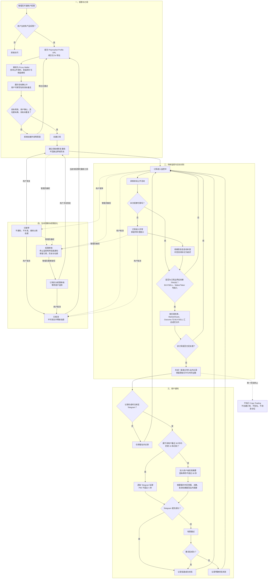

# Trader Sync：Activity Alerts 需求

> 需求状态：讨论中
>
> 关联技术设计：未创建

本文定义产品第一阶段的目标行为。产品总名同时覆盖本阶段的活动订阅与通知，以及未来独立讨论的 Copy Trading 板块。各项关键决定，包括本轮新增的目标确认卡和目标备注规则，已经逐项确认；整份需求仍等待用户最终确认，确认前不能作为后端技术设计输入。

## 第一阶段需求总览

| 维度 | 第一阶段需求 |
| --- | --- |
| 产品范围 | 产品名为 `Trader Sync`，本阶段板块名为 `Activity Alerts`；只做授权、订阅、监控和通知，`Copy Trading` 另行讨论。 |
| 产品权限 | 只有管理员开通权限的 ATHENA 用户可以使用；管理员可撤权，用户之间的数据严格隔离。 |
| 管理员边界 | 管理员只读查看用户、目标、订阅状态、运行健康及活动和投递数量汇总；不能操作订阅，也不能查看用户备注、完整活动或逐条 Telegram 投递内容。 |
| 订阅限制 | 每位用户最多保有 10 个未取消订阅；同一用户对同一 Proxy Wallet 只能有一个有效订阅，不同用户可以订阅同一目标。 |
| 目标输入与确认 | 接受 Polymarket Profile URL 或合法 0x 地址，统一解析为 Proxy Wallet；创建前展示已确认范围内的公开资料、完整地址、收益统计和收益曲线供用户确认。名称或用户名不能单独用于订阅；辅助收益资料缺失不阻止确认订阅。 |
| 目标备注 | 用户可以为自己关注的每个 Proxy Wallet 设置最多 20 个字符的私有纯文本备注；备注显示在订阅列表、详情及后续新通知中，其他用户和管理员不可见。取消订阅后保留，重新订阅同一目标时自动沿用。 |
| 活动范围 | 只通知实际成交的 `TRADE`，覆盖 `BUY`、`SELL`、Maker 与 Taker，不按金额、市场或 Outcome 过滤；挂单、改单、撤单及其他活动不通知。 |
| 活动粒度 | 相同交易哈希、Market/Asset、Outcome 和买卖方向的成交分片汇成一个逻辑活动；摘要展示总量、总金额、加权均价和价格范围，原始分片仍完整保留。 |
| 历史边界 | 首次订阅只建立基线、不回放历史；系统故障恢复后自动补查并标记延迟；用户暂停、撤权或取消期间的活动均不补发。 |
| 订阅生命周期 | 订阅可暂停、恢复或取消；暂停与权限停用继续占用名额，恢复时建立新基线；取消不可恢复并释放名额。撤权后全部未取消订阅权限停用，重新授权后仍需用户逐个恢复。 |
| 站内通知 | 每个逻辑活动都立即形成一条独立、持久且不自动过期的 `Activity Alerts` 记录，无论 Telegram 是否绑定或投递成功。 |
| Telegram 通知 | 活动形成时已绑定 Telegram 才私聊通知；绑定、解绑和重新绑定都不补发历史；失败有限重试并保留明确终态。第一阶段没有逐订阅渠道配置。 |
| 突发摘要 | 同一用户任意连续 60 秒内前 10 条逐条 Telegram 通知，第 11 条起进入用户级摘要；摘要至多每 60 秒一条，首条待汇总活动等待不超过 60 秒，不同用户互不影响。 |
| 时效目标 | 从活动公开可查询到站内记录形成：P95 不超过 15 秒、P99 不超过 30 秒；非突发 Telegram 提交：P95 不超过 5 秒；外部公开延迟和故障补查单独标识。 |
| 安全边界 | 第一阶段绝不创建、签名或提交订单，也不改变任何钱包、余额或 Polymarket 仓位。 |

## 背景与问题

ATHENA 需要向特定用户开放一个受管理员控制的新产品。获得产品权限的用户可以自行订阅 Polymarket 目标账户；目标产生符合范围的新活动时，ATHENA 将事实通知该订阅用户。

未来可能在该产品中加入跟单能力，但跟单功能当前不进行需求讨论。第一阶段只验证授权、订阅、可靠监控和用户通知，不触发任何交易操作。

## 目标

- 管理员能够决定哪些 ATHENA 用户可以使用本产品。
- 管理员能够只读查看用户、订阅目标、订阅状态和运行概要，但不能操作用户订阅；第一阶段的管理员产品界面不提供完整活动内容或逐条通知投递明细。
- 获得权限的用户能够在 ATHENA 中创建和管理属于自己的目标账户订阅。
- 用户创建订阅前能够查看目标的公开身份、收益统计与收益曲线，以更可靠地确认所选账户。
- 用户能够为自己关注的每个目标设置私有备注，便于识别和管理目标。
- 每位获授权用户最多同时订阅 10 个目标账户；同一用户对同一规范目标身份最多保留一个有效订阅，不同用户之间互不占用名额。
- 每个订阅都绑定创建它的 ATHENA 用户；目标产生符合范围的新活动时，只通知相应订阅用户。
- 多个获授权用户可以独立订阅目标，各自的订阅、状态和通知互不泄露。
- 对目标建立稳定且无歧义的监控身份，不因显示名称变化而监控错误账户。
- 在重复读取、乱序返回、服务重启和短时外部故障下，不静默丢失活动，也不为同一逻辑活动向同一订阅重复通知。
- 记录活动发生、ATHENA 发现和通知投递相关时间，使用户能够判断通知时效。
- 当订阅已无法被可靠监控或通知时，不能把“系统失效”表现成“目标没有新活动”。

## 非目标

- 不讨论或设计自动跟单、手动跟单入口及其产品规则。
- 不创建、签名、提交、撤销或修改任何 Polymarket 订单。
- 不接收复制金额、比例、仓位、余额、滑点、价格或其他交易执行参数。
- 不访问或保管被监控目标的私钥、API Key、会话或其他非公开凭据。
- 不自动发现、推荐或评价“值得跟随”的目标，不提供胜率、策略或投资建议。
- 不把目标收益统计或曲线解释为未来收益保证、ATHENA 评价或投资建议。
- 不向未获管理员授权的用户开放订阅、目标活动或通知数据。
- 不把挂单、改单、撤单、拆分、合并、赎回、奖励、充值和提现纳入第一阶段通知范围。
- 不承诺消除 Polymarket 将活动公开到可查询数据源之前的外部延迟。

## 角色与权限

| 角色 | 职责与边界 |
| --- | --- |
| ATHENA 管理员 | 已明确：开通或关闭用户使用本产品的权限；只读查看用户、订阅目标、状态、运行健康和活动与投递汇总，但不能代替用户操作订阅，也不能通过第一阶段管理员产品界面读取完整活动内容、Telegram 消息正文或逐条投递历史。 |
| 获授权用户 | 在 ATHENA 中创建、查看、暂停、恢复和取消自己的目标订阅，并接收自己订阅产生的活动通知。 |
| 未获授权用户 | 不能进入或使用产品，也不能读取产品页面、订阅、目标活动或通知结果。 |
| 被订阅目标 | Polymarket 上的外部公开账户；无需登录 ATHENA，也不向 ATHENA 授权。 |

每个订阅必须有唯一 ATHENA 用户所有者。管理员只能读取已确认的运行概要；目标备注、完整活动内容、Telegram 消息正文和逐条投递历史不属于管理员只读范围。普通用户不得查看、修改或接收其他用户的订阅数据。

## 业务术语

| 术语 | 定义 |
| --- | --- |
| 产品权限 | 由 ATHENA 管理员授予某个用户、允许其进入并使用本产品的资格。 |
| 订阅用户 | 已获得产品权限并创建目标订阅的 ATHENA 用户。 |
| 目标账户 | 订阅用户希望持续观察的一个 Polymarket 公开交易身份。 |
| 规范目标身份 | 用于唯一识别目标且不随显示名称变化的身份；统一使用 Polymarket Profile Address / Proxy Wallet。 |
| 目标确认卡 | 目标解析成功后、创建订阅前展示的确认资料，包含规范身份、公开资料以及可取得的收益统计和收益曲线。 |
| 目标备注 | 由订阅用户为自己关注的一个 Proxy Wallet 编写、最多 20 个字符的私有纯文本，仅用于个人识别和管理，不属于 Polymarket 公开资料。 |
| 目标订阅 | 由一个 ATHENA 用户拥有、指向一个规范目标身份的持续活动关注关系；除已取消外均为有效订阅并占用配额，包括因产品撤权而权限停用的订阅。 |
| 权限停用 | 管理员撤销用户的 `Trader Sync` 权限后，所有未取消订阅进入的保留状态；不监控、不形成新活动、不投递通知，重新授权后仍需用户手动恢复。 |
| 目标活动 | Polymarket 对目标公开的一项操作事实；第一阶段只有实际成交的 `TRADE` 属于通知范围。 |
| 交易活动 | Polymarket 对目标公开的一笔 `TRADE` 事实，包含买卖方向、市场、Outcome、价格、数量和时间等可用信息。 |
| 成交分片 | 外部公开数据中的一条交易记录；同一次目标交易可能因多个成交价格或对手方表现为多个分片。 |
| 逻辑活动 | 对同一订阅最多产生一次用户通知的最小业务事件；由相同交易哈希、Market/Asset、Outcome 和买卖方向的成交分片组成。 |
| 初始基线 | 创建或从用户暂停状态恢复订阅时已存在的历史活动集合，仅用于确定新旧边界，不产生用户通知。 |
| 故障补查 | 订阅保持有效但因系统或外部依赖故障暂时无法观察时，在恢复后补回故障窗口内的新活动。 |
| 站内活动记录 | 每个逻辑活动在 `Activity Alerts` 中形成、归订阅所有者查看的持久历史记录。 |
| Telegram 通知 | 用户已绑定 Telegram 时，对新形成的站内活动记录发送的私人即时提醒；正常情况下逐条发送，达到用户级突发阈值后改用突发摘要。 |
| 突发摘要 | 同一用户在任意连续 60 秒内收到超过 10 个新逻辑活动时，为避免 Telegram 消息洪泛而对第 11 个及后续活动形成的用户级汇总通知；不替代或合并站内活动记录。 |
| 用户通知 | 站内活动记录及其可选 Telegram 私聊投递；它不是跟单指令，也不代表任何订单已经或将要执行。 |
| 外部公开延迟 | 交易实际发生到 Polymarket 将其公开到可查询数据源之间的时间；不计入 ATHENA 时效目标，但需要记录和呈现。 |

## 当前可行性与交易粒度分析

当前公开能力足以支持交易活动通知：[用户活动](https://docs.polymarket.com/api-reference/core/get-user-activity)可以按 Profile Address 查询并区分 `TRADE`、`BUY` 与 `SELL`，结果包含市场、Outcome、价格、数量、USDC 金额、交易哈希和秒级时间戳；[公开成交](https://docs.polymarket.com/api-reference/core/get-trades-for-a-user-or-markets)也可按用户查询，但 `takerOnly` 默认值为 `true`。另一方面，[User WebSocket](https://docs.polymarket.com/api-reference/wss/user)需要目标自身的认证信息，不能被假设为监控任意公开目标的推送来源。

目标确认资料也存在公开数据基础：[公开资料](https://docs.polymarket.com/api-reference/profiles/get-public-profile-by-wallet-address)包含创建时间、Proxy Wallet、头像、显示名称和认证标记；[持仓总价值](https://docs.polymarket.com/api-reference/core/get-total-value-of-a-users-positions)、[已平仓仓位](https://docs.polymarket.com/api-reference/core/get-closed-positions-for-a-user)、[已交易市场数量](https://docs.polymarket.com/api-reference/misc/get-total-markets-a-user-has-traded)和[交易员排行榜](https://docs.polymarket.com/api-reference/core/get-trader-leaderboard-rankings)可提供部分统计与周期 PnL。官方[速率限制](https://docs.polymarket.com/api-reference/rate-limits)列出了 User PNL API，但当前公开参考文档没有单独给出完整收益曲线的字段与区间契约；因此需求必须允许明确显示不可用字段，技术设计阶段还需验证稳定数据来源。

公开活动与成交结果都没有独立的成交 ID。对一个公开活跃目标的只读抽样显示，同一交易哈希、相同秒级时间戳、相同市场、Asset、Outcome 和方向可能返回多个不同价格或数量的成交分片。因此交易通知存在三种业务粒度：

| 选择 | 通知行为 | 优点 | 代价 |
| --- | --- | --- | --- |
| A：逐成交分片 | 每个公开结果行发送一条通知。 | 最贴近源端原始记录，不发生聚合误判。 | 一次目标操作可能刷出多条消息。 |
| B：按链上交易与标的汇总 | 相同交易哈希、市场/Asset、Outcome 和方向的分片保留明细，但合成一条通知，展示总数量、总金额、加权均价和价格区间。 | 保留事实，同时更接近用户理解的一次目标交易。 | 公开数据无法证明这些分片一定来自同一张原始订单。 |
| C：按时间窗口净额汇总 | 在固定时间窗口内按标的和方向汇总。 | 消息最少。 | 引入等待并可能混合多次独立意图。 |

已确认选择 B：相同交易哈希、Market/Asset、Outcome 和买卖方向的成交分片合成一条通知；原始成交分片仍完整保留。

## 业务规则与不变量

以下规则是已确认单项决定的完整展开；整份需求仍需最终确认：

1. 只有当前具有产品权限的用户才能创建、查看、修改、暂停、恢复或取消自己的目标订阅。
2. 用户只能读取自己的订阅、相关目标活动和通知状态；相同目标被多个用户订阅时，各用户仍拥有独立订阅关系。
3. 管理员只读范围包括：用户身份、订阅目标及完整 Proxy Wallet、订阅状态及生命周期时间、最近成功监控时间、异常摘要、待补查状态、活动数量以及 Telegram 投递成功/失败汇总。第一阶段管理员产品界面和业务接口不提供目标备注、完整活动内容、Telegram 消息正文或逐条投递历史，也不得提供创建、修改、暂停、恢复、取消、重发或删除用户订阅及通知的入口。
4. 每位用户最多同时订阅 10 个不同的 Proxy Wallet；待建立基线、监控中、已暂停、异常和权限停用订阅均占用名额，已取消订阅释放名额。
5. 同一用户对同一 Proxy Wallet 最多保有一个有效订阅；不同用户可以独立订阅同一 Proxy Wallet，各自占用自己的名额。
6. 每个目标必须解析为一个规范目标身份。显示名称、头像和简介只用于展示，变化后不得导致目标被当成新身份或历史活动被重新通知。
7. 第一阶段只以已经实际成交并公开为 `TRADE` 的活动触发通知，同时覆盖 `BUY` 和 `SELL`、Maker 与 Taker；挂单、改单、撤单及其他非交易活动不触发通知。
8. 创建订阅时先建立初始基线，基线之前及基线内的历史活动不通知；基线成功后该订阅才进入正常监控。
9. 订阅持续有效期间发生系统或外部依赖故障时进入异常状态并继续占用配额；恢复后由系统自动补查故障窗口，完成补查后继续原订阅，不要求用户手动恢复。
10. 用户主动暂停后不再生成活动通知，暂停期间活动不补发；暂停状态继续占用配额并保留该用户与 Proxy Wallet 的唯一订阅关系。用户恢复时重新建立基线，只通知恢复成功后的新活动。
11. 用户取消订阅后不再监控或通知，订阅进入不可恢复的终态并释放配额与目标唯一性。用户以后可以对相同 Proxy Wallet 创建新订阅，新订阅重新建立基线且不回放取消期间活动。
12. 第一阶段不设置最小金额、市场类别、Outcome 或买卖方向过滤。
13. 同一逻辑活动即使被重复返回、多次扫描、通知重试或跨服务重启，也最多向同一订阅发送一条业务通知。
14. 不同订阅即使指向同一目标，也必须分别按订阅所有者的权限和接收状态决定是否通知。
15. 多笔不同活动不得仅因秒级时间戳或交易哈希相同被错误合并。只有交易哈希、Market/Asset、Outcome 和买卖方向全部一致的成交分片才能进入同一逻辑活动和通知。
16. 通知只能陈述外部数据支持的事实；字段缺失、冲突或无法核验时不得推测目标意图、实际仓位或盈亏。
17. 识别、保存和通知目标活动的任何步骤都不得调用交易执行能力，也不得产生钱包、余额、订单或仓位副作用。
18. 通知渠道暂时失败时，已识别活动不得被重新当成新活动；通知应最终送达订阅用户，或形成该用户可见的明确失败结果。管理员仅通过订阅异常摘要和 Telegram 成功/失败汇总了解投递情况，不读取对应活动或逐条投递内容。
19. 每个逻辑活动都必须在 `Activity Alerts` 中形成持久站内记录，作为订阅用户的完整活动历史；第一阶段不自动过期或删除这些记录。
20. 用户在站内活动记录形成时已绑定 Telegram 的，正常情况下同时收到一条私人 Telegram 通知；达到突发阈值时按突发摘要规则投递。任何情况下都不得发送到群组，也不提供逐订阅渠道配置。
21. 未绑定 Telegram 不阻止用户创建或维持订阅，但产品必须明确提示当前只有站内记录。以后绑定或重新绑定 Telegram 时，只推送绑定成功后新形成的活动，不补发未绑定期间的历史消息。
22. 用户解除 Telegram 绑定后停止外部推送；解除绑定期间的活动仍形成站内记录，重新绑定后不补发这些历史消息。
23. Telegram 暂时投递失败时进行有限重试，不重复创建站内活动；最终失败后保留站内记录和明确投递失败状态。
24. Polymarket 将交易公开到可查询数据源之前的外部公开延迟不计入 ATHENA 正常监控时效，但必须单独记录可观测的交易发生时间和发现时间。
25. 正常监控状态下，从交易可被公开查询到形成站内活动记录，95% 不超过 15 秒，99% 不超过 30 秒。
26. 非突发摘要覆盖的活动，从站内活动记录形成到 Telegram 成功提交发送，95% 不超过 5 秒；Telegram 服务自身在成功接收后的最终送达时间不属于 ATHENA 可保证范围。突发摘要不适用该 5 秒指标，而适用独立的 60 秒最迟发送目标。
27. 每条站内活动记录保存交易发生时间、ATHENA 发现时间、站内记录形成时间；存在 Telegram 投递时还保存其成功或终态失败时间。
28. 故障补查不适用正常监控时效目标，但补回的站内记录和 Telegram 消息必须明确标识为延迟活动，并保留实际延迟证据。
29. 目标没有新活动是正常状态，不产生心跳式活动消息；用户应能通过独立订阅状态区分无活动和监控失效。
30. 管理员撤销产品权限后立即阻止用户进入 `Trader Sync`、读取站内活动或操作订阅；用户所有未取消订阅进入权限停用状态，停止监控、形成新站内记录和发送 Telegram 通知。
31. 撤权前已经形成的订阅配置和站内活动历史继续保留；尚未成功发送的 Telegram 通知停止投递并记录因撤权终止的状态，撤权后不得继续向用户发送产品数据。
32. 管理员重新开通权限后，用户重新获得产品及已有历史的读取权，但原订阅继续保持权限停用，仍计入 10 个订阅配额。
33. 重新获权用户必须手动恢复每个订阅；恢复时建立新基线，只通知恢复成功后的新交易，不补发撤权期间的活动。
34. 突发活动不得改变站内记录粒度；每个逻辑活动仍立即形成独立、完整且可核验的站内活动记录，不静默丢弃或合并。
35. Telegram 突发阈值按订阅用户汇总其全部订阅计算：同一用户在任意连续 60 秒内的前 10 个新逻辑活动逐条私聊通知，从第 11 个开始进入突发摘要模式。
36. 突发摘要模式下，后续活动不再逐条发送 Telegram，而是至多每 60 秒发送一条摘要；首条等待汇总的活动必须在其站内记录形成后 60 秒内被摘要覆盖。摘要至少包含覆盖时间范围、活动总数、各目标账户的活动数量和进入对应站内完整记录的链接。
37. 已进入某条突发摘要的活动，无论摘要最终成功或失败，都不得再改为逐条 Telegram 补发；摘要投递失败时只重试同一摘要，有限重试后形成明确失败结果，站内活动记录不受影响。
38. 当同一用户最近 60 秒内的新逻辑活动不超过 10 条时退出突发摘要模式，后续新活动恢复逐条 Telegram 通知。
39. 突发判断、排队和摘要必须按用户隔离；一个用户的突发活动不得延迟、汇总或改变其他用户的通知。
40. 无论用户输入 Profile URL 还是合法 0x 地址，解析成功后都必须先展示目标确认卡，用户明确确认后才能创建订阅；收益数据仅用于帮助辨认目标，不改变 Proxy Wallet 作为唯一身份的规则。
41. 目标确认卡必须展示头像、显示名称、完整 Proxy Wallet、认证标记、加入时间、当前持仓价值、最大单笔盈利、按 Polymarket 原始口径命名的 `Predictions`，以及 `1D`、`1W`、`1M`、`1Y`、`YTD`、`ALL` 区间的 Profit/Loss 数值与曲线，默认选择 `1Y`；浏览量等其他公开资料可以选配。收益和统计数据必须来自 Polymarket 对该目标公开的数据并展示查询时间；不能取得 `Predictions` 时不得用“已交易市场数”等其他口径冒充，缺失或冲突字段也不得推导、拼凑或伪造。目标身份无法解析时禁止创建；身份已经可靠解析但辅助收益资料部分或全部不可用时，明确标记不可用并允许用户重试，但不阻止用户确认订阅。第一阶段只在创建订阅前查询和展示该确认卡，不在订阅创建后持续刷新或跟踪目标收益资料。
42. 每个 ATHENA 用户可以针对一个 Proxy Wallet 设置一个可选目标备注。备注属于该用户与 Proxy Wallet 的关系，最多 20 个字符，以纯文本展示，可以在创建订阅时填写并在以后编辑或清空；只有该用户可见，其他用户和管理员均不可见。备注显示在订阅列表、详情以及修改后新产生的站内和 Telegram 通知中；修改或清空不追溯改变既有站内记录或已经发送的 Telegram 消息。取消订阅后仍保留备注，重新订阅同一 Proxy Wallet 时自动沿用。备注变化不得影响目标唯一性、订阅配额、监控状态、基线、监控边界、既有活动事实或活动去重。

## 主流程

1. ATHENA 管理员为一个用户开通产品权限。
2. 获授权用户进入产品并提交一个 Polymarket 目标标识。
3. ATHENA 校验目标可被唯一解析，并向用户展示包含规范身份、公开资料、收益统计和收益曲线的目标确认卡。
4. 用户核对确认卡、按需填写目标备注并确认创建订阅；ATHENA 成功建立初始基线后显示订阅正在正常监控。
5. 目标在 Polymarket 产生符合第一阶段范围的新活动。
6. ATHENA 判断活动是否位于该订阅边界之后、是否属于通知范围，以及该订阅是否已经处理该逻辑活动。
7. ATHENA 为该订阅形成持久站内活动记录，保留目标身份、活动事实和时间证据。
8. 用户已绑定 Telegram 时，ATHENA 在正常流量下逐条私聊提醒；同一用户超过突发阈值后对后续活动发送用户级摘要。相同目标的其他订阅和其他用户的突发状态独立处理。
9. 用户可以查看自己的订阅状态，并按本文生命周期规则暂停、恢复或取消订阅。
10. 管理员关闭用户的产品权限后，用户立即失去产品访问与操作资格，所有未取消订阅进入权限停用且停止产生新记录与通知。
11. 管理员重新开通权限后，用户可以查看原有订阅与历史，并自行选择要恢复的订阅；每个恢复的订阅建立新基线。

## 状态转换

第一阶段同时区分用户产品权限和每个目标订阅的状态：

| 对象 | 当前状态 | 触发 | 下一状态 | 可观察行为 |
| --- | --- | --- | --- | --- |
| 产品权限 | 未开通 | 管理员开通 | 已开通 | 用户可以进入产品并管理自己的订阅。 |
| 产品权限 | 已开通 | 管理员关闭 | 已关闭 | 用户立即不能访问产品；所有未取消订阅进入权限停用。 |
| 产品权限 | 已关闭 | 管理员重新开通 | 已开通 | 用户重新看到原有订阅与历史；订阅不自动恢复。 |
| 目标订阅 | 待建立基线 | 目标校验和初始基线成功 | 监控中 | 只处理该订阅边界后的活动。 |
| 目标订阅 | 待建立基线 | 目标无效或无法建立可信边界 | 异常 | 不发送活动通知，向用户说明问题。 |
| 目标订阅 | 监控中 | 用户主动暂停 | 已暂停 | 停止生成活动通知；暂停期间不补发，继续占用配额并保留目标唯一性。 |
| 目标订阅 | 监控中 | 暂时无法可靠观察且超过异常阈值 | 异常 | 告知订阅用户监控不可靠，保留待补查范围并继续占用配额。 |
| 目标订阅 | 异常 | 依赖恢复且故障窗口补查完成 | 监控中 | 系统自动补查故障活动后继续原订阅，无需用户操作。 |
| 目标订阅 | 已暂停 | 用户恢复 | 待建立基线 | 建立新边界；不通知暂停期间活动。 |
| 目标订阅 | 任意非终态 | 管理员撤销用户产品权限 | 权限停用 | 立即停止监控和通知，保留订阅与既有历史并继续占用配额。 |
| 目标订阅 | 权限停用 | 用户重新获权后手动恢复 | 待建立基线 | 建立新边界；不通知撤权期间活动。 |
| 目标订阅 | 任意非终态 | 当前具有产品权限的用户取消 | 已取消 | 不再监控或通知，释放配额与目标唯一性，不能恢复原订阅；重新获权用户可以直接取消权限停用订阅，无需先恢复。 |

未成功建立初始基线的订阅不得表现为“监控中”。异常订阅也不得通过丢弃故障窗口直接恢复为正常。

## 异常与边界场景

- **用户未获授权**：不能进入产品或通过其他入口创建、读取、修改订阅。
- **目标标识无效或有歧义**：拒绝创建订阅，不选择最相似账户代替。
- **目标身份可解析但部分或全部收益资料不可用**：明确标记缺失字段并允许重试，不用推导值填补，也不阻止用户确认订阅。
- **目标可查询但没有历史活动**：可以完成基线；空历史不是错误。
- **达到订阅上限**：用户已有 10 个未取消订阅时拒绝继续创建；待建立基线、监控中、已暂停、异常和权限停用订阅均计入配额。
- **重复订阅同一目标**：同一用户已有该 Proxy Wallet 的有效订阅时拒绝重复创建；不同用户可以独立订阅。
- **权限在操作过程中被撤销**：撤销决定优先，未完成的用户操作不得绕过最新权限状态；所有未取消订阅立即权限停用，尚未成功投递的 Telegram 通知停止发送。
- **重新获得权限**：用户可以重新读取原有订阅与站内历史，但必须逐个手动恢复订阅；撤权期间活动不补发。
- **目标显示资料变化**：保持规范身份和已处理边界不变。
- **外部数据重复、乱序或同秒多笔**：不重复通知，也不遗漏晚到但位于有效订阅窗口内的活动。
- **同一链上交易包含多个成交分片**：保留每个分片；按已确认边界汇总通知，并在消息中表达分片数、总量、加权均价和价格范围。
- **外部依赖暂时失败或限流**：订阅进入异常状态，恢复后系统自动补查，不把技术失败伪装成目标零活动，也不要求用户手动恢复。
- **无法可靠补查完整故障窗口**：停止声称订阅正常，并向受影响的订阅用户报告可能缺失的范围。
- **Telegram 未绑定**：不阻止订阅，逻辑活动继续形成站内记录；产品提示用户当前不会收到 Telegram 私聊。
- **Telegram 解绑后重绑**：解绑期间的活动保留在站内，重新绑定后不补发，只推送后续新活动。
- **Telegram 暂时不可达**：有限重试后仍失败则显示明确终态；站内活动记录不受影响，也不因投递重试重复创建。
- **管理员请求受限明细**：第一阶段不向管理员返回目标备注、完整活动内容、Telegram 消息正文或逐条投递历史；管理员仍可通过运行状态、异常摘要和数量汇总判断订阅是否正常。
- **突发大量活动**：站内仍逐条即时形成完整记录；同一用户任意连续 60 秒内前 10 条 Telegram 逐条发送，第 11 条起进入用户级摘要模式，至多每 60 秒发送一条摘要且首条待汇总活动等待不超过 60 秒。活动速率恢复后退出摘要模式；不同用户互不影响。

## 输入与可见输出

### 订阅输入

- 目标标识：接受 Polymarket Profile URL 或合法 0x 地址，统一解析为 Proxy Wallet，并展示解析出的公开账户资料和完整地址供用户确认。
- 显示名称或用户名不能单独作为创建订阅的目标标识。
- 目标备注：可选，由当前用户针对该 Proxy Wallet 设置，最多 20 个字符且仅自己可见；可以创建、编辑或清空。
- 创建、暂停、恢复、取消订阅或修改目标备注的意图。

第一阶段不接收任何跟单或交易执行参数。

### 目标确认卡（已确认）

目标确认卡在创建订阅前展示，必须包含：

- 头像、显示名称、完整 Proxy Wallet、认证标记和加入时间；
- 当前持仓价值、最大单笔盈利，以及 `Predictions`（沿用 Polymarket 页面原始口径）；如果数据源只能提供“已交易市场数”等其他口径，必须按原名展示，不能冒充 `Predictions`；
- 浏览量等其他公开资料可在数据源明确提供时展示，缺失时不作为必显字段；
- 当前选择区间的 Profit/Loss 数值和曲线；
- `1D`、`1W`、`1M`、`1Y`、`YTD`、`ALL` 时间区间，默认选择 `1Y`；
- 数据来源、查询时间，以及字段不可用或数据不完整的明确状态；
- 可选目标备注输入和最终“确认订阅”动作。

收益资料是创建前的一次公开信息确认视图，不代表 ATHENA 对目标的评价。第一阶段在订阅创建后不继续刷新、展示或跟踪这些收益资料。

### 目标备注（已确认）

目标备注只属于当前 ATHENA 用户与该 Proxy Wallet 的关系，其他用户和管理员均不可见。备注最多 20 个字符，以纯文本展示，允许在创建订阅时填写并在以后编辑或清空。当前备注显示在订阅列表和详情中；新产生的站内记录与 Telegram 通知使用当时有效的备注，既有站内记录和已发消息不随以后修改而改变。修改备注不暂停监控、不重建基线，也不改变既有活动事实。取消订阅后保留备注，重新订阅同一目标时自动沿用。

### 目标活动通知

每条站内活动记录以及非突发模式下对应的逐条 Telegram 通知至少应尽可能包含：

- 目标备注（用户已设置时）、目标展示名和规范目标身份；
- 活动类型；交易活动包含 `BUY` 或 `SELL`；
- Event / Market 标题与 Outcome；
- 成交价格、Outcome Token 数量和 USDC 金额；
- 成交分片数、总 Token 数量、总 USDC 金额、加权平均价格以及最低和最高成交价格；
- 交易发生时间、ATHENA 发现时间、站内记录形成时间以及可计算的延迟；
- 存在 Telegram 投递时的成功或终态失败时间；故障补查产生的记录明确标识为延迟活动；
- Polymarket 页面链接；
- 交易哈希或其他可用于人工核验的来源标识；
- 明确的“仅通知、未执行交易”语义。

外部数据未提供的可选字段显示为未知，不得为了消息完整而推导无法可靠验证的值。

突发摘要至少展示其覆盖时间范围、活动总数、各目标账户的活动数量及站内完整记录链接，并明确说明详细交易仍按逻辑活动逐条保存在 `Activity Alerts`。摘要覆盖的活动不再逐条补发 Telegram。

站内记录保存每个逻辑活动的完整历史和 Telegram 投递状态。第一阶段不提供逐订阅通知渠道设置；Telegram 是否发送完全取决于活动记录形成时该用户是否已绑定，并可能按用户级突发规则表现为逐条私聊或摘要私聊。

### 订阅状态输出

- 当前订阅是否待建立基线、监控中、已暂停、异常、权限停用或已取消；
- 最近一次成功观察时间和最近一笔已处理活动时间；
- 是否存在尚未补查的窗口或待投递通知；
- 最近异常摘要和恢复时间。

### 管理员只读输出

管理员可以查看：

- 订阅所有者的 ATHENA 用户身份；
- 目标公开资料和完整 Proxy Wallet；
- 订阅状态、创建时间及生命周期状态变更时间；
- 最近成功监控时间、异常摘要和是否存在待补查窗口；
- 活动数量以及 Telegram 投递成功、失败数量汇总。

第一阶段不向管理员显示目标备注、完整站内活动内容、Telegram 消息正文或逐条投递历史。管理员也不能重发、删除通知或执行任何订阅状态操作。未来如果需要为客服或审计增加受控明细访问，必须另行讨论和确认权限需求。

## 验收场景

1. **管理员开通后可用**：用户原本不能进入产品；管理员开通权限后，用户可以创建自己的目标订阅。
2. **未授权访问被拒绝**：未获权限的用户无法通过页面或直接请求读取、创建或修改任何订阅。
3. **首次订阅不回放历史**：目标已有历史活动；建立订阅后不发送旧活动，随后发生的新活动只向订阅用户通知一次。
4. **相同目标可被独立订阅**：两个获授权用户订阅同一目标；新活动分别通知两位用户，双方不能看到对方的订阅或通知状态。
5. **订阅所有权隔离**：用户不能读取、暂停、恢复、取消或更改另一用户的订阅。
6. **管理员最小只读范围**：管理员能看到用户身份、目标与完整 Proxy Wallet、订阅状态和生命周期时间、监控健康与待补查状态、活动数量及 Telegram 成功/失败汇总；不能看到目标备注、完整活动内容、Telegram 消息正文或逐条投递历史，也不能创建、修改、暂停、恢复、取消订阅或重发、删除通知。
7. **订阅配额**：用户可以创建第 10 个不同目标订阅；已有 10 个计入配额的订阅时，第 11 个被明确拒绝。
8. **同用户目标唯一**：同一用户不能重复订阅同一 Proxy Wallet；不同用户可以分别订阅同一目标并独立收到通知。
9. **目标输入与确认**：同一目标分别通过其 Polymarket Profile URL 和合法 0x 地址输入时，均解析为同一 Proxy Wallet；创建前向用户展示账户资料和完整地址并要求确认。仅输入显示名称或用户名时不能直接创建订阅。
10. **活动范围完整**：目标发生任意金额、市场、Outcome、方向及 Maker/Taker 身份的实际成交时均进入通知范围；只发生挂单、改单、撤单或其他非交易活动时不通知。
11. **活动事实正确**：通知中的目标、活动类型、方向、市场、Outcome、价格、数量和时间与公开事实一致。
12. **重复处理不重复通知**：同一逻辑活动在重复观察、通知重试和进程重启后，对同一订阅仍只有一条业务通知。
13. **多分片汇总不丢事实**：交易哈希、Market/Asset、Outcome 和买卖方向全部一致的一组成交分片只产生一条摘要通知，分片数、总量、金额、加权均价和价格范围正确；任一边界不同则分别通知，原始分片仍可核验。
14. **用户暂停与恢复**：暂停期间的活动不通知，暂停订阅仍占用配额且阻止重复订阅同一目标；恢复并建立新基线后只通知新的活动。
15. **取消与重新订阅**：取消后释放配额与目标唯一性且原订阅不能恢复；重新订阅相同目标时建立新订阅和新基线，不回放取消期间活动。
16. **故障后连续**：订阅保持有效时发生短时故障，恢复后由系统自动补回窗口内的新活动，不回放初始基线前历史，也不要求用户手动恢复。
17. **权限撤销立即生效**：管理员关闭用户权限后，用户不能访问产品或读取站内历史；所有未取消订阅立即权限停用，不再形成新活动记录，尚未成功投递的 Telegram 通知停止发送。
18. **投递失败可诊断**：活动已识别但通知无法送达时，订阅用户能看到对应记录的明确失败状态，管理员能看到订阅异常摘要及失败数量汇总；不产生第二个逻辑活动，也不向管理员泄露对应活动或逐条投递内容。
19. **站内历史完整**：无论 Telegram 是否绑定或投递成功，每个逻辑活动都形成且只形成一条可持久查看的站内记录，不自动过期或删除。
20. **Telegram 已绑定且未突发**：活动记录形成时用户已绑定 Telegram，且该活动未进入突发摘要范围；系统同时向该用户私聊发送一次提醒，不发送到任何群组。
21. **未绑定不阻塞订阅**：用户未绑定 Telegram 仍可订阅且站内历史正常产生，产品明确提示只有站内记录。
22. **绑定变更不补发**：用户在一段时间后绑定、解绑或重新绑定 Telegram；变更前或解绑期间的历史提醒均不补发，只推送绑定有效期间的新活动。
23. **Telegram 失败不丢历史**：私聊投递在有限重试后最终失败；站内记录仍完整且显示失败状态，不产生重复活动记录。
24. **正常监控时效**：在正常监控样本中，从交易可被公开查询到站内记录形成，至少 95% 不超过 15 秒、99% 不超过 30 秒；非突发摘要覆盖的活动从站内记录形成到 Telegram 成功提交发送，至少 95% 不超过 5 秒。
25. **外部延迟分离**：Polymarket 尚未公开交易的时间不计入 ATHENA 指标；站内记录仍能通过交易、发现、记录和投递时间呈现端到端实际延迟。
26. **延迟补查可识别**：故障恢复后补回的活动不按正常时效判定，但站内记录和 Telegram 消息均明确标识延迟活动且不丢失时间证据。
27. **撤权数据保留**：权限停用期间保留原有订阅配置和站内活动历史；管理员重新开通权限后，用户重新看到这些数据，但订阅不自动恢复且继续占用配额。
28. **重新获权后手动恢复**：用户逐个恢复订阅并建立新基线，只接收恢复成功后的新活动，不补发撤权期间交易。
29. **突发时站内不合并**：同一用户在 60 秒内收到超过 10 个逻辑活动；每个活动仍立即形成独立完整的站内记录，记录数量和活动事实均不因 Telegram 摘要而减少。
30. **Telegram 突发摘要**：同一用户在任意连续 60 秒内收到 12 个逻辑活动；前 10 个逐条 Telegram 通知，第 11、12 个由摘要覆盖，首条等待汇总的活动在 60 秒内得到摘要结果，摘要显示覆盖范围、总数、各目标数量和站内链接，且两项活动以后不再逐条补发。
31. **突发用户隔离**：一个用户持续处于突发摘要模式，另一个用户只有单个新活动；后者仍按普通 5 秒 Telegram 时效目标逐条收到通知，其消息不进入前者摘要。
32. **绝无交易副作用**：所有第一阶段场景均不创建订单、签名，也不改变任何钱包、余额或 Polymarket 仓位。
33. **创建前展示目标确认资料**：用户输入可解析的 Profile URL 或 0x 地址后，在创建订阅前看到该 Proxy Wallet 的已确认身份资料、统计字段以及默认 `1Y` 且可切换全部已确认区间的收益曲线，并明确执行确认动作；身份无法解析时不能创建，辅助资料部分或全部缺失时显示不可用但仍可确认订阅，任何缺失字段均不得用不同口径替代或推导。
34. **目标备注完整规则**：两个用户订阅同一 Proxy Wallet 并分别设置备注；双方只能看到和修改自己的备注，管理员看不到任一备注。20 个字符的备注可以保存，超过 20 个字符时被明确拒绝；修改后订阅列表、详情和新通知显示新备注，既有站内记录及已发消息保持原样。取消后重新订阅同一目标时自动带出原备注，且任何备注变化都不影响监控状态、基线或活动去重。

## 已确认决定

- 这是 ATHENA 面向用户提供的产品，不是只服务运营人员的内部监控工具。
- 只有被 ATHENA 管理员开通该产品权限的用户才能使用它。
- 获授权用户可以在 ATHENA 中订阅目标账户的活动。
- 目标账户产生符合范围的操作后，通知应发送给创建该订阅的 ATHENA 用户，而不是统一发送到运营群组。
- 第一阶段只实现授权、目标订阅、活动监控和用户通知，不执行任何跟单操作。
- 产品未来需要增加独立的 `Copy Trading` 功能板块，因此产品总名不能只表达第一阶段的监控或通知能力。
- `Copy Trading` 的具体业务规则当前不进行需求讨论，必须另行形成并确认需求。
- 产品正式名称已确认为 `Trader Sync`；第一阶段功能板块名称为 `Activity Alerts`。
- 管理员只读查看用户身份、目标与完整 Proxy Wallet、订阅状态和生命周期时间、监控健康与待补查状态、活动数量及 Telegram 成功/失败汇总；第一阶段不查看目标备注、完整活动内容、Telegram 消息正文或逐条投递历史，也不能操作订阅、重发或删除通知。
- 每位用户最多同时订阅 10 个目标账户；同一用户对同一 Proxy Wallet 最多一个有效订阅，不同用户可以独立订阅同一目标。
- 创建订阅时接受 Polymarket Profile URL 或合法 0x 地址，统一解析为 Proxy Wallet，并在用户确认解析结果后创建；显示名称或用户名不能单独作为目标标识。
- 第一阶段只通知实际成交的 `TRADE`，完整覆盖 `BUY`、`SELL`、Maker 与 Taker，不按金额、市场类别或 Outcome 过滤；其他活动不通知。
- 首次订阅不回放历史；系统故障恢复后自动补查。用户暂停期间不通知且恢复后不补发，暂停与异常订阅继续占用配额；取消为不可恢复终态并释放配额，重新订阅同一目标时建立新基线。
- 一条通知按交易哈希、Market/Asset、Outcome 和买卖方向汇总成交分片，展示分片数、总 Token 数量、总 USDC 金额、加权均价及价格范围；原始成交分片完整保留。
- 每个逻辑活动均形成不自动过期的独立站内记录。用户当时已绑定 Telegram 时，正常流量逐条私聊；同一用户任意连续 60 秒超过 10 条后，第 11 条起至多每 60 秒形成一条用户级摘要，首条待汇总活动等待不超过 60 秒，摘要覆盖活动不再逐条补发且不同用户互不影响。未绑定不阻止订阅，绑定、解绑或重新绑定均不补发此前消息；投递最终失败不影响站内历史并显示明确状态；第一阶段不提供逐订阅渠道配置。
- 正常监控时，从交易可被公开查询到站内记录形成的 95% 不超过 15 秒、99% 不超过 30 秒；非突发摘要覆盖的活动从站内记录形成到 Telegram 成功提交发送的 95% 不超过 5 秒，突发摘要的首条待汇总活动等待不超过 60 秒。Polymarket 公开前的外部延迟单独记录，故障补查消息明确标识为延迟活动。
- 管理员撤权立即阻止产品访问并使全部未取消订阅权限停用，停止新活动和未完成 Telegram 投递但保留订阅与历史；重新授权后订阅不自动恢复且仍占配额，由用户逐个手动恢复并建立新基线，不补撤权期间活动。
- 创建订阅前必须展示目标确认卡，包含头像、名称、完整 Proxy Wallet、认证、加入时间、持仓价值、最大盈利、原始口径的 `Predictions`，以及默认 `1Y`、支持 `1D`、`1W`、`1M`、`1Y`、`YTD`、`ALL` 的 P/L 数值和曲线；浏览量等其他公开资料可选展示。身份解析失败时禁止创建，辅助资料不可用时明确标记但不阻止订阅；第一阶段不在订阅创建后持续刷新收益资料。
- 每位用户可以为自己关注的 Proxy Wallet 设置最多 20 个字符的私有纯文本备注，可在创建时填写并以后编辑或清空；备注显示在订阅列表、详情及后续新站内和 Telegram 通知中，不追溯修改既有记录或已发消息。取消订阅后保留，重新订阅同一目标时自动沿用；其他用户和管理员不可见，也不影响监控行为。
- 当前文档仍处于需求讨论阶段，尚未创建后端技术设计，也未授权修改后端源码。

## 待确认问题

无。整份需求仍需用户明确确认后才能将状态更新为 `已确认`。

[返回产品需求索引](README.md)
