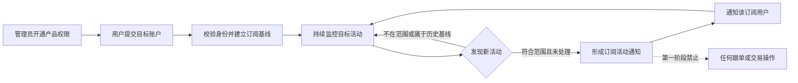

# Trader Sync：Activity Alerts 需求

> 需求状态：讨论中
>
> 关联技术设计：未创建

本文定义产品第一阶段的目标行为。产品总名需要同时覆盖本阶段的活动订阅与通知，以及未来独立讨论的 Copy Trading 板块；除“已确认决定”明确列出的内容外，其余规则均为建议草案，只有经用户确认并写回本文后才能作为后端技术设计输入。

## 背景与问题

ATHENA 需要向特定用户开放一个受管理员控制的新产品。获得产品权限的用户可以自行订阅 Polymarket 目标账户；目标产生符合范围的新活动时，ATHENA 将事实通知该订阅用户。

未来可能在该产品中加入跟单能力，但跟单功能当前不进行需求讨论。第一阶段只验证授权、订阅、可靠监控和用户通知，不触发任何交易操作。

## 目标

- 管理员能够决定哪些 ATHENA 用户可以使用本产品。
- 管理员能够查看用户的具体目标订阅及其状态，但不能代替用户创建、修改、暂停、恢复或取消订阅。
- 获得权限的用户能够在 ATHENA 中创建和管理属于自己的目标账户订阅。
- 每位获授权用户最多同时订阅 10 个目标账户；同一用户对同一规范目标身份最多保留一个有效订阅，不同用户之间互不占用名额。
- 每个订阅都绑定创建它的 ATHENA 用户；目标产生符合范围的新活动时，只通知相应订阅用户。
- 多个获授权用户可以独立订阅目标，各自的订阅、状态和通知互不泄露。
- 对目标建立稳定且无歧义的监控身份，不因显示名称变化而监控错误账户。
- 在重复读取、乱序返回、服务重启和短时外部故障下，不静默丢失活动，也不为同一逻辑活动向同一订阅重复通知。
- 记录活动发生、ATHENA 发现和通知投递相关时间，使用户能够判断通知时效。
- 当订阅已无法被可靠监控或通知时，不能把“系统失效”表现成“目标没有新活动”。

## 非目标

- 不讨论或设计自动跟单、手动跟单入口及其产品规则。
- 不创建、签名、提交、撤销或修改任何 Polymarket 订单。
- 不接收复制金额、比例、仓位、余额、滑点、价格或其他交易执行参数。
- 不访问或保管被监控目标的私钥、API Key、会话或其他非公开凭据。
- 不自动发现、推荐或评价“值得跟随”的目标，不提供胜率、策略或投资建议。
- 不向未获管理员授权的用户开放订阅、目标活动或通知数据。
- 不把挂单、改单、撤单、拆分、合并、赎回、奖励、充值和提现纳入第一阶段通知范围。
- 不承诺消除 Polymarket 将活动公开到可查询数据源之前的外部延迟。

## 角色与权限

| 角色 | 已明确或建议的职责与边界 |
| --- | --- |
| ATHENA 管理员 | 已明确：开通或关闭用户使用本产品的权限；可以查看用户的具体订阅及其状态，但不能代替用户创建、修改、暂停、恢复或取消订阅。管理员可查看的活动与通知明细范围仍待确认。 |
| 获授权用户 | 已明确：在 ATHENA 中订阅目标账户，并接收自己订阅产生的活动通知。建议同时能够查看、暂停、恢复和取消自己的订阅。 |
| 未获授权用户 | 已明确：不能使用产品。建议不能读取产品页面、订阅、目标活动或通知结果。 |
| 被订阅目标 | Polymarket 上的外部公开账户；无需登录 ATHENA，也不向 ATHENA 授权。 |

每个订阅必须有唯一 ATHENA 用户所有者。管理员对用户订阅只有只读权限；普通用户不得查看、修改或接收其他用户的订阅数据。

## 业务术语

| 术语 | 定义 |
| --- | --- |
| 产品权限 | 由 ATHENA 管理员授予某个用户、允许其进入并使用本产品的资格。 |
| 订阅用户 | 已获得产品权限并创建目标订阅的 ATHENA 用户。 |
| 目标账户 | 订阅用户希望持续观察的一个 Polymarket 公开交易身份。 |
| 规范目标身份 | 用于唯一识别目标且不随显示名称变化的身份；统一使用 Polymarket Profile Address / Proxy Wallet。 |
| 目标订阅 | 由一个 ATHENA 用户拥有、指向一个规范目标身份的持续活动关注关系。 |
| 目标活动 | Polymarket 对目标公开的一项操作事实；第一阶段只有实际成交的 `TRADE` 属于通知范围。 |
| 交易活动 | Polymarket 对目标公开的一笔 `TRADE` 事实，包含买卖方向、市场、Outcome、价格、数量和时间等可用信息。 |
| 成交分片 | 外部公开数据中的一条交易记录；同一次目标交易可能因多个成交价格或对手方表现为多个分片。 |
| 逻辑活动 | 对同一订阅最多产生一次用户通知的最小业务事件。交易活动的建议汇总边界见下文。 |
| 初始基线 | 创建或恢复订阅时已存在的历史活动集合，仅用于确定新旧边界，默认不产生用户通知。 |
| 故障补查 | 订阅保持有效但因系统或外部依赖故障暂时无法观察时，在恢复后补回故障窗口内的新活动。 |
| 用户通知 | 向订阅所有者发送的目标活动事实；它不是跟单指令，也不代表任何订单已经或将要执行。 |

## 当前可行性与交易粒度分析

当前公开能力足以支持交易活动通知：[用户活动](https://docs.polymarket.com/api-reference/core/get-user-activity)可以按 Profile Address 查询并区分 `TRADE`、`BUY` 与 `SELL`，结果包含市场、Outcome、价格、数量、USDC 金额、交易哈希和秒级时间戳；[公开成交](https://docs.polymarket.com/api-reference/core/get-trades-for-a-user-or-markets)也可按用户查询，但 `takerOnly` 默认值为 `true`。另一方面，[User WebSocket](https://docs.polymarket.com/api-reference/wss/user)需要目标自身的认证信息，不能被假设为监控任意公开目标的推送来源。

公开活动与成交结果都没有独立的成交 ID。对一个公开活跃目标的只读抽样显示，同一交易哈希、相同秒级时间戳、相同市场、Asset、Outcome 和方向可能返回多个不同价格或数量的成交分片。因此交易通知存在三种业务粒度：

| 选择 | 通知行为 | 优点 | 代价 |
| --- | --- | --- | --- |
| A：逐成交分片 | 每个公开结果行发送一条通知。 | 最贴近源端原始记录，不发生聚合误判。 | 一次目标操作可能刷出多条消息。 |
| B：按链上交易与标的汇总 | 相同交易哈希、市场/Asset、Outcome 和方向的分片保留明细，但合成一条通知，展示总数量、总金额、加权均价和价格区间。 | 保留事实，同时更接近用户理解的一次目标交易。 | 公开数据无法证明这些分片一定来自同一张原始订单。 |
| C：按时间窗口净额汇总 | 在固定时间窗口内按标的和方向汇总。 | 消息最少。 | 引入等待并可能混合多次独立意图。 |

当前建议选择 B；无论用户通知如何汇总，原始成交分片都应完整保留。

## 业务规则与不变量

以下未被“已确认决定”覆盖的规则仍等待确认：

1. 只有当前具有产品权限的用户才能创建、查看、修改、暂停、恢复或取消自己的目标订阅。
2. 用户只能读取自己的订阅、相关目标活动和通知状态；相同目标被多个用户订阅时，各用户仍拥有独立订阅关系。
3. 管理员可以查看具体用户的订阅及其状态，但不得通过任何入口代替用户创建、修改、暂停、恢复或取消订阅。
4. 每位用户最多同时订阅 10 个不同的 Proxy Wallet；订阅生命周期中的哪些状态占用名额，将与暂停、取消和恢复规则一并确认。
5. 同一用户对同一 Proxy Wallet 最多保有一个有效订阅；不同用户可以独立订阅同一 Proxy Wallet，各自占用自己的名额。
6. 每个目标必须解析为一个规范目标身份。显示名称、头像和简介只用于展示，变化后不得导致目标被当成新身份或历史活动被重新通知。
7. 第一阶段只以已经实际成交并公开为 `TRADE` 的活动触发通知，同时覆盖 `BUY` 和 `SELL`、Maker 与 Taker；挂单、改单、撤单及其他非交易活动不触发通知。
8. 创建订阅时先建立初始基线，基线之前及基线内的历史活动不通知；基线成功后该订阅才进入正常监控。
9. 订阅持续有效期间发生短时故障，恢复后必须补查故障窗口。用户主动暂停或取消订阅期间的活动默认不补查；恢复或重新订阅时建立新边界。
10. 第一阶段不设置最小金额、市场类别、Outcome 或买卖方向过滤。
11. 同一逻辑活动即使被重复返回、多次扫描、通知重试或跨服务重启，也最多向同一订阅发送一条业务通知。
12. 不同订阅即使指向同一目标，也必须分别按订阅所有者的权限和接收状态决定是否通知。
13. 多笔不同活动不得仅因秒级时间戳或交易哈希相同被错误合并。若采用汇总通知，只有市场/Asset、Outcome 和方向等边界也一致的成交分片才能进入同一消息。
14. 通知只能陈述外部数据支持的事实；字段缺失、冲突或无法核验时不得推测目标意图、实际仓位或盈亏。
15. 识别、保存和通知目标活动的任何步骤都不得调用交易执行能力，也不得产生钱包、余额、订单或仓位副作用。
16. 通知渠道暂时失败时，已识别活动不得被重新当成新活动；通知应最终送达订阅用户，或形成该用户与获授权管理员可见的明确失败结果。
17. 目标没有新活动是正常状态，不产生心跳式活动消息；用户应能通过独立订阅状态区分无活动和监控失效。
18. 管理员撤销产品权限后必须立即阻止用户继续操作产品；现有订阅是暂停、终止还是保留待恢复仍待确认。

## 主流程

1. ATHENA 管理员为一个用户开通产品权限。
2. 获授权用户进入产品并提交一个 Polymarket 目标标识。
3. ATHENA 校验目标可被唯一解析，并向用户展示规范目标身份和公开资料摘要，避免订阅错误账户。
4. 用户确认创建订阅；ATHENA 成功建立初始基线后显示订阅正在正常监控。
5. 目标在 Polymarket 产生符合第一阶段范围的新活动。
6. ATHENA 判断活动是否位于该订阅边界之后、是否属于通知范围，以及该订阅是否已经处理该逻辑活动。
7. ATHENA 为该订阅形成用户通知，保留目标身份、活动事实和时间证据。
8. 通知发送给订阅所有者；相同目标的其他订阅根据各自状态独立处理。
9. 用户可以查看自己的订阅状态，并按最终确认的生命周期规则暂停、恢复或取消订阅。
10. 管理员关闭用户的产品权限后，用户立即失去产品操作资格，并按待确认规则处理已有订阅。

## 状态转换

第一阶段建议同时区分用户产品权限和每个目标订阅的状态：

| 对象 | 当前状态 | 触发 | 下一状态 | 可观察行为 |
| --- | --- | --- | --- | --- |
| 产品权限 | 未开通 | 管理员开通 | 已开通 | 用户可以进入产品并管理自己的订阅。 |
| 产品权限 | 已开通 | 管理员关闭 | 已关闭 | 用户立即不能继续使用产品；既有订阅处理方式待确认。 |
| 目标订阅 | 待建立基线 | 目标校验和初始基线成功 | 监控中 | 只处理该订阅边界后的活动。 |
| 目标订阅 | 待建立基线 | 目标无效或无法建立可信边界 | 异常 | 不发送活动通知，向用户说明问题。 |
| 目标订阅 | 监控中 | 用户主动暂停 | 已暂停 | 停止为该订阅生成活动通知。 |
| 目标订阅 | 监控中 | 暂时无法可靠观察且超过异常阈值 | 异常 | 告知订阅用户监控不可靠并保留待补查范围。 |
| 目标订阅 | 异常 | 依赖恢复且故障窗口补查完成 | 监控中 | 先处理补查活动，再告知用户恢复。 |
| 目标订阅 | 已暂停 | 用户恢复 | 待建立基线 | 建立新边界；暂停期间活动默认不通知。 |
| 目标订阅 | 任意非终态 | 用户取消 | 已取消 | 不再监控或通知，是否允许恢复待确认。 |

未成功建立初始基线的订阅不得表现为“监控中”。异常订阅也不得通过丢弃故障窗口直接恢复为正常。

## 异常与边界场景

- **用户未获授权**：不能进入产品或通过其他入口创建、读取、修改订阅。
- **目标标识无效或有歧义**：拒绝创建订阅，不选择最相似账户代替。
- **目标可查询但没有历史活动**：可以完成基线；空历史不是错误。
- **达到订阅上限**：用户已经同时订阅 10 个不同 Proxy Wallet 时拒绝继续创建；具体状态计数规则与订阅生命周期一并确认。
- **重复订阅同一目标**：同一用户已有该 Proxy Wallet 的有效订阅时拒绝重复创建；不同用户可以独立订阅。
- **权限在操作过程中被撤销**：撤销决定优先，未完成的用户操作不得绕过最新权限状态。
- **目标显示资料变化**：保持规范身份和已处理边界不变。
- **外部数据重复、乱序或同秒多笔**：不重复通知，也不遗漏晚到但位于有效订阅窗口内的活动。
- **同一链上交易包含多个成交分片**：保留每个分片；若采用汇总通知，消息应表达分片数、总量、加权均价和价格范围。
- **外部依赖暂时失败或限流**：恢复后补查，不把技术失败伪装成目标零活动。
- **无法可靠补查完整故障窗口**：停止声称订阅正常，并向受影响的订阅用户报告可能缺失的范围。
- **通知渠道未连接或不可达**：创建订阅是否受阻、是否保留待发送通知以及用户看到何种状态仍待确认。
- **突发大量活动**：默认不静默丢弃；允许通知排队。是否进一步生成批量摘要待确认。

## 输入与可见输出

### 订阅输入

- 目标标识：接受 Polymarket Profile URL 或合法 0x 地址，统一解析为 Proxy Wallet，并展示解析出的公开账户资料和完整地址供用户确认。
- 显示名称或用户名不能单独作为创建订阅的目标标识。
- 用户自定义订阅名称或备注：可选，只对订阅所有者可见。
- 创建、暂停、恢复或取消订阅的意图。

第一阶段不接收任何跟单或交易执行参数。

### 建议的目标活动通知

每条用户通知至少应尽可能包含：

- 订阅名称、目标展示名和规范目标身份；
- 活动类型；交易活动包含 `BUY` 或 `SELL`；
- Event / Market 标题与 Outcome；
- 成交价格、Outcome Token 数量和 USDC 金额；
- 若发生汇总，包含成交分片数、总量、加权均价和价格范围；
- 活动时间、ATHENA 发现时间以及可计算的延迟；
- Polymarket 页面链接；
- 交易哈希或其他可用于人工核验的来源标识；
- 明确的“仅通知、未执行交易”语义。

外部数据未提供的可选字段显示为未知，不得为了消息完整而推导无法可靠验证的值。

### 建议的订阅状态输出

- 当前订阅是否待建立基线、监控中、已暂停、异常或已取消；
- 最近一次成功观察时间和最近一笔已处理活动时间；
- 是否存在尚未补查的窗口或待投递通知；
- 最近异常摘要和恢复时间。

## 验收场景

1. **管理员开通后可用**：用户原本不能进入产品；管理员开通权限后，用户可以创建自己的目标订阅。
2. **未授权访问被拒绝**：未获权限的用户无法通过页面或直接请求读取、创建或修改任何订阅。
3. **首次订阅不回放历史**：目标已有历史活动；建立订阅后不发送旧活动，随后发生的新活动只向订阅用户通知一次。
4. **相同目标可被独立订阅**：两个获授权用户订阅同一目标；新活动分别通知两位用户，双方不能看到对方的订阅或通知状态。
5. **订阅所有权隔离**：用户不能读取、暂停、恢复、取消或更改另一用户的订阅。
6. **管理员只读**：管理员能够查看用户订阅及其状态，但通过任何管理员入口都不能创建、修改、暂停、恢复或取消用户订阅。
7. **订阅配额**：用户可以创建第 10 个不同目标订阅；已有 10 个计入配额的订阅时，第 11 个被明确拒绝。
8. **同用户目标唯一**：同一用户不能重复订阅同一 Proxy Wallet；不同用户可以分别订阅同一目标并独立收到通知。
9. **目标输入与确认**：同一目标分别通过其 Polymarket Profile URL 和合法 0x 地址输入时，均解析为同一 Proxy Wallet；创建前向用户展示账户资料和完整地址并要求确认。仅输入显示名称或用户名时不能直接创建订阅。
10. **活动范围完整**：目标发生任意金额、市场、Outcome、方向及 Maker/Taker 身份的实际成交时均进入通知范围；只发生挂单、改单、撤单或其他非交易活动时不通知。
11. **活动事实正确**：通知中的目标、活动类型、方向、市场、Outcome、价格、数量和时间与公开事实一致。
12. **重复处理不重复通知**：同一逻辑活动在重复观察、通知重试和进程重启后，对同一订阅仍只有一条业务通知。
13. **多分片汇总不丢事实**：若采用建议粒度，一组符合汇总边界的成交分片只产生一条摘要通知，分片数、总量、金额、加权均价和价格范围正确。
14. **故障后连续**：订阅保持有效时发生短时故障，恢复后补回窗口内的新活动，不回放初始基线前历史。
15. **权限撤销立即生效**：管理员关闭用户权限后，用户不能继续操作产品或收到不符合最终撤权规则的新通知。
16. **投递失败可诊断**：活动已识别但通知无法送达时，订阅用户或获授权管理员能看到明确状态，不产生第二个逻辑活动。
17. **绝无交易副作用**：所有第一阶段场景均不创建订单、签名，也不改变任何钱包、余额或 Polymarket 仓位。

## 已确认决定

- 这是 ATHENA 面向用户提供的产品，不是只服务运营人员的内部监控工具。
- 只有被 ATHENA 管理员开通该产品权限的用户才能使用它。
- 获授权用户可以在 ATHENA 中订阅目标账户的活动。
- 目标账户产生符合范围的操作后，通知应发送给创建该订阅的 ATHENA 用户，而不是统一发送到运营群组。
- 第一阶段只实现授权、目标订阅、活动监控和用户通知，不执行任何跟单操作。
- 产品未来需要增加独立的 `Copy Trading` 功能板块，因此产品总名不能只表达第一阶段的监控或通知能力。
- `Copy Trading` 的具体业务规则当前不进行需求讨论，必须另行形成并确认需求。
- 产品正式名称已确认为 `Trader Sync`；第一阶段功能板块名称为 `Activity Alerts`。
- 管理员可以查看用户的具体订阅及其状态，但不能代替用户创建、修改、暂停、恢复或取消订阅。
- 每位用户最多同时订阅 10 个目标账户；同一用户对同一 Proxy Wallet 最多一个有效订阅，不同用户可以独立订阅同一目标。
- 创建订阅时接受 Polymarket Profile URL 或合法 0x 地址，统一解析为 Proxy Wallet，并在用户确认解析结果后创建；显示名称或用户名不能单独作为目标标识。
- 第一阶段只通知实际成交的 `TRADE`，完整覆盖 `BUY`、`SELL`、Maker 与 Taker，不按金额、市场类别或 Outcome 过滤；其他活动不通知。
- 当前文档仍处于需求讨论阶段，尚未创建后端技术设计，也未授权修改后端源码。

## 待确认问题

| 编号 | 需要确认的业务决定 | 当前建议 | 主要影响 |
| --- | --- | --- | --- |
| Q1 | 首次订阅、故障恢复和主动暂停如何处理历史？ | 首次不回放；运行故障必须补查；主动暂停或取消后不补相应期间活动。 | 新旧边界和连续性。 |
| Q2 | 一条交易通知对应什么粒度？ | 选择 B：相同交易哈希、市场/Asset、Outcome 和方向的分片保留明细并汇总为一条通知。 | 去重、汇总和消息数量。 |
| Q3 | 通过什么渠道通知订阅用户？ | 使用用户已绑定的 Telegram 私聊；未绑定或不可达时的订阅与补发行为需继续讨论。 | 用户体验、通知可靠性和隐私。 |
| Q4 | 正常监控的时效目标是什么？ | 交易可从公开数据源查询后 15 秒内进入用户通知流程，并记录交易时间到发现、送达的实测延迟。 | 监控频率、容量和可感知时效。 |
| Q5 | 管理员关闭产品权限后如何处理已有订阅？ | 立即暂停全部订阅并停止新通知；保留订阅，重新开通权限后由用户手动恢复并建立新基线。 | 撤权安全、数据保留和恢复行为。 |
| Q6 | 管理员查看订阅时，可以看到哪些活动和通知明细？ | 管理员可查看订阅状态与异常摘要，不默认查看用户收到的完整活动和投递历史。 | 隐私、支持和运维能力。 |
| Q7 | 突发大量活动如何通知？ | 按 Q2 的逻辑活动逐条排队且不丢弃；是否增加批量摘要以后再确认。 | 消息噪声和通知延迟。 |

[返回产品需求索引](README.md)
