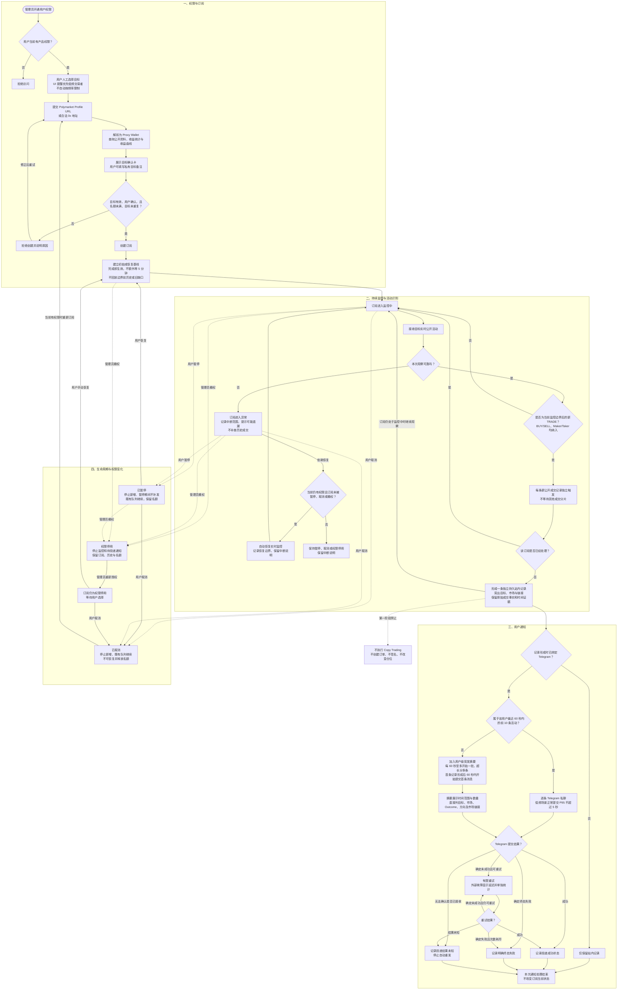

# Trader Sync：Activity Alerts 需求

> 需求状态：已确认
>
> 关联技术设计：[Activity Alerts 后端技术设计](../../design/trading/trader-sync-activity-alerts.md)（设计中）

本文定义产品第一阶段的目标行为。产品面向用户人工挑选的低频交易者，核心目标是帮助订阅用户及时识别这些目标正在交易哪些市场；用户收到信息后，自行前往对应市场判断是否手动下单。未来 Copy Trading 的总体方向是复制人工选定的低频交易者的交易，高频监控和高频跟单不属于性能支持目标。Copy Trading 的具体业务规则仍另行讨论，本阶段不提供交易执行入口。

第一阶段需求此前已正式确认并进入技术设计，首期 10 人规模、低频目标定位、逐条活动、完成基线立即生效、不补历史及权限边界继续有效。本轮技术核实引出的业务调整已逐项确认，按事实将需求状态记为 `已确认`。用户已逐项确认：以链上结算时间判断订阅边界并明确展示“结算时间”；摘要 60 秒内开始提交，成功回执耗时单独记录；每 60 秒至多开始一批摘要，超长分多条完整展示，60 秒时限针对该批首条提交，整批完成耗时单列。三项决定已全部写入本文。2026-09-10 本轮另已确认：保留前 10 条逐条 Telegram 提醒，同用户集中成交允许按限速排队；平稳流量仍以成功回执 P95 ≤ 5 秒为目标，集中成交单列排队时延并保留在总体统计中，不承诺这类突发也达到 5 秒。另已确认发送许可边界：撤权/解绑提交后禁止新发送许可，未获许可队列终止；此前已进入发送中的单条请求可完成或形成未知结果，不等待网络回执才完成撤权。[完整设计 spec](../../superpowers/specs/2026-09-10-trader-sync-activity-alerts-design.md)仍待书面整体审阅；业务确认不等于实现授权，本次只推进设计文档。

## 第一阶段需求总览

| 维度 | 第一阶段需求 |
| --- | --- |
| 产品范围 | 产品名为 `Trader Sync`，本阶段板块名为 `Activity Alerts`；只做授权、订阅、监控和通知，`Copy Trading` 另行讨论。 |
| 核心价值 | 告知用户目标正在交易的市场、Outcome、方向与市场链接，供用户自行判断是否手动下单；不要求还原目标的一整张订单或完整操作意图。 |
| 目标选择与产品定位 | 用户人工挑选目标，UI 明确提醒优先选择低频交易者；系统不自动筛选、判断频率或禁止订阅高频目标。高频交易监控和未来高频跟单不属于性能支持目标。 |
| 产品权限 | 只有管理员开通权限的 ATHENA 用户可以使用；管理员可撤权，用户之间的数据严格隔离。 |
| 管理员边界 | 管理员只读查看用户、目标、订阅状态、运行健康及活动和投递数量汇总；不能操作订阅，也不能查看用户备注、完整活动或逐条 Telegram 投递内容。 |
| 订阅限制 | 每位用户最多保有 10 个未取消订阅；同一用户对同一 Proxy Wallet 只能有一个有效订阅，不同用户可以订阅同一目标。 |
| 首期使用规模 | 按 10 名用户同时保持订阅监控设计，每人最多 10 个未取消订阅；容量覆盖 100 个订阅关系以及目标完全不重叠时的 100 个不同目标。人数按后台持续监控计，不按同时打开页面计。 |
| 目标输入与确认 | 接受 Polymarket Profile URL 或合法 0x 地址，统一解析为 Proxy Wallet；创建前展示已确认范围内的公开资料、完整地址、收益统计和收益曲线供用户确认。名称或用户名不能单独用于订阅；辅助收益资料缺失不阻止确认订阅。 |
| 目标备注 | 用户可以为自己关注的每个 Proxy Wallet 设置最多 20 个字符的私有纯文本备注；备注显示在订阅列表、详情及后续新通知中，其他用户和管理员不可见。取消订阅后保留，重新订阅同一目标时自动沿用。 |
| 活动范围 | 只通知实际成交的 `TRADE`，覆盖 `BUY`、`SELL`、Maker 与 Taker，不按金额、市场或 Outcome 过滤；挂单、改单、撤单及其他活动不通知。 |
| 活动粒度 | 每条新识别的公开成交记录独立触发，不等待同一交易的其他分片；同一市场或交易的不同记录可以分别提醒。可明确识别为同一已处理记录的重复读取不新增提醒。 |
| 历史边界 | 首次订阅和手动恢复在完成基线后立即生效，展示明确生效时刻，按链上结算时间判断，不额外等待 5 分钟。生效前撮合、生效后结算的成交计入新活动；生效前已结算的成交不因晚发现而计入。当前不做历史补查，包括断线、服务重启、故障及停用期间的遗漏。仍有资格监控的订阅在故障恢复后自动继续实时监控，只识别恢复边界起的新结算成交；中断说明继续可见。 |
| 订阅生命周期 | 订阅可暂停、恢复或取消；暂停与权限停用继续占用名额，恢复时建立新基线；取消不可恢复并释放名额。用户主动暂停或取消后，已经排队的通知继续完成并提示可能延迟；撤权和 Telegram 解绑仍停止投递。撤权后全部未取消订阅权限停用，重新授权后仍需用户逐个恢复。 |
| 站内通知 | 每个已识别且符合边界的成交活动都立即形成一条独立、持久且不自动过期的 `Activity Alerts` 记录，无论 Telegram 是否绑定或投递成功；不承诺覆盖中断期间未接收到的成交。 |
| Telegram 通知 | 活动形成时已绑定 Telegram 才私聊通知；绑定、解绑和重新绑定都不补发历史。仅对确定未成功的暂时失败有限重试；结果不确定时停止自动重发并显示“投递结果未知”，优先避免重复通知。第一阶段没有逐订阅渠道配置。 |
| 突发摘要 | 同一用户任意连续 60 秒内前 10 条逐条 Telegram 通知，第 11 条起进入用户级摘要；每 60 秒至多开始一批，超长时分多条完整展示全部涉及目标、市场、Outcome、方向及市场链接。从首条待汇总站内记录形成到开始向 Telegram 提交该批首条不超过 60 秒，成功回执及整批完成耗时单列；不同用户互不影响。 |
| 时效目标 | 面向人工选择的低频目标及其正常负载、偶发短时突发：公开可查询到站内记录形成 P95 不超过 15 秒、P99 不超过 30 秒；平稳流量普通 Telegram 通知成功回执 P95 不超过 5 秒，同用户集中成交允许按限速排队并单列时延；摘要首条待汇总记录形成后 60 秒内开始提交该批首条，回执及整批完成耗时单列。高频场景不纳入性能保障；外部延迟、监控中断及 Telegram 异常单独标识和统计，已识别记录不因频率高而丢弃。 |
| 安全边界 | 第一阶段绝不创建、签名或提交订单，也不改变任何钱包、余额或 Polymarket 仓位。 |

## 背景与问题

ATHENA 需要向特定用户开放一个受管理员控制的新产品。获得产品权限的用户可以自行订阅 Polymarket 目标账户；目标产生符合范围的新活动时，ATHENA 将事实通知该订阅用户。

用户负责人工挑选适合跟随的低频交易者，产品在 UI 中提示这一适用场景。系统不自动筛选交易者，不为目标设定频率准入门槛，也不以高频交易监控或高频跟单为性能建设目标。

通知首先回答“哪个目标在交易哪个市场、哪个 Outcome、什么方向”，并给出对应市场链接。用户据此自行查看市场并决定是否手动下单；同一目标在同一市场的多条新成交记录可以带来多次有效提醒，不必为等待完整成交分片而延后市场信息。

未来 Copy Trading 的总体目标是完成对人工选定低频交易者的交易复制。复制金额、买卖映射、订单执行及其他具体业务规则另行讨论；当前仅确认这一产品方向。第一阶段只提供授权、订阅、可靠监控和用户通知，不触发任何交易操作。

## 目标

- 面向用户人工选择的低频交易者提供活动提醒，并在创建订阅前明确提示优先选择低频目标；不增加自动筛选或禁止订阅高频目标的门槛。
- 让订阅用户及时知道目标账户正在交易哪些市场，并能通过市场链接自行查看、判断是否手动下单。
- 管理员能够决定哪些 ATHENA 用户可以使用本产品。
- 管理员能够只读查看用户、订阅目标、订阅状态和运行概要，但不能操作用户订阅；第一阶段的管理员产品界面不提供完整活动内容或逐条通知投递明细。
- 获得权限的用户能够在 ATHENA 中创建和管理属于自己的目标账户订阅。
- 用户创建订阅前能够查看目标的公开身份、收益统计与收益曲线，以更可靠地确认所选账户。
- 用户能够为自己关注的每个目标设置私有备注，便于识别和管理目标。
- 每位获授权用户最多同时订阅 10 个目标账户；同一用户对同一规范目标身份最多保留一个有效订阅，不同用户之间互不占用名额。
- 每个订阅都绑定创建它的 ATHENA 用户；目标产生符合范围的新活动时，只通知相应订阅用户。
- 多个获授权用户可以独立订阅目标，各自的订阅、状态和通知互不泄露。
- 对目标建立稳定且无歧义的监控身份，不因显示名称变化而监控错误账户。
- 在重复读取、乱序返回、服务重启和短时外部故障下，保留有效监控期间识别到的成交事实；区分不同成交记录的多次提醒与同一记录的重复处理。Telegram 投递结果不确定时优先避免重复，不把无法确定是否送达表述为确定未送达。
- 记录成交结算、ATHENA 发现和通知投递相关时间，使用户能够判断通知时效；页面和通知明确标注“结算时间”。
- 当订阅已无法被可靠监控或通知时，不能把“系统失效”表现成“目标没有新活动”。

## 非目标

- 不讨论或设计自动跟单、手动跟单入口及其产品规则。
- 不以高频交易监控或高频跟单为性能支持目标，不为持续高频目标承诺本文的正常监控和通知时效。
- 不自动按交易频率筛选、评级、拒绝或暂停目标订阅，不把低频使用建议变成新的订阅准入条件。
- 不创建、签名、提交、撤销或修改任何 Polymarket 订单。
- 不接收复制金额、比例、仓位、余额、滑点、价格或其他交易执行参数。
- 不访问或保管被监控目标的私钥、API Key、会话或其他非公开凭据。
- 不自动发现、推荐或评价“值得跟随”的目标，不提供胜率、策略或投资建议。
- 不把目标收益统计或曲线解释为未来收益保证、ATHENA 评价或投资建议。
- 不向未获管理员授权的用户开放订阅、目标活动或通知数据。
- 不把挂单、改单、撤单、拆分、合并、赎回、奖励、充值和提现纳入第一阶段通知范围。
- 不承诺消除 Polymarket 将活动公开到可查询数据源之前的外部延迟。
- 当前不做历史成交补查或回放，包括首次订阅前、断线、服务重启、系统或外部依赖故障、暂停、取消和撤权期间的遗漏；不以覆盖全部历史成交为目标。

## 低频目标定位与使用提醒（已确认）

低频交易者由用户人工选择。产品通过说明和创建订阅前的 UI 提醒引导用户优先选择低频目标；不自动计算频率标签，不制定每分钟或每天成交次数的业务准入阈值，也不自动禁止、暂停或取消高频目标的订阅。

性能保障面向低频目标及其正常负载、偶发成交分片或短时集中成交；首期用户与目标规模按下文“首期使用规模”执行，具体成交负载与承载能力由技术设计核实。持续高频交易监控和高频跟单不属于产品的性能支持目标。用户仍可按已有权限、目标解析和配额规则订阅目标，系统继续按既有活动识别、逐条保留和突发摘要规则处理；高频场景不承诺达到正常性能目标，但不能因此静默丢弃已识别活动或把异常表现为没有成交。无法可靠监控时，继续如实显示异常、延迟和可能缺失的范围；恢复后只继续实时监控，不补查遗漏。

既有“任意连续 60 秒前 10 条逐条提醒、其后摘要”的规则只用于控制消息数量，不是低频或高频交易者的划分标准，也不构成支持持续高频监控的承诺。

UI 必须在用户确认创建订阅前清晰提示优先选择低频交易者，并在产品说明中说明高频场景不纳入性能保障。提示本身不要求用户再完成额外确认步骤，不改变目标确认卡、收益资料缺失处理、订阅配额或权限规则。参考文案：

> 建议优先订阅低频交易者。本功能面向人工选择的低频目标，不保障高频交易场景的通知时效。收到提醒后，请查看对应市场并自行判断。

这里只确认 UI 需要表达的信息；具体布局在后续 UI 设计阶段确定。

## 首期使用规模（已确认）

用户已确认首期按 **10 名用户同时保持订阅监控**进行设计。这里包含关闭网页后仍由后台持续监控的用户；每位用户最多 10 个未取消订阅的既有配额继续适用。

- 容量目标覆盖 10 名用户、合计 100 个订阅关系全部处于监控中的场景；当各用户的目标完全不重叠时，最多为 100 个不同目标。
- 多个用户订阅相同目标时，不同目标数量相应减少，各用户的活动记录、通知资格和突发摘要仍独立处理；目标重叠不减少用户侧订阅关系数量。
- 本规模是首期容量与性能设计依据，不新增管理员授权人数上限或用户准入规则。
- 在这一规模内，低频目标正常负载及偶发短时突发继续适用 15/30 秒监控和 60 秒摘要目标；普通通知的 5 秒成功回执目标适用于平稳流量，同用户集中成交按下文已确认的排队边界处理。具体成交速率、外部配额与实际达标情况由技术设计核实，不能仅按人数宣称容量已经验证。
- RPC 调研中“每个目标每天 100 条匹配日志”仍只是费用算例，不作为已确认的成交速率、低频定义或准入阈值。

## 角色与权限

| 角色 | 职责与边界 |
| --- | --- |
| ATHENA 管理员 | 已明确：开通或关闭用户使用本产品的权限；只读查看用户、订阅目标、状态、运行健康和活动与投递汇总，但不能代替用户操作订阅，也不能通过第一阶段管理员产品界面读取完整活动内容、Telegram 消息正文或逐条投递历史。 |
| 获授权用户 | 在 ATHENA 中创建、查看、暂停、恢复和取消自己的目标订阅，并接收自己订阅产生的活动通知。 |
| 未获授权用户 | 不能进入或使用产品，也不能读取产品页面、订阅、目标活动或通知结果。 |
| 被订阅目标 | Polymarket 上的外部公开账户；无需登录 ATHENA，也不向 ATHENA 授权。 |

每个订阅必须有唯一 ATHENA 用户所有者。管理员只能读取已确认的运行概要；目标备注、完整活动内容、Telegram 消息正文和逐条投递历史不属于管理员只读范围。普通用户不得查看、修改或接收其他用户的订阅数据。

## 业务术语

| 术语 | 定义 |
| --- | --- |
| 产品权限 | 由 ATHENA 管理员授予某个用户、允许其进入并使用本产品的资格。 |
| 订阅用户 | 已获得产品权限并创建目标订阅的 ATHENA 用户。 |
| 目标账户 | 订阅用户希望持续观察的一个 Polymarket 公开交易身份。 |
| 规范目标身份 | 用于唯一识别目标且不随显示名称变化的身份；统一使用 Polymarket Profile Address / Proxy Wallet。 |
| 目标确认卡 | 目标解析成功后、创建订阅前展示的确认资料，包含规范身份、公开资料以及可取得的收益统计和收益曲线。 |
| 目标备注 | 由订阅用户为自己关注的一个 Proxy Wallet 编写、最多 20 个字符的私有纯文本，仅用于个人识别和管理，不属于 Polymarket 公开资料。 |
| 目标订阅 | 由一个 ATHENA 用户拥有、指向一个规范目标身份的持续活动关注关系；除已取消外均为有效订阅并占用配额，包括因产品撤权而权限停用的订阅。 |
| 权限停用 | 管理员撤销用户的 `Trader Sync` 权限后，所有未取消订阅进入的保留状态；不监控、不形成新活动、不产生新发送许可；已获许可请求按发送边界处理，重新授权后仍需用户手动恢复。 |
| 目标活动 | Polymarket 对目标公开的一项操作事实；第一阶段只有实际成交的 `TRADE` 属于通知范围。 |
| 交易活动 | Polymarket 对目标公开的一笔 `TRADE` 事实，包含买卖方向、市场、Outcome、价格、数量和时间等可用信息。 |
| 成交分片 | 外部公开数据中的一条交易记录；同一次目标交易可能因多个成交价格或对手方表现为多个分片。 |
| 成交活动 | 一条新识别的公开成交记录所形成的最小通知事件，不要求收齐相同交易哈希、Market/Asset、Outcome 和方向的其他分片；一条记录不一定对应目标的一整张订单。 |
| 结算时间 | 成交在链上结算所对应的区块时间，是第一阶段判断订阅生效、暂停及实时恢复边界的成交时间口径；页面和通知明确标注“结算时间”，不表述为精确撮合时间。本文示例中的成交时刻均指此时间，另有说明除外。 |
| 初始基线 | 创建或手动恢复订阅时用于建立可信新旧边界的基准，本身不产生用户通知；基线完成后订阅立即生效并展示明确生效时刻。 |
| 实时恢复边界 | 监控中断后重新能够可靠观察新活动的起点；恢复后仅接收该边界起的新成交，不追溯读取中断前或中断期间未接收的成交。 |
| 监控中断 | 因连接、服务或外部依赖异常暂时无法可靠观察活动的时段；保留可判断的范围、原因和恢复时间，提示可能遗漏，不列为待补查，也不推测遗漏的成交数量或内容。 |
| 站内活动记录 | 每个成交活动在 `Activity Alerts` 中形成、归订阅所有者查看的持久历史记录。 |
| Telegram 通知 | 用户已绑定 Telegram 时，对新形成的站内活动记录发送的私人即时提醒；正常情况下逐条发送，达到用户级突发阈值后改用突发摘要。 |
| 已排队通知 | 已形成站内活动、已取得当时 Telegram 通知资格，并已进入普通发送或待汇总范围的提醒；包括等待组成摘要的活动。中断期间未接收的成交不属于已排队通知。 |
| 投递结果未知 | 通知可能已被 Telegram 接收，但 ATHENA 无法可靠确认结果；优先避免重复通知，停止自动重发并保留用户可见的未知终态，不计为确定成功或确定失败。 |
| 突发摘要 | 同一用户在任意连续 60 秒内收到超过 10 个新成交活动时，对第 11 个及后续活动形成的用户级汇总批次；每 60 秒至多开始一批，内容超长时分多条消息完整展示，并标明同批关系与序号，不替代或合并站内活动记录。 |
| 用户通知 | 站内活动记录及其可选 Telegram 私聊投递；它不是跟单指令，也不代表任何订单已经或将要执行。 |
| 外部公开延迟 | 成交结算到对应成交数据公开可查询之间可核验的时间；不计入 ATHENA 时效目标。链下撮合时间或公开起点不可核验时明确未知，不用 ATHENA 首次发现时刻推算或代替。 |

## 当前可行性与通知粒度

除公开活动 API 外，[链上成交数据可行性调研](onchain-trade-data-feasibility.md)已通过当前两种 V2 Exchange 的部署源码、实际成交回执、RPC 目标过滤和市场查询，证明能够识别指定实际交易钱包的自身成交并补齐市场资料。用户已选择链上结算时间口径并要求细化实时采集；开发选用 Chainstack、dRPC 仅作手动替代。[当前源契约核验](source-contract-verification.md)已补充自身日志粒度、钱包/金额与 Combo 映射的证据；完整运行矩阵仍需验收，不能将核心样本成功等同于本文全部要求已经验证。金额按实际来源币种准确标注；样本中的 pUSD 不因公开 API 存在 `usdcSize` 字段就改标为 USDC。[pUSD 官方说明](https://docs.polymarket.com/concepts/pusd)

当前公开能力足以支持交易活动通知：[用户活动](https://docs.polymarket.com/api-reference/core/get-user-activity)可以按 Profile Address 查询并区分 `TRADE`、`BUY` 与 `SELL`，结果包含市场、Outcome、价格、数量、USDC 金额、交易哈希和秒级时间戳；[公开成交](https://docs.polymarket.com/api-reference/core/get-trades-for-a-user-or-markets)也可按用户查询，但 `takerOnly` 默认值为 `true`。另一方面，[User WebSocket](https://docs.polymarket.com/api-reference/wss/user)需要目标自身的认证信息，不能被假设为监控任意公开目标的推送来源。

目标确认资料也存在公开数据基础：[公开资料](https://docs.polymarket.com/api-reference/profiles/get-public-profile-by-wallet-address)包含创建时间、Proxy Wallet、头像、显示名称和认证标记；[持仓总价值](https://docs.polymarket.com/api-reference/core/get-total-value-of-a-users-positions)、[已平仓仓位](https://docs.polymarket.com/api-reference/core/get-closed-positions-for-a-user)、[已交易市场数量](https://docs.polymarket.com/api-reference/misc/get-total-markets-a-user-has-traded)和[交易员排行榜](https://docs.polymarket.com/api-reference/core/get-trader-leaderboard-rankings)可提供部分统计与周期 PnL。官方[速率限制](https://docs.polymarket.com/api-reference/rate-limits)列出了 User PNL API，但当前公开参考文档没有单独给出完整收益曲线的字段与区间契约；因此需求必须允许明确显示不可用字段，技术设计阶段还需验证稳定数据来源。

文档已有的只读抽样显示，同一交易哈希、相同秒级时间戳、相同市场、Asset、Outcome 和方向可能返回多个成交分片，公开记录也不能直接证明目标完整订单的边界。

用户已确认按单条新成交记录独立触发，并保留用户级突发摘要：

- 每条新识别的公开成交记录独立形成站内活动，正常流量下独立提醒；不等待其他分片、不计算整笔交易的汇总金额或加权均价。
- 同一市场、同一交易哈希下的不同成交记录可以多次提醒；迟到的新分片作为新的成交活动处理，不需要修改已经通知的记录。
- 能明确判断为同一已处理记录的重复扫描，不再形成新提醒；不把重复读取等同于新的真实交易，也不宣称每条记录代表一张独立订单。无法可靠区分的源数据边界应如实说明。
- 保留用户级突发摘要保护。摘要直接列出涉及的目标、市场、Outcome、方向及市场链接，不能仅列目标活动数量；详细成交仍在站内逐条保留。

上述“多条新成交可以分别提醒”与“同一条 Telegram 消息在结果未知时不自动重发”是不同规则，两者不冲突。

## 订阅生效边界（已确认）

首次订阅和手动恢复在完成基线后立即生效，不额外等待 5 分钟，并向用户展示明确的生效时刻。用户已确认以**链上结算时间**是否处于有效监控区间决定资格，并在形成活动前遵守当前权限和订阅状态；首次发现时间和可能更早的链下撮合时间均不用于替代这一边界。页面和通知明确标注“结算时间”。基线只确定从何时开始接收新结算成交，不要求扫描目标历史交易。监控中断后另建立实时恢复边界，不追溯中断期间遗漏的成交；建立可信边界的方法留给技术设计。

例如，若订阅于 12:00:00 生效，11:59:59 已在链上结算、12:01 才发现的交易不通知；11:59:59 撮合、12:00:02 才在链上结算的成交计入新活动。12:00:01 结算、12:01 才从实时数据源收到的成交，在期间监控连续且未暂停、取消或撤权时仍应识别。若中间发生监控中断，则按实时恢复边界处理，不以迟到记录为由回放旧区间。开始时刻纳入区间，暂停、取消或撤权的生效时刻作为区间结束，不纳入结束时刻及之后结算的成交；具体同秒边界的可实现性在技术设计阶段验证。

## 实时监控与中断恢复（已确认）

用户已明确当前保持简单设计，不做历史补查。正常运行只识别实时收到且符合监控边界的新成交；断线、服务重启或系统及外部依赖故障后，不追溯读取遗漏成交，不建立待补查任务，也不通过其他活动数据源回放旧区间。该范围不影响市场资料补全、创建订阅前的公开收益资料查询，以及已保存站内活动的查看。

监控中断时如实显示异常，保留可判断的中断范围和原因，提示“中断期间可能遗漏交易，恢复后不会补发”。依赖恢复且订阅未暂停、取消或撤权时，系统自动继续实时监控，记录恢复时间，只识别实时恢复边界起的新成交，不要求用户手动恢复。恢复后的“监控中”只表示当前观察正常，不能将此前中断标为数据完整或已补齐。

例如，系统 12:00 断线，目标 12:02 成交，12:04 恢复且订阅仍有效：12:02 的成交若未接收则不补查、不补通知，12:04 起的新成交正常识别。保留这段中断说明，不推测其中是否实际有成交。若用户在 12:03 暂停，12:04 的连接恢复不自动恢复该订阅；之后用户手动恢复时建立新基线。

中断前已可靠接收的活动按接收时所属监控区间判断成交边界，形成记录时仍需符合当前权限及订阅规则，可以继续处理和补齐市场资料；新的实时恢复边界仅约束恢复后新接收的数据。已形成的站内记录继续保留，已排队通知按原规则继续投递。用户主动暂停或取消时旧队列继续完成；撤权、解绑或重新绑定时停止受影响旧投递。通知的有限重试和避免重复规则继续适用。

## 时效口径（已确认）

时效口径定义一段延迟从什么事件开始、到什么事件结束。用户已确认摘要的 60 秒以开始向 Telegram 提交该批首条消息为终点，成功回执与整批完成耗时分别记录；外部故障继续单独处理和统计。正常监控及平稳流量普通通知的数值目标继续适用，普通通知的 5 秒仍以成功回执为终点；同用户集中成交按本节的排队边界处理。采集时刻的可观测性和指标计算方法留给技术设计：

以下正常性能目标适用于“低频目标定位与使用提醒”定义的低频使用场景及正常支持负载，首期按 10 名用户、最多 100 个监控订阅及目标完全不重叠时的 100 个不同目标设计，包括偶发短时突发；持续高频场景不纳入性能保障。该范围不改变已识别记录的保留、突发摘要、异常可见性或用户隔离规则。

| 时间段 | 已确认口径 |
| --- | --- |
| 成交结算 → 数据公开可查询 | 外部公开延迟，单独呈现可核验的证据，不纳入 ATHENA 的 15/30 秒正常监控目标；链下撮合时间不可核验时不推算该分段。 |
| 数据公开可查询 → 站内记录形成 | 保留正常监控 P95 ≤ 15 秒、P99 ≤ 30 秒目标，包含 ATHENA 自身发现和处理所耗时间；数据公开起点的可观测性留待技术设计验证，不能直接用 ATHENA 首次发现时间代替，也不能把发生到发现的全部间隔都归为外部延迟。 |
| 站内记录形成 → Telegram 明确成功接收普通通知 | 平稳流量保留 P95 ≤ 5 秒目标；同用户集中成交仍保留前 10 条逐条提醒，允许按 Telegram 限速排队，不承诺该突发自身也达到 5 秒。成功接收指 Telegram 确认接收发送请求，不代表用户设备已展示、用户已阅读或已经下单。 |
| 首条待汇总记录形成 → 开始向 Telegram 提交该摘要批次首条消息 | 正常情况下不超过 60 秒；只生成内容或进入待发队列不算开始提交。同一用户相邻两批首条开始提交至少间隔 60 秒；超长批次可含多条消息。 |
| 摘要消息开始提交 → 该消息成功回执；摘要批次开始 → 整批完成 | 分别记录和呈现，不纳入前述 60 秒提交时限，不另行承诺未确认的完成时限。只有全部消息确认成功才算整批成功；未完成、失败、未知或终止情况如实展示。 |
| 监控中断、Telegram 异常或投递结果未知 | 监控中断单独记录次数、时段与恢复情况，遗漏成交不补查，也不记为正常零活动。外部故障时不强行承诺 60 秒，已有通知明确显示延迟、失败或结果未知；与正常时效样本分别统计，不能隐藏异常或未完成投递。仅按已确认的避免重复原则对确定未成功的暂时失败有限重试，结果未知时停止自动重发。 |

例如，交易于 12:00:00 结算，12:00:08 公开可查询，12:00:12 被 ATHENA 发现，12:00:13 形成站内记录，12:00:16 得到 Telegram 成功回执：结算至成功回执共 16 秒，ATHENA 的公开至记录耗时为 5 秒，普通通知提交耗时为 3 秒。本例中的公开时刻仅用于解释，实际无法可靠观测时必须标注该分段未知，不能伪造精确外部延迟，也不能据结算时间推断撮合时刻。

### 同用户集中成交的普通通知排队（已确认）

Telegram 官方建议同一私聊每秒不超过一条消息，短时超速可能被容许，但不能作为稳定容量保证。同一用户瞬间形成 10 条普通提醒时，按每秒一条排程，第 10 条约在第 9 秒才开始请求，尚未计回执时间。[Telegram 官方限制](https://core.telegram.org/bots/faq#my-bot-is-hitting-limits-how-do-i-avoid-this)

用户已确认优先保留“任意连续 60 秒前 10 条逐条提醒、第 11 条起摘要”。平稳流量普通提醒继续以成功回执 P95 ≤ 5 秒为目标；同用户集中成交产生的逐条提醒允许按限速排队，单列排队时延，不承诺该突发自身也在 5 秒内达标。集中成交样本仍保留在总体统计中，不属于外部故障，也不能仅因超时而事后归类为集中成交或高频场景。

该调整只改变集中成交的普通 Telegram 时效承诺。站内逐条活动及 15/30 秒监控目标、摘要首条 60 秒提交目标、完整内容、避免重复和用户隔离继续适用；一个用户的队列不得阻塞其他用户的正常发送。

## 发送许可与撤权边界（已确认）

发送许可指 ATHENA 在核验当前产品权限与 Telegram 绑定后，持久记录某一次通知已进入“发送中”的决定。许可与消息实际开始提交、Telegram 成功回执是三个不同事件；界面不能将已获许可直接显示为已提交或成功。

用户已确认：管理员撤权、Telegram 解绑或重新绑定成功提交后，禁止为旧资格批准新的发送；尚未取得发送许可的普通通知、待汇总成员及摘要部分立即终止。此前已经进入发送中的单条通知允许完成或形成未知结果，用户仍可能稍后收到，包括取得许可后尚未实际发出请求的竞争窗口。撤权与解绑不等待网络回执，也不能撤回已经交给 Telegram 的请求。此前获许可的尝试若确定未成功，也不得在资格失效后重新获得许可；重新授权不能恢复这份旧投递的重试资格；未知结果始终不自动重发。

该边界不改变撤权后立即禁止产品访问、停止新活动、保留历史及重新获权后手动恢复的规则。用户主动暂停或取消仍允许旧队列继续按原资格处理。摘要每一部分分别取得许可；撤权时某一部分已在发送，不代表其余部分也有继续发送的资格。

## 业务规则与不变量

以下规则保留既有确认结论并纳入已逐项确认的结算时间、摘要提交时限、超长分批与同用户集中成交排队调整；下列业务规则均已逐项确认：

1. 只有当前具有产品权限的用户才能创建、查看、修改、暂停、恢复或取消自己的目标订阅。
2. 用户只能读取自己的订阅、相关目标活动和通知状态；相同目标被多个用户订阅时，各用户仍拥有独立订阅关系。
3. 管理员只读范围包括：用户身份、订阅目标及完整 Proxy Wallet、订阅状态及生命周期时间、最近成功监控时间、异常摘要、中断范围及恢复时间、活动数量以及 Telegram 投递成功、确定失败和结果未知数量汇总。第一阶段管理员产品界面和业务接口不提供目标备注、完整活动内容、Telegram 消息正文或逐条投递历史，也不得提供创建、修改、暂停、恢复、取消、重发或删除用户订阅及通知的入口。
4. 每位用户最多同时订阅 10 个不同的 Proxy Wallet；待建立基线、监控中、已暂停、异常和权限停用订阅均占用名额，已取消订阅释放名额。
5. 同一用户对同一 Proxy Wallet 最多保有一个有效订阅；不同用户可以独立订阅同一 Proxy Wallet，各自占用自己的名额。
6. 每个目标必须解析为一个规范目标身份。显示名称、头像和简介只用于展示，变化后不得导致目标被当成新身份或历史活动被重新通知。
7. 第一阶段只以已经实际成交并公开为 `TRADE` 的活动触发通知，同时覆盖 `BUY` 和 `SELL`、Maker 与 Taker；挂单、改单、撤单及其他非交易活动不触发通知。
8. 创建订阅时先建立可信的新旧边界，基线完成后立即生效并进入监控中，不额外等待 5 分钟；首次订阅不回放历史。展示明确生效时刻，按“订阅生效边界”以链上结算时间判断资格；生效前撮合、生效后结算的成交计入新活动，生效前已结算的成交不因晚发现而计入。
9. 订阅在监控中发生连接、服务或外部依赖故障时进入异常状态并继续占用配额；若期间未暂停、取消或撤权，依赖恢复后自动继续实时监控，只识别实时恢复边界起的新成交，不要求用户手动恢复。断线、重启或其他故障期间未接收的成交均不补查；中断范围和恢复时间按第 44 条保留。
10. 用户可暂停监控中或异常的订阅。主动暂停后停止新活动的识别和通知生成，暂停期间发生的活动不补发。暂停前已经排队的普通通知及待汇总活动继续按原规则完成，不因暂停清除。产品在操作时和状态中明确提示“已排队通知仍会继续发送，可能稍后收到”。暂停状态继续占用配额并保留目标唯一性。用户恢复时重新建立基线，只识别新生效时刻起的活动，不补查旧区间；旧队列的完成不属于暂停期间活动补发。
11. 用户取消订阅后停止新监控和新活动通知生成，订阅进入不可恢复终态并立即释放配额与目标唯一性；取消前已经排队的通知继续完成并显示延迟提示，既有站内记录和投递结果继续保留。用户以后可以对相同 Proxy Wallet 创建新订阅，新订阅重新建立基线且不回放取消期间活动；旧订阅队列的完成不占用新订阅名额，也不作为新订阅活动重复处理。
12. 第一阶段不设置最小金额、市场类别、Outcome 或买卖方向过滤。
13. 对能明确识别为同一已处理公开成交记录的重复返回、多次扫描和跨服务重启保持站内活动唯一；同一市场或交易哈希的不同新成交记录可以分别提醒。Telegram 投递遵循第 23 条的避免重复原则，不以自动重发消除未知结果。
14. 不同订阅即使指向同一目标，也必须分别按订阅所有者的权限和接收状态决定是否通知。
15. 每条新识别的公开成交记录独立触发，不等待其他分片，不因市场、方向、时间戳或交易哈希相同而合并；迟到的新分片仍须位于当前有效订阅区间并满足当前权限和订阅状态，符合时形成新活动。保留原始事实，不修正为目标整张订单的总量或完整交易意图。
16. 通知只能陈述外部数据支持的事实；字段缺失、冲突或无法核验时不得推测目标意图、实际仓位或盈亏。
17. 识别、保存和通知目标活动的任何步骤都不得调用交易执行能力，也不得产生钱包、余额、订单或仓位副作用。
18. 通知渠道暂时失败时，已识别活动不得被重新当成新活动；投递最终应显示成功、确定失败或投递结果未知。因撤权、解绑或重新绑定而终止的投递保留终止原因。管理员仅通过订阅异常摘要和投递结果数量汇总了解情况，不读取对应活动或逐条投递内容；未知结果不算作确定成功或确定失败。
19. 每个已识别且符合监控边界的成交活动都必须在 `Activity Alerts` 中形成持久站内记录，完整保留已识别活动的历史；第一阶段不自动过期或删除这些记录，也不承诺覆盖中断期间未接收的成交。
20. 用户在站内活动记录形成时已绑定 Telegram 的，正常情况下同时收到一条私人 Telegram 通知；达到突发阈值时按突发摘要规则投递。任何情况下都不得发送到群组，也不提供逐订阅渠道配置。
21. 未绑定 Telegram 不阻止用户创建或维持订阅，但产品必须明确提示当前只有站内记录。以后绑定或重新绑定 Telegram 时，只推送绑定成功后新形成的活动，不补发未绑定期间的历史消息。
22. 用户解除 Telegram 绑定后停止外部推送；解除绑定期间的活动仍形成站内记录，重新绑定后不补发这些历史消息。
23. Telegram 投递以避免重复通知为优先：仅对确定没有成功提交的暂时失败进行有限重试；若消息可能已被接收但结果无法确认，则停止自动重发并显示“投递结果未知”。确定失败或结果未知均保留站内记录，不重复创建活动，也不把未知结果表述成确定未送达。该原则同样适用于普通通知和突发摘要；用户允许已排队通知继续完成，不代表对未知结果无限重试。
24. 成交结算至对应数据公开可查询之间可核验的外部公开延迟不计入 ATHENA 正常监控时效；分别记录结算、公开可查询和发现时间，不能可靠观测的分段明确未知，不由发现时刻倒推撮合或公开时刻。
25. 在低频目标使用场景及正常支持负载下，从交易可被公开查询到形成站内活动记录，95% 不超过 15 秒，99% 不超过 30 秒。持续高频交易监控不纳入该性能保障。
26. 在低频目标平稳流量下，非突发摘要覆盖的活动，从站内活动记录形成到 Telegram 成功回执，95% 不超过 5 秒；同用户集中成交的前 10 条仍逐条发送，允许按限速排队，单列时延并保留总体统计，不承诺该突发自身也达到 5 秒；Telegram 服务自身在成功接收后的最终送达时间不属于 ATHENA 可保证范围。偶发短时突发形成的摘要不适用该 5 秒指标，而是从首条待汇总站内记录形成到开始向 Telegram 提交该批首条消息不超过 60 秒；只生成内容或排队不算开始提交。摘要消息成功回执和整批完成耗时单列，不另设未确认的时限，也不要求用户已经阅读。高频场景不纳入性能保障，外部故障单独处理和统计，见“时效口径”。
27. 每条站内活动记录保存链上结算时间、ATHENA 发现时间、站内记录形成时间；页面和通知明确使用“结算时间”标签。存在 Telegram 投递时还保存其成功、确定失败、结果未知或终止时间及原因。
28. 监控中断与正常时效样本分别统计，保留异常次数、可判断的范围和恢复时间；中断期间可能遗漏且不补查，不伪造遗漏成交的活动记录、数量或延迟样本。已经接收或排队的活动继续保留可核验的时间与延迟证据。
29. 目标没有新活动是正常状态，不产生心跳式活动消息；用户应能通过独立订阅状态区分无活动和监控失效。
30. 管理员撤销产品权限后立即阻止用户进入 `Trader Sync`、读取站内活动或操作订阅；用户所有未取消订阅进入权限停用状态，停止监控、形成新站内记录和批准新的 Telegram 发送；此前已获许可尝试按发送边界处理。
31. 撤权前已经形成的订阅配置和站内活动历史继续保留；尚未获得发送许可的 Telegram 通知停止投递并记录因撤权终止的状态；撤权提交后不得产生新的发送许可，已进入发送中的请求按上述已确认边界完成或形成未知结果。
32. 管理员重新开通权限后，用户重新获得产品及已有历史的读取权，但原订阅继续保持权限停用，仍计入 10 个订阅配额。
33. 重新获权用户必须手动恢复每个订阅；恢复时建立新基线并立即生效，只通知新生效时刻起的交易，不补查撤权期间或其他旧区间的活动；原有中断说明继续可见。
34. 突发活动不得改变站内记录粒度；每个成交活动仍立即形成独立、完整且可核验的站内活动记录，不静默丢弃或合并。
35. Telegram 突发阈值按订阅用户汇总其全部订阅计算：同一用户在任意连续 60 秒内的前 10 个新成交活动逐条私聊通知，从第 11 个开始进入突发摘要模式。
36. 突发摘要模式下，后续活动不再逐条发送 Telegram，而是每 60 秒至多开始一批摘要；相邻两批首条开始提交至少间隔 60 秒，不能按自然分钟切换规避间隔。在低频目标使用场景及正常支持负载下，首条待汇总站内记录形成后 60 秒内开始提交该批首条消息。摘要包含覆盖时间范围、活动总数、各目标账户的活动数量和站内完整记录链接，并完整列出全部涉及的目标、市场、Outcome、方向及市场链接；超长时分多条且明确批次和序号。成功回执及整批完成耗时单列。外部故障单独处理和统计，持续高频场景不纳入性能保障。
37. 已进入某批突发摘要的活动，无论摘要最终成功、确定失败或结果未知，都不得再改为逐条 Telegram 补发。多条消息分别保存结果，仅对其中确定未成功的暂时失败有限重试；成功或未知消息不重发，也不为修复某一条失败而重发整批。其余尚未提交消息继续按原资格处理，撤权、解绑或重绑仍停止旧资格。站内显示对应消息及整批进度，只有全部确认成功才显示整批成功，部分失败、未知或终止不得掩盖；活动记录不受影响。
38. 当同一用户最近 60 秒内的新成交活动不超过 10 条时退出突发摘要模式，后续新活动恢复逐条 Telegram 通知。
39. 突发判断、排队和摘要必须按用户隔离；一个用户的突发活动不得延迟、汇总或改变其他用户的通知。
40. 无论用户输入 Profile URL 还是合法 0x 地址，解析成功后都必须先展示目标确认卡，用户明确确认后才能创建订阅；收益数据仅用于帮助辨认目标，不改变 Proxy Wallet 作为唯一身份的规则。
41. 目标确认卡必须展示头像、显示名称、完整 Proxy Wallet、认证标记、加入时间、当前持仓价值、最大单笔盈利、按 Polymarket 原始口径命名的 `Predictions`，以及 `1D`、`1W`、`1M`、`1Y`、`YTD`、`ALL` 区间的 Profit/Loss 数值与曲线，默认选择 `1Y`；浏览量等其他公开资料可以选配。收益和统计数据必须来自 Polymarket 对该目标公开的数据并展示查询时间；不得用未经核实的其他统计冒充 `Predictions`。本轮已验证官方页面直接以 `/traded.traded` 原值展示 Predictions，因此允许按该消费证据取值，并不授权自行重算。缺失或冲突字段不得推导、拼凑或伪造。目标身份无法解析时禁止创建；身份已经可靠解析但辅助收益资料部分或全部不可用时，明确标记不可用并允许用户重试，但不阻止用户确认订阅。第一阶段只在创建订阅前查询和展示该确认卡，不在订阅创建后持续刷新或跟踪目标收益资料。
42. 每个 ATHENA 用户可以针对一个 Proxy Wallet 设置一个可选目标备注。备注属于该用户与 Proxy Wallet 的关系，最多 20 个字符，以纯文本展示，可以在创建订阅时填写并在以后编辑或清空；只有该用户可见，其他用户和管理员均不可见。备注显示在订阅列表、详情以及修改后新产生的站内和 Telegram 通知中；修改或清空不追溯改变既有站内记录或已经发送的 Telegram 消息。取消订阅后仍保留备注，重新订阅同一 Proxy Wallet 时自动沿用。备注变化不得影响目标唯一性、订阅配额、监控状态、基线、监控边界、既有活动事实或活动去重。
43. 用户主动暂停或取消不改变此前排队通知的内容和投递资格，跨目标摘要继续包含已经纳入待汇总范围的活动，不因其中一个订阅暂停或取消而删除其他目标的提醒。“继续完成”允许按第 23 条形成成功、确定失败或结果未知，不承诺无限重试或必然送达；其后发生管理员撤权或 Telegram 解绑、重新绑定时，原有停止投递规则优先适用。
44. 当前不维护待补查状态或执行历史成交补查。已知监控中断保留可判断的范围、原因及恢复或停用时间，并提示可能遗漏；无法精确确定的边界如实标为未知，不推测遗漏数量。用户暂停、取消或管理员撤权时仍保留该说明，之后恢复或重新订阅均不补旧区间。当前实时观察正常时可以显示监控中，但不能把此前中断标为已补齐。已经形成的历史活动继续保留，旧排队通知遵循第 43 条。
45. 产品面向用户人工挑选的低频交易者，在产品说明和确认创建订阅前提醒优先选择低频目标；高频交易监控和未来高频跟单不属于性能支持目标。该定位不新增自动筛选、频率标签、频率准入阈值、禁止订阅或自动停用规则。高频场景仍遵守已识别记录保留、通知投递、用户隔离及异常可见性规则，不能因不提供性能保障而静默丢弃已识别活动。

## 主流程

1. ATHENA 管理员为一个用户开通产品权限。
2. 获授权用户人工选择目标，看到优先订阅低频交易者及高频场景性能边界的提示，然后提交一个 Polymarket 目标标识。
3. ATHENA 校验目标可被唯一解析，并向用户展示包含规范身份、公开资料、收益统计和收益曲线的目标确认卡。
4. 用户核对确认卡、按需填写目标备注并确认创建订阅；ATHENA 成功建立初始基线后显示订阅正在正常监控。
5. 目标在 Polymarket 产生符合第一阶段范围的新活动。
6. ATHENA 判断实时收到的成交是否位于当前有效监控区间（包括最近一次实时恢复边界）、当前是否仍有权限且允许监控、是否属于通知范围，以及该订阅是否已经处理该公开成交记录。
7. ATHENA 为该订阅形成持久站内活动记录，保留目标身份、活动事实和时间证据。
8. 用户已绑定 Telegram 时，ATHENA 在正常流量下逐条私聊提醒；同一用户超过突发阈值后对后续活动发送用户级摘要。相同目标的其他订阅和其他用户的突发状态独立处理。
9. 用户可以查看自己的订阅状态，并按本文生命周期规则暂停、恢复或取消订阅；主动暂停或取消时提示已有排队通知仍会继续发送，待发队列按原规则完成。
10. 管理员关闭用户的产品权限后，用户立即失去产品访问与操作资格，所有未取消订阅进入权限停用且停止产生新记录与通知。
11. 管理员重新开通权限后，用户可以查看原有订阅与历史，并自行选择要恢复的订阅；每个恢复的订阅建立新基线。
12. 监控中断时显示异常和可能遗漏的范围；依赖恢复且订阅仍允许监控时自动继续接收新成交，记录实时恢复边界，不补查旧区间。

## 状态转换

第一阶段同时区分用户产品权限和每个目标订阅的状态：

| 对象 | 当前状态 | 触发 | 下一状态 | 可观察行为 |
| --- | --- | --- | --- | --- |
| 产品权限 | 未开通 | 管理员开通 | 已开通 | 用户可以进入产品并管理自己的订阅。 |
| 产品权限 | 已开通 | 管理员关闭 | 已关闭 | 用户立即不能访问产品；所有未取消订阅进入权限停用。 |
| 产品权限 | 已关闭 | 管理员重新开通 | 已开通 | 用户重新看到原有订阅与历史；订阅不自动恢复。 |
| 目标订阅 | 待建立基线 | 目标校验和初始基线成功 | 监控中 | 完成基线后立即生效并展示生效时间，不额外等待 5 分钟；只处理新生效时刻起的成交。 |
| 目标订阅 | 待建立基线 | 目标无效或无法建立可信边界 | 异常 | 不发送活动通知，向用户说明问题。 |
| 目标订阅 | 监控中或异常 | 用户主动暂停 | 已暂停 | 停止新增活动通知，保留既有中断说明；已排队通知继续完成并提示可能延迟。暂停期间发生的活动不补发，继续占用配额并保留目标唯一性。 |
| 目标订阅 | 监控中 | 暂时无法可靠观察且超过异常阈值 | 异常 | 告知订阅用户监控不可靠，记录可判断的中断范围并提示可能遗漏，不建立待补查状态，继续占用配额。 |
| 目标订阅 | 异常 | 已完成初始基线，期间未暂停、取消或撤权，依赖恢复并能可靠观察新活动 | 监控中 | 自动从实时恢复边界继续原订阅，无需用户操作；不补查中断期间遗漏，保留中断说明和恢复时间。 |
| 目标订阅 | 已暂停 | 用户恢复 | 待建立基线 | 建立新边界；不通知暂停期间活动，不补查旧区间，原有中断说明继续可见。 |
| 目标订阅 | 任意非终态 | 管理员撤销用户产品权限 | 权限停用 | 立即停止监控和待投递通知，保留中断说明、订阅与既有历史，继续占用配额。 |
| 目标订阅 | 权限停用 | 用户重新获权后手动恢复 | 待建立基线 | 建立新边界；不通知撤权期间活动，不补查旧区间，原有中断说明继续可见。 |
| 目标订阅 | 任意非终态 | 当前具有产品权限的用户取消 | 已取消 | 停止新监控和新通知，保留中断说明；已排队通知继续完成并提示可能延迟。立即释放配额与目标唯一性，不能恢复原订阅。重新获权用户可以直接取消权限停用订阅；已经因撤权终止的旧队列不因取消而重新发送。 |

未成功建立初始基线的订阅不得表现为“监控中”。已建立基线的异常订阅在实时观察恢复后可以自动回到监控中，无须等待历史补查；这只表明当前监控正常，不代表此前中断期间数据完整。原有中断说明继续保留，不显示待补查、补查中或已补齐等状态。

## 异常与边界场景

- **用户未获授权**：不能进入产品或通过其他入口创建、读取、修改订阅。
- **目标标识无效或有歧义**：拒绝创建订阅，不选择最相似账户代替。
- **目标身份可解析但部分或全部收益资料不可用**：明确标记缺失字段并允许重试，不用推导值填补，也不阻止用户确认订阅。
- **目标有效但没有历史活动**：可以完成基线；不以存在历史成交或成功读取历史日志作为订阅前提。
- **达到订阅上限**：用户已有 10 个未取消订阅时拒绝继续创建；待建立基线、监控中、已暂停、异常和权限停用订阅均计入配额。
- **重复订阅同一目标**：同一用户已有该 Proxy Wallet 的有效订阅时拒绝重复创建；不同用户可以独立订阅。
- **权限在操作过程中被撤销**：所有尚未提交的用户操作须重新核验最新权限；撤权提交后不再产生新发送许可，已获许可尝试按专节处理；所有未取消订阅立即权限停用，尚未取得发送许可的 Telegram 通知停止发送；已进入发送中的请求按已确认边界处理。
- **暂停或取消时存在排队消息**：既有普通消息、正在有限重试且仍符合发送规则的消息及已进入待汇总范围的活动继续完成；混合多个目标的摘要不因其中一个目标暂停或取消而移除既有活动。产品提示用户仍可能收到此前排队的延迟提醒；后续撤权、解绑或重新绑定会终止受影响旧投递。
- **重新获得权限**：用户可以重新读取原有订阅与站内历史，但必须逐个手动恢复订阅；撤权期间活动不补发。
- **目标显示资料变化**：保持规范身份和已处理边界不变。
- **外部数据重复、乱序或同秒多笔**：对可明确识别为重复的公开记录不新增提醒，不因同一市场或交易哈希而合并不同记录；当前监控区间内晚到的新记录依时间边界及当前权限、状态判断资格。
- **同一链上交易包含多个成交分片**：每个符合当前监控边界的新识别分片独立形成活动和提醒，不等待完整分片、不宣称对应整笔订单总量；同一市场可以多次提醒。
- **外部依赖暂时失败或限流**：订阅进入异常状态并提示可能遗漏；期间未暂停、取消或撤权时，依赖恢复后系统自动继续实时监控，不补查旧成交，不把技术失败伪装成目标零活动，也不要求用户手动恢复。
- **故障中暂停、取消或撤权**：保留中断说明及停用时间，依赖恢复不自动恢复该订阅，也不补旧记录。用户手动恢复订阅完成新基线后仅处理新生效时刻起的成交；取消的旧订阅不可恢复。已经形成的记录和旧排队通知分别按保留及投递规则处理。
- **服务重启或中断较短**：统一从实时恢复边界继续，不因遗漏时间短或节点仍允许查询就补查旧成交；尚无法可靠接收新活动时继续显示异常。重启前已保存活动和已有投递状态保留。
- **Telegram 未绑定**：不阻止订阅，成交活动继续形成站内记录；产品提示用户当前不会收到 Telegram 私聊。
- **Telegram 解绑后重绑**：解绑期间的活动保留在站内，重新绑定后不补发，只推送后续新活动。
- **Telegram 暂时不可达**：确定未成功提交的暂时失败允许有限重试，次数耗尽后显示确定失败；可能已接收但无法确认时显示投递结果未知并停止自动重发。站内活动记录不受影响。
- **管理员请求受限明细**：第一阶段不向管理员返回目标备注、完整活动内容、Telegram 消息正文或逐条投递历史；管理员仍可通过运行状态、异常摘要和数量汇总判断订阅是否正常。
- **短时突发大量活动**：站内仍逐条即时形成完整记录；同一用户任意连续 60 秒内前 10 条 Telegram 逐条发送，第 11 条起进入用户级摘要，每 60 秒至多开始一批。在低频目标及正常支持负载下，首条待汇总站内记录形成后 60 秒内开始提交该批首条；超长分多条完整展示，回执及整批完成耗时单列。某条消息未知时保留未知，不重发该条或整批；其余消息仍按发送资格处理。活动速率恢复后退出摘要模式，不同用户互不影响。该规则不构成持续高频监控的性能承诺，也不是交易者频率准入标准。
- **用户订阅高频目标**：在产品说明和创建订阅前提示不属于性能保障范围，但不自动禁止、筛选或停用；继续按既有成交识别和摘要规则处理，已识别记录仍保留，无法可靠监控时如实展示异常、延迟和可能缺口。

## 输入与可见输出

### 订阅输入

- 目标标识：接受 Polymarket Profile URL 或合法 0x 地址，统一解析为 Proxy Wallet，并展示解析出的公开账户资料和完整地址供用户确认。
- 显示名称或用户名不能单独作为创建订阅的目标标识。
- 目标备注：可选，由当前用户针对该 Proxy Wallet 设置，最多 20 个字符且仅自己可见；可以创建、编辑或清空。
- 创建、暂停、恢复、取消订阅或修改目标备注的意图。

第一阶段不接收任何跟单或交易执行参数。

### 目标确认卡（已确认）

用户最终确认订阅前必须能清楚看到“优先选择低频交易者、高频场景不纳入性能保障”的使用提醒，具体表达见“低频目标定位与使用提醒”。这是通用适用范围说明，不代表系统已对当前目标做过频率评价或筛选。

目标确认卡在创建订阅前展示，必须包含：

- 头像、显示名称、完整 Proxy Wallet、认证标记和加入时间；
- 当前持仓价值、最大单笔盈利，以及 `Predictions`（沿用 Polymarket 页面已核实的原始消费口径）；未被证明是该页面来源的其他统计必须按原名展示，不能冒充 `Predictions`；
- 浏览量等其他公开资料可在数据源明确提供时展示，缺失时不作为必显字段；
- 当前选择区间的 Profit/Loss 数值和曲线；
- `1D`、`1W`、`1M`、`1Y`、`YTD`、`ALL` 时间区间，默认选择 `1Y`；
- 数据来源、查询时间，以及字段不可用或数据不完整的明确状态；
- 可选目标备注输入和最终“确认订阅”动作。

收益资料是创建前的一次公开信息确认视图，不代表 ATHENA 对目标的评价。第一阶段在订阅创建后不继续刷新、展示或跟踪这些收益资料。

### 目标备注（已确认）

目标备注只属于当前 ATHENA 用户与该 Proxy Wallet 的关系，其他用户和管理员均不可见。备注最多 20 个字符，以纯文本展示，允许在创建订阅时填写并在以后编辑或清空。当前备注显示在订阅列表和详情中；新产生的站内记录与 Telegram 通知使用当时有效的备注，既有站内记录和已发消息不随以后修改而改变。修改备注不暂停监控、不重建基线，也不改变既有活动事实。取消订阅后保留备注，重新订阅同一目标时自动沿用。

### 目标活动通知

每条站内活动记录以及非突发模式下对应的逐条 Telegram 通知至少应尽可能包含：

- 目标备注（用户已设置时）、目标展示名和规范目标身份；
- 活动类型；交易活动包含 `BUY` 或 `SELL`；
- Event / Market 标题与 Outcome；
- 成交价格、Outcome Token 数量和按真实来源标注币种的成交金额（例如链上 pUSD）；不将不同币种或不同费用口径直接改标；
- 只展示该条公开成交记录的数量、金额与价格，不展示无法由单条记录证明的整笔订单总量、加权均价或价格范围；
- 链上结算时间（明确标注“结算时间”）、ATHENA 发现时间、站内记录形成时间以及可计算的延迟；
- 存在 Telegram 投递时的成功、确定失败、结果未知或终止时间及原因；已经接收或排队的活动保留实际延迟证据；
- Polymarket 页面链接；
- 交易哈希或其他可用于人工核验的来源标识；
- 明确的“仅通知、未执行交易”语义。

外部数据未提供的可选字段显示为未知，不得为了消息完整而推导无法可靠验证的值。

突发摘要展示其覆盖时间范围、活动总数、各目标账户的活动数量及站内完整记录链接，并明确说明详细成交仍逐条保存在 `Activity Alerts`。摘要直接完整展示涉及的目标、市场、Outcome、方向及市场链接；超长时按同一批次分多条消息并标注序号，使用户从该批消息中看到全部涉及市场。摘要覆盖的活动不再逐条补发 Telegram。站内分别展示消息结果和批次进度，部分成功不标为整批成功。

站内记录完整保存每个已识别且符合监控边界的成交活动和 Telegram 投递状态，不代表目标在中断期间的成交也已收录。第一阶段不提供逐订阅通知渠道设置；Telegram 是否发送完全取决于活动记录形成时该用户是否已绑定，并可能按用户级突发规则表现为逐条私聊或摘要私聊。

### 订阅状态输出

- 当前订阅是否待建立基线、监控中、已暂停、异常、权限停用或已取消；
- 最近一次成功观察时间和最近一笔已处理活动时间；
- 是否存在待投递通知；已知监控中断显示可判断的范围、原因及恢复或停用时间，并提示可能遗漏且不会补查；不显示待补查状态；
- 主动暂停或取消后，是否仍有此前排队通知待完成，以及可能稍后收到提醒的明确提示；
- 最近异常摘要和恢复时间。

### 管理员只读输出

管理员可以查看：

- 订阅所有者的 ATHENA 用户身份；
- 目标公开资料和完整 Proxy Wallet；
- 订阅状态、创建时间及生命周期状态变更时间；
- 最近成功监控时间、异常摘要，以及已知中断的可判断范围、原因和恢复或停用时间；提示可能遗漏且不补查，不提供对应成交明细，也不推测遗漏数量；
- 活动数量以及 Telegram 投递成功、确定失败和结果未知数量汇总。

第一阶段不向管理员显示目标备注、完整站内活动内容、Telegram 消息正文或逐条投递历史。管理员也不能重发、删除通知或执行任何订阅状态操作。未来如果需要为客服或审计增加受控明细访问，必须另行讨论和确认权限需求。

## 验收场景

1. **管理员开通后可用**：用户原本不能进入产品；管理员开通权限后，用户可以创建自己的目标订阅。
2. **未授权访问被拒绝**：未获权限的用户无法通过页面或直接请求读取、创建或修改任何订阅。
3. **首次订阅立即生效且按结算时间划界**：基线完成后立即生效并展示明确时刻，不额外等待 5 分钟，也不以扫描历史成交为前提。若于 12:00:00 生效，11:59:59 已结算、12:01 才发现的交易不通知；11:59:59 撮合、12:00:02 结算的成交计入新活动。12:00:01 结算、12:01 才从实时数据源收到的成交，在期间监控连续且未暂停、取消或撤权时独立形成活动和提醒；页面和通知标注“结算时间”。
4. **相同目标可被独立订阅**：两个获授权用户订阅同一目标；新活动分别通知两位用户，双方不能看到对方的订阅或通知状态。
5. **订阅所有权隔离**：用户不能读取、暂停、恢复、取消或更改另一用户的订阅。
6. **管理员最小只读范围**：管理员能看到用户身份、目标与完整 Proxy Wallet、订阅状态和生命周期时间、监控健康及中断说明、活动数量及 Telegram 成功、确定失败和结果未知数量汇总；不能看到目标备注、完整活动内容、Telegram 消息正文或逐条投递历史，也不能创建、修改、暂停、恢复、取消订阅或重发、删除通知。
7. **订阅配额**：用户可以创建第 10 个不同目标订阅；已有 10 个计入配额的订阅时，第 11 个被明确拒绝。
8. **同用户目标唯一**：同一用户不能重复订阅同一 Proxy Wallet；不同用户可以分别订阅同一目标并独立收到通知。
9. **目标输入与确认**：同一目标分别通过其 Polymarket Profile URL 和合法 0x 地址输入时，均解析为同一 Proxy Wallet；创建前向用户展示账户资料和完整地址并要求确认。仅输入显示名称或用户名时不能直接创建订阅。
10. **活动范围完整**：目标发生任意金额、市场、Outcome、方向及 Maker/Taker 身份的实际成交时均进入通知范围；只发生挂单、改单、撤单或其他非交易活动时不通知。
11. **活动事实正确**：通知中的目标、活动类型、方向、市场、Outcome、价格、数量、金额币种和时间与公开事实一致；页面和通知将链上时间明确标为“结算时间”，不称作精确撮合时间。
12. **可识别的重复记录不重新触发**：同一已处理公开成交记录在重复观察和进程重启后不形成新站内活动；投递重试不新建活动。不同新成交记录即使属于同一市场或交易哈希，也可以分别提醒。
13. **新成交分片独立触发**：同一交易的一个分片已形成活动并通知后，又识别到另一个符合当前监控区间的新分片；后者独立形成新活动，正常流量下独立提醒。两条记录均突出目标、市场、Outcome、方向和市场链接，各自展示源端事实，不等待完整交易、不拼成整笔订单汇总，也不把多次提醒表述为必然发生了多张独立订单。
14. **用户暂停与恢复**：监控中或异常的订阅均可暂停；暂停期间发生的活动不通知，暂停前已排队通知继续完成，用户可见“已排队通知仍会继续发送，可能稍后收到”的提示。暂停订阅仍占用配额且阻止重复订阅同一目标；恢复完成新基线后立即生效，只识别新生效时刻起的活动，不额外等待 5 分钟，也不补查旧区间。
15. **取消与重新订阅**：取消后立即释放配额与目标唯一性且原订阅不能恢复；此前排队通知继续完成并明确提示可能延迟。重新订阅相同目标时建立新订阅和新基线，不回放取消期间活动；旧通知不作为新订阅活动重新触发。含多个目标的待发摘要不因取消其中一个订阅而丢弃已纳入的活动。
16. **故障后恢复实时监控**：系统 12:00 断线、目标 12:02 成交、12:04 恢复，期间订阅未被暂停、取消或撤权；未接收的 12:02 成交不补入站内或 Telegram，12:04 起的新成交正常识别，无须用户手动恢复。中断说明和恢复时间可见，不显示历史已补齐。
17. **权限撤销立即生效**：管理员关闭用户权限后，用户不能访问产品或读取站内历史；所有未取消订阅立即权限停用，不再形成新活动记录，尚未取得发送许可的 Telegram 通知停止发送；已进入发送中的请求按已确认边界处理。
18. **投递结果可诊断**：活动已识别但投递确定失败或结果无法确认时，订阅用户分别看到“投递失败”或“投递结果未知”；管理员通过订阅异常摘要及结果数量汇总了解情况。不产生第二个成交活动，不把未知统计为确定失败，也不向管理员泄露对应活动或逐条投递内容。
19. **已识别站内历史完整**：无论 Telegram 是否绑定或投递成功，当前允许监控区间内每个符合条件且已识别的成交活动都形成且只形成一条可持久查看的站内记录，不自动过期或删除；中断期间可能遗漏的说明单独保留，不宣称该窗口已完整识别。
20. **Telegram 已绑定且未突发**：活动记录形成时用户已绑定 Telegram，且该活动未进入突发摘要范围；系统同时向该用户私聊发送一次提醒，不发送到任何群组。
21. **未绑定不阻塞订阅**：用户未绑定 Telegram 仍可订阅且站内历史正常产生，产品明确提示只有站内记录。
22. **绑定变更不补发**：用户在一段时间后绑定、解绑或重新绑定 Telegram；变更前或解绑期间的历史提醒均不补发，只推送绑定有效期间的新活动。
23. **Telegram 优先避免重复**：确定未成功提交的暂时失败可以有限重试，最终确定失败时站内显示失败；若请求可能已被接收但无法确认结果，则停止自动重发并显示“投递结果未知”。两种情况都保留站内记录，不产生重复活动；摘要也不得为消除未知结果而重发或改为逐条补发。
24. **低频场景正常监控时效**：在人工选择低频目标的正常支持负载样本中，从交易可被公开查询到站内记录形成，至少 95% 不超过 15 秒、99% 不超过 30 秒；平稳流量下非突发摘要覆盖的活动从站内记录形成到 Telegram 成功回执，至少 95% 不超过 5 秒。同用户集中成交保留前 10 条逐条提醒，允许限速排队；其时延单列且保留总体统计，不能因超时而事后改归集中成交。持续高频目标不纳入性能保障，不能把低频正常场景的未达标结果归为高频而隐藏。
25. **外部延迟分离**：对应成交数据尚未公开可查询的时间不计入 ATHENA 监控指标；站内记录保存结算、发现、记录和投递时间及可核验延迟。撮合时刻或公开起点不可观测时明确未知，不用结算或发现时刻替代公开起点。
26. **重启和短时中断均不补查**：服务重启或仅遗漏一个区块时，即使数据源仍允许查询旧区块，也只从实时恢复边界继续，不发起旧成交补查或回放。中断前已保存的活动和投递结果仍可查看，符合条件的已排队通知继续按原规则完成，中断信息单独保留。
27. **撤权数据保留**：权限停用期间保留原有订阅配置和站内活动历史；管理员重新开通权限后，用户重新看到这些数据，但订阅不自动恢复且继续占用配额。
28. **重新获权后手动恢复**：用户逐个恢复订阅并建立新基线，完成后立即生效，只接收新生效时刻起的活动；不额外等待 5 分钟，不补发撤权期间交易，也不补查旧区间，原有中断说明仍可见。
29. **突发时站内不合并**：同一用户在 60 秒内收到超过 10 个成交活动；每个已识别活动仍形成独立完整的站内记录，记录数量和活动事实均不因 Telegram 摘要而减少。不能因为触发摘要就把目标自动判为高频并禁止订阅。
30. **Telegram 突发摘要**：低频目标偶发集中成交，使同一用户在任意连续 60 秒内收到 12 个成交活动；前 10 个逐条 Telegram 通知，第 11、12 个由摘要批次覆盖。在正常支持负载下，从首条待汇总站内记录形成起 60 秒内开始向 Telegram 提交该批首条；只生成内容或排队不算开始提交。同一用户相邻批次首条提交至少间隔 60 秒，消息回执和整批完成耗时单列。摘要显示覆盖范围、总数、各目标数量、站内链接，并完整列出涉及的目标、市场、Outcome、方向及市场链接。超长时分多条标明批次与序号；部分消息失败或未知时不重发成功/未知消息或整批，站内如实展示进度，两项活动以后均不逐条补发。
31. **突发用户隔离**：在低频目标的正常支持负载下，一个用户的短时集中成交触发摘要，另一个用户只有单个新活动；后者仍按普通 5 秒 Telegram 时效目标逐条收到通知，其消息不进入前者摘要。持续高频负载不属于性能保障，用户数据和摘要归属仍必须隔离。
32. **绝无交易副作用**：所有第一阶段场景均不创建订单、签名，也不改变任何钱包、余额或 Polymarket 仓位。
33. **创建前展示目标确认资料**：用户输入可解析的 Profile URL 或 0x 地址后，在创建订阅前看到该 Proxy Wallet 的已确认身份资料、统计字段以及默认 `1Y` 且可切换全部已确认区间的收益曲线，并明确执行确认动作；身份无法解析时不能创建，辅助资料部分或全部缺失时显示不可用但仍可确认订阅，任何缺失字段均不得用不同口径替代或推导。
34. **目标备注完整规则**：两个用户订阅同一 Proxy Wallet 并分别设置备注；双方只能看到和修改自己的备注，管理员看不到任一备注。20 个字符的备注可以保存，超过 20 个字符时被明确拒绝；修改后订阅列表、详情和新通知显示新备注，既有站内记录及已发消息保持原样。取消后重新订阅同一目标时自动带出原备注，且任何备注变化都不影响监控状态、基线或活动去重。
35. **外部故障时效可见**：Telegram 故障导致摘要未能在 60 秒内开始提交，或已经提交但迟迟没有成功回执时，分别展示提交延迟、确定失败或投递结果未知，按既有规则有限重试或停止自动重发；故障记录与正常时效样本分别统计，同时保留异常次数、持续时间、逐条结果和整批未完成信息，不把只生成内容算作已提交，也不将已提交算作发送成功。
36. **故障中暂停保持停用**：系统 12:00 故障、目标 12:02 成交、用户 12:03 暂停，12:04 依赖恢复。未接收的 12:02 成交不补入站内或 Telegram；保留中断范围、原因和暂停时间，订阅保持已暂停。用户以后恢复并完成新基线后仅识别新生效时刻起的成交；原有中断说明仍可见，已排队通知按原规则继续完成。
37. **故障中撤权或取消**：中断期间撤权或取消订阅，依赖恢复不自动恢复该订阅，已知中断说明和已形成站内记录保留。重新获权、手动恢复或重新订阅后均不补旧区间。撤权停止未完成投递；主动取消允许此前已排队通知继续完成，且不为旧通知新建活动。
38. **低频目标使用提醒**：用户在产品说明和确认创建订阅前能看到优先选择低频交易者、高频场景不纳入性能保障的提示。系统不自动筛选目标或设置频率准入门槛；目标满足既有身份、权限和配额规则时，不因交易频率被拒绝、自动暂停或取消。目标出现高频活动时，已识别记录继续保留，异常和延迟如实展示。
39. **首期规模覆盖**：10 名用户各自保持 10 个订阅监控，目标完全不重叠时覆盖 100 个不同目标；用户关闭网页后监控继续。低频正常负载及偶发短时突发适用本次修订后的时效目标，同用户集中成交的普通通知排队按专节处理；多人订阅同一目标时，各用户的活动、通知和摘要仍按所有者独立处理。

## 已确认决定

- 这是 ATHENA 面向用户提供的产品，不是只服务运营人员的内部监控工具。
- 产品面向用户人工挑选的低频交易者，UI 在产品说明和创建订阅前提醒优先选择低频目标；高频监控和高频跟单不属于性能支持目标。系统不自动筛选、判断频率、设置频率准入阈值或禁止订阅高频目标。
- 只有被 ATHENA 管理员开通该产品权限的用户才能使用它。
- 获授权用户可以在 ATHENA 中订阅目标账户的活动。
- 目标账户产生符合范围的操作后，通知应发送给创建该订阅的 ATHENA 用户，而不是统一发送到运营群组。
- 通知的核心目标是帮助用户识别目标正在交易哪些市场；用户收到信息后，自行前往对应市场判断是否手动下单。
- 第一阶段只实现授权、目标订阅、活动监控和用户通知，不执行任何跟单操作。
- 产品未来需要增加独立的 `Copy Trading` 功能板块，因此产品总名不能只表达第一阶段的监控或通知能力。
- 未来 `Copy Trading` 的总体方向是复制用户人工选定的低频交易者的交易；高频跟单不属于性能支持目标。复制金额、订单执行等具体业务规则必须另行形成并确认需求，当前不进入该板块的技术设计或实现。
- 产品正式名称已确认为 `Trader Sync`；第一阶段功能板块名称为 `Activity Alerts`。
- 管理员只读查看用户身份、目标与完整 Proxy Wallet、订阅状态和生命周期时间、监控健康及中断说明、活动数量及 Telegram 成功、确定失败和结果未知数量汇总；第一阶段不查看目标备注、完整活动内容、Telegram 消息正文或逐条投递历史，也不能操作订阅、重发或删除通知。
- 每位用户最多同时订阅 10 个目标账户；同一用户对同一 Proxy Wallet 最多一个有效订阅，不同用户可以独立订阅同一目标。
- 首期按 10 名用户同时保持后台订阅监控设计，容量覆盖 100 个订阅关系及目标完全不重叠时的 100 个不同目标；这是容量目标，不新增管理员授权人数上限。既有低频性能边界与时效目标继续适用，具体成交负载和节点承载能力仍需核实。
- 创建订阅时接受 Polymarket Profile URL 或合法 0x 地址，统一解析为 Proxy Wallet，并在用户确认解析结果后创建；显示名称或用户名不能单独作为目标标识。
- 第一阶段只通知实际成交的 `TRADE`，完整覆盖 `BUY`、`SELL`、Maker 与 Taker，不按金额、市场类别或 Outcome 过滤；其他活动不通知。
- 首次订阅和手动恢复在完成基线后立即生效，不额外等待 5 分钟，并展示明确生效时刻。用户已明确选择链上结算时间作为订阅边界口径，页面和通知标注“结算时间”；生效前撮合、生效后结算的成交纳入新活动，生效前已结算的成交即使晚发现也不通知。
- 用户于 2026-09-10 明确当前保持简单设计，不做历史成交补查，包括断线、服务重启和故障期间的遗漏。仍有资格监控的订阅在依赖恢复后自动继续实时监控，只识别实时恢复边界起的新成交；不维护待补查状态，中断范围、原因和恢复时间可见，不承诺中断期间的完整性。首次订阅、手动恢复及重新订阅不回放旧区间；暂停与异常订阅继续占用名额，取消释放名额且不可恢复原订阅。
- 每条新识别的公开成交记录独立触发，同一市场或交易哈希的不同记录可以多次提醒；可明确识别为同一已处理记录的重复读取不新增提醒。保留原始事实，不等待完整成交分片，不把一条记录表述为整张订单。
- 每个成交活动均形成不自动过期的独立站内记录。用户当时已绑定 Telegram 时，正常流量逐条私聊；同一用户任意连续 60 秒超过 10 条后，第 11 条起至多每 60 秒开始一批用户级摘要。在低频正常支持负载下，首条待汇总站内记录形成后 60 秒内开始向 Telegram 提交该批首条，回执及整批完成耗时单列。超长摘要可分多条，完整列出目标、市场、Outcome、方向及链接，明确批次及序号；消息结果分别保留，部分失败或未知不重发整批。覆盖活动不再逐条补发，不同用户互不影响。该阈值仅控制消息量，不判断目标是否低频。未绑定不阻止订阅，绑定、解绑或重绑不补历史；投递结果不影响站内历史，第一阶段不提供逐订阅渠道配置。
- Telegram 发送结果不确定时优先避免重复通知；据此仅对确定未成功的暂时失败有限重试，结果无法确认时停止自动重发并保留“投递结果未知”。普通通知与摘要都遵循这一原则。
- 用户已明确：主动暂停或取消订阅时，已经排队的通知继续完成，并提示可能存在延迟；管理员撤权、Telegram 解绑或重绑终止尚未获许可的旧资格，已获许可请求按发送边界处理。重新绑定后不补发历史。
- 在低频目标及正常支持负载下，从交易可被公开查询到站内记录形成的 95% 不超过 15 秒、99% 不超过 30 秒；平稳流量普通通知从站内记录形成到 Telegram 成功回执的 95% 不超过 5 秒。同用户集中成交保留前 10 条逐条提醒，允许按限速排队，时延单列且保留总体统计，不承诺突发自身也达到 5 秒。摘要从首条待汇总站内记录形成到开始提交该批首条不超过 60 秒，仅生成内容或排队不算提交，成功回执及整批完成耗时单列。持续高频场景不纳入性能保障，已识别记录仍须保留。公开前外部延迟及监控中断单独呈现，已接收或排队活动保留时间与延迟证据。
- 用户已确认外部故障单独处理和统计：Telegram 故障时不强行承诺 60 秒，按既有避免重复原则有限重试或停止自动重发，并展示延迟、失败或结果未知；异常样本不混入正常时效指标，但保留异常次数、持续时间和未完成投递信息。公开时刻的观测和指标计算方法由技术设计验证，不能用首次发现时间替代公开时间。
- 管理员撤权立即阻止产品访问并使全部未取消订阅权限停用，停止新活动和未获许可的 Telegram 投递但保留订阅与历史；已进入发送中的单条请求可完成或形成未知，撤权不等待网络回执；重新授权后订阅不自动恢复且仍占配额，由用户逐个手动恢复并建立新基线，不补撤权期间活动。
- 创建订阅前必须展示目标确认卡，包含头像、名称、完整 Proxy Wallet、认证、加入时间、持仓价值、最大盈利、原始口径的 `Predictions`，以及默认 `1Y`、支持 `1D`、`1W`、`1M`、`1Y`、`YTD`、`ALL` 的 P/L 数值和曲线；浏览量等其他公开资料可选展示。身份解析失败时禁止创建，辅助资料不可用时明确标记但不阻止订阅；第一阶段不在订阅创建后持续刷新收益资料。
- 每位用户可以为自己关注的 Proxy Wallet 设置最多 20 个字符的私有纯文本备注，可在创建时填写并以后编辑或清空；备注显示在订阅列表、详情及后续新站内和 Telegram 通知中，不追溯修改既有记录或已发消息。取消订阅后保留，重新订阅同一目标时自动沿用；其他用户和管理员不可见，也不影响监控行为。
- 首期 10 人规模及既有需求此前已正式确认，用户已授权开展后端技术设计。本轮全部业务调整和技术设计各节已逐项确认，完整书面技术 spec 待整体审阅；本次不修改后端源码。Copy Trading 的具体需求继续另行讨论。

## 待确认问题

既有业务条目已确认，包括首期按 10 人设计的规模、低频产品定位、UI 使用提醒与不自动限制高频目标的边界，以及独立触发与市场摘要、完成基线后立即生效、当前不做历史补查、恢复后继续实时监控并保留中断说明。

本轮发现的三项业务边界均已逐项确认并写回：链上结算时间、摘要 60 秒内开始提交、每 60 秒至多一批且超长分多条完整展示。本轮又已确认同用户集中成交的普通通知排队边界，详见时效专节。撤权/解绑与已进入发送中的请求划界也已确认，详见“发送许可与撤权边界”；其余已有业务决定继续有效。当前没有尚待用户选择的业务取舍；书面技术规格仍待整体审阅，状态不额外增加审批流程。

数据源、金额与钱包、Profile URL 和收益口径的本轮事实见[契约核验](source-contract-verification.md)；容量及节点边界见[采集核验](collector-contract-verification.md)。完整运行样本矩阵与时效验证仍是后续实现验收工作，不要求用户选择事实真假。金额按实际来源币种准确显示是对既有“仅陈述来源事实”规则的对齐；没有加入币种转换或交易执行。若进一步核实发现业务影响再明确记录。需求确认不构成整份技术设计确认或实现授权。

[返回产品需求索引](README.md)
