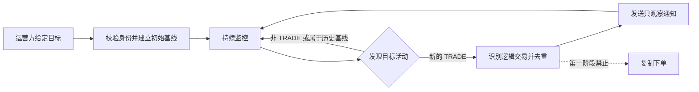

# Polymarket 目标交易监控与通知需求

> 需求状态：讨论中
>
> 关联技术设计：未创建

本文定义 Polymarket 跟单系统第一阶段的目标行为。除“已确认决定”明确列出的内容外，其余规则均为便于讨论的建议草案，只有经用户确认并写回本文后才能作为后端技术设计输入。

## 背景与问题

最终目标是在给定一个 Polymarket 交易目标后，持续发现该目标的新交易，并在后续阶段依据独立确认的跟单规则执行复制操作。

直接执行复制交易会同时引入信号正确性、发现延迟、重复处理、资金安全、仓位、价格偏差和失败恢复等风险。第一阶段采用只观察模式：先证明系统能稳定识别目标的新交易、避免重复，并把足够的事实及时通知运营人员；本阶段不触发任何复制操作。

## 目标

- 对已启用的 Polymarket 目标建立稳定且无歧义的监控身份。
- 持续识别目标在监控边界之后新产生的交易活动，并区分买入与卖出。
- 将每笔符合范围的交易及时通知指定运营接收方，消息足以人工核验交易事实。
- 在重复读取、乱序返回、服务重启和短时外部故障下，不静默丢失交易，也不为同一笔交易重复通知。
- 记录并呈现交易发生、系统发现和通知投递相关时间，使第一阶段能够评估第二阶段所需的真实跟单时效。
- 当监控已无法可靠继续时，让运营人员能够知道监控处于异常状态，而不是把“没有通知”误解为“目标没有交易”。

## 非目标

- 不创建、签名、提交、撤销或修改任何 Polymarket 订单。
- 不访问或保管被监控目标的私钥、API Key、会话或其他非公开凭据。
- 不设计复制比例、固定金额、仓位上限、余额、滑点、限价、成交等待、退出或其他第二阶段执行规则。
- 不把挂单、改单、撤单或尚未成为交易事实的订单活动当作本阶段通知事件。
- 默认不监控拆分、合并、赎回、奖励、充值、提现等非交易活动；如需纳入，应作为需求范围变更重新确认。
- 不自动发现“值得跟随”的交易者，不评价目标策略、胜率或风险，也不提供投资建议。
- 不承诺消除 Polymarket 将交易公开到可查询数据源之前的外部延迟；第一阶段应测量而不是掩盖这段延迟。

## 角色与权限

| 角色 | 建议职责与边界 |
| --- | --- |
| 运营管理员 | 提供并核验监控目标，启用或暂停监控，查看监控状态，接收交易及异常通知。 |
| 被监控目标 | Polymarket 上的外部公开交易身份；无需登录 ATHENA，也不向 ATHENA 授权。 |
| 通知接收方 | 由运营方指定的内部接收范围；不得默认广播给所有普通账户。 |
| ATHENA 普通账户 | 第一阶段默认不能创建目标、修改监控规则或接收系统级跟单通知。 |

目标管理是否需要用户界面、第一阶段允许多少个目标，以及最终通知接收范围仍待确认。具体鉴权机制留给技术设计。

## 业务术语

| 术语 | 定义 |
| --- | --- |
| 监控目标 | 运营方要求 ATHENA 观察的一个 Polymarket 公开交易身份。 |
| 规范目标身份 | 监控过程中用于唯一识别目标且不随显示名称变化的身份；当前建议使用 Polymarket Profile Address / Proxy Wallet。 |
| 交易活动 | Polymarket 对目标公开的一笔 `TRADE` 事实，包含买卖方向、市场、Outcome、价格、数量和时间等可用信息。 |
| 交易时间 | 外部数据对该交易给出的发生时间，不等于 ATHENA 发现或通知送达时间。 |
| 启用边界 | 某目标开始或恢复监控时划定的新旧活动分界；用于决定哪些活动属于待通知的新交易。 |
| 初始基线 | 首次启用目标时已存在的历史活动集合，仅用于确定启用边界，默认不产生通知。 |
| 故障补查 | 目标处于启用状态但因服务或外部依赖故障暂时无法观察时，在恢复后补回故障窗口内的新交易。 |
| 逻辑交易 | 应只产生一次交易通知的最小业务事件。其精确粒度仍待确认，但不得仅因时间戳或交易哈希相同就合并不同市场、Outcome 或方向的活动。 |
| 成交分片 | 外部公开数据中的一条交易记录。同一次目标交易可能因多个成交价格或对手方表现为多个分片。 |
| 交易通知 | 描述一笔逻辑交易的只观察消息；它不是复制交易指令，也不代表任何订单已经或将要执行。 |

## 当前可行性与粒度分析

当前公开能力足以支持第一阶段讨论：[用户活动](https://docs.polymarket.com/api-reference/core/get-user-activity)可以按 Profile Address 查询并区分 `TRADE`、`BUY` 与 `SELL`，结果包含市场、Outcome、价格、数量、USDC 金额、交易哈希和秒级时间戳；[公开成交](https://docs.polymarket.com/api-reference/core/get-trades-for-a-user-or-markets)也可按用户查询，但 `takerOnly` 默认值为 `true`。另一方面，[User WebSocket](https://docs.polymarket.com/api-reference/wss/user)需要目标自身的认证信息，不能被假设为监控任意公开目标的推送来源。

公开活动与成交结果都没有独立的成交 ID。对一个公开活跃目标的只读抽样还显示，同一交易哈希、相同秒级时间戳、相同市场、Asset、Outcome 和方向可能返回多个不同价格或数量的成交分片。因此存在三种业务粒度选择：

| 选择 | 通知行为 | 优点 | 代价 |
| --- | --- | --- | --- |
| A：逐成交分片 | 每个公开结果行发送一条通知。 | 最贴近源端原始记录，不发生聚合误判。 | 一次目标操作可能刷出多条消息，未来跟单信号被碎片化。 |
| B：按链上交易与标的汇总 | 相同交易哈希、市场/Asset、Outcome 和方向的分片保留明细，但合成一条通知，展示总数量、总金额、加权均价和价格区间。 | 保留事实的同时更接近运营人员理解的一次目标交易。 | 公开数据无法证明这些分片一定来自同一张原始订单。 |
| C：按时间窗口净额汇总 | 在固定时间窗口内按标的和方向汇总。 | 消息最少。 | 引入额外等待，并可能混合多次独立意图，不适合作为第二阶段的原始事实。 |

当前建议选择 B；无论通知如何汇总，原始成交分片都应完整保留，第二阶段也不能把第一阶段的通知粒度直接视为原始订单意图。

## 业务规则与不变量

以下是当前建议规则，等待逐项或整体确认：

1. 每个监控目标必须解析为一个规范目标身份。显示名称、头像和简介只用于展示，变化后不得导致目标被当成新身份或历史交易被重新通知。
2. 第一阶段只以已经公开为 `TRADE` 的活动触发通知，同时覆盖 `BUY` 和 `SELL`；不因目标是 Maker 或 Taker 而默认漏掉其中一类成交。
3. 首次启用目标时先建立初始基线，基线之前及基线内的历史交易不通知。建立基线成功后发生的新交易才进入通知流程。
4. 目标持续启用期间发生短时故障，恢复后必须补查故障窗口，不得因为重启或外部依赖暂时失败跳过新交易。运营人员主动暂停期间的交易默认不补查；恢复监控时建立新的启用边界。
5. 第一阶段默认观察目标的全部交易，不设置最小金额、市场类别、Outcome 或买卖方向过滤。任何过滤都会改变未来可验证范围，需明确确认。
6. 同一逻辑交易即使被外部数据重复返回、被多次扫描、在通知重试中出现或跨服务重启，也最多产生一条业务通知。
7. 多笔不同交易即使具有相同秒级时间戳或相同交易哈希，也不得仅凭该单一字段被错误合并。若确认采用汇总通知，只有市场/Asset、Outcome 和方向等汇总边界也一致的成交分片才能进入同一通知；乱序发现时仍需完整处理，并尽可能按交易时间稳定呈现。
8. 通知只能陈述外部数据能够支持的事实。字段缺失、冲突或无法核验时应明确显示未知或进入异常处理，不得推测目标意图、实际仓位或盈亏。
9. 识别交易、保存交易事实和投递通知的任何步骤都不得调用交易执行能力，也不得产生钱包、余额或订单副作用。
10. 通知接收依赖暂时失败时，已识别交易不得因此被重新当成新交易；通知应最终送达，或形成运营人员可见的明确失败结果。
11. 短暂、可自动恢复的单次查询失败不应反复骚扰运营人员；持续失去可靠监控能力时应发送一次异常通知，恢复后发送一次恢复通知。
12. 目标无新交易是正常状态，不产生心跳式交易消息；监控健康状态应通过独立状态或异常通知判断。

## 主流程

1. 运营管理员提交一个目标标识。
2. ATHENA 校验目标可被唯一解析，向运营管理员展示规范目标身份和公开资料摘要，避免监控错误的人。
3. 运营管理员启用目标；系统成功建立初始基线后显示该目标已进入正常监控状态。
4. 目标在 Polymarket 产生新的公开交易活动。
5. ATHENA 识别该活动是否位于启用边界之后、是否属于本阶段范围，以及是否已经处理。
6. 对新的逻辑交易形成只观察通知，保留其目标身份、交易事实和时间证据。
7. 通知被指定接收方收到；投递暂时失败时可恢复处理，且不会生成第二条业务事件。
8. ATHENA 继续监控后续活动；监控可靠性下降或恢复时按独立的异常规则通知运营人员。

## 状态转换

第一阶段至少需要表达下列业务状态语义；状态名称和是否提供可操作的管理入口待确认：

| 当前状态 | 触发 | 下一状态 | 可观察行为 |
| --- | --- | --- | --- |
| 待建立基线 | 目标校验和初始基线成功 | 监控中 | 开始只处理启用边界后的交易。 |
| 待建立基线 | 目标无效或无法建立可信边界 | 异常 | 不发送交易通知，说明目标或依赖问题。 |
| 监控中 | 运营管理员主动暂停 | 已暂停 | 停止观察；暂停期间交易默认不补查。 |
| 监控中 | 暂时无法可靠观察且超过异常阈值 | 异常 | 发送一次监控异常通知并保留待补查范围。 |
| 异常 | 依赖恢复且故障窗口补查完成 | 监控中 | 先处理补查交易，再发送一次恢复通知。 |
| 已暂停 | 运营管理员恢复 | 待建立基线 | 重新建立启用边界，不把暂停期间历史交易作为新交易。 |

未成功建立初始基线的目标不得表现为“监控中”。监控异常也不得通过丢弃故障窗口直接恢复为正常。

## 异常与边界场景

- **目标标识无效或有歧义**：拒绝启用，展示可操作的错误，不选择“最相似”的账户代替。
- **目标可查询但从未交易**：可以完成基线并进入监控中；空历史不是错误。
- **目标显示资料变化**：更新展示信息时保持规范目标身份和已处理边界不变。
- **外部数据重复或乱序**：不重复通知，也不遗漏晚到但位于有效监控窗口内的交易。
- **同一秒内多笔交易**：逐笔保留，不以时间游标直接跳过边界上的其他交易。
- **同一链上交易包含多条目标活动**：不得只按交易哈希粗略合并；逻辑交易粒度确认前保留每个成交分片。若采用汇总通知，消息必须能表达分片数、总量、加权均价和价格范围。
- **活动缺少关键身份或方向**：不得生成看似完整但事实错误的交易通知；目标进入可诊断异常或保留待处理活动。
- **可选展示字段缺失**：仍可通知，但对应字段明确为未知，不阻塞其他完整交易。
- **外部依赖暂时失败或限流**：保持已启用目标的连续监控语义，恢复后补查；不把技术失败伪装成零活动。
- **外部可查询窗口不足以覆盖故障**：停止声称监控连续，发送高优先级异常并等待运营处理。
- **突发大量交易**：默认不得静默丢弃或合并；允许通知排队并明确反映延迟。是否需要摘要式合并仍待确认。
- **通知渠道不可达**：继续保留交易事实和明确投递状态，恢复后不得把同一交易重复识别。
- **进程重启**：已建立的目标边界和已处理交易语义必须延续，不能重新通知全部历史。

## 输入与可见输出

### 建议输入

- 目标标识：建议接受 Polymarket Profile URL 或 0x 地址，并最终让运营管理员确认解析出的 Proxy Wallet。
- 目标展示标签：可选的内部备注，用于在通知中快速辨认目标。
- 启用或暂停意图。
- 通知接收范围：具体渠道待确认。

第一阶段不要求目标的任何认证凭据，也不接收复制金额或交易执行参数。

### 建议的单笔交易通知

每条通知至少应尽可能包含：

- 明确的“只观察、未执行跟单”标识；
- 目标展示名、内部标签和规范目标身份；
- `BUY` 或 `SELL`；
- Event / Market 标题与 Outcome；
- 成交价格、Outcome Token 数量和 USDC 金额；
- 交易时间、ATHENA 发现时间以及可计算的延迟；
- Polymarket 页面链接；
- 交易哈希或其他可用于人工核验和故障诊断的来源标识。

外部数据未提供的可选字段显示为未知。不得为了消息完整而推导无法可靠验证的值。

### 建议的运行状态输出

- 每个目标当前是否待建立基线、监控中、已暂停或异常；
- 最近一次成功观察时间、最近一笔已处理交易时间；
- 是否存在尚未补查的时间窗口或待投递通知；
- 最近异常的安全摘要和恢复时间。

是否需要专用管理页面或只读历史入口仍待确认；第一阶段至少要让运营人员能够区分“没有新交易”和“监控已经失效”。

## 验收场景

1. **首次启用不回放历史**：目标已有历史交易；启用并建立基线后不产生旧交易通知，随后一笔新交易只产生一条通知。
2. **买卖方向完整**：目标先买入、后卖出；系统分别通知两笔交易，方向、市场、Outcome、价格和数量与公开事实一致。
3. **非交易活动不触发**：目标发生拆分、合并、赎回或奖励活动但没有 `TRADE`；不产生交易通知。
4. **重复读取不重复通知**：同一交易在多次观察、通知重试和进程重启后仍只有一条业务通知。
5. **边界同秒不漏单**：两笔可区分交易具有相同秒级时间戳；两笔均被通知。
6. **多分片汇总不丢事实**：若采用建议的汇总粒度，同一交易哈希与相同标的、Outcome、方向下出现多个不同价格或数量的分片；只产生一条摘要通知，但分片数、总数量、总金额、加权均价和价格范围均正确，原始分片仍可核验。
7. **短时故障后补查**：目标保持启用时外部依赖暂时不可用，期间发生交易；恢复后补回该交易且不回放基线前历史。
8. **主动暂停不补历史**：目标暂停期间发生交易；恢复并建立新边界后不通知暂停期间交易，只通知恢复后的新交易。
9. **无法保证连续性时告警**：故障范围超过可可靠补查边界；系统不宣称监控正常，并向运营人员报告存在可能缺失的范围。
10. **投递失败可诊断**：交易已识别但通知暂时无法送达；恢复后该通知最终送达，或运营人员看到明确的终态失败，而不是产生第二笔交易事件。
11. **绝无交易副作用**：完成以上所有场景时，ATHENA 均未创建订单、签名或改变任何钱包与 Polymarket 仓位。
12. **时效可评估**：运营人员能从交易通知或相关状态中判断交易时间、发现时间和通知时间，为第二阶段评估端到端延迟。

具体时效阈值将在下方问题确认后补入验收结果。

## 已确认决定

- 最终业务目标是：给定一个 Polymarket 目标，监控该目标何时产生交易，并在后续阶段执行操作复制。
- 第一阶段只监控目标活动并通知运营方，不执行操作复制。
- 复制操作属于第二阶段，必须另行形成并确认需求、技术设计和实现授权。
- 当前文档仅用于需求讨论，尚未创建后端技术设计，也未授权修改后端源码。

## 待确认问题

| 编号 | 需要确认的业务决定 | 当前建议 | 主要影响 |
| --- | --- | --- | --- |
| Q1 | 第一期由谁管理、同时监控多少目标？ | 仅运营管理员可管理；业务上支持多个目标，不开放普通账户自助跟单。具体管理入口留到技术设计。 | 权限、目标生命周期、并发规模和运营方式。 |
| Q2 | 接受哪些目标标识？ | 接受 Polymarket Profile URL 或合法 0x 地址，解析后必须展示并由管理员确认唯一 Proxy Wallet；不接受仅凭显示名称直接启用。 | 身份唯一性、误监控风险和输入校验。 |
| Q3 | 哪些活动算一期“交易”？ | 只包含公开的 `TRADE`，覆盖 `BUY`、`SELL`、Maker 与 Taker，且默认不过滤金额或市场；其他活动全部排除。 | 数据完整性、通知数量和未来跟单信号范围。 |
| Q4 | 首次启用、故障恢复和主动暂停如何处理历史？ | 首次启用不回放；运行故障必须补查；主动暂停后恢复不补暂停期间交易。 | 启用边界、连续性和是否产生意外历史通知。 |
| Q5 | 一条通知对应什么粒度？ | 选择 B：相同交易哈希、市场/Asset、Outcome 和方向的成交分片保留原始明细并汇总为一条通知；不同边界分别通知，不按时间窗口净额合并。 | 去重标识、汇总算法、消息数量以及第二阶段复制语义。 |
| Q6 | 通知发给哪里？ | 使用现有系统 Telegram 的生产群组，独立 Topic 建议命名为 `[POLY] 跟单监控`；开发联调使用测试群组，不发送到普通账户私聊。 | 接收权限、通知契约和运营历史。 |
| Q7 | 正常监控的时效目标是什么？ | 先以“交易可从公开数据源查询后 15 秒内被 ATHENA 接受为待通知消息”为目标，并同时记录交易时间到发现/送达的实测延迟。 | 观察频率、容量、外部限流和二期可行性判断。 |
| Q8 | 监控异常何时通知？ | 连续 60 秒无法可靠观察时通知一次；恢复且完成补查后通知一次；期间不按每次失败刷屏。 | 故障判定、告警噪声和运营信心。 |
| Q9 | 第一期是否需要专用历史或管理页面？ | 不新增普通账户页面；运营方至少能查看目标状态、已观察交易与通知结果。是否新增管理员页面需在需求层明确，若需要则另走 UI 布局确认。 | API/UI 范围、审计能力和前端门禁。 |
| Q10 | 突发大量交易是否逐笔通知？ | 默认按 Q5 确认后的每笔逻辑交易分别通知、不丢弃；允许排队。若消息噪声不可接受，再明确每批摘要规则，但原始成交分片仍须完整。 | 消息量、排队延迟和信息完整性。 |

[返回 Polymarket 跟单需求索引](README.md)
