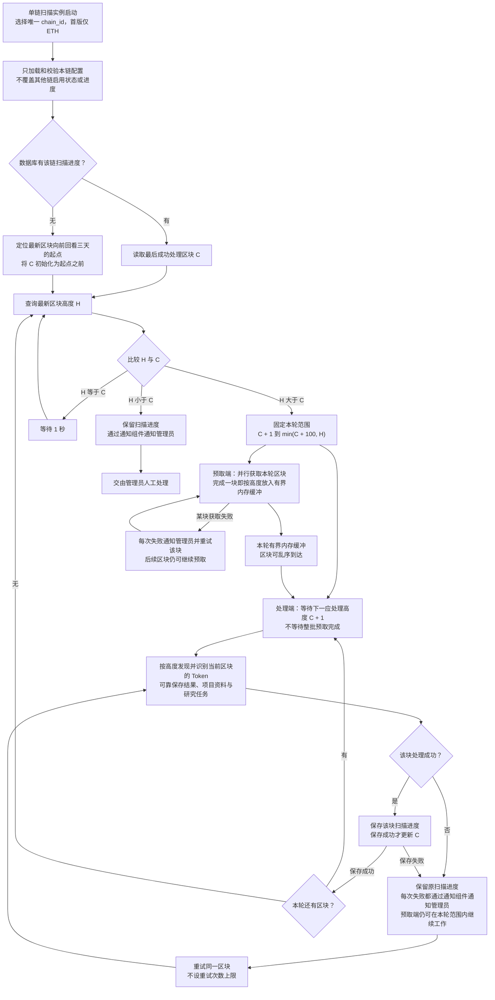

# Token 区块扫描流程

> 需求状态：讨论中
>
> 细分状态：扫描流水线规则已确认，尚未实现；Token 整体需求仍为讨论中。本图描述首版 ETH 主网的扫描调度：每轮并行预取最多 100 个区块，同时按高度严格串行处理和保存。

## 入口与符号

程序启动时选择唯一的 `chain_id`，只加载和校验本实例负责链的配置；首版只运行 ETH。随后优先恢复数据库中的该链扫描进度；无进度时，定位最新区块向前回看三天的起始区块。不同链使用同一程序分别启动实例，见 [单链实例运行设计](token-chain-runtime.md)。

| 符号 | 含义 |
| --- | --- |
| `C` | 最后一个已经成功处理并保存进度的区块高度；下一块是 `C + 1` |
| `H` | 本轮查询得到的最新区块高度 |
| 本轮终点 | `min(C + 100, H)`，以本轮开始时的 `C` 和 `H` 确定，轮内保持不变 |
| 预取缓冲 | 仅保留本轮范围内已取得、尚未处理的区块数据；允许乱序到达，不是扫描进度 |

## 流程图

## 关键说明

- 本图的区块高度、扫描游标与任务始终属于实例选择的链；未来 BSC 实例使用同一套代码独立运行本流程，不共用 ETH 游标。研究期目标 Token 日志、部署者／当前 owner 主动交易与 Swap 由同一链的共享事件监控独立处理，也不得跨链共用覆盖进度或协议部署地址。
- 三天是时间范围，不是固定区块数量。初始 `C` 设在起点之前，保证起始区块会被处理。
- 每轮范围两端均包含，最多 100 个不同区块。例如 `C = 1800`、`H = 2000`，本轮预取和处理 1801–1900；轮内上限不随新块产生而延长。
- 预取端在本轮范围内并行获取区块，完成一块就按高度放入有界内存缓冲。区块可以乱序到达；最多 100 块限制的是本轮范围和可缓冲上界，不表示必须同时发出 100 个节点请求。
- 处理端只等待当前应处理高度；该块一旦取得就开始处理，不等待其余区块或整批预取完成。预取与串行处理同时运行，处理完成一块即释放其内存数据。
- Token 识别、结果保存和游标推进始终按区块高度严格串行。处理当前区块时汇总该块全部候选合约并使用聚合合约的批量判断形态，不逐个调用单个判断；成功一块保存一块，没有部署候选的区块也推进进度。
- 本轮完成立即重新查询 `H`。只有 `H == C` 时等待 1 秒，仍有积压时不额外等待。
- 区块获取失败不阻止本轮其他高度继续预取；已取得的后续区块保留在缓冲中。但串行处理和游标必须停在最早未取得或未成功处理的区块，不得因后续区块已到达而越过。
- 区块获取、处理或进度保存失败时，每次失败都通知管理员并重试对应区块，不合并、去重或抑制重复失败通知；100 块上限不限制重试次数。
- 内存预取结果不构成持久进度。进程停止或重启后可丢弃未处理缓冲，并从数据库已保存的 `C + 1` 重新预取，不得把只存在内存中的区块视为已扫描。
- `H < C` 保留进度并交由管理员人工处理，不自动回退、重新初始化或按追平处理。通知复用 [系统通知组件](../../design/notifications/system-notification-operations.md)。

## 待明确边界

三天起点定位算法、实际并行获取数、节点请求限流与背压、缓冲数据的具体形式与字节级资源保护、重试间隔、通知提交失败处理、人工恢复仍待技术设计；已确认的需求是本轮最多 100 块、并行预取与严格串行处理同时运行。研究期事件监控的连续性与业务边界见独立文档，不纳入扫描器内部。当前不考虑区块替换或链重组，不增加回滚修复。图中异常通知属于未来程序行为，本次文档整理不会触发这些运行告警。

扫描中的区块失败无限重试与 [源码请求的有限重试](token-contract-source-flow.md) 是不同层次的规则，研究请求错误在各自任务内处理，不触发已完成扫描区块的回退或无限重试。

## 已确认的扫描与研究衔接

采用方案 A：当前区块的候选发现完成后，汇总该块全部候选并使用聚合合约批量判断；完成全部候选的 Token 识别，可靠保存识别结果、项目资料和对应研究任务后，才推进区块进度。没有部署候选的区块也保存完成进度。源码、AI、五层钱包和其他研究资料由后台独立执行，不等待这些任务结束或项目研究停止才推进区块。

区块预取失败、Token 识别外层请求或结果/任务保存失败时，沿用对应区块不推进、每次通知并持续重试的规则。预取端可以继续取得本轮后续区块，但处理端和游标不得越过最早失败块。研究任务自身的源码或 AI 请求失败在各自任务内处理，不使已经成功处理的区块回退或重复扫描。具体事务与任务结构在实现时细化，可靠保存任务和推进游标应保持一致。

区块扫描不执行研究期活动和停止判断。可靠保存项目与研究任务后，按链共享事件监控独立接管目标 Token `Approval` / `Transfer`、部署者／当前 owner 主动交易及首版七协议 Swap。活动区块时间不晚于当前期限才具有资格：`Approval` 只记录证据并续期；`Transfer` 续期、缺少非空源码时重查，并按管理员配置刷新（默认 Token 当前状态和 Ave 持币资料）；部署者／当前 owner 主动交易只续期和缺源码重查，不触发其他资料刷新。迟到活动只保留依据。

主动交易必须成功、属于顶层且 `from` 等于监控地址，零 ETH 合约调用仍有效，入账、失败交易和内部调用无效。部署者从部署交易之后开始监控，当前 owner 从成功读取它的观察区块开始；owner 更换后停止旧 owner 监控，部署者始终保留，地址或角色重合时同一项目同一交易去重。

日志与顶层交易均需实时接收和历史补查防漏：Token 日志及 Swap 从部署区块开始，部署者和 owner 交易按各自有效监控起点补齐。确认超时前，`Approval`、`Transfer`、部署者交易、当前 owner 交易及 Swap 必须全部完整覆盖越过期限，且期限内无待处理有效活动或 Swap；不能只以项目发现扫描已追平作为监控完整依据。事件监控积压或短暂故障不回退已经成功完成的扫描区块，详见 [项目事件监控](token-project-activity-flow.md)与 [Swap 事件调研](token-swap-events-research.md)。

项目开始时另保存本链原生币资金来源门槛快照，ETH 默认 `0.01 ETH`，未来 BSC 默认 `0.01 BNB`。该门槛只用于后台钱包普通直接入账与内部 ETH 入账的逐条资金来源识别，不影响区块发现、Token 身份或零金额主动交易续期。L1 六项资产同区块 USDT 估值、L1–L5 历史分析及交易所／跨链终止节点规则由 [钱包研究流程](token-wallet-research-flow.md)承接，不等待这些研究完成才推进扫描。

[内部 ETH 转账识别](token-wallet-internal-transfers-flow.md)只扩充后台 L1–L5 钱包部署前 `0..B-1` 历史，两类分别倒序取第一页最多 300 条原始记录。它不把内部记录作为新项目或内部合约部署发现入口，扫描候选仍限于顶层合约创建交易，也不增加区块推进等待条件。

当前不考虑区块被替换时的处理。断线恢复补查用于防止日志和主动交易漏数据，不属于链重组回滚设计。具体业务时效/SLO 仍待明确，本次不新增 API、数据库字段或内部组件设计。

## 关联文档

- [Token 目标设计](token.md)
- [单链实例运行设计](token-chain-runtime.md)
- [合约发现与 Token 识别流程](token-discovery-identification-flow.md)
- [整体业务流程](token-overall-flow.md)
- [返回业务设计与流程图索引](README.md)
