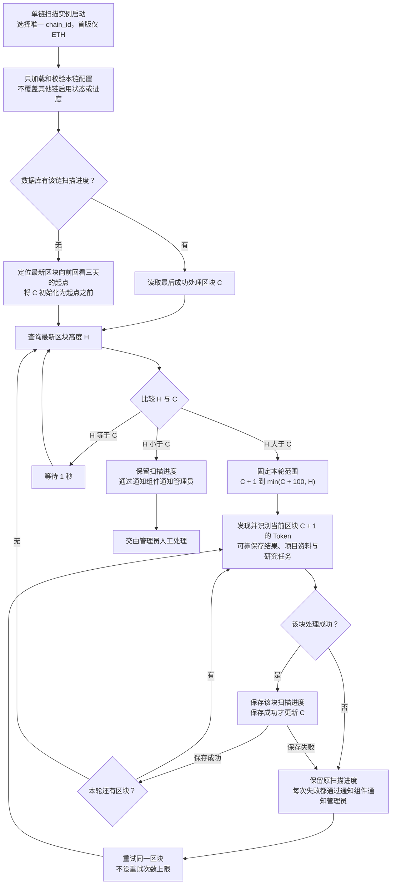

# Token 区块扫描流程

> 需求状态：讨论中
>
> 细分状态：目标设计草案，尚未实现。本图描述首版 ETH 主网的扫描调度，保持已明确的逐块扫描与失败处理规则。

## 入口与符号

程序启动时选择唯一的 `chain_id`，只加载和校验本实例负责链的配置；首版只运行 ETH。随后优先恢复数据库中的该链扫描进度；无进度时，定位最新区块向前回看三天的起始区块。不同链使用同一程序分别启动实例，见 [单链实例运行设计](token-chain-runtime.md)。

| 符号 | 含义 |
| --- | --- |
| `C` | 最后一个已经成功处理并保存进度的区块高度；下一块是 `C + 1` |
| `H` | 本轮查询得到的最新区块高度 |
| 本轮终点 | `min(C + 100, H)`，以本轮开始时的 `C` 和 `H` 确定，轮内保持不变 |

## 流程图

## 关键说明

- 本图的区块高度、扫描游标、活动日志与任务始终属于实例选择的链；未来 BSC 实例独立运行本流程，不共用 ETH 游标或协议部署地址。
- 三天是时间范围，不是固定区块数量。初始 `C` 设在起点之前，保证起始区块会被处理。
- 每轮范围两端均包含，最多 100 个不同区块。例如 `C = 1800`、`H = 2000`，本轮处理 1801–1900。
- 逐块处理，成功一块保存一块；没有部署候选的区块也推进进度。本轮上限固定，不随新块产生而延长。
- 本轮完成立即重新查询 `H`。只有 `H == C` 时等待 1 秒，仍有积压时不额外等待。
- 区块处理或进度保存失败均不越过该块。每次失败都通知管理员并重试，不合并、去重或抑制重复失败通知；100 块上限不限制重试次数。
- `H < C` 保留进度并交由管理员人工处理，不自动回退、重新初始化或按追平处理。通知复用 [系统通知组件](../../design/notifications/system-notification-operations.md)。

## 待明确边界

三天起点定位算法、活动日志的持久化与更新调度、重试间隔、通知提交失败处理、人工恢复仍待设计；当前不考虑区块替换或链重组，不增加回滚修复。图中异常通知属于未来程序行为，本次文档整理不会触发这些运行告警。

扫描中的区块失败无限重试与 [源码请求的有限重试](token-contract-source-flow.md) 是不同层次的规则，研究请求错误在各自任务内处理，不触发已完成扫描区块的回退或无限重试。

## 已确认的扫描与研究衔接

采用方案 A：完成该块全部候选的 Token 识别，可靠保存识别结果、项目资料和对应研究任务后，才推进区块进度。没有部署候选的区块也保存完成进度。源码、AI、五层钱包和其他研究资料由后台独立执行，不等待这些任务结束，也不等待项目首次 Swap 才推进区块。

扫描读取、Token 识别外层请求或结果/任务保存失败时，沿用该块不推进、每次通知并持续重试的规则。研究任务自身的源码或 AI 请求失败在各自任务内处理，不使已经成功处理的区块回退或重复扫描。具体事务与任务结构在实现时细化，可靠保存任务和推进游标应保持一致。

通过扫描区块检测目标 Token 的 Approval/Transfer，尚无源码时产生更新事件；Swap 实时订阅与补查负责研究截止。项目登记前已发生的 Swap 必须可补匹配，具体日志读取、活动记录和更新任务的持久化继续设计，见 [项目活动更新](token-project-activity-flow.md)与[Swap 事件调研](token-swap-events-research.md)。

当前不考虑区块被替换时的处理。断线恢复补查日志用于防止订阅漏数据，不属于链重组回滚设计。

## 关联文档

- [Token 目标设计](token.md)
- [单链实例运行设计](token-chain-runtime.md)
- [合约发现与 Token 识别流程](token-discovery-identification-flow.md)
- [整体业务流程](token-overall-flow.md)
- [返回业务设计与流程图索引](README.md)
