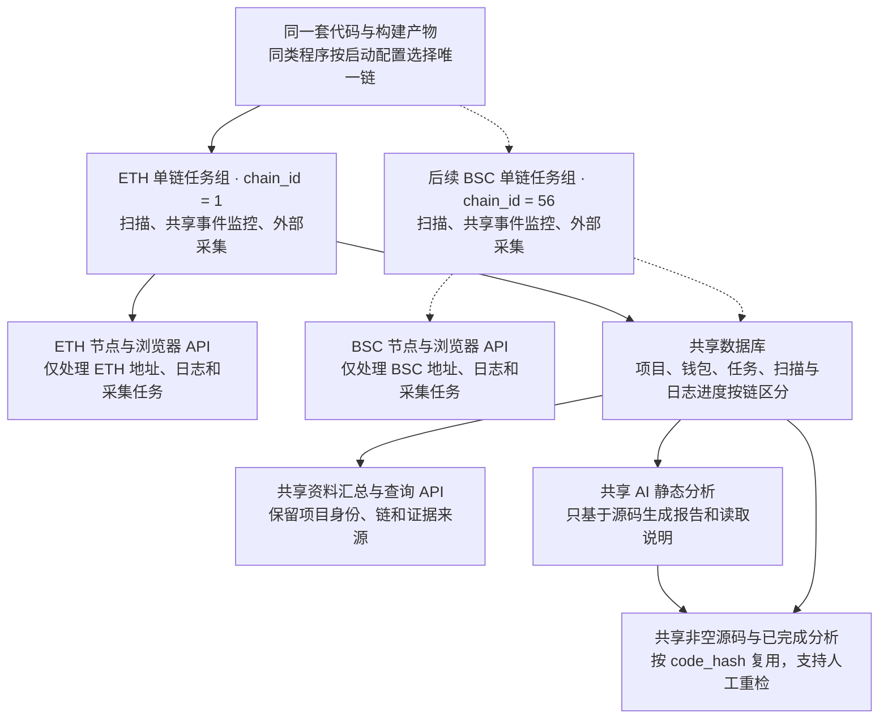

# Token 单链实例运行设计

> 需求状态：已确认
>
> 细分状态：已确认的目标设计，尚未实现。本次确定运行时按链拆分及每链共享事件监控的边界；当前只开发和运行 Ethereum Mainnet，后续扩链时使用同一套代码增加实例。
>
> 关联技术设计：[Token Chain Processor](../../design/token-intelligence/chain-processor.md)、[Token Collection and Project Profile](../../design/token-intelligence/collection-profile.md)

## 运行方式

同一职责的程序使用同一套代码和同一个构建产物，通过启动配置选择唯一的 `chain_id`，每个链任务实例只处理这一条链。ETH 与 BSC 分别运行、独立启停和恢复，不维护两份按链复制的业务代码。

首版只运行 ETH（chain ID `1`）实例，不要求提供 BSC 配置。后续接入 BSC（chain ID `56`）时，使用同一程序增加 BSC 实例，并配置该链节点、聚合合约及已接入协议的部署信息；扩链前将现有免费 Etherscan Key 全部换成付费 Key，并核对接口权限。持币地址总数与前 100 名分布改由 Ave 获取，仍按项目所属链隔离。

按链拆分适用于扫描、项目事件监控和外部数据采集。每条链使用一套共享事件监控能力动态覆盖本链研究项目，不为每个项目复制业务代码或建立独立监控系统；具体进程数量和组件边界后续技术设计。资料汇总、AI 静态分析、源码与报告缓存、查询 API 可以共享；它们仍须保留各项目的所属链和数据来源。本设计不要求把扫描器、事件监控、采集器和资料汇总合并成一个进程，也不确定第二板块交易执行内部的服务数量和通信方式。

## 运行关系图

图中的单链任务组表示责任范围，组内可以包含多个不同职责的进程；BSC 为后续扩展位置，当前不启动。

## 启动配置与状态归属

以下为配置语义，具体环境变量、命令行参数和部署文件格式在实现时确定，不表示已经存在对应启动选项。

| 配置或状态 | 已确认规则 |
| --- | --- |
| 实例所属链 | 启动时明确选择唯一 `chain_id`，贯穿节点访问、日志处理和任务领取，不以缺少链范围表示处理所有链 |
| 链配置 | 只加载、校验和连接当前实例负责链所需的节点、聚合合约及协议部署配置；ETH 实例无需填写 BSC 参数 |
| 扫描与采集参数 | 各链独立配置扫描、补扫和采集资源；具体参数遵守对应业务规则，不因拆分改变三天、100 块、1 秒等已确认口径 |
| 观察与刷新策略 | 每条链分别配置观察时长（默认 72 小时）、Approval/Transfer 刷新映射和每项目每数据组冷却时间（默认 10 分钟）；一个实例修改或加载本链策略不得覆盖其他链 |
| 系统链范围 | “系统支持或启用某条链”与“某个实例负责哪条链”分别表达；实例启动不得将其他链写成禁用 |
| 运行状态 | 只维护本实例及其负责链、职责对应的运行状态；启停 ETH 实例不得覆盖 BSC 的状态或扫描进度 |
| 健康与观测 | 各实例分别提供健康状态，日志与指标标明所属链、职责和实例；同机部署时区分健康监听地址 |

共享汇总和 AI 服务不因消费多链资料而被视为链扫描实例，也不应在启动时修改全局链启用状态或要求无关的节点配置。

## 任务与数据边界

| 部分 | 目标责任与隔离方式 |
| --- | --- |
| 区块扫描与 Token 识别 | 只处理启动链的区块，按该链恢复和保存扫描进度；每轮在本链范围内并行预取最多 100 块，Token 识别、保存和游标仍按本链区块高度严格串行；同一区块候选汇总后使用本链聚合合约批量判断，不逐个调用单个判断 |
| 项目活动 | 共享监控为本链所有研究中项目维护目标 Token Approval/Transfer 动态目标；实时订阅、历史补查、活动摘要、观察期限及配置刷新任务均关联实际链及项目；只有具有续期资格的活动才续期、刷新，并在无非空源码时强制触发源码查询 |
| 首次已识别 Swap 监控 | 共享监控覆盖本链所有研究中项目；实时订阅、历史补查、协议覆盖版本、池或管理合约身份、代币映射及持久日志覆盖进度均有明确链范围；不能将 ETH 的协议地址直接当作 BSC 部署使用 |
| 外部采集 | 源码请求、钱包历史、链上状态及持币查询使用项目所属链；采集实例只领取并处理该链任务，即使多个链共用一张任务表 |
| 项目与钱包资料 | 共用数据库，地址身份按链区分；交易、事件、研究任务和采集结果保留链、项目及实际来源，不能仅凭相同地址或区块高度跨链关联 |
| 资料汇总 | 可以共用汇总服务，从已保存资料构建各项目结果；按项目关联证据，不要求为每条链复制汇总进程 |
| 源码与 AI 分析 | 非空源码和已完成报告、owner/税费接收钱包/税率读取说明及公开链接分析按既定 `code_hash` 规则跨实例复用；各部署的实际链上地址和值逐链、逐合约读取 |
| 查询 API 与管理入口 | 保持统一，从共享数据库查询，返回和筛选中保留链身份 |

源码成功返回空内容、请求失败和活动补采继续遵守 [源码获取设计](token-contract-source-flow.md)，不把一个部署未公开源码的结果当作所有同字节码部署都未公开。共享报告仍允许管理员指定报告人工重检，不因另一个链实例发现相同源码重复分析。

## 扫描与后台研究衔接

每个扫描实例只为自己负责的链维护本轮最多 100 块的有界内存预取缓冲，该缓冲不在链之间共享，也不构成持久进度。下一应处理区块取得后立即开始串行处理，不等待整批到齐；后续区块可以先预取，但不得越过最早失败块进行 Token 识别或推进游标。

每个扫描实例汇总当前链当前区块的全部候选合约，并使用该链聚合合约的批量判断形态完成 Token 识别；候选不与其他区块或其他链混合。可靠保存全部识别结果、项目资料和研究任务后，才推进该链进度。没有部署候选的区块也保存完成进度；任务保存与游标推进应保持一致。源码、AI、五层钱包及其他研究后台独立执行，不阻塞后续区块扫描。

项目与研究任务保存后，由本链共享事件监控独立接管动态目标。Approval/Transfer 与 Swap 都以实时订阅降低延迟、以历史日志补查保证启动、断线、重启、动态目标变化及登记时差期间不漏事件；新增目标先建立实时接收，再固定终点并从部署区块补查，重叠范围去重。Approval/Transfer 覆盖所有研究中项目；事件区块时间不晚于处理前当前期限时才用于期限续期和按链配置刷新，晚于期限时只保留依据。动态目标变化不得形成未覆盖空档，断线或重启后从持久覆盖进度恢复；内存接收缓冲不作为完成依据。地址分片、订阅重建、请求并发和持久化结构后续技术设计。

项目因首版覆盖内首次已识别 Swap、不活跃超时或管理员手动操作停止。停止后取消未开始任务，已开始任务按原有限重试规则收尾，项目不可恢复；普通停止不发送管理员通知。此前尚未覆盖的 Swap 范围继续补齐以更新当前覆盖版本内的最早证据，不重新启动研究。拆分进程不改变这些业务规则。扫描失败重试、通知和 `H < C` 人工处理继续按 [区块扫描设计](token-block-scan-flow.md) 执行；本阶段仍不考虑区块替换或链重组。

## 实现时需要对齐的现状

- [当前扫描器](../../../cmd/athena-token-chain-processor/commands/athena-token-chain-processor.go) 为每条启用链创建周期任务，尚未限制单实例单链。
- [当前链参数解析](../../../cmd/tokenchain/flags.go) 和 [链注册表](../../../internal/token/chainregistry/registry.go) 同时要求 ETH、BSC 的配置，禁用链也会校验；应调整为仅校验本职责需要的当前链配置。
- [当前公共启动逻辑](../../../cmd/tokenworker/common.go) 会同步全部链，[链状态写入](../../../internal/token/adapters/postgres/queries/chain.sql) 会覆盖 `enabled`。不能只复制实例并把各自不处理的链设成禁用；应先分清全局链状态与实例链范围，避免相互覆盖。
- [当前采集器](../../../cmd/athena-token-collector/commands/athena-token-collector.go) 已把启用链范围传入任务领取，改造时应收敛为实例唯一链；[当前资料汇总器](../../../cmd/athena-token-profile-builder/commands/athena-token-profile-builder.go) 从全库领取汇总任务，可以按上述共享职责保留，但需解除无关链配置与全局状态写入的启动依赖。

拆分使各链能够独立重启、分配进程资源和观察运行状态；普通单链请求错误仍在自身任务中处理。共享数据库和 Etherscan Key 池继续存在共同容量限制，进程拆分不增加 Key 配额，也不自动消除共享依赖故障。资源额度、限流参数、部署配置和实例标识的具体形式在实现时细化。

本次只确认需求目标，未修改程序或部署配置。当前实现继续以 [Token Chain Processor](../../design/token-intelligence/chain-processor.md) 和 [Token Collection and Project Profile](../../design/token-intelligence/collection-profile.md) 为准；开始改造前必须先形成并确认覆盖本需求的目标技术设计，实现时再将其同步为 `已实现`。

## 关联文档

- [Token 目标设计](token.md#已明确的单链实例运行方式)
- [整体业务流程](token-overall-flow.md)
- [区块扫描与研究衔接](token-block-scan-flow.md)
- [项目研究流程](token-research-flow.md)
- [项目事件监控、活动续期与研究停止](token-project-activity-flow.md)
- [ETH Swap 事件调研](token-swap-events-research.md)
- [业务设计与流程图索引](README.md)
