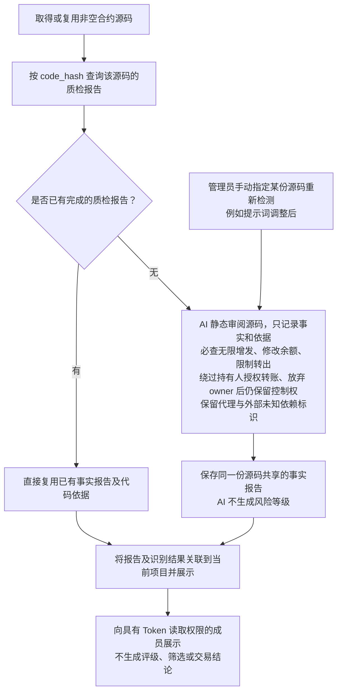

# Token 合约源码 AI 静态审阅流程

> 关联目标技术设计：[对应子系统方案](../../design/token-intelligence/source-facts-and-read-plans.md)（分节已确认，书面待审阅；尚未实现）。

> 需求状态：讨论中
>
> 细分状态：目标设计草案，尚未实现。五项必查事实已明确，其中“绕过持有人授权转账”和“放弃 owner 后仍保留控制权”已作为新增单项要求确认；整份需求仍为讨论中。首版通过 AI 静态审阅源码，生成按 `code_hash` 复用的事实报告及代码依据；只展示，不评级、不筛选。

## 入口与目的

获取合约源码的目的是通过 AI 静态审阅识别源码中可见的能力、明显漏洞、后门或危险逻辑，形成事实报告和代码依据。AI 只生成事实及依据，不负责风险评级；第一板块也不配置程序筛选标准、不生成通过／不通过或排除结果。未来是否以及如何使用报告，由后续需求另行讨论。

本流程从已取得或复用非空源码开始，源码获取及其失败处理沿用 [合约源码获取流程](token-contract-source-flow.md)。首版仅研究 Ethereum Mainnet，源码查询使用免费 Etherscan Key。通过当前合约运行时字节码的 `code_hash` 匹配该源码的质检报告：已有报告直接复用，没有报告才交给 AI 静态审阅并保存。同一份源码使用共享报告，不因新部署重复分析；管理员可以针对某份源码手动触发重新检测。

AI 的分析输入是实际提供的源码。项目身份、源码来源和 `code_hash` 用于匹配与关联，不作为读取链上状态的入口。报告必须分别覆盖是否可无限增发、是否可修改余额、是否可限制转出、是否可绕过持有人授权转账、是否在放弃 owner 后仍保留控制权五项事实与依据，以及“是否使用代理”“是否存在外部未知依赖”两项独立识别结果。每个项目关联对应共享报告，不混入任何评级或筛选字段。

## 流程图

## 首版范围

首版仅通过 AI 阅读源码完成审阅，不接入静态分析工具，不执行合约，也不读取链上状态核实当前 owner、角色、税率、开关或代理实现。审阅不依赖钱包资料、底池信息或其他采集结果。

AI 审阅由后台研究任务独立执行。该块 Token 识别结果、项目资料和研究任务可靠保存后即可推进区块，不等待源码、报告或五层钱包采集完成。

AI 可以分析源码中的权限判断、参数修改范围和调用条件。例如，源码允许某个管理角色无限增发时，应说明相关入口、权限限制及增发逻辑；不能据此声称已经查明当前谁拥有该角色，或该角色目前仍可执行操作。

是否可无限增发、是否可修改余额、是否可限制转出、是否可绕过持有人授权转账、是否在放弃 owner 后仍保留控制权是报告必须分别覆盖的五个事实维度；异常税费及其他明显漏洞或危险逻辑仍可记录为额外发现。每项均说明相关入口、权限、触发条件、作用范围、可能影响及源码依据，不能仅凭函数名称或注释认定存在漏洞，也不从代码单独推断开发者的主观意图。AI 不将某个事实自行映射为风险等级或排除结论。同一段逻辑同时涉及余额修改和授权绕过时，分别说明两个维度并关联同一份代码依据，不将其伪装为两个独立漏洞。

[AI 分析 owner 读取方式与 Go 链上读取](token-owner-wallet-flow.md)、[税费接收钱包获取](token-fee-recipient-wallet-flow.md)、[合约税率读取](token-tax-rate-flow.md)及关联钱包采集属于独立研究资料流程；静态审阅不使用这些逐合约的链上结果核实报告结论，也不以取得地址或税率为前提。

### 绕过持有人授权转账

检查源码是否允许持有人之外的调用者，在没有持有人有效授权的情况下转走其代币。沿 `transferFrom` 及其他实际转账入口检查授权与余额变更路径，至少关注：

- 特殊地址、角色或分支是否跳过持有人授权检查；
- 是否可替其他持有人设置或扩大授权，并据此转走代币；
- 源码包含 `permit` 或其他签名授权时，签名是否绑定实际持有人、被授权方和额度，以及 nonce、防重放域、有效期等实际校验是否存在可导致未经有效授权转账的缺陷。

持有人转移自己的代币、在有效额度内使用其授权，以及使用有效签名授权的正常转账，不记为绕过；有效无限额度授权也不因未逐笔减少额度就被认定为漏洞。源码没有签名授权入口时，不把未实现 `permit` 当作缺陷。不能仅凭缺少某个修饰符、某次额度扣减或某种签名字段就认定绕过，必须解释实际可达路径及其前提。若源码不足以判断，则记录缺失原因，不补成“不能绕过”。

### 放弃 owner 后仍保留控制权

从源码实际提供的放弃所有权入口及其状态变更出发，检查完成该操作后，哪些敏感操作仍可能由其他角色、地址或入口执行。不能仅凭 `renounceOwnership` 名称、owner 清零或放弃所有权事件认定所有控制权都已消失，至少关注：

- operator、管理员角色、硬编码地址及其他独立权限是否仍能执行增发、余额修改、限制转出、授权绕过、修改关键参数等敏感操作；
- 是否仍有角色授予、恢复 owner 或恢复其他敏感权限的路径；
- 本次源码可见的升级或控制器入口是否仍保留相应控制能力；未提供的代理实现或外部依赖继续按未知范围处理，不额外获取或分析。

每个保留权限必须对应具体敏感操作、权限判断、触发条件和源码依据；仅存在某个角色名称或税费接收地址不足以认定保留控制权。源码没有放弃 owner 的入口时，如实说明该项不适用及依据，不推断已经放弃所有权。报告表达的是“按源码执行放弃 owner 后仍可能保留哪些控制能力”，不宣称当前部署已经执行过放弃操作、当前谁持有角色，或相关权限此刻仍然有效。源码不完整或权限行为取决于未知外部实现时，保留无法判断的原因。

### 代理与外部未知依赖识别

AI 在本次已取得的源码范围内，分别判断以下两项，并给出简短结论及源码位置或代码片段作为依据：

| 识别项 | 判断内容 |
| --- | --- |
| 是否使用代理 | 源码是否通过代理结构将调用交给另一个实现合约执行；结合实际转发逻辑判断，不仅凭合约名、注释或单个关键词认定。 |
| 是否存在外部未知依赖 | 源码是否依赖本次提供的源码中未包含、或无法确定具体实现的外部合约逻辑；指出对应调用位置，以及实现未提供或目标无法确定等原因。 |

两项分别保存，一个合约可以同时使用代理并存在外部未知依赖。已完整提供且能在本次源码中审阅的库或父合约，不因出现导入或继承语句就归为未知依赖；只有接口而没有依赖的具体实现，也不能仅凭接口名称认定其行为已知。结论为“否”表示本次源码范围内未识别到相应结构或依赖，不表示已经通过链上状态核实其全局不存在。源码中的疑点与范围限制在依据说明中保留。

本阶段只完成这两项识别及结果展示，不新增实际代理实现地址的解析或链上读取，不继续获取、追踪或分析代理实现及外部依赖的源码。两项结果不产生自动排除或风险等级提升，也不将使用代理或存在未知依赖本身直接等同于存在漏洞。

## 报告内容与表达

报告关联本次实际审阅的源码，至少说明以下内容，具体字段和格式待细化：

| 内容 | 要求 |
| --- | --- |
| 审阅范围 | 说明本次审阅了哪些源码，以及缺少或无法判断的部分。 |
| 是否可无限增发 | 说明代码是否提供无总量上限的增发能力，给出入口、权限限制、总量约束及相关源码依据；不凭存在普通铸币入口就认定可无限增发。 |
| 是否可修改余额 | 说明代码是否允许通过特殊入口或逻辑修改账户余额，注明可作用的账户范围、限制及源码依据；与正常转账、铸币或销毁造成的余额变化区分表达。 |
| 是否可限制转出 | 说明代码是否提供限制持币地址转出的能力，给出条件、作用范围、相关入口及源码依据。 |
| 是否可绕过持有人授权转账 | 说明持有人之外的调用者是否能在没有有效授权时转走其代币，涵盖特殊转账分支、代设授权及源码中存在的签名授权路径；给出权限、触发条件、影响和源码依据，区分正常授权行为。 |
| 是否在放弃 owner 后仍保留控制权 | 说明源码中放弃所有权后仍保留的敏感操作、角色、地址或权限恢复路径及依据；没有相应入口或无法判断时说明原因，不把源码结论当作当前部署已放权或角色已核实。 |
| 是否使用代理 | 保存本次源码的识别结论及代理逻辑依据，仅识别，不延伸分析实际实现合约。 |
| 是否存在外部未知依赖 | 保存本次源码的识别结论、调用依据及未知原因，仅识别，不获取或分析外部实现。 |
| 风险发现 | 描述发现的具体漏洞或危险逻辑及可能影响。 |
| 源码依据 | 给出相关函数、代码位置或片段，说明为何支持该发现。 |
| 触发条件 | 说明源码中要求的权限、参数或执行条件；涉及当前链上状态的部分保留为未核实条件。 |
| 审阅结论 | 汇总本次事实、发现、疑点和判断依据，不给出风险等级、筛选通过或买入结论。 |

存在疑点、只有代理外壳或缺少外部依赖源码时，AI 保存上述两项识别结果，在报告中说明审阅范围、疑点和依据，不把未提供的实现逻辑视为已经审阅，也不继续扩展该部分分析。事实判断限定在实际提供的源码；不足以判断的部分保留原因，不补成能力不存在。AI 请求失败等技术异常不能填成全部识别结果均为“否”。

## 同一源码的分析结果复用

`code_hash` 是运行时字节码的哈希，用于从数据库定位对应的源码记录，不是源码文本哈希。报告事实、代码依据及代理与外部未知依赖的两项识别结果关联实际审阅的源码保存；后续项目匹配到同一份源码时，共用上述结果，不按项目地址重复生成报告。识别结论描述该份源码，不作为新部署实例的链上实现关系证明。

默认相信已完成报告的准确性并直接复用，不增加新部署自动复核或自动批量重评。管理员可以针对某份源码手动触发重新检测，例如更改提示词后重新生成该份报告。成功重检形成该共享源码的最新有效版本；包括已停止项目在内的所有关联项目都展示最新版。重检不恢复项目、不触发项目专属资料刷新，也不改变停止原因。

这一共享原则与 [owner 分析结果的复用](token-owner-wallet-flow.md)、[税费接收钱包分析复用](token-fee-recipient-wallet-flow.md)及[税率分析复用](token-tax-rate-flow.md)一致：同一份源码共用质检报告、owner 分析结论与读取方式、税费接收钱包的识别结论、固定地址与读取方式，以及税率分析结论、读取与解释方案。各项分别保存，互不作为完成前提，也不要求合并在一次 AI 调用中。

[源码公开资料链接](token-public-links-flow.md)也是独立的源码分析资料，按实际源码复用已完成提取结果，保存多条链接、分类及出处。该资料仅提取和展示，不把发现官网或审计报告链接视为已核实项目身份或审计结论，不跟随链接获取网页或扩大审阅范围，也不作为生成质检报告的前提。

复用读取方式后，实际 owner、依赖链上状态的税费接收地址及税率仍须按当前链、当前合约分别读取；不复用其他部署实例的链上结果。质检报告只静态分析所提供源码，不包含这些逐合约的链上读取结果，也不因为匹配到相同字节码就宣称已覆盖未提供的代理实现或外部依赖。

## 研究停止与目标技术设计

非空源码就绪且尚无有效缓存时，质检报告等各项独立 AI 分析以 [P95 ≤ 5 分钟首次完成](token.md#ai-首次分析)为设计目标，包含排队时间；技术失败不作为完成的报告。各项分析独立保存，不等待其他分析或链上读取完成。

项目因首次已识别 Swap、不活跃超时或管理员手动操作停止时，尚未开始的 AI 任务取消；已经开始的任务按原有限重试策略完成并保存结果或最终失败，停止后不得启动新的下游项目任务。报告是否完成不延后研究停止。

报告是按 `code_hash` 共享的静态产物，不随单个项目专属事实冻结。其他研究中项目或管理员重检产生更新后，已停止项目仍展示最新共享有效版本，但不重启该项目。报告输出结构、并发去重、版本替换、失败时保留上一个有效版本及人工重检接口在技术设计中细化。

项目筛选、风险等级、关注项目、移交与交易判断不属于当前第一板块，待事实资料投入使用后另行讨论。具体状态衔接见 [项目事实研究流程](token-research-flow.md)。

AI 请求失败、超时或返回不符合报告要求时，按技术异常记录，不保存为质检报告或据此给项目定级；每轮最多 2 次请求，间隔及请求超时由技术设计确定。正常业务输出为事实报告及依据，技术异常不画成风险等级分支。配额等待与实际请求次数分别记录，完整边界见[研究请求的重试边界](token.md#研究请求的重试边界)。

模型、提示词、报告格式、管理员手动重新检测的记录方式、有效版本替换、失败时保留旧版本、同一源码的并发分析协调和数据结构见关联目标技术设计，尚未实现。评级与筛选不属于本阶段；当前不扩展分析工具、链上核实或执行架构，也不实现管理 UI。

## 关联文档

- [Token 目标设计](token.md)
- [合约源码获取流程](token-contract-source-flow.md)
- [owner 获取与读取方式复用](token-owner-wallet-flow.md)
- [税费接收钱包获取与读取方式复用](token-fee-recipient-wallet-flow.md)
- [合约税率读取与分析复用](token-tax-rate-flow.md)
- [源码公开资料链接提取与复用](token-public-links-flow.md)
- [研究资料整理流程](token-research-materials-flow.md)
- [项目事实研究流程](token-research-flow.md)
- [返回业务设计与流程图索引](README.md)
