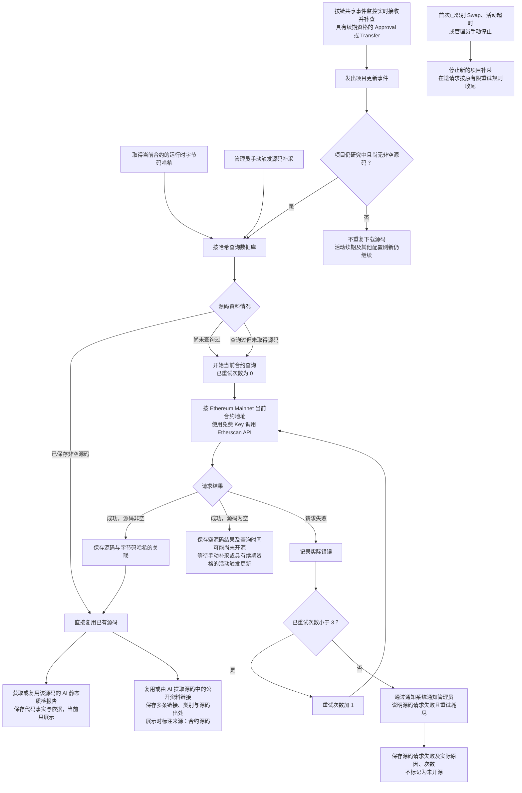

# Token 合约源码获取流程

> 需求状态：讨论中
>
> 细分状态：目标设计草案，尚未完整实现。当前已有按代码哈希复用资料的机制；本图还包含待实施的手动补采、项目活动触发补采和请求重试规则。

## 入口与目的

首版仅研究 Ethereum Mainnet 项目，Etherscan 请求使用现有免费 Key。取得当前合约的运行时字节码哈希后，先查询数据库中的源码资料。相同哈希已有源码时直接复用；没有可复用源码时，通过当前合约的链和地址调用 Etherscan API。后续扩展其他链时，现有免费 Key 全部替换为付费 Key。该凭据安排只用于源码等既有 Etherscan 请求；持币地址总数与前 100 名分布改由 Ave 获取，见 [持币地址资料获取流程](token-holder-flow.md)。

区块处理在完成该块 Token 识别，并可靠保存识别结果、项目资料及研究任务后即可推进。源码获取、AI 分析和五层钱包采集由后台独立执行，本流程的 API 请求、失败重试、补采与报告生成不阻塞区块推进。

## 流程图

## 关键说明

| 情况 | 处理方式 |
| --- | --- |
| 相同哈希已保存非空源码 | 关联并复用已有源码，无需为本次采集请求 Etherscan |
| 尚未查询过，或此前查询过但没有源码 | 使用当前合约的链和地址查询，不沿用其他地址的空结果跳过采集 |
| 请求成功且源码非空 | 保存源码与字节码哈希的关联，供后续相同哈希的合约复用 |
| 请求成功但源码为空 | 保存成功空响应、链、地址与查询时间，表示可能尚未开源；支持手动补采，研究期间由具有续期资格的新目标 Token `Approval` 或 `Transfer` 事件触发更新后再次查询，不触发请求失败重试 |
| 请求失败 | 记录实际错误并重试；耗尽后通过通知系统通知管理员，保存请求失败、原因和次数，不标记为“未开源” |

“最多重试三次”目前按首次请求之外最多再重试三次记录，即总计最多四次请求。重试次数初始为 0，允许重试时先加 1，再发起请求；任一次请求成功后即停止失败重试，按源码是否为空处理。

成功空源码和请求失败分别记录，不能合并为“未开源”。成功空源码只说明本次接口尚未返回源码，可能是尚未开源，需要再查询；请求失败只说明没有成功取得本次响应。空源码补采与失败重试是两类安排，不把首次请求加三次失败重试的次数上限套用为空源码补采上限。通知只画在失败重试耗尽分支，复用 [系统通知组件](../../design/notifications/system-notification-operations.md)，向管理员说明当前链、合约、失败原因与请求次数。

图中的手动补采只面向研究中且尚无非空源码的项目；项目停止后不提供项目专属手动补采或刷新入口。所有研究中项目都持续加入目标 Token 的 `Approval` / `Transfer` 监控。事件去重后，只有事件区块时间不晚于处理前当前期限的活动才续期并执行按链配置的资料刷新；晚于期限的事件只保留证据，不续期、不刷新。仅当项目仍无非空源码时，具有续期资格的活动才强制触发或合并本流程的重新查询；已有非空源码继续复用，不因每个事件重复下载或自动重新生成 AI 报告。活动检测不修改关联钱包固定的部署前 300 笔窗口。

该补采方式由手动操作或具有续期资格的新活动事件触发，不设置定时无限轮询。每次真正发起查询仍按成功非空、成功为空、请求失败分别处理；活动事件聚合、同一项目在途请求协调及补采调度细节后续确定。

缓存键是运行时字节码哈希，不是源码文本哈希，也不是 `code.length`。有哈希记录不等于已经取得源码；某个地址的空结果不会使同哈希的其他地址永久停止源码查询。按哈希匹配到同一份源码后，共享其质检报告中的事实与依据、AI 已完成的 owner 分析结论与读取方式、[税费接收钱包分析](token-fee-recipient-wallet-flow.md)的识别结论、固定地址与读取方式，以及[税率分析](token-tax-rate-flow.md)的结论、读取与解释方案。依赖链上状态的 owner、税费接收地址及税率，由 Go 程序按当前链、当前合约分别读取。AI 报告不含风险评级，第一板块不生成程序筛选结果。复用源码不复制其他项目的链上状态，也不等于当前地址已在 Etherscan 完成独立源码验证。

[公开资料链接提取](token-public-links-flow.md)同样复用实际源码已有的完成结果，缺失时由 AI 识别源码中实际出现的 HTTPS 链接，支持官网、X、Telegram、项目文档、GitHub、公开审计报告等多条资料，保留分类与源码出处。该分支独立于质检报告及其他读取方案，不要求同一次 AI 调用，也不访问外部页面核验内容；展示时标注“来源：合约源码”。两条后续连线只表达资料依赖，当前均保存并展示已有结果，不新增资料必须全部完成的门槛。

取得或复用非空源码后，进入 [AI 静态质检流程](token-contract-review-flow.md)：先查该源码已有的完成报告，命中即复用；没有报告才调用 AI 静态分析，至少记录是否可无限增发、是否可修改余额、是否可限制转出及代码依据，同时保留代理与外部未知依赖识别。管理员可针对某份共享源码手动重新检测。AI 只生成事实，不评级、不筛选、不排除项目。空源码及请求失败分支不生成成功报告，也不伪造否定事实。

本流程只在项目研究中启动新的项目源码请求。项目因首次已识别 Swap、不活跃超时或管理员手动操作停止时，排队且未开始的请求取消；已经开始的请求继续首次加三次重试口径，成功或耗尽后保存结果。停止后不启动新的下游项目任务，也不允许项目专属手动补采。按 `code_hash` 共享的源码、报告和静态分析可因其他研究中项目或管理员重检更新，已停止项目始终展示最新共享有效版本，但不恢复研究。

## 待明确边界

失败重试间隔、通知提交失败时的处理、活动刷新冷却中的请求合并、同一哈希的并发请求协调及数据结构仍待技术设计。空源码已确认采用研究中管理员手动补采与具有续期资格的新 `Approval`／`Transfer` 活动触发，不另设定时轮询。通知组件自身的投递和重试机制沿用现有设计。源码缺失只作为事实，不形成过滤条件。该有限失败重试上限不替代 [区块失败的无限重试规则](token-block-scan-flow.md)。

## 关联文档

- [Token 目标设计](token.md)
- [合约源码 AI 静态审阅流程](token-contract-review-flow.md)
- [税费接收钱包获取与读取方式复用](token-fee-recipient-wallet-flow.md)
- [合约税率读取与分析复用](token-tax-rate-flow.md)
- [源码公开资料链接提取与复用](token-public-links-flow.md)
- [项目事实研究流程](token-research-flow.md)
- [研究资料整理流程](token-research-materials-flow.md)
- [当前源码采集与任务重试实现](../../design/token-intelligence/collection-profile.md)
- [返回业务设计与流程图索引](README.md)
