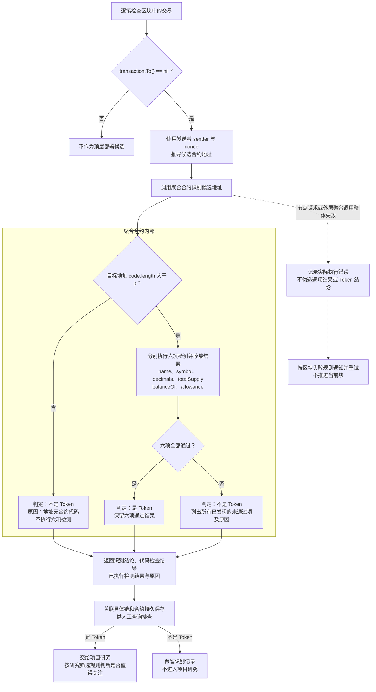

# Token 候选发现与识别流程

> 需求状态：讨论中
>
> 细分状态：目标设计草案，尚未实现。本图依据 [Token 两板块目标设计](token.md)，说明顶层部署候选如何被识别为 Token，以及识别结论和原因如何保留。

本流程接收[区块扫描流程](token-block-scan-flow.md)取得的区块交易，将通过识别的 Token 交给[项目研究流程](token-research-flow.md)。单块完成需要完成该块的 Token 识别并可靠保存识别结果、项目资料与研究任务，之后推进扫描；具体研究在后台独立执行。

首版仅 Ethereum Mainnet（chain ID 1），发现范围只覆盖顶层合约创建交易，不包括工厂内部的 `CREATE` / `CREATE2`；暂不使用 Bitquery、Allium 或内部调用追踪扩展范围。

## 流程图

## 六项检测规则

目标地址有代码时，保留现有全部检测条件，不放宽元数据、精度或供应量要求。

| 检测项 | 通过条件 |
| --- | --- |
| `name()` | 能读取、按现有要求解码，且名称非空 |
| `symbol()` | 能读取、按现有要求解码，且符号非空 |
| `decimals()` | 能读取、按现有要求解码，且大于 0 |
| `totalSupply()` | 能读取、按现有要求解码，且大于 0 |
| `balanceOf(零地址)` | 能正常返回并按现有要求解码，允许返回 0 |
| `allowance(零地址, 零地址)` | 能正常返回并按现有要求解码，允许返回 0 |

这六项是 Token 识别检测，后续项目研究另行使用研究筛选规则。“是 Token”不直接表示项目值得关注。

## 结论与诊断记录

- 识别结论只有“是 Token”和“不是 Token”。无代码或任意检测项未通过，判定为不是 Token；有代码且六项全部通过，判定为 Token。
- 代码检查在聚合合约内部先执行。无代码时记录“地址无合约代码”，其余六项为未执行，不记录为已经检测失败。
- 有代码时分别记录六项检测结果。单项不通过仍继续其余可执行检测，返回所有已发现的未通过项；`name` 和 `symbol` 各自保留结果。
- 原因区分目标方法调用失败、返回数据无法解码、成功读取但值不满足条件。保留实际取得的返回值或错误信息，不将调用失败直接断言为方法不存在。
- 两种识别结论及其检测记录都关联具体链和合约持久保存，不能仅输出日志或只保留通过识别的地址。基础信息还需保存查询区块的实际 `code.length` 字节数，并关联对应区块与时间；该数值不增加新的长度阈值或筛选规则。
- 不设置独立的部署交易成功判断，不以回执 `status` 作为识别前置条件。“地址无合约代码”只描述查询时的事实，不直接推断原始部署交易失败。
- 节点请求或外层聚合调用整体失败属于执行异常侧路，记录实际错误。未取得检测结果时不伪造逐项失败，也不新增第三种 Token 识别结论。

## 待明确的衔接

具体返回结构、错误码、存储结构、人工查询入口、检测资源限制仍待设计；识别查询使用哪个区块状态仍需明确。识别结果及研究任务可靠保存后推进扫描的边界已确认，研究不阻塞扫描。

[区块扫描流程](token-block-scan-flow.md)已规定区块处理失败时每次通知管理员并无限次重试同一区块；节点或外层识别调用整体失败接入该块重试；目标合约单项检测不通过则保存不是 Token 的业务结论，不把它当作无限重试的技术异常。

完整业务约束见 [Token 两板块目标设计](token.md)。返回[业务设计与研究资料索引](README.md)，或继续阅读[项目研究流程](token-research-flow.md)。
