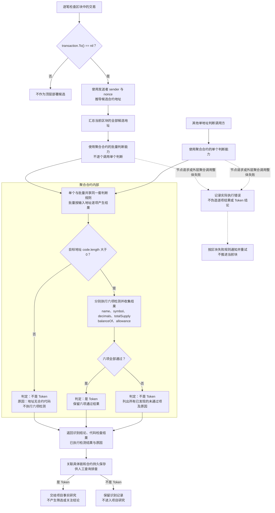

# Token 候选发现与识别流程

> 关联目标技术设计：[对应子系统方案](../../design/token-intelligence/discovery-research-lifecycle.md)（分节已确认，书面待审阅；尚未实现）。

> 需求状态：讨论中
>
> 细分状态：单个/批量识别能力、区块扫描批量路径、最新状态口径与最终拒绝规则已确认，整体仍为目标设计草案、尚未实现。本图依据 [Token 第一板块目标设计](token.md)，说明顶层部署候选如何被识别为 Token，以及识别结论和原因如何保留。

本流程接收[区块扫描流程](token-block-scan-flow.md)取得的区块交易，将通过识别的 Token 交给[项目研究流程](token-research-flow.md)。单块完成需要完成该块的 Token 识别并可靠保存识别结果、项目资料与研究任务，之后推进扫描；具体研究在后台独立执行。

首版仅 Ethereum Mainnet（chain ID 1），发现范围只覆盖顶层合约创建交易，不包括工厂内部的 `CREATE` / `CREATE2`；暂不使用 Bitquery、Allium 或内部调用追踪扩展范围。

## 流程图

## 单个与批量识别能力

- 聚合合约必须同时支持单个候选合约判断和多个候选合约批量判断。两种调用形态共享完全相同的代码存在检查、六项检测、结论与诊断语义，不能形成两套判断规则。
- 区块扫描完成当前区块的候选发现后，汇总该区块全部候选地址并使用批量判断形态，不在 Go 中循环调用单个判断。即使当前区块只有一个候选，也沿用扫描的批量路径；没有候选时跳过聚合判断。
- 一次批量判断只包含同一条链、同一个区块的候选，不与其他区块合并。返回结果必须与输入候选一一对应并保持输入顺序，保证识别记录能够关联原交易和合约。
- 某个候选的代码不存在或单项检测不通过，只形成该候选“不是 Token”的业务结果，不影响批量中其他候选继续判断。节点请求或整个聚合调用失败才进入当前区块的技术失败重试。
- 单次批量最大候选数量及超限拆分方式见关联目标技术设计；若需要拆分，同一区块仍只使用批量判断形态，并在全部拆分结果可靠保存后才能推进区块进度。
- 需求只确认两种调用能力及扫描使用方式；具体 Solidity ABI 方法数量、名称和返回结构见关联目标技术设计。

## 六项检测规则

目标地址有代码时，保留现有全部检测条件，不放宽元数据、精度或供应量要求。

| 检测项 | 通过条件 |
| --- | --- |
| `name()` | 能读取、按现有要求解码，且名称非空 |
| `symbol()` | 能读取、按现有要求解码，且符号非空 |
| `decimals()` | 能读取、按现有要求解码，且大于 0 |
| `totalSupply()` | 能读取、按现有要求解码，且大于 0 |
| `balanceOf(零地址)` | 能正常返回并按现有要求解码，允许返回 0 |
| `allowance(零地址, 零地址)` | 能正常返回并按现有要求解码，允许返回 0 |

这六项只用于 Token 身份识别。“是 Token”仅表示通过当前识别规则，后续第一板块继续采集事实，不判断项目是否值得关注。

## 结论与诊断记录

- 识别结论只有“是 Token”和“不是 Token”。无代码或任意检测项未通过，判定为不是 Token；有代码且六项全部通过，判定为 Token。
- 代码检查在聚合合约内部先执行。无代码时记录“地址无合约代码”，其余六项为未执行，不记录为已经检测失败。
- 有代码时分别记录六项检测结果。单项不通过仍继续其余可执行检测，返回所有已发现的未通过项；`name` 和 `symbol` 各自保留结果。
- 原因区分目标方法调用失败、返回数据无法解码、成功读取但值不满足条件。保留实际取得的返回值或错误信息，不将调用失败直接断言为方法不存在。
- 两种识别结论及其检测记录都关联具体链和合约持久保存，不能仅输出日志或只保留通过识别的地址。基础信息还需保存查询区块的实际 `code.length` 字节数，并关联对应区块与时间；该数值不增加新的长度阈值或筛选规则。
- 不设置独立的部署交易成功判断，不以回执 `status` 作为识别前置条件。“地址无合约代码”只描述查询时的事实，不直接推断原始部署交易失败。
- 节点请求或外层聚合调用整体失败属于执行异常侧路，记录实际错误。未取得检测结果时不伪造逐项失败，也不新增第三种 Token 识别结论。
- 每次识别使用执行该次判断时可取得的最新区块状态，并保存实际观察区块号及区块时间。批量被拆分时，各次调用仍记录自己的实际观察点；具体 block tag 固定方式由技术设计确定。
- 代码检查或六项检测中的业务条件不通过，形成最终“不是 Token”结论，不自动重试，也不提供人工重新识别入口。只有节点、外层聚合调用或保存失败等技术异常才按当前区块无限重试。
- 项目进入研究后，可以按活动刷新策略再次读取 `code.length` 与六项值作为当前事实，但不得改写最初保存的 Token 识别结论。

## 目标技术设计衔接

具体 ABI 方法、返回结构、错误码、存储结构、人工查询入口、单次批量上限、检测资源限制及最新观察区块的固定方式见关联目标技术设计，尚未实现。使用最新状态、保存实际观察点、业务拒绝不重检，以及识别结果和研究任务可靠保存后才推进扫描的边界均已确认；研究不阻塞扫描。

[区块扫描流程](token-block-scan-flow.md)已规定区块处理失败时每次通知管理员并无限次重试同一区块；节点或外层识别调用整体失败接入该块重试；目标合约单项检测不通过则保存不是 Token 的业务结论，不把它当作无限重试的技术异常。

完整业务约束见 [Token 第一板块目标设计](token.md)。返回[业务设计与研究资料索引](README.md)，或继续阅读[项目研究流程](token-research-flow.md)。
