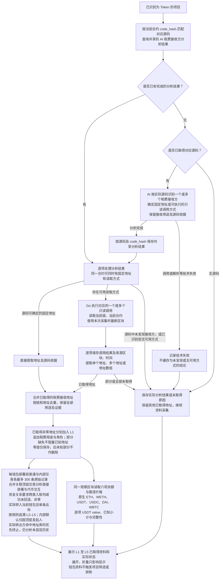

# Token 税费接收钱包获取与研究流程

> 关联目标技术设计：[对应子系统方案](../../design/token-intelligence/source-facts-and-read-plans.md)（分节已确认，书面待审阅；尚未实现）。

> 需求状态：讨论中
>
> 细分状态：目标设计草案，尚未实现。本图记录已确认的 AI 税费接收方分析、固定地址提取、Go 链上读取与关联钱包研究范围。

首版仅研究 Ethereum Mainnet，相关 Etherscan 请求使用免费 Key；后续扩展其他链时现有免费 Key 全部替换为付费 Key。

## 入口与目的

取得合约源码后，由 AI 分析实际源码中的税费接收地址。一个合约可以有一个或多个税费接收钱包，也可以同时包含源码中写死的地址和需要读取链上状态的地址。对源码中能够直接确定的固定地址，直接提取；对由状态决定的地址，AI 给出源码支持的读取方式，由 Go 程序读取当前链、当前合约的实际结果。

取得的非零地址作为 L1 直接关联钱包，追加“税费接收钱包”标签，采集历史交易、分析部署与代币交互、在项目门槛和终止节点边界内追溯资金来源，并读取六项资产余额与 USDT 估值。零地址原值保留但不纳入钱包研究。同一地址还可以是部署者、owner 或初始接收钱包，各角色和依据同时保留。税费接收钱包可以是合约地址，数量不受“最多 5 个初始接收钱包”限制。

该板块只采集、解析、保存和展示资料，不增加风险评级、项目筛选或排除规则。源码 AI 同样只生成事实报告和依据，见 [AI 静态质检流程](token-contract-review-flow.md)。

## 流程图

图中的固定地址与链上读取分支可以同时存在，分别处理每个接收方；不将整个合约强制归为二选一。同一数组部分读取成功时，已证实的非零地址立即加入 L1 并开始独立研究；只有对应集合完整成功后才允许关闭旧地址角色。流程图表达后台研究任务的数据依赖，不要求税费接收方、owner、静态报告或其他资料共同完成才继续研究，也不阻塞该块识别结果、项目资料及研究任务保存后的区块推进。

税费接收地址只可被管理员配置为具有续期资格的目标 Token `Transfer` 所触发的刷新组；`Approval` 和部署者／当前 owner 主动交易不得触发该资料刷新。刷新仍使用执行时最新区块，只保留最近成功的当前地址集合，失败另存最近时间与原因。每项完整成功结果替换对应税费用途的当前地址集合，缺失或失败部分不视为删除旧值；新增非零地址自动成为 L1，执行其固定 `0..B-1` 历史、六项资产余额与 USDT 估值及 L2–L5 研究。被移出的旧地址失去相应当前税费角色，仍保留历史 L1 入口、其他有效角色与已有事实，继续未完成历史和上游研究。

项目因首次已识别 Swap、不活跃超时或管理员手动操作停止时，未开始的相关任务取消，已开始任务按原有限重试规则收尾；停止后不启动新下游任务。在途任务结束后冻结项目专属地址与钱包事实。共享税费接收方分析、固定地址和读取方案仍展示最新有效版本，但不会触发已停止项目重新读取。具体衔接见 [项目事实研究流程](token-research-flow.md)。

## AI 分析与地址获取

AI 根据税费计算、归集与转出代码确认地址的接收语义，不只依据 `marketingWallet`、`feeReceiver` 等变量或函数名称。接收用途按源码实际情况记录；源码未说明的用途不自行猜测，也不将发现接收地址等同于已经发生税费支付。

| 接收方类型 | 处理方式 |
| --- | --- |
| 源码中可直接确定的固定地址 | AI 提取地址、用途和源码依据。必须能从实际取得的源码确认地址值及固定性，才能将该地址作为固定接收方。 |
| 由当前链上状态决定的地址 | AI 给出可执行的只读调用描述，Go 对当前合约查询并解码实际地址。一个合约可以使用多个读取方法；单个返回值也可以包含多个地址。 |
| 已识别税费接收逻辑，但源码未提供可用读取方式 | 保存相关源码依据和无法取得当前地址的原因；不猜测地址，不将其记为“未发现税费接收方”。 |
| 实际取得的源码中未发现税费接收方 | 保存已完成的分析结论和依据，含义仅限本次实际分析的源码范围。 |

普通可变变量的初始值即使是源码中的地址字面量，也不自动代表当前接收地址。例如变量后续可以通过 setter 修改，应按其当前状态提供读取方式；没有可用方式时记录无法取得。只有构造参数才能决定的值，也不能在未取得该参数时由 AI 补猜。本轮不额外加入部署或初始化资料采集。

读取描述应足够让 Go 程序构造调用、解码并提取地址，包括函数签名、必要参数类型与确定值或取值来源、返回类型，以及地址所在字段或数组元素。若需要读取数组长度后逐项读取，应明确这类只读调用之间的依赖。需要但无法确定的参数或无法执行的模糊方法名，不算可用读取方式；Go 不补猜参数，也不执行 AI 生成的任意程序。

链上读取使用本次采集时的最新区块，并保留实际区块和时间。多个相关调用使用该次税费接收方采集的区块，结果表达这一时点的接收配置；不把它当作部署时的接收配置或实际历史收款记录。该采集与 owner、余额等其他资料不要求共用同一区块。

## 共享分析与实例结果

同一份源码的税费接收方分析只生成一份，通过运行时字节码 `code_hash` 匹配对应源码后复用。共享内容包括已识别的接收用途、源码依据、源码可确定的固定地址和只读调用说明，也包括已完成的“源码中未发现”或“已识别但无可用读取方式”结论。

每个部署实例保存本次地址获取结果。固定地址注明来自对应源码；通过调用取得的地址必须由 Go 对当前链、当前合约读取，不能将其他部署实例的地址或历史快照作为本次结果。同一地址由多个来源取得时合并钱包节点，保留各条来源与用途。

AI 技术失败单独记录，不作为“未发现”或“无可用方式”的可复用完成结论，也不覆盖已有有效分析。Go 调用失败同样不改变共享的源码分析结论。无源码、未发现接收方、缺少读取方式、部分成功以及调用失败分别保存实际结果与原因；未取得某个地址时只跳过该地址的钱包采集，不影响其他已知地址。

税费接收方分析与 [owner 分析](token-owner-wallet-flow.md)、[税率分析与读取](token-tax-rate-flow.md)、[静态质检报告](token-contract-review-flow.md)各自复用，不强制合并为一次 AI 调用或互相等待。税费地址与税率分别取得和保存，不要求取得全部税率才采集接收钱包；这些链上读取不纳入静态质检的核实，也不成为静态事实报告生成的前置条件。

当前只分析实际取得的源码，不额外解析代理实现地址，不获取或分析代理实现及外部依赖源码。若接收方只能由未取得的外部实现确定，则保留该限制及实际分析结果；已经明确的当前合约只读调用仍按本流程执行。

## 纳入关联钱包研究

- 将取得的一个或多个税费接收地址与部署者、owner、最多 5 个初始接收钱包合并为 L1。按链和地址去重，角色标签属于当前项目；相同钱包只采集一份同范围历史，保留全部角色与证据。
- 每个钱包分别通过 Etherscan 按地址查询普通交易与内部交易，均使用 `startblock=0`、`endblock=B-1`、`sort=desc`、`page=1`、`offset=300`，其中 `B` 为当前项目部署区块。两类分别最多 300 条原始记录，取得后再筛选，不翻页凑足；分别保存无记录、达到采样上限、失败及部分取得状态。税费地址在部署后才取得也不改变截止区块，例如 `B=30000` 时两类均查询 `0..29999`。
- 合并普通样本与内部记录关联的顶层交易，去重补充回执与日志，分析有证据属于当前钱包的直接部署与代币交互；不把被动收款当作主动参与，也不扩展内部合约部署识别。明确买卖首版只识别 Uniswap V2/V3/V4、Sushi V2/V3、PancakeSwap V2/V3，未支持路径保留未分类事实。
- 普通顶层直接入账与内部 ETH 入账都必须成功、未回滚、非零、实际转入当前钱包，并逐条达到项目开始时保存的门槛快照；ETH 默认 `0.01 ETH`，同交易内多笔小额也不累计。内部入账默认按顶层发起人归因，保留实际转出证据；仅在实际转出方未命中地址库时，无法取得发起人或属于自身发起回款的记录不新增外部上游。后台自动研究 L2–L5，保留共同来源和循环关系；不扩展代币入账来源，L5 不扩展 L6。
- 内部转账的实际转出方命中管理员按链维护的交易所／跨链地址库时，优先保留该方到当前钱包的关系并在该方终止，不穿透顶层发起人；否则按归因来源继续研究，来源自身命中该库也终止。终止节点仍完成本层普通与内部交易各最多 300 条原始记录及行为分析，保留已有资金边，但不再发现更上游来源。标签新增、移除和项目停止后的处理沿用统一资金来源规则。
- 税费接收钱包属于 L1，在同一最新观察区块读取原生 ETH、WETH、USDT、USDC、DAI、WBTC 的余额及估值路径池状态，逐项保留原始余额和 USDT value，并给出已知小计与总值完整性。L2–L5 不采集余额。
- 多重身份、接收用途、交易过或部署过的项目、资金关系、余额及未取得资料的原因都只用于展示，不触发项目筛选或排除。

更完整的采集、去重、分层和展示规则沿用 [多层关联钱包研究流程](token-wallet-research-flow.md)、[内部 ETH 转账识别与来源归因](token-wallet-internal-transfers-flow.md)及 [钱包资金来源关系图](token-wallet-funding-graph.md)。内部归因不证明实际出资或控制关系，实际流水与归因展示不得重复计额；本次历史扩展不改变研究期活动或停止规则。

## 目标技术设计衔接

零地址保留原值但不研究，部分失败不删除未知部分，旧地址保留历史 L1 并继续未完成研究，均已确认。读取描述、冲突处理、重试与共享版本见[源码事实与读取方案](../../design/token-intelligence/source-facts-and-read-plans.md)，任务合并见[研究运行时](../../design/token-intelligence/research-task-runtime.md)。这些目标设计尚未实现；不添加地址数量上限或新的研究完成门槛。

## 关联文档

- [Token 目标设计](token.md)
- [研究资料整理流程](token-research-materials-flow.md)
- [合约源码获取流程](token-contract-source-flow.md)
- [合约源码 AI 静态质检与报告复用](token-contract-review-flow.md)
- [Token owner 钱包获取与研究流程](token-owner-wallet-flow.md)
- [合约税率读取流程](token-tax-rate-flow.md)
- [多层关联钱包研究流程](token-wallet-research-flow.md)
- [钱包资金来源关系图](token-wallet-funding-graph.md)
- [内部 ETH 转账识别与来源归因](token-wallet-internal-transfers-flow.md)
- [返回业务设计与流程图索引](README.md)
