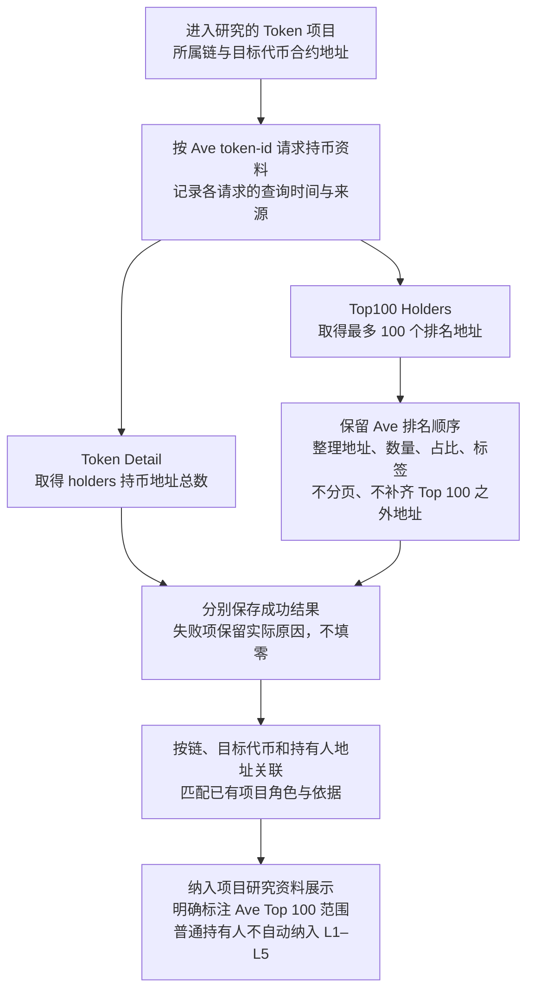

# Token 持币地址资料获取流程

> 需求状态：讨论中
>
> 细分状态：持币数据来源与采集范围已明确，异常处理、刷新和展示细节仍待设计，尚未实现。首版仅研究 Ethereum Mainnet；持币资料改由 Ave 提供，不再设计 Etherscan PRO Key 或完整分页持币名单。

## 入口与目的

按项目所属链和目标代币合约地址，从 Ave 获取两类当前持币资料：持币地址总数，以及 Ave 排名中的前 100 个持币地址。前 100 名逐项展示具体地址、持有数量、持有占比和 Ave 提供的地址标签。

持币资料依赖链和目标代币地址，不依赖合约已开源，也不等待 AI 源码分析。本板块只采集、整理、保存和展示资料，不增加持仓集中度评分、筛选阈值或项目排除规则。源码 AI 当前只生成事实报告和依据，后续程序按管理员维护的标准生成风险等级并执行对应筛选，见 [AI 静态质检流程](token-contract-review-flow.md)。

## 流程图

总数和 Top 100 分别保存结果，任一请求失败不丢弃另一项已取得资料，也不要求两项都成功才展示。接入后由后台研究任务执行，不阻塞该块识别结果、项目资料及研究任务保存后的区块推进。具体调用协调、重试和刷新频率后续细化，不增加持币资料必须齐备的研究完成条件。

项目首次真实 Swap 为研究截止，识别不限定 V2、V3 或 V4；持币资料未取得或 Top 100 返回不足 100 条不延后截止。结束研究不等于资料齐备、高风险或可以买入；首次 Swap 时尚未交接的项目放弃本轮参与，具体衔接见 [项目研究与筛选流程](token-research-flow.md)。

## 数据来源与目标字段

| 目标资料 | Ave 来源与处理要求 |
| --- | --- |
| 持币地址总数 | 调用 Ave Token Detail `GET /v2/tokens/{token-id}`，保存返回的 `holders` 及独立查询时间。该值表达 Ave 当前提供的持币地址总数；未返回或请求失败时保留原因，不填为 `0`。[Ave 官方文档](https://docs.ave.ai/reference/api-reference/v2) |
| 前 100 持币地址 | 调用 Ave Top100 Holders `GET /v2/tokens/top100/{token-id}`。接口单次最多返回 100 条，本需求不继续分页，也不从其他来源补全 Top 100 之外的持有人。[Ave 官方文档](https://docs.ave.ai/reference/api-reference/v2) |
| 持有数量 | 使用 Ave 对应持有人返回的当前持有数量，例如 `amount_cur`；保留接口原始值和可用的单位信息，不自行推测缺失数量。 |
| 持有占比 | 使用 Ave 返回的 `balance_ratio`，保留原始值，并按 Ave 的比例语义格式化为百分比展示；不改用 Top 100 余额之和作为分母重新计算。 |
| 地址标签 | 保留 Ave 返回的地址备注和别名信息，例如 `remark`、`addr_alias`。两者均为空时明确表示 Ave 未提供标签；不根据地址行为自行生成身份标签。 |

Ave 返回顺序就是本次 Top 100 的提供方排名，保存和展示时保持该顺序，不因地址属于交易所、池、销毁地址、合约或已有项目角色而自动剔除。已有角色匹配结果与 Ave 标签分别保留来源；同一地址可以同时展示多个标签，但不能将提供方标签表达为系统已经核实的真实身份。

Top100 接口实际返回少于 100 条时，保存实际条数，不自动判为采集失败，也不补造缺失名次。只有 Ave 明确成功返回空列表时才保存真实空结果；鉴权、限流、解析或网络错误均保存为失败，不能解释为无人持币。

## 保存结果与时间语义

本需求不获取完整持币名单，不设计页码、分页游标、全量遍历状态或“已覆盖全部持有人”的结论。`holders` 是总数资料，Top 100 是有界排名资料；两者不能合并表述为完整持币分布，也不能用总数与 Top 100 条数的差异判断数据缺失。

| 保存内容 | 表达要求 |
| --- | --- |
| 项目与地址 | 保存所属链、目标代币合约地址、Ave token-id、持有人地址及名次；按当前链、目标代币和持有人地址关联，保留可追溯的原始响应来源。 |
| 持币地址总数 | 保存 Ave 返回的 `holders`、查询时间和取得状态；与 Top 100 实际返回条数分开表达。 |
| Top 100 明细 | 每条保存名次、地址、持有数量、持有占比、Ave 原始标签字段及本次查询时间；字段缺失按项保留，不用零值或推测值补齐。 |
| 已有角色 | 匹配当前项目已有的部署者、owner、初始接收钱包、税费接收钱包和资金来源身份及其证据；持有人名单本身不证明地址由某个团队或个人控制。 |
| 采集依据 | 保存 Ave 接口、请求对应的链与 token-id、每项查询时间、成功或失败结果及实际原因。接口没有提供具体来源区块时不补造区块号。 |

Token Detail 与 Top100 Holders 是两次独立请求，Ave 的数据更新时点也可能不同；不能假定总数、名次、数量和占比属于同一链上区块快照。若接口提供数据更新时间则按项保留，否则仅记录本系统实际查询时间。持币结果属于具体链、具体代币部署实例，不能随源码或 `code_hash` 跨合约共享，也不把旧查询结果直接表达为当前持仓。

## Ave 采集范围

本阶段只恢复并使用 Ave 的持币能力：Token Detail 中的持币地址总数，以及 Top100 Holders 中的前 100 持币分布。不恢复现有 Ave 市场、池、流动性或风险标签采集，也不从 Ave Contract Risk 等其他接口拼接本需求字段。

首版 Ethereum Mainnet 的合约源码、钱包普通交易等既有 Etherscan 请求继续使用现有免费 Key；后续扩展其他链时，现有免费 Key 全部替换为付费 Key。这个安排只适用于 Etherscan 的既有用途，持币资料不再依赖 Etherscan 套餐或单独的 PRO Key。

## 与关联钱包研究的边界

取得 Top 100 地址后可以匹配已有 L1–L5 钱包身份，但仅因持有目标代币，不自动将该地址加入 L1，也不自动触发该地址的部署前 300 笔历史、资金来源追溯或其他资产余额采集。已有钱包的研究继续沿用 [多层关联钱包研究流程](token-wallet-research-flow.md)。

本板块记录“当前有多少持币地址，以及 Ave 前 100 名是谁、持有多少”。首版 L1 钱包资产板块记录相关钱包持有的 WETH、USDT 等既有追踪资产，两者分别保存；本次不扩大 L1 的追踪资产配置，不增加 L2–L5 的资产余额采集。已确认的关联钱包由后台自动采集 L1–L5 并展示五层实际结果，展示折叠不触发取数；该规则不扩大为自动分析 Top 100 的全部地址。

持币地址及数量用于展示当前分布，不代替部署交易中的初始分配，也不扩展为历史区块持有人名单。完整持币名单、初始分配明细、历史持仓、其他资产和新增钱包筛选规则均不属于本需求。未配置 Ave 凭据、部分字段缺失或采集失败不阻塞其他研究，也不单独导致项目被排除。

## 待设计事项

Ave token-id 的链映射、认证配置复用、两项请求的调度与并发协调、错误分类、限频重试、刷新与数据更新方式、标签展示优先级及存储结构后续在技术设计阶段细化。还需在接入时核对新部署且首次 Swap 前的 Token 是否都能及时出现在 Ave 两个接口中；接口暂未收录时记录“提供方暂无数据”，不回退到 Etherscan 补齐。

本轮只确定业务数据来源、Top 100 范围、目标字段和研究边界，不固定内部任务、数据库或 API 契约。需求文档仍为 `讨论中`，待整体确认后再进入后端技术设计。

## 关联文档

- [Token 目标设计](token.md)
- [项目研究与筛选流程](token-research-flow.md)
- [研究资料整理流程](token-research-materials-flow.md)
- [多层关联钱包研究流程](token-wallet-research-flow.md)
- [合约源码 AI 静态质检与报告复用](token-contract-review-flow.md)
- [返回业务设计与流程图索引](README.md)
