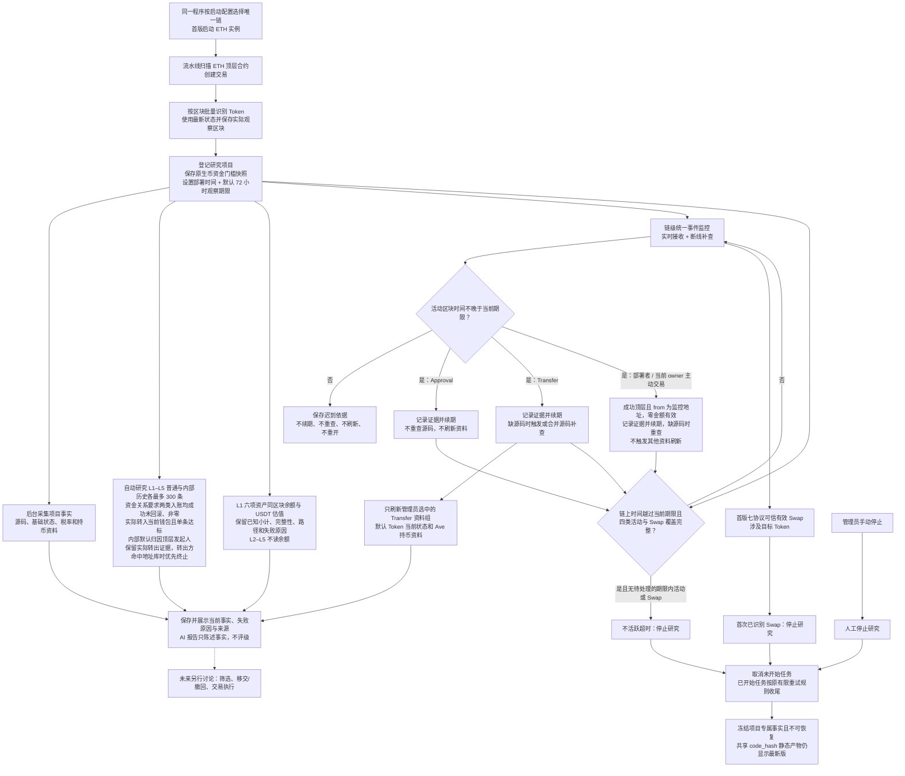

# Token 整体业务流程

> 需求状态：讨论中
>
> 细分状态：第一板块目标设计，尚未实现。首版仅 ETH 主网，当前只输出事实；第二板块暂不设计。

## 入口与目的

系统通过顶层合约创建交易发现候选，批量识别 Token，并在研究期间持续采集和刷新可核对事实。AI 只生成源码事实报告，不评级；程序不筛选、不排除、不移交，也不判断买入。

## 关键说明

- 第一板块只采集、解析、保存和展示事实。Token `READ` 或 `READ_WRITE` 成员可以查看；观察时长、`Transfer` 刷新配置、L1 估值路径、资金来源门槛、交易所／跨链地址库和人工停止仅管理员可操作。
- 默认观察 72 小时。当前期限内（含期限时点）的合法目标 Token `Approval`、`Transfer`，以及部署者／当前 owner 发出的成功顶层交易均按活动区块时间续期；零原生币主动调用有效，入账、失败交易和内部调用无效。晚于期限的活动不续期或恢复项目。
- 首版 Swap 范围固定为 Ethereum 上的 Uniswap V2/V3/V4、Sushi V2/V3、PancakeSwap V2/V3。任一支持协议中涉及目标 Token 的有效 Swap（包括 flash swap）停止研究；添加流动性不停止。
- “首次”只表示当前覆盖版本内最早的已识别 Swap。页面必须展示协议清单、覆盖版本和进度；未支持路径保持未知。
- `Approval` 只记录证据并续期，不重查源码、不刷新资料。`Transfer` 在缺少非空源码时重查，并按链级管理员配置刷新资料，默认刷新 Token 当前状态和 Ave 持币资料。部署者／当前 owner 主动交易在缺少非空源码时重查，但不触发其他资料刷新。
- 部署者从部署交易之后开始监控；当前 owner 从成功读取它的观察区块开始监控。owner 更换后停止旧 owner，部署者始终保留；地址重合时，同项目同一交易只处理一次。超时前必须确认 `Approval`、`Transfer`、部署者交易、当前 owner 交易和 Swap 都已完整覆盖越过期限。
- 每项目每数据组默认 10 分钟冷却，重复 `Transfer` 合并刷新；期限续期不受冷却影响。项目动态资料通常展示最近成功事实，失败另存最近时间和原因；L1 每次估值快照保留逐项结果和完整性，不用旧结果填补本次缺项。
- 三类停止分别为首次已识别 Swap、不活跃超时、管理员手动停止。正常停止不通知管理员，不允许恢复。未开始任务取消，已开始任务执行完原有限重试后保存。
- 项目停止并等待在途任务完成后，项目专属事实冻结。共享源码报告、公开链接和静态读取方案始终显示最新共享有效版本，但不会重开项目。
- ETH 首版每个 L1 钱包固定读取原生 ETH、WETH、USDT、USDC、DAI、WBTC，在同一观察区块逐项保存余额和 USDT value；非零资产无法估值时保留已知小计并把总值标记为不完整。L2–L5 不采集余额，首版不采集现有 `simulation_result`。
- L1–L5 每钱包在部署前 `0..B-1` 对普通与内部交易分别倒序取第一页最多 300 条原始记录，先取样后筛选，不翻页补足；两类关联的顶层交易去重开展行为分析，不把被动收款当主动参与，不扩展内部部署发现。
- 每项目保存原生币门槛快照，ETH 默认 `0.01 ETH`、未来 BSC 默认 `0.01 BNB`；普通顶层直接入账与内部 ETH 入账都必须成功、未回滚、非零、实际转入当前钱包且单条达到门槛，同交易小额也不累计。内部默认按顶层发起人归因，保留实际转出证据；实际转出方命中交易所／跨链库时优先在该方终止，否则归因来源命中也终止。终止节点仍分析本层两类历史；归因不证明实际出资或控制关系。详见 [内部 ETH 转账识别](token-wallet-internal-transfers-flow.md)。
- 部署前内部转账属于钱包历史，不改变研究期续期、源码补查、刷新或 Swap 停止规则；不扩展 ERC-20 资金来源或工厂内部部署发现。
- 扫描、事件监控和外部采集按单链实例运行；未来 BSC 复用代码启动独立实例，不复制业务代码。首版不考虑区块替换与重组回滚。

## 仍待明确

第一板块各环节的业务延迟或 SLO 尚未确定。组件、存储、接口、并发、限流与配置载体在需求整体确认后进入技术设计。筛选、移交／撤回、买入与交易执行属于未来第二板块，本阶段不展开。

## 关联文档

- [Token 目标设计](token.md)
- [单链实例运行设计](token-chain-runtime.md)
- [区块扫描与研究衔接](token-block-scan-flow.md)
- [项目研究流程](token-research-flow.md)
- [内部 ETH 转账识别与来源归因](token-wallet-internal-transfers-flow.md)
- [项目事件监控、活动续期与研究停止](token-project-activity-flow.md)
- [ETH Swap 事件调研](token-swap-events-research.md)
- [流程图索引](README.md)
