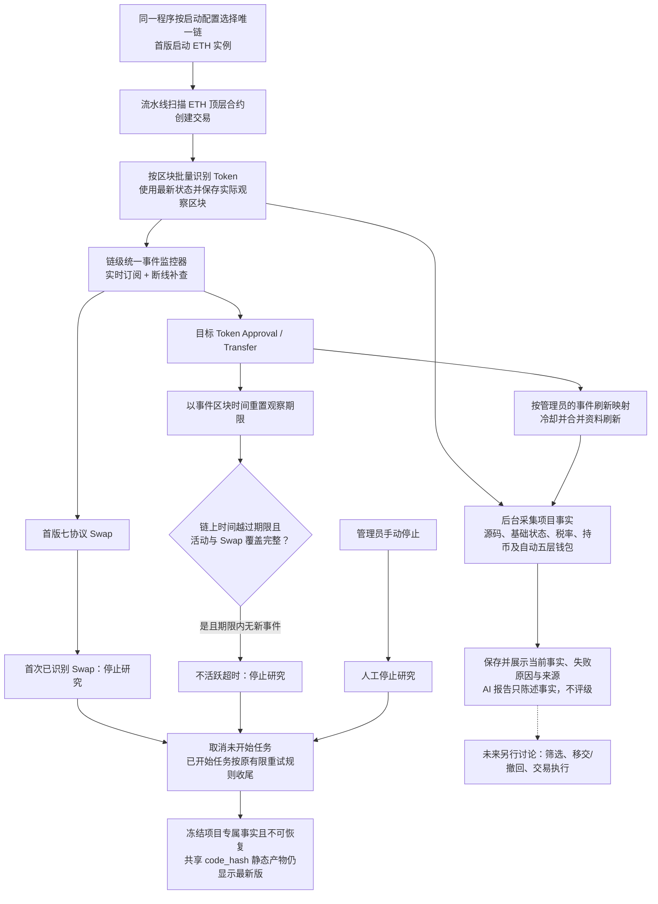

# Token 整体业务流程

> 需求状态：讨论中
>
> 细分状态：第一板块目标设计，尚未实现。首版仅 ETH 主网，当前只输出事实；第二板块暂不设计。

## 入口与目的

系统通过顶层合约创建交易发现候选，批量识别 Token，并在研究期间持续采集和刷新可核对事实。AI 只生成源码事实报告，不评级；程序不筛选、不排除、不移交，也不判断买入。

## 关键说明

- 第一板块只采集、解析、保存和展示事实。Token `READ` 或 `READ_WRITE` 成员可以查看；观察时长、活动刷新配置和人工停止仅管理员可操作。
- 默认观察 72 小时。每个合法 `Approval` 或 `Transfer` 都按事件区块时间重置期限，续期不限次数；超时必须等待活动和 Swap 覆盖完整越过期限后才能确认。
- 首版 Swap 范围固定为 Ethereum 上的 Uniswap V2/V3/V4、Sushi V2/V3、PancakeSwap V2/V3。任一支持协议中涉及目标 Token 的有效 Swap（包括 flash swap）停止研究；添加流动性不停止。
- “首次”只表示当前覆盖版本内最早的已识别 Swap。页面必须展示协议清单、覆盖版本和进度；未支持路径保持未知。
- `Approval` 和 `Transfer` 的刷新映射分别按链配置。续期及缺少非空源码时重查源码不可关闭；默认 `Approval` 不刷新其他资料，`Transfer` 还刷新 Token 当前状态和 Ave 持币资料。
- 每项目每数据组默认 10 分钟冷却，重复事件合并刷新；期限续期不受冷却影响。项目动态资料只保留最近成功事实，失败另存最近时间和原因。
- 三类停止分别为首次已识别 Swap、不活跃超时、管理员手动停止。正常停止不通知管理员，不允许恢复。未开始任务取消，已开始任务执行完原有限重试后保存。
- 项目停止并等待在途任务完成后，项目专属事实冻结。共享源码报告、公开链接和静态读取方案始终显示最新共享有效版本，但不会重开项目。
- L1 钱包资产固定为 WETH、USDT、USDC、DAI、WBTC，不读取原生 ETH；L2–L5 不采集余额。首版不采集现有 `simulation_result`。
- 扫描、事件监控和外部采集按单链实例运行；未来 BSC 复用代码启动独立实例，不复制业务代码。首版不考虑区块替换与重组回滚。

## 仍待明确

第一板块各环节的业务延迟或 SLO 尚未确定。组件、存储、接口、并发、限流与配置载体在需求整体确认后进入技术设计。筛选、移交／撤回、买入与交易执行属于未来第二板块，本阶段不展开。

## 关联文档

- [Token 目标设计](token.md)
- [单链实例运行设计](token-chain-runtime.md)
- [区块扫描与研究衔接](token-block-scan-flow.md)
- [项目研究流程](token-research-flow.md)
- [项目事件监控、活动续期与研究停止](token-project-activity-flow.md)
- [ETH Swap 事件调研](token-swap-events-research.md)
- [流程图索引](README.md)
