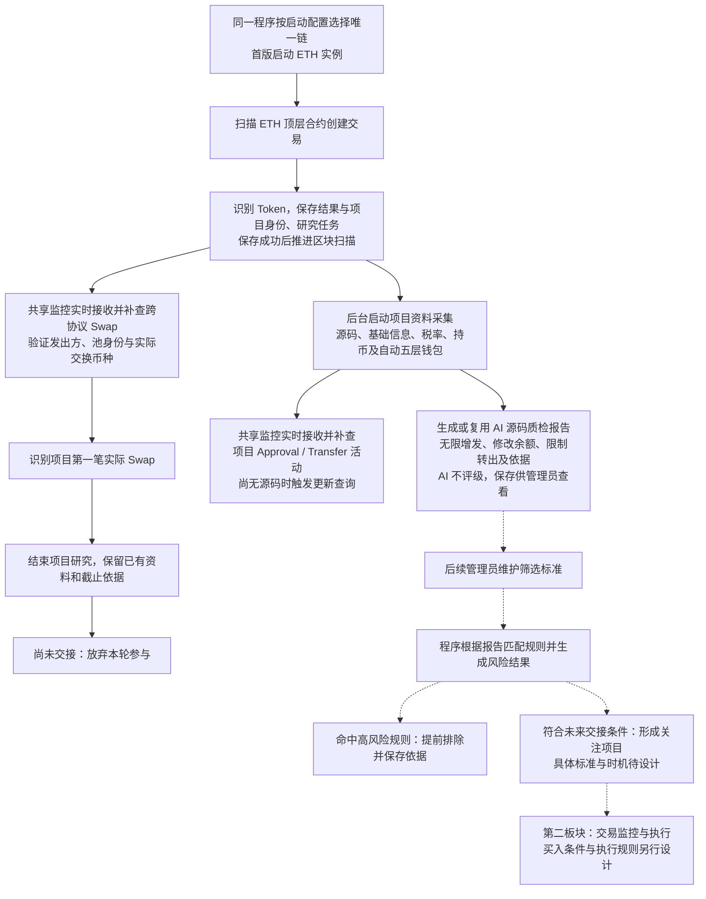

# Token 整体业务流程

> 需求状态：讨论中
>
> 细分状态：目标设计，尚未实现。首版仅 ETH 主网，先完成后端，再实现前端。

## 入口与目的

通过顶层合约创建交易发现并识别 Token，在其首次实际 Swap 前收集资料。AI 生成源码质检报告，供管理员查看；管理员后续维护筛选标准，由程序根据报告判断风险。当前不要求 AI 评级，也不预设高风险标准。

## 关键说明

- 首次 Swap 是研究截止时间，不等于资料已经齐全、通过筛选或允许买入。未交接项目在此时结束研究并放弃本轮参与，不能用部分资料临时补交接。
- 源码报告按实际源码共享。默认相信 AI 报告准确，允许管理员针对某份报告人工触发重新检测，例如提示词变更；不因新部署重复分析。
- 后续程序评级与 AI 报告分别表达，程序使用报告和管理员规则判断风险。虚线部分是后续规则与执行设计，当前不把未配置规则当作低风险或已通过。
- 钱包、税率、持币与源码公开资料只采集、解析、保存展示。后台自动执行 L1–L5，前端展示五层；首次 Swap 提前出现时保留部分结果，不等待采集齐备。
- 为匹配 Swap 取得池与代币身份映射，属于截止事件识别，不扩展为底池深度、流动性或 LP 风险研究。研究开始不要求池子已经存在。
- 每条链使用一套共享事件监控动态覆盖研究项目，不按项目分别建立独立订阅。Approval/Transfer 仅监控仍在研究且尚无非空源码的目标 Token；Swap 监控覆盖所有仍在研究的项目，通常从 Pair、Pool、Vault 或 PoolManager 等交易场所日志解析。
- 首版不考虑区块替换。实时订阅用于降低发现延迟，历史补查用于覆盖项目登记时差、启动、断线、重启与动态目标变化；新目标先开始实时接收，再固定终点并从部署区块补查，重叠范围按链上日志身份去重。
- 扫描、活动/Swap 监控和外部采集按链实例运行，汇总、AI、源码报告与 API 可以共享；项目、任务及来源保留链身份，详见 [单链实例运行设计](token-chain-runtime.md)。
- 已经交接的项目由第二板块按其规则处理，研究截止不是买入指令。单链运行边界已经确定，板块内部其余服务数量或通信方式仍待设计。

## 待明确边界

报告结构、程序规则维护、人工重检、活动更新合并、首批 DEX 适配清单、研究结束时在途任务收尾及第二板块交易执行仍待细化。扫描已选择完成 Token 识别并保存研究任务后推进，不等待 AI 或五层研究完成。

## 关联文档

- [Token 目标设计](token.md)
- [单链实例运行设计](token-chain-runtime.md)
- [区块扫描与研究衔接](token-block-scan-flow.md)
- [项目研究流程](token-research-flow.md)
- [AI 源码质检](token-contract-review-flow.md)
- [项目事件监控、源码更新与研究截止](token-project-activity-flow.md)
- [ETH Swap 事件调研](token-swap-events-research.md)
- [流程图索引](README.md)
