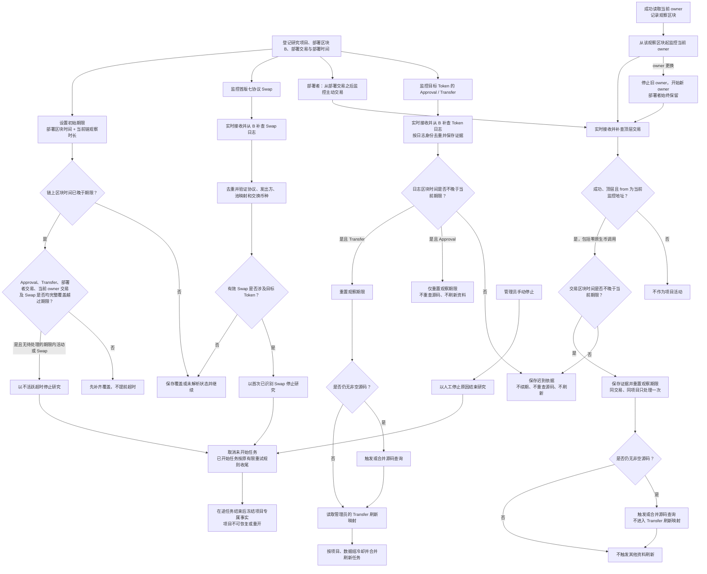

# Token 项目事件监控、活动续期、资料刷新与研究停止

> 需求状态：讨论中
>
> 细分状态：共享监控、实时订阅与断线补查、三类活动触发矩阵、观察期限、刷新配置、三类停止原因和在途任务规则已经明确，尚未实现。首版仅 Ethereum Mainnet。

## 目的与监控范围

每条链使用一套共享事件监控能力，动态覆盖本链所有研究中项目，不为每个项目分别建立独立订阅。首版只运行 ETH；未来接入 BSC 时复用同一套业务代码和构建产物，按 BSC 配置启动独立实例。具体进程与组件边界在技术设计中确定。

“统一事件监控器”表示同一条链的实时接收、断线补查、持久覆盖进度、去重和项目匹配由同一套链级能力负责。它既覆盖合约日志，也覆盖部署者和当前 owner 发起的顶层交易；不同活动的业务动作必须按下表隔离。

| 监控对象 | 动态目标 | 有效事实 | 已确认业务动作 |
| --- | --- | --- | --- |
| 目标 Token `Approval` | 本链所有研究中项目的 Token 合约 | 合法 `Approval` 日志 | 保存活动证据；期限内续期。不得重查源码，不触发任何资料刷新 |
| 目标 Token `Transfer` | 本链所有研究中项目的 Token 合约 | 合法 `Transfer` 日志 | 保存活动证据；期限内续期；仍无非空源码时触发或合并源码查询；按管理员配置刷新资料 |
| 部署者／当前 owner 主动交易 | 各项目当前监控地址 | 成功顶层交易，且交易 `from` 等于监控地址 | 保存活动证据；期限内续期；仍无非空源码时触发或合并源码查询。不触发其他资料刷新 |
| 首次已识别 Swap | 本链所有研究中项目 | 首版七个可信协议的 Pair、Pool 或 PoolManager 日志 | 验证协议身份和实际交换币种；涉及目标 Token 时立即停止研究 |
| 池创建或初始化 | Swap 匹配所需协议映射 | 可信 Factory 或 PoolManager 日志 | 建立池、`poolId` 与币种映射；本身不停止研究 |

首版七个协议为 Uniswap V2、Uniswap V3、Uniswap V4、Sushi V2、Sushi V3、PancakeSwap V2、PancakeSwap V3 的 Ethereum 部署。添加流动性不是停止事件。协议事件和覆盖语义见 [Swap 事件调研](token-swap-events-research.md)。

## 统一流程

## 三类活动与观察期限

默认观察时长为 72 小时，由管理员按链配置。项目的初始期限是部署区块时间加当时配置的观察时长。管理员修改配置后，只影响新项目及之后发生的续期活动，不批量重写现有项目已经保存的期限。

目标 Token 发出的任一合法 ERC-20 `Approval` 或 `Transfer` 都表示项目仍有活动，包括零值授权或转账、撤销授权、mint、burn 和自转账。两类日志都能续期，但后续动作不同：`Approval` 到此结束；`Transfer` 才继续判断源码补查和管理员刷新配置。

部署者或当前 owner 的活动必须同时满足：交易成功、属于顶层交易、交易 `from` 精确等于当时的监控地址。转给监控地址的入账交易、失败交易和内部调用均不续期；交易的原生币金额可以为零，因此监控地址发出的零 ETH 合约调用仍可续期。这里不使用资金来源图的原生币金额门槛。

活动是否有续期资格统一按链上时间判断：日志或交易所在区块的时间早于或等于处理前的当前期限时，把期限重置为“该区块时间 + 处理该活动时的当前链配置时长”，续期次数不设上限；晚于当前期限时只保留迟到依据，不续期、不触发源码查询或资料刷新。覆盖滞后不改变资格，项目一旦停止也不会被迟到活动恢复。

### 部署者与当前 owner 的监控生命周期

- 部署者从项目部署交易之后开始监控，部署交易自身不重复作为研究期活动；只要项目仍在研究，部署者始终保留在监控目标中。
- 当前 owner 只有在 Go 成功读到地址后才加入监控，从该次读取所使用的观察区块开始覆盖。尚未取得 owner 时，不猜测地址，也不影响部署者及其他活动的覆盖。
- owner 刷新读到新地址后，停止把旧 owner 的后续交易当作 owner 活动，并从新 owner 的观察区块开始监控。旧地址若同时是部署者，则仍以部署者身份保留。
- 部署者和当前 owner 地址重合，或同一地址具有多个监控角色时，同一项目中的同一笔交易只保存和执行一次活动动作，同时保留全部命中角色。该交易若同时命中多个研究中项目，仍分别作用于每个项目。

## 超时与覆盖门槛

超时判断不能只看服务器时钟。只有同时满足以下条件才停止：

1. 已出现链上区块时间严格晚于当前期限；
2. 目标 Token 的 `Approval` 和 `Transfer` 均已连续覆盖完整越过该期限；
3. 部署者及在各自有效监控区间内的当前 owner 顶层交易均已连续覆盖完整越过该期限；
4. 首版七协议 Swap 的覆盖和必要映射解析已完整越过该期限；
5. 在期限内没有尚未处理的有效活动或首次已识别 Swap。

覆盖落后、查询失败或映射待解析时继续补齐，不能先标记超时。期限、续期依据和停止时间均使用链上区块时间；服务器收到时间只可作为运行观测信息。

第一版不要求为业务展示保存研究期的全部活动明细。`Approval`、`Transfer` 和监控地址主动交易分别保存首次证据、最近证据及累计去重数量，并保存当前观察期限。日志证据至少能追溯链、区块、交易哈希、交易序号、`logIndex`、发出合约、事件主题和区块时间；主动交易证据至少能追溯链、区块、交易哈希、交易序号、`from`、命中地址与角色、成功状态和区块时间。原始数据持久化的技术边界后续设计。

## Transfer 触发资料刷新

只有具有续期资格的目标 Token `Transfer` 可以触发管理员配置的资料刷新。`Approval` 和部署者／当前 owner 主动交易均没有资料刷新映射；配置不能为它们开启刷新。配置变更只影响之后处理的 `Transfer`，不主动回放历史活动，也不改写现有期限。

管理员可按链为 `Transfer` 选择以下刷新组：

| 刷新组 | 刷新内容 |
| --- | --- |
| Token 当前状态 | `code.length` 与六项 Token 探测值；只更新事实，不重新分类原始 Token 身份 |
| owner | 按共享源码读取方案读取当前 owner，并同步当前 owner 的活动监控目标 |
| 税费接收地址 | 按共享源码分析／读取方案取得当前地址 |
| 税率 | 按共享方案在同一最新区块读取本次税率配置 |
| L1 钱包资产 | 固定读取原生 ETH、WETH、USDT、USDC、DAI、WBTC，并逐项计算 USDT value；不扩展到 L2–L5 |
| Ave 持币资料 | 持币地址总数及 Top 100 |

默认由 `Transfer` 刷新 Token 当前状态和 Ave 持币资料。源码补查不是可配置刷新组：符合期限的 `Transfer` 及部署者／当前 owner 主动交易在项目仍无非空源码时始终具备触发资格；`Approval` 永远不触发源码补查。

每个项目、每个数据组分别计算冷却，默认 10 分钟，管理员可按链配置。冷却期或同组任务执行期间的重复 `Transfer` 合并，最多形成一次待执行刷新；不能无限堆积相同任务。观察期限续期逐个按去重活动计算，不因刷新合并而丢失最近活动时间。源码查询也与同项目正在执行或冷却中的同类请求合并。

项目专属动态资料通常展示最近一次成功事实。刷新失败时保留上一次成功值，并另外保存最近失败时间与原因，不能用失败或空响应覆盖有效值。L1 资产每次估值快照单独保留：部分成功仍展示本次已知小计、不完整状态及缺失资产，不能用旧余额或价格补入本次观察区块的结果，也不能用旧完整总值掩盖本次缺项。源码已有非空内容时不因活动反复下载，也不自动重复 AI 分析。

owner 刷新成功后替换当前 owner，并按前述生命周期切换交易监控目标；税费接收地址刷新成功后按税费用途替换当前地址集合。新出现的当前地址自动成为 L1，并执行该地址的固定 `0..B-1` 历史、六项资产余额与估值以及 L2–L5 研究。被移出的旧地址失去相应当前角色；如果它还具有部署者、初始接收方或其他税费用途等角色，仍保留节点、其他标签及已有事实。普通活动不重抓所有既有钱包的固定历史窗口，也不整体重建资金来源图。

## 三类研究停止与任务收尾

业务上区分“研究中”与三种带原因的停止结果：首次已识别 Swap 停止、不活跃超时停止、管理员手动停止。这里定义可观察语义，不提前固定数据库或 API 枚举名称。原始 Token 识别记录始终保留，研究状态变化不能覆盖它。

| 停止原因 | 触发方 | 保存依据 |
| --- | --- | --- |
| 首次已识别 Swap | 共享事件监控器 | 协议覆盖版本、交易与日志位置、可信部署和币种映射依据 |
| 不活跃超时 | 共享事件监控器 | 当前期限、各类最后活动摘要，以及五类覆盖均已完整越过期限的证据 |
| 管理员手动停止 | 管理员 | 操作者、操作时间和人工停止原因 |

普通的三类停止只保存状态与证据，不向管理员发送通知。技术请求、持久化或覆盖失败仍按各自错误流程通知。只有管理员可手动停止；没有恢复、重开或普通成员停止入口。

任何停止原因发生后：

- 排队但未开始的研究与刷新任务直接取消；
- 已经开始的任务继续原有有限重试策略，直至成功或重试耗尽，并保存最终结果或失败；
- 停止后不允许再启动新的下游任务，即使在途任务发现了新地址或新依赖；
- 在途任务全部收尾后，项目专属的链上状态、地址、税率、余额与估值、持币和钱包事实冻结，不提供手动补充或刷新；
- 迟到的活动、Swap 或刷新结果不得恢复项目，也不得改变原始 Token 识别结论。

按 `code_hash` 共享的静态产物不属于项目专属冻结范围。共享质检报告、源码公开链接，以及 owner、税费接收地址和税率的静态分析／读取方案始终展示最新有效版本；它们因管理员重检或其他研究中项目而更新时，已停止项目也能看到新版，但不会据此启动该项目的新链上采集。

## 连续性与覆盖规则

1. 实时接收用于降低延迟，历史补查用于覆盖启动、断线、重启、项目登记时差和动态目标调整；两条路径业务语义一致。
2. 新日志目标先开始实时接收，再固定补查终点 `H`，从部署区块 `B` 补查至 `H`，两端包含。交易目标按各自起点补查：部署者从部署交易之后，当前 owner 从成功读取它的观察区块起，做到有效监控区间内无空档覆盖。重叠数据按其链上唯一身份去重。
3. 动态目标变化不得形成未覆盖空档。地址分片、订阅重建、请求并发、限流和背压在技术设计中确定。
4. 只有完整取得并可靠保存一个区间后才推进对应连续覆盖进度；无匹配数据的区块也可形成覆盖，查询失败或截断不得记为成功。
5. 日志顺序按 `blockNumber`、`transactionIndex`、`logIndex` 确定；顶层交易按 `blockNumber`、`transactionIndex` 确定，均不按服务器到达顺序确定。
6. 项目登记前到达但尚未关联的数据不能永久丢弃；可先保存后关联，也可通过登记后的历史补查取得，具体持久化边界后续设计。
7. 识别到 Swap 可以立即停止研究；若更早范围尚未覆盖，继续补齐并更新“首次已识别 Swap”证据，不恢复项目。
8. 内存接收缓冲不是覆盖进度。进程退出可丢弃内存内容，但必须依靠持久进度和链上数据恢复。

Geth 订阅只推送当前事件，连接关闭后订阅随连接消失，因此实时订阅不能单独作为完整性依据；`eth_getLogs` 区块范围包含两端。依据见 [Geth 日志订阅](https://geth.ethereum.org/docs/interacting-with-geth/rpc/pubsub) 和 [Ethereum execution APIs](https://raw.githubusercontent.com/ethereum/execution-apis/main/src/eth/filter.yaml)。

## 与区块扫描的边界

区块扫描只负责区块获取、顶层部署候选发现、Token 识别，以及可靠保存项目与初始研究任务。项目保存后，链级事件监控能力独立接管三类活动、Swap、观察期限和刷新触发；其积压或短暂故障不回退已经完成的项目发现区块，但必须通过自身持久覆盖进度补回日志和顶层交易。

当前不考虑区块替换或链重组后的状态回滚。具体业务时效目标仍待明确；组件、数据结构、配置入口和调度细节在需求确认后的技术设计中确定。

返回 [Token 目标设计](token.md) 或 [流程图索引](README.md)。
