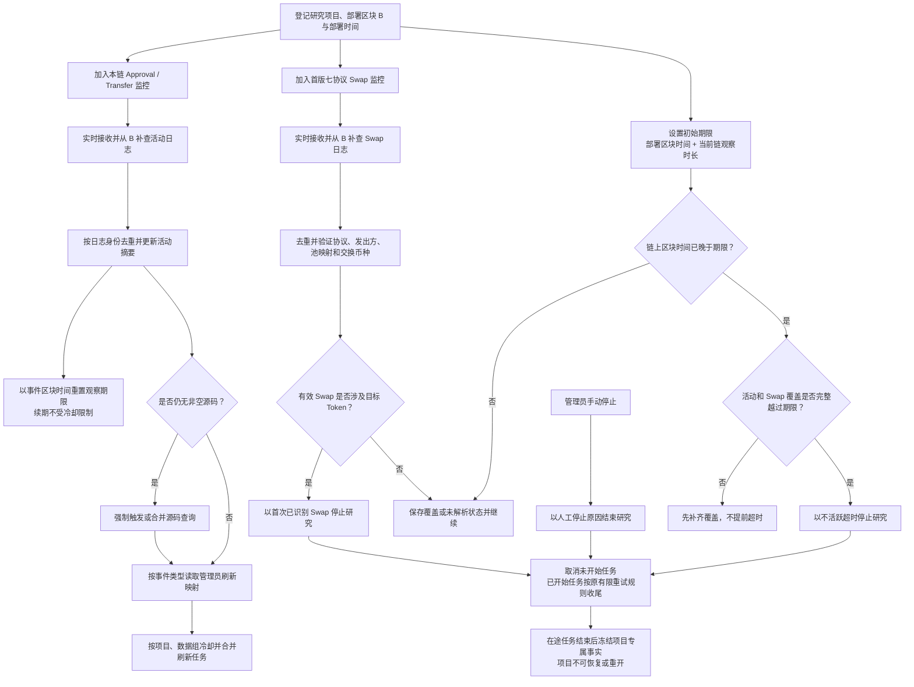

# Token 项目事件监控、活动续期、资料刷新与研究停止

> 需求状态：讨论中
>
> 细分状态：共享监控、实时订阅与断线补查、活动续期、刷新配置、三类停止原因和在途任务规则已经明确，尚未实现。首版仅 Ethereum Mainnet。

## 目的与监控范围

每条链使用一套共享事件监控能力，动态覆盖本链所有研究中项目，不为每个项目分别建立独立订阅。首版只运行 ETH；未来接入 BSC 时复用同一套业务代码和构建产物，按 BSC 配置启动独立实例。具体进程与组件边界在技术设计中确定。

“统一事件监控器”表示同一条链的实时日志接收、断线补查、持久覆盖进度、日志去重和项目匹配由同一套链级能力负责；它同时处理下表事件，但不同事件的业务动作仍然隔离。

| 事件 | 动态目标 | 日志发出方 | 已确认业务动作 |
| --- | --- | --- | --- |
| `Approval` / `Transfer` | 本链所有研究中项目 | 目标 Token 合约 | 保存活动摘要；重置观察期限；按管理员配置刷新资料；无非空源码时强制触发源码查询 |
| 首次已识别 Swap | 本链所有研究中项目 | 首版七个可信协议的 Pair、Pool 或 PoolManager | 验证协议身份和实际交换币种；涉及目标 Token 时立即停止研究 |
| 池创建或初始化 | Swap 匹配所需协议映射 | 可信 Factory 或 PoolManager | 建立池、`poolId` 与币种映射；本身不停止研究 |

首版七个协议为 Uniswap V2、Uniswap V3、Uniswap V4、Sushi V2、Sushi V3、PancakeSwap V2、PancakeSwap V3 的 Ethereum 部署。添加流动性不是停止事件。协议事件和覆盖语义见 [Swap 事件调研](token-swap-events-research.md)。

## 统一流程

## 活动与观察期限

默认观察时长为 72 小时，由管理员按链配置。项目的初始期限是部署区块时间加当时配置的观察时长。管理员修改配置后，只影响新项目及之后发生的续期事件，不批量重写现有项目已经保存的期限。

目标 Token 发出的任一合法 ERC-20 `Approval` 或 `Transfer` 都表示项目仍有活动，包括：

- 数量为零的授权或转账；
- 将授权额度设为零的撤销授权；
- 从零地址发出的 mint、发往零地址的 burn；
- 发送方与接收方相同的自转账。

活动以事件所在区块的时间把期限重置为“事件区块时间 + 处理该事件时的当前链配置时长”，续期次数不设上限。恰好发生在当前期限时点的事件仍有效。相同日志只处理一次，不得重复续期；已经因任何原因停止后，期限之后才发现的活动不能重开项目。

超时判断不能只看服务器时钟。只有同时满足以下条件才停止：

1. 已出现链上区块时间严格晚于当前期限；
2. 目标 Token 的 `Approval` / `Transfer` 连续覆盖完整越过该期限；
3. 首版七协议 Swap 的覆盖和必要映射解析也完整越过该期限；
4. 在期限内没有尚未处理的有效活动或首次已识别 Swap。

覆盖落后、日志查询失败、映射待解析时继续补齐，不能先标记超时。期限、续期依据和停止时间均使用链上区块时间；服务器收到时间只可作为运行观测信息。

第一版不保存项目研究期的全部活动日志供业务展示。每种事件类型分别保存首次证据、最近证据、累计去重数量，并保存当前观察期限。证据至少能够追溯链、区块、交易哈希、交易序号、`logIndex`、发出合约、事件主题及区块时间；原始日志持久化的技术边界后续设计。

## 活动触发资料刷新

管理员按链分别配置 `Approval` 和 `Transfer` 的刷新映射。配置变更仅影响之后处理的事件，不主动回放历史活动，也不改写现有期限。以下两个动作不能关闭：

1. 每个有效活动都重置观察期限，且不受刷新冷却限制；
2. 项目仍无非空源码时，每个活动都具备触发源码重新查询的资格，并与正在执行或冷却中的同类请求合并。

管理员可为两类事件分别启用六个刷新组：

| 刷新组 | 刷新内容 |
| --- | --- |
| Token 当前状态 | `code.length` 与六项 Token 探测值；只更新事实，不重新分类原始 Token 身份 |
| owner | 按共享源码读取方案读取当前 owner |
| 税费接收地址 | 按共享源码分析／读取方案取得当前地址 |
| 税率 | 按共享方案在同一最新区块读取本次税率配置 |
| L1 钱包资产 | 固定读取 WETH、USDT、USDC、DAI、WBTC；不读取原生 ETH，不扩展到 L2–L5 |
| Ave 持币资料 | 持币地址总数及 Top 100 |

默认配置：

| 事件 | 始终执行 | 默认额外刷新 |
| --- | --- | --- |
| `Approval` | 续期；缺少非空源码时重查源码 | 无 |
| `Transfer` | 续期；缺少非空源码时重查源码 | Token 当前状态、Ave 持币资料 |

每个项目、每个数据组分别计算冷却，默认 10 分钟，管理员可按链配置。冷却期或同组任务执行期间的重复触发合并，最多形成一次待执行刷新；不能无限堆积相同任务。观察期限续期始终逐个按去重事件计算，不因刷新合并而丢失最近活动时间。

项目专属动态资料只展示最近一次成功事实。刷新失败时保留上一次成功值，并另外保存最近失败时间与原因，不能用失败或空响应覆盖有效值。源码已有非空内容时不因活动反复下载，也不自动重复 AI 分析。

owner 或税费接收地址刷新发现新当前地址时，新地址替换对应角色的当前值，并自动执行该新 L1 地址的固定 `0..B-1` 历史、五项资产余额和 L2–L5 研究。旧地址失去该“当前 owner”或“当前税费接收方”角色；如果它还具有部署者、初始接收方、其他税费用途等角色，仍保留节点、其他标签及已有事实。普通活动不重抓所有既有钱包的固定历史窗口，也不整体重建资金来源图。

## 三类研究停止与任务收尾

研究只有以下三种停止原因：

| 停止原因 | 触发方 | 保存依据 |
| --- | --- | --- |
| 首次已识别 Swap | 共享事件监控器 | 协议覆盖版本、交易与日志位置、可信部署和币种映射依据 |
| 不活跃超时 | 共享事件监控器 | 当前期限、最后活动摘要、活动与 Swap 覆盖已完整越过期限的证据 |
| 管理员手动停止 | 管理员 | 操作者、操作时间和人工停止原因 |

普通的三类停止只保存状态与证据，不向管理员发送通知。技术请求、持久化或覆盖失败仍按各自错误流程通知。只有管理员可手动停止；没有恢复、重开或普通成员停止入口。

任何停止原因发生后：

- 排队但未开始的研究与刷新任务直接取消；
- 已经开始的任务继续原有有限重试策略，直至成功或重试耗尽，并保存最终结果或失败；
- 停止后不允许再启动新的下游任务，即使在途任务发现了新地址或新依赖；
- 在途任务全部收尾后，项目专属的链上状态、地址、税率、余额、持币和钱包事实冻结，不提供手动补充或刷新；
- 迟到的活动、Swap 或刷新结果不得恢复项目，也不得改变原始 Token 识别结论。

按 `code_hash` 共享的静态产物不属于项目专属冻结范围。共享质检报告、源码公开链接，以及 owner、税费接收地址和税率的静态分析／读取方案始终展示最新有效版本；它们因管理员重检或其他研究中项目而更新时，已停止项目也能看到新版，但不会据此启动该项目的新链上采集。

## 连续性与覆盖规则

1. 实时订阅用于降低延迟，历史日志补查用于覆盖启动、断线、重启、项目登记时差和动态目标调整；两条路径业务语义一致。
2. 新目标先开始实时接收，再固定补查终点 `H`，补查 `B..H`，两端包含。重叠范围至少按 `chain_id`、交易哈希和 `logIndex` 去重。
3. 动态目标变化不得形成未覆盖空档。地址分片、订阅重建、请求并发、限流和背压在技术设计中确定。
4. 只有完整取得并可靠保存一个区间后才推进连续覆盖进度；无匹配日志的区块也可形成覆盖，查询失败或截断不得记为成功。
5. 事件顺序按 `blockNumber`、`transactionIndex`、`logIndex` 确定，不按实时订阅、补查或服务器的到达顺序确定。
6. 项目登记前到达但尚未关联的日志不能永久丢弃；可以先保存后关联，也可以通过项目登记后的 `B..H` 补查取得，具体持久化边界后续设计。
7. 识别到 Swap 可以立即停止研究；若更早范围尚未覆盖，继续补齐并更新“首次已识别 Swap”证据，不恢复项目。
8. 内存接收缓冲不是覆盖进度。进程退出可丢弃内存内容，但必须依靠持久进度和链上日志恢复。

Geth 订阅只推送当前事件，连接关闭后订阅随连接消失，因此实时订阅不能单独作为完整性依据；`eth_getLogs` 区块范围包含两端。依据见 [Geth 日志订阅](https://geth.ethereum.org/docs/interacting-with-geth/rpc/pubsub) 和 [Ethereum execution APIs](https://raw.githubusercontent.com/ethereum/execution-apis/main/src/eth/filter.yaml)。

## 与区块扫描的边界

区块扫描只负责区块获取、顶层部署候选发现、Token 识别，以及可靠保存项目与初始研究任务。项目保存后，链级事件监控器独立接管活动、Swap、观察期限和刷新触发；其积压或短暂故障不回退已经完成的项目发现区块，但必须通过自身持久覆盖进度补回日志。

当前不考虑区块替换或链重组后的状态回滚。具体业务时效目标仍待明确；组件、数据结构、配置入口和调度细节在需求确认后的技术设计中确定。

返回 [Token 目标设计](token.md) 或 [流程图索引](README.md)。
