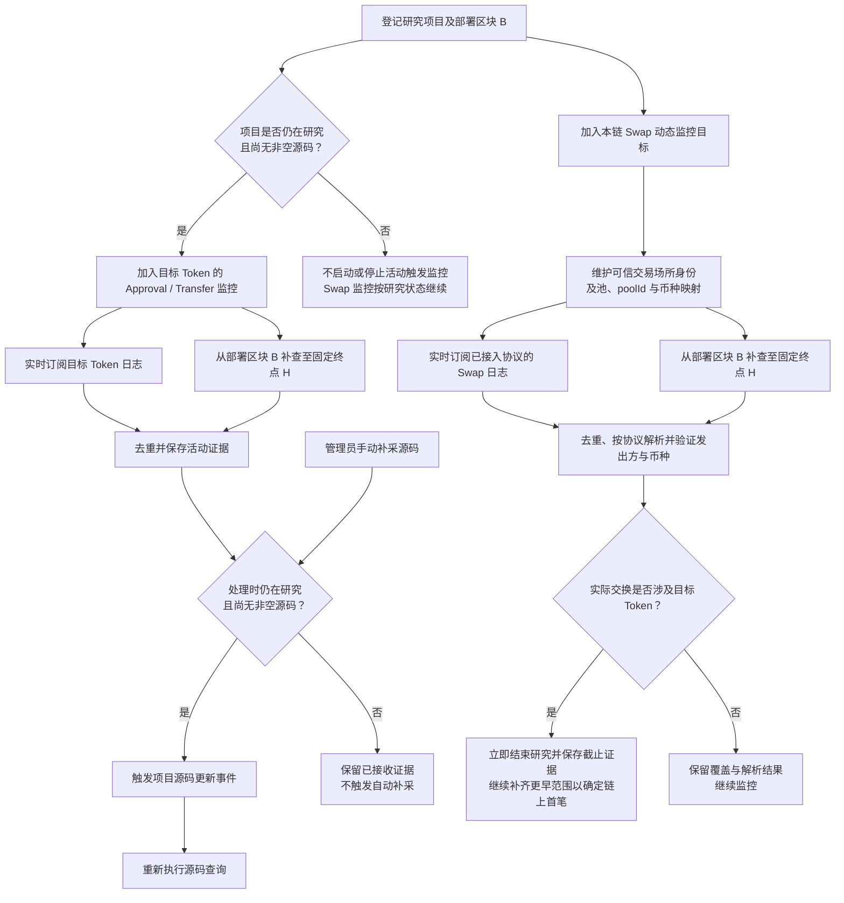

# Token 项目事件监控、源码更新与研究截止

> 需求状态：讨论中
>
> 细分状态：按链共享监控、实时订阅与历史补查、动态目标范围已经确认，尚未实现。首版仅 Ethereum Mainnet。活动触发的源码补采与 Swap 触发的研究截止分别处理，不使用定时轮询补采。

## 已确认的监控范围

每条链使用一套共享的项目事件监控能力，动态维护本链需要关注的研究项目，不为每个项目分别建立一套独立监控。具体进程数量、组件边界和通信方式后续技术设计；首版只运行 ETH 实例，未来 BSC 使用同一套代码启动独立实例。

监控同时包含两类目标，但过滤来源和业务动作不同：

| 事件类型 | 监控目标 | 日志发出方 | 业务动作 |
| --- | --- | --- | --- |
| `Approval` / `Transfer` | 仍在研究且尚无非空源码的项目 | 目标 Token 合约 | 保存活动证据并触发源码更新；不表示已经成交或开放交易 |
| 实际 Swap | 所有仍在研究的项目 | 经验证的 Pair、Pool、Vault、PoolManager 或其他已接入协议合约 | 按协议解析并匹配实际交换币种；涉及目标 Token 时停止研究 |
| 池创建或初始化 | 为 Swap 匹配维护的协议身份与币种映射 | 可信 Factory、Registry 或 PoolManager | 建立或补齐映射，本身不作为研究截止事件 |

项目取得非空源码后，不再需要以该项目的 `Approval` / `Transfer` 触发自动源码补采，但 Swap 监控继续到研究结束。项目因首次 Swap 或其他已确认规则结束研究后，退出两类动态监控目标；迟到事件不重新启动研究。这里不要求保存项目研究期内全部 `Approval` / `Transfer` 历史，第一版只保存已经接收并用于活动触发的证据。

## 统一接收与业务流程

`Approval`、`Transfer` 由目标 Token 地址发出，可以按研究目标地址和事件主题过滤。Swap 通常由池、Vault 或 PoolManager 发出，不能只订阅 Token 地址或只凭同名事件判断成交；必须验证链、真实协议部署、事件布局及池或 `poolId` 对应币种，详见 [Swap 事件调研](token-swap-events-research.md)。

## 已确认的连续性规则

1. 实时订阅用于降低发现延迟，历史日志补查用于保证启动、断线、重启、动态目标变化及项目登记时差期间不漏事件；两条路径处理相同的业务语义。
2. 新项目或新的监控目标先开始接收实时日志，再固定补查终点 `H`，补查 `B..H`，两端均包含。实时与补查范围允许重叠，重复日志不得形成重复活动、重复补采或重复研究截止。
3. 动态监控目标发生变化时不得产生未覆盖空档。具体地址分片数量、订阅重建方式、请求并发、限流和背压由技术设计确定，不能以每项目一套独立订阅作为扩展方式。
4. 断线、重启或接收速度不足时，从已可靠保存的连续覆盖进度继续补查。只有完整取得并保存一个区间后才推进该区间覆盖进度；没有匹配日志的区块也可以形成已覆盖区间，查询失败或截断不能记为成功覆盖。
5. 日志至少按 `chain_id`、交易哈希和 `logIndex` 去重，并保留区块号、交易顺序、日志位置、发出合约和实际主题。首笔事件按 `blockNumber`、`transactionIndex`、`logIndex` 的链上顺序确定，不按订阅或补查的到达顺序确定。
6. 项目登记前到达但尚未关联的日志不能仅因当时查不到项目而丢弃；可以先保留再关联，或者在项目登记时通过 `B..H` 补查取得，具体持久化边界后续设计。
7. 发现可信 Swap 后立即停止继续研究；要把截止证据标记为链上最早 Swap，仍需完成从 `B` 到该事件位置之前尚未覆盖范围的补查。若随后找到更早 Swap，更新最早证据，但不改变研究已经停止的事实。
8. 实时接收中的内存缓冲不构成覆盖进度或业务完成依据。进程退出后允许丢弃内存内容，但必须能够依据持久进度与链上日志补回。

Geth 订阅只推送当前事件，连接关闭后订阅随连接消失，因此实时订阅不能单独作为完整性依据；补查使用的 `eth_getLogs` 区块范围包含两端。依据见 [Geth 日志订阅](https://geth.ethereum.org/docs/interacting-with-geth/rpc/pubsub) 和 [Ethereum execution APIs](https://raw.githubusercontent.com/ethereum/execution-apis/main/src/eth/filter.yaml)。

## 源码更新与研究截止

首次源码查询成功但返回空内容，只表示本次未取得源码、合约可能尚未公开源码。管理员可以手动补采；项目仍在研究且尚无非空源码时，目标 Token 新的 `Approval` 或 `Transfer` 日志触发项目更新事件，再尝试获取源码。已有非空源码按 `code_hash` 复用，不因每笔活动重新下载或重复调用 AI。请求失败保留技术错误、按 [源码获取流程](token-contract-source-flow.md) 重试并通知管理员，不改记成未开源。

活动证据到达时必须重新检查项目是否仍在研究且仍无非空源码，避免目标集合更新延迟导致已结束项目或已有源码项目重新触发自动补采。同一项目多个活动与正在执行的源码请求如何合并、调度和保存结果，仍待技术设计；补采不采用定时无限轮询。

识别到实际涉及项目 Token 的可信 Swap 后，立即结束研究，停止后续自动补采；尚未交接的项目放弃本轮参与。Swap 截止不表示资料齐全、高风险或可以买入。管理员对共享报告的人工重检属于另一类维护动作，不自动恢复已结束项目；已结束项目是否允许独立手动补充源码资料另行设计。

## 与区块扫描的边界

区块扫描只负责区块获取、顶层部署候选发现、Token 识别，以及可靠保存项目与研究任务；它不再负责研究期 `Approval` / `Transfer` 或 Swap 日志监控。项目和研究任务保存后，按链共享的事件监控独立接管动态目标；它的积压或短暂故障不回退已经成功完成的项目发现区块，但必须通过自己的覆盖进度和补查恢复。

当前不考虑区块替换或链重组后的研究恢复。订阅断线补查属于日志防漏，不属于重组回滚设计。

返回 [Token 目标设计](token.md) 或 [流程图索引](README.md)。
