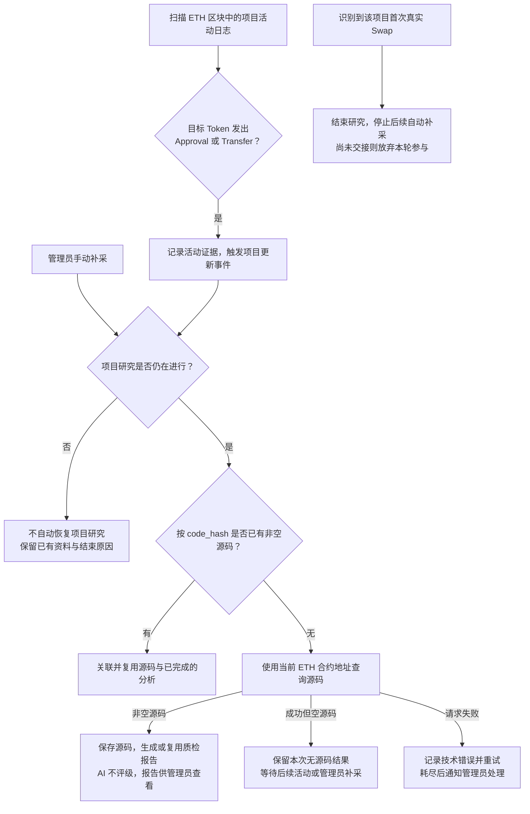

# Token 项目活动与源码更新

> 需求状态：讨论中
>
> 细分状态：目标设计，尚未实现。首版仅 Ethereum Mainnet。活动触发的源码补采与 Swap 触发的研究截止分别处理，不使用定时轮询补采。

## 已确认规则

首次源码查询成功但返回空内容，只表示本次未取得源码、合约可能尚未公开源码。管理员可以手动补采；仍未取得时，通过扫描区块监控研究中的项目。目标 Token 合约发出新的 `Approval` 或 `Transfer` 日志时，触发项目更新事件，再尝试获取源码。

已有非空源码时按 `code_hash` 复用，不因每笔活动重新下载或重复调用 AI。请求失败保留技术错误、按源码流程重试并通知管理员，不改记成未开源。具体请求与结果见 [源码获取流程](token-contract-source-flow.md)。

`Approval`、`Transfer` 只作为活动更新信号，不证明已发生买卖或已开放交易。它们由目标 Token 地址发出；Swap 则通常由池、Vault 或 PoolManager 发出，需要独立解析并匹配涉及的代币，见 [Swap 事件调研](token-swap-events-research.md)。

活动记录至少保留链、Token、事件类型、交易哈希、区块与日志位置。相同日志重复收到时不当作新活动；同一项目多个活动与正在进行的源码请求如何合并、调度和保存进度，待实现设计。原生币转账或其他合约发出的相似事件不在此次已确认的活动触发范围。

研究截止后，迟到活动不能重新启动研究。管理员对共享报告的人工重检属于另一类维护动作，不自动恢复已结束项目；已结束项目是否允许独立手动补充源码资料的维护入口另行设计。

## 扫描衔接

用户已选择扫描方案 A：完成该块 Token 识别，可靠保存识别结果、项目资料与研究任务后推进扫描；源码、AI 和多层钱包异步执行。活动检测通过区块扫描实现；Swap 截止采用日志订阅，并需设计启动和断线期间补查。活动日志与更新任务的具体持久化边界继续细化，当前不考虑区块替换或链重组恢复。

返回 [Token 目标设计](token.md) 或 [流程图索引](README.md)。
