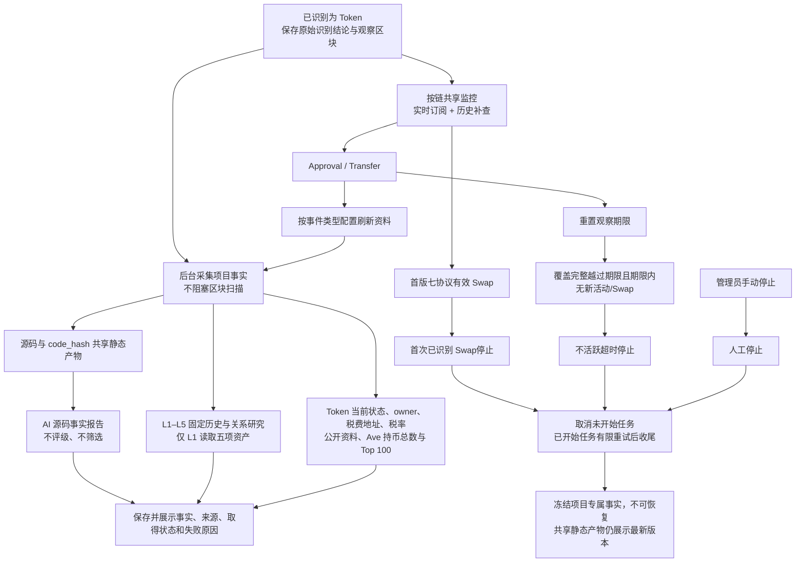

# Token 项目事实研究流程

> 需求状态：讨论中
>
> 细分状态：第一板块目标设计，尚未实现。首版仅 ETH；资料只作为事实展示，研究由首次已识别 Swap、不活跃超时或管理员手动操作停止。

## 业务流程

输入是已经识别为 Token 的项目。识别结果、项目资料和初始研究任务可靠保存后，区块扫描继续推进；研究任务后台独立执行。链扫描、事件监控和外部采集按 [单链实例运行设计](token-chain-runtime.md)运行，同一链所有研究项目共用事件监控能力。

资料分支只表示依赖，不规定内部任务顺序。当前输出始终是事实，不因资料缺失、失败、报告内容、钱包行为、税率或持仓形成评级、通过／不通过或项目排除。第二板块的筛选、移交与交易不在本流程。

## 已确认资料范围

| 资料 | 已确定范围 |
| --- | --- |
| Token 识别与当前状态 | 识别使用执行时最新状态并保存实际观察区块；业务检测不通过是最终拒绝。活动配置可刷新 `code.length` 与六项探测值，但不能改写最初身份。 |
| 源码 | 只复用非空源码；成功空内容与技术失败分开。研究中无非空源码时，每个活动都可触发或合并重查；不定时轮询。 |
| AI 与共享静态资料 | 质检报告、源码公开链接、owner/税费地址/税率的静态分析和读取方案按 `code_hash` 共享并始终展示最新有效版本。AI 不评级。 |
| owner、税费接收地址与税率 | 研究中按最新区块读取项目专属当前值；可由管理员活动刷新映射触发。新当前 owner 或税费地址成为 L1 并自动完成该地址初始研究。 |
| L1 钱包资产 | 只读 WETH、USDT、USDC、DAI、WBTC，不读取原生 ETH；L2–L5 不采集余额。 |
| L1–L5 钱包历史 | 后台自动研究。每钱包固定查询部署前 `0..B-1`、desc、第一页最多 300 笔，L5 不扩展 L6；普通活动不整体刷新固定历史或关系图。 |
| 钱包买卖事实 | 首版只对 Uniswap V2/V3/V4、Sushi V2/V3、PancakeSwap V2/V3 形成明确买卖；聚合器落到支持池可由底层证据识别，RFQ 和未支持路径保留为未分类。 |
| Ave 持币资料 | 当前持币地址总数及 Top 100；默认由 `Transfer` 活动刷新，只保留最近成功事实，失败另存。普通持有人不自动纳入 L1–L5。 |
| `simulation_result` | 第一版完全移除，不创建、不采集、不展示，也不作为可选任务。 |

## 观察、刷新与停止

- 初始观察期限为部署区块时间加按链配置时长，默认 72 小时；配置调整只影响新项目和后续续期事件。
- 所有研究中项目持续接收合法 `Approval` / `Transfer`。零值、撤销授权、mint、burn、自转都续期，使用事件区块时间，次数不限。
- `Approval` 和 `Transfer` 分别配置资料刷新组。续期和缺少非空源码时重查源码不可关闭；默认 `Approval` 无其他刷新，默认 `Transfer` 刷新 Token 当前状态和 Ave 持币资料。
- 每项目每数据组默认 10 分钟冷却，重复触发合并；期限续期不节流。动态事实只显示最近成功值，最近失败单独记录。
- 首版七协议中任一涉及目标 Token 的有效 Swap，包括 flash swap，立即停止研究；添加流动性不停止。“首次”只指当前覆盖版本内最早的已识别事件。
- 超时必须等待链上区块时间和活动、Swap 覆盖都完整越过期限后才能确认；覆盖落后不能提前停止。迟到事件不得恢复项目。
- 管理员可手动停止，普通成员不能。三类正常停止只记录原因与证据，不通知管理员；项目均不可恢复。
- 停止时取消未开始任务，允许已开始任务按原有限重试规则完成；停止后禁止新下游任务。在途任务收尾后，项目专属事实冻结。

完整规则见 [项目事件监控、活动续期、资料刷新与研究停止](token-project-activity-flow.md)。Token `READ` 或 `READ_WRITE` 成员可以查看事实；刷新策略、观察时长和手动停止仅管理员管理。

返回 [Token 目标设计](token.md) 或 [资料整理总图](token-research-materials-flow.md)。
