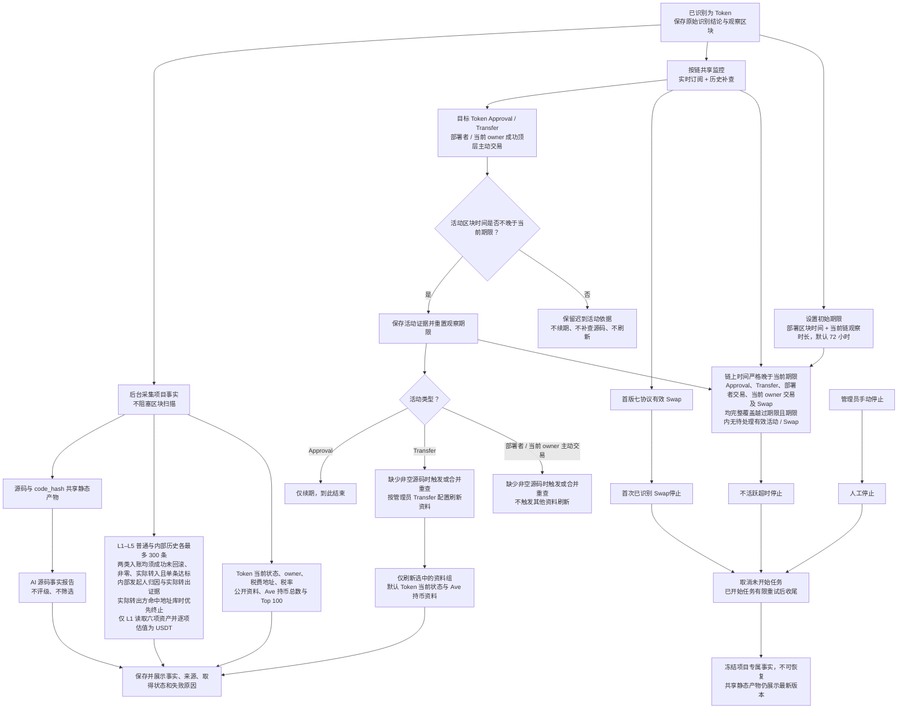

# Token 项目事实研究流程

> 需求状态：讨论中
>
> 细分状态：第一板块目标设计，尚未实现。首版仅 ETH；资料只作为事实展示，研究由首次已识别 Swap、不活跃超时或管理员手动操作停止。

## 业务流程

输入是已经识别为 Token 的项目。识别结果、项目资料和初始研究任务可靠保存后，区块扫描继续推进；研究任务后台独立执行。链扫描、事件监控和外部采集按 [单链实例运行设计](token-chain-runtime.md)运行，同一链所有研究项目共用事件监控能力。

资料分支只表示依赖，不规定内部任务顺序。当前输出始终是事实，不因资料缺失、失败、报告内容、钱包行为、税率或持仓形成评级、通过／不通过或项目排除。第二板块的筛选、移交与交易不在本流程。

## 已确认资料范围

| 资料 | 已确定范围 |
| --- | --- |
| Token 识别与当前状态 | 识别使用执行时最新状态并保存实际观察区块；业务检测不通过是最终拒绝。管理员的 `Transfer` 刷新配置可刷新 `code.length` 与六项探测值，但不能改写最初身份。 |
| 源码 | 只复用非空源码；成功空内容与技术失败分开。研究中无非空源码时，具有续期资格的目标 Token `Transfer` 或部署者／当前 owner 主动交易可触发或合并重查；`Approval` 不重查，不定时轮询。 |
| AI 与共享静态资料 | 质检报告、源码公开链接、owner/税费地址/税率的静态分析和读取方案按 `code_hash` 共享并始终展示最新有效版本。AI 不评级。 |
| owner、税费接收地址与税率 | 研究中按最新区块读取项目专属当前值；可由管理员 `Transfer` 刷新映射触发。新当前 owner 或税费地址成为 L1 并自动完成该地址初始研究；owner 更换同时切换主动交易监控目标。 |
| L1 钱包资产 | 固定读取原生 ETH、WETH、USDT、USDC、DAI、WBTC；保存每项原始余额、独立 USDT value 和钱包已知 USDT 小计。余额、池状态和价格使用同一观察区块；L2–L5 不采集余额。 |
| USDT 估值 | 管理员按链、按资产配置直接或最多两跳的固定 DEX 现货路径，池限于首版七协议可信部署。ETH 复用 WETH 路径，USDT 按自身精度计值，其他资产不固定假设 `1:1`；非零资产无法估值时保留其他结果及已知小计，总值标记不完整并列出缺失资产。每次保留路径、池、观察区块、时间及失败原因，配置变化不改写历史快照。 |
| L1–L5 钱包历史与资金边 | 每钱包固定查询部署前 `0..B-1`，普通与内部交易分别倒序取第一页最多 300 条原始记录，取得后再筛选且不翻页凑足。普通顶层直接原生币入账与内部 ETH 入账都必须成功、未回滚、非零、实际转入当前钱包且单条达到项目门槛；ETH 默认 `0.01 ETH`，未来 BSC 默认 `0.01 BNB`。内部默认归因顶层发起人，保留实际转出证据，不表示已证明其出资或控制关系。小额不累计，不扩展代币资金来源，L5 不扩展 L6。详见 [内部 ETH 转账识别](token-wallet-internal-transfers-flow.md)。 |
| 交易所／跨链终止节点 | 管理员按链维护地址、类型、名称和依据。内部实际转出方命中时优先在该方终止，不穿透发起人；否则归因来源自身命中时也终止。L1–L5 终止节点仍完成本层两类历史各最多 300 条及行为分析，但不发现上游。研究中新增标签停止后续扩展、保留事实且允许在途任务收尾而不继续派生；移除后可恢复尚未执行的上溯，已停止项目不重开。 |
| 钱包买卖事实 | 普通样本与内部记录关联的顶层交易合并去重分析，补充必要回执和日志，只记录有证据属于当前钱包的行为，不把被动收款当作主动参与，不扩展内部合约部署发现。首版只对 Uniswap V2/V3/V4、Sushi V2/V3、PancakeSwap V2/V3 形成明确买卖；聚合器落到支持池可由底层证据识别，RFQ 和未支持路径保留为未分类。 |
| Ave 持币资料 | 当前持币地址总数及 Top 100；默认由 `Transfer` 活动刷新，只保留最近成功事实，失败另存。普通持有人不自动纳入 L1–L5。 |
| `simulation_result` | 第一版完全移除，不创建、不采集、不展示，也不作为可选任务。 |

普通活动不整体刷新既有钱包的两个固定历史窗口或关系图。历史内部 ETH 转账只补充部署前钱包研究，不新增研究期活动、源码补查、刷新或 Swap 停止触发。不同内部转账分别保留，重复记录及实际流水与归因关系不重复计额；仅在实际转出方未命中地址库时，发起人缺失或自身发起回款的记录不新增外部上游。

## 观察、刷新与停止

- 初始观察期限为部署区块时间加按链配置时长，默认 72 小时；配置调整只影响新项目和后续续期事件。
- 所有研究中项目持续接收目标 Token 的合法 `Approval` / `Transfer`，以及部署者和当前 owner 的成功顶层主动交易。活动区块时间处于当前期限内（含期限时点）时才续期，次数不限；迟到活动不续期、不重查源码、不刷新。
- `Approval` 仅记录证据并续期，不能配置资料刷新，也不重查源码；零值、撤销授权仍有效。`Transfer` 包括零值、mint、burn、自转，续期后在缺少非空源码时触发或合并重查，并保留管理员刷新配置，默认刷新 Token 当前状态和 Ave 持币资料。
- 部署者／当前 owner 的主动交易必须成功、属于顶层且 `from` 为监控地址；零 ETH 合约调用有效，入账、失败交易和内部调用无效。有效交易续期并在缺少非空源码时触发或合并重查，不触发其他资料刷新，也不受资金来源金额门槛限制。
- 部署者从部署交易之后开始监控；当前 owner 从成功读取它的观察区块开始。owner 更换后停止旧 owner 的监控，部署者始终保留；地址或角色重合时，同一项目同一交易只处理一次并保留命中角色。
- 每项目每数据组默认 10 分钟冷却，重复触发合并；期限续期不节流。动态事实通常显示最近成功值，最近失败单独记录；L1 资产每次估值快照单独保留，部分成功仍展示本次已知小计、不完整状态及缺失资产，不用旧完整总值掩盖本次缺项，也不混用其他观察区块的余额或价格。
- 首版七协议中任一涉及目标 Token 的有效 Swap，包括 flash swap，立即停止研究；添加流动性不停止。“首次”只指当前覆盖版本内最早的已识别事件。
- 超时必须等待链上区块时间严格晚于期限，且 `Approval`、`Transfer`、部署者交易、各有效监控区间的当前 owner 交易及 Swap 均完整覆盖越过期限后才能确认；覆盖落后或期限内有效事实待处理时不能提前停止。迟到活动不得恢复项目。
- 管理员可手动停止，普通成员不能。三类正常停止只记录原因与证据，不通知管理员；项目均不可恢复。
- 停止时取消未开始任务，允许已开始任务按原有限重试规则完成；停止后禁止新下游任务。在途任务收尾后，项目专属事实冻结。

完整规则见 [项目事件监控、活动续期、资料刷新与研究停止](token-project-activity-flow.md)与 [L1–L5 钱包研究](token-wallet-research-flow.md)。Token `READ` 或 `READ_WRITE` 成员可以查看事实；刷新策略、观察时长、资产估值路径、资金来源门槛、交易所／跨链地址库和手动停止仅管理员管理。这里仅定义配置能力和业务输出；API、数据库与内部组件留到技术设计，具体业务时效/SLO 仍待明确。

返回 [Token 目标设计](token.md) 或 [资料整理总图](token-research-materials-flow.md)。
