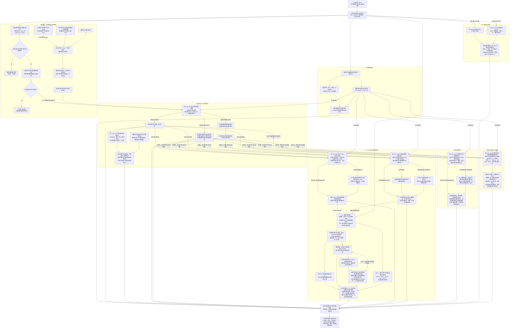

# Token 研究资料整理流程

> 需求状态：讨论中
>
> 细分状态：目标设计草案，尚未实现。本图展开项目研究中的资料整理环节，表达后台研究资料的数据依赖；区块推进不等待采集完成，各子任务的具体调度方式另行设计。

## 入口与目的

输入是已经识别为 Token 的项目，以及发现和识别阶段已经取得的资料。首版仅研究 Ethereum Mainnet，源码和钱包普通交易等 Etherscan 请求使用现有免费 Key；后续扩展其他链时，这些免费 Key 全部替换为付费 Key。持币地址总数与前 100 名分布改由 Ave 获取。沿用已有的链、合约地址、部署交易、部署区块与时间、识别结果等上下文，整理基础信息、源码及其中的项目公开资料、税率配置、持币分布和关联钱包资料。

当前资料流程执行“采集数据 → 解析事实 → 保存展示”。AI 静态质检只生成事实报告和代码依据；第一板块不生成风险等级、筛选、排除或移交结论。基础信息、字节码信息、合约 owner、需要链上读取的税费接收地址、税率配置和钱包资产等链上状态，以各自采集时最新区块作为数据源，并保留实际读取的区块号与时间。此前取得的发现和 Token 识别记录保留其原始时点，后续刷新不改写原始身份结论。

区块处理采用已确认的边界：完成该块 Token 识别，可靠保存识别结果、项目资料及研究任务后推进区块。源码、AI 和 L1–L5 钱包等资料由后台独立采集，不等待全部资料到齐。项目因首版七协议中的首次已识别 Swap、不活跃超时或管理员手动操作停止；停止时取消未开始任务，已经开始的任务按原有限重试规则收尾。项目不可恢复，管理员重检共享报告也不重开项目。

项目公开资料由 AI 从源码提取 HTTPS 链接并分类，同一源码可保留多个公开资料，同类型也可有多条。保留完整 URL 与各处源码依据，展示标注“来源：合约源码”；当前只提取保存，不抓取链接页面或核验真实性。

持币地址信息是另一类独立资料：通过 Ave Token Detail 取得 `holders` 总数，通过 Top100 Holders 取得最多 100 个地址及其持有数量、持有占比和提供方标签，只保存展示，不新增项目筛选。总数与 Top 100 分别记录查询时间，不套用链上 RPC 的来源区块，也不当作部署初始分配、完整持有人名单或固定区块快照。

## 流程图

## 数据依赖与结果说明

| 部分 | 依赖与需要保留的内容 |
| --- | --- |
| 发现与识别资料 | 项目身份、部署交易和区块、部署者、Token 识别结果及已取得的基础事实；部署时间取部署区块的 `timestamp`，识别结果复用前置合约调用检测结论。复用已有资料，不额外增加部署交易成功判断。 |
| 代币基础信息 | 以本次采集时最新区块读取名称、符号、精度、总供应量、`code.length` 与 `code_hash`，保存实际区块与时间，并关联已有识别结果；`code.length` 是运行时代码字节数，具体研究用途待定；`code_hash` 来自运行时字节码。 |
| 合约源码资料 | 依赖 `code_hash` 查询已有非空源码；没有可复用源码时，使用当前链和合约地址查询。成功空源码表示可能尚未开源，记录实际结果，支持手动补采及研究中具有续期资格的新 `Approval`／`Transfer` 活动触发再次查询；请求失败按首次加最多 3 次重试处理，耗尽后通知管理员，不记为未开源。完整分支见 [合约源码获取流程](token-contract-source-flow.md)。 |
| AI 静态质检报告 | 通过 `code_hash` 定位源码及完成报告，默认相信并直接复用；没有报告且已有源码时由 AI 静态分析，管理员也可手动指定某份源码重新检测。至少保存是否可无限增发、是否可修改余额、是否可限制转出，以及代码依据、触发条件和影响；独立保存“是否使用代理”“是否存在外部未知依赖”及依据。AI 不评级，第一板块不产生程序筛选结论。共享报告更新后，已停止项目也展示最新有效版本。详见 [合约源码 AI 静态审阅](token-contract-review-flow.md)。 |
| 项目活动、刷新与停止 | 按链共享事件监控为所有研究中项目实时接收并补查目标 Token 的 `Approval`／`Transfer` 和首版七协议 Swap。期限内（含期限时点）活动按事件区块时间续期；此类活动在无非空源码时强制重查，并按管理员为 Approval/Transfer 分别配置的映射刷新资料。默认观察 72 小时，覆盖完整越过期限后才可判不活跃。首次已识别 Swap、不活跃超时或管理员手动操作停止研究。详见 [项目事件监控](token-project-activity-flow.md) 与 [Swap 事件识别](token-swap-events-research.md)。 |
| 源码中的项目公开资料 | 按 `code_hash` 定位同一源码的已完成提取结果，命中直接复用；未命中且有源码时，AI 提取实际出现的 HTTPS 链接，分类为官网、X、Telegram、项目文档、GitHub、公开审计报告及其他。同源码、同类型均可有多个，按完整 URL 去重并保留全部源码出处及原文依据。展示明确标注“来源：合约源码”；没有源码且无可复用结果、未发现链接时记录实际结果，继续其他资料采集。详见 [源码公开资料提取流程](token-public-links-flow.md)。 |
| 合约 owner | 按 `code_hash` 复用同一源码已完成的 AI 分析结论及读取方式；未命中且有源码时，AI 判断能否取得 owner 及具体方式，不限定函数名。存在方式后由 Go 程序按采集时最新区块读取当前合约，保存实际结果、读取方式与来源区块，取得地址后采集其普通交易和代币余额。未取得时保留结果与可知原因，继续已知钱包和其他资料采集。详见 [owner 获取与钱包采集流程](token-owner-wallet-flow.md)。 |
| 税费接收钱包 | 按 `code_hash` 复用同一源码的 AI 分析结论；缺失且有源码时识别一个或多个税费接收方及源码依据。确实固定的地址直接提取，需要读取的地址由 AI 提供可执行方式，再由 Go 读取当前链、当前合约在本次最新采集区块的状态；两种来源可同时存在，合并全部已取得地址，逐项保留来源类型、依据、读取方式、结果及实际区块。动态实际地址不跨部署复用。部分或全部未取得时记录真实结果与原因，继续已知钱包资料采集。详见 [税费接收钱包获取流程](token-fee-recipient-wallet-flow.md)。 |
| 税率配置 | 按 `code_hash` 复用同一源码已完成的 AI 读取与解释方案；缺失且有源码时，由 AI 根据真实计税逻辑识别可读取的税率项目及读函数，提供参数、返回类型、单位、分母和换算公式，不固定函数名或要求买入、卖出、转账税率全部存在。Go 读取当前链、当前合约在本次最新采集区块的原始值及需要动态读取的分母，同项相关调用使用同一区块；保存原值、依据、实际区块与时间，解释明确时展示百分比。实际税率逐合约读取，不跨部署复用；部分结果保留，无方法或失败不记为零税率。详见 [税率读取流程](token-tax-rate-flow.md)。 |
| L1 直接关联钱包 | 围绕部署者、最多 5 个初始接收钱包、已取得的合约 owner 和税费接收钱包整理资料，保留不同角色和初始分配线索。同一地址可以同时拥有多个角色标签，按项目保留全部角色及税费用途依据，采集与分析不因标签重复。初始接收钱包按部署交易内该代币的净接收量降序，从净接收量为正且查询时无合约代码的地址中最多选取 5 个；该上限仅针对初始接收钱包，不限制税费接收钱包数量，税费接收地址也可以是合约地址。 |
| L2–L5 资金来源地址 | 从当前层交易样本中提取成功向该钱包直接转入 ETH、金额大于零的发送地址，后台自动逐层查找至 L5，即从 L1 向上扩展四轮。保留来源地址、接收钱包、金额、交易哈希及区块与时间；首版不纳入代币入账和内部转账来源，不增加金额阈值或每层来源地址数量上限。L5 仍开展历史研究，不向 L6 扩展，展示折叠不决定是否采集。 |
| 各层钱包历史交易 | 原样保留当前查询规则并用于 L1–L5：按链和钱包地址去重后，通过 Etherscan `account/txlist` 查询区块 `0` 至 `当前项目部署区块 - 1`，`sort=desc`、`page=1`、`offset=300`，每个钱包获取部署前最近的最多 300 笔普通交易，不足则保留实际数量，只取第一页。各层同样使用当前项目的部署边界。保留交易资料及查询范围；失败处理与研究流程的衔接后续设计。 |
| 各层钱包历史行为分析 | 补充同一批交易的回执与日志，整理成功直接部署的合约及交易依据，识别其中的 Token，匹配已有项目与研究报告。首版只对 Uniswap V2/V3/V4、Sushi V2/V3、PancakeSwap V2/V3 形成明确买卖；聚合器进入支持池可由池证据识别，RFQ 与未支持路径保留未分类事实。补充详情不扩大 300 笔范围。L1–L5 共用该分析逻辑，具体流程见 [多层关联钱包研究](token-wallet-research-flow.md)。 |
| 资金来源图 | 底层保存有向关系图，展示后台自动采集的 L1–L5 五层结果及实际未取得原因。地址节点去重，保留共同来源和循环边，以距任一 L1 的最短路径分层；同一来源、接收地址和资产的转账汇总展示，点击查看每笔交易依据，同一交易不重复计数。展开、折叠仅改变显示，不触发取数或删除数据。详见 [钱包资金来源关系图](token-wallet-funding-graph.md)。 |
| L1 钱包资产 | 对 L1 直接关联钱包，按本次采集时最新区块固定读取 WETH、USDT、USDC、DAI、WBTC 并记录来源区块，不采集原生 ETH；不将余额采集扩展到 L2–L5。 |
| 资料汇集 | 将已经取得的事实、来源、采集结果、共享质检报告及实际未取得原因关联到项目并展示；AI 分析内容与实际链上采集事实分别表达。当前不产生风险评分、通过／不通过、排除或移交结论。项目动态资料只保留最近成功事实，失败另存最近时间与原因。 |
| 当前持币地址资料 | 依赖当前链、目标代币地址和 Ave 认证配置，不依赖源码、AI 或 owner 完成。通过 Token Detail 获取 `holders` 持币地址总数，通过 Top100 Holders 获取最多 100 名的地址、`amount_cur` 持有数量、`balance_ratio` 持有占比及 `remark`、`addr_alias` 等提供方标签；保留原始占比并按 Ave 比例语义格式化为百分比展示。分别保留查询时间、来源、原始字段和取得状态，按链、目标代币与持有人关联。保持 Ave 排名顺序，不分页、不补齐 Top 100 之外的地址，也不把该结果称为完整名单。已有角色可匹配时连同独立依据展示；普通持有人不自动纳入 L1，不触发历史交易、资金来源或其他余额采集。详见 [当前持币地址采集流程](token-holder-flow.md)。 |

图中的实线表示后台研究资料的数据依赖，不包含评级或筛选分支。区块推进采用已确认边界，不等待源码、AI 或五层钱包任务完成；具体后台子任务不固定为全部并行或固定串行。源码获取依赖字节码哈希；公开资料提取、owner、税费接收钱包与税率分析子流程分别先按该哈希查库，未命中已完成结果时才需要源码进行 AI 分析。税费接收钱包按每项结果分别处理固定地址或读取方式，保留已成功取得的地址，不要求两类来源都存在或所有读取都成功。

项目只因首次已识别 Swap、不活跃超时或管理员手动操作停止，当前不存在风险规则排除。停止不等待资料齐备；未开始任务取消，已开始任务按原有限重试规则收尾，之后冻结项目专属事实。迟到事件和共享报告维护都不能恢复项目。

AI 静态质检只依赖已取得的源码；同一源码的报告、已完成的公开资料提取、owner 分析、税费接收钱包分析与税率分析分别共享复用，需要链上读取的地址与税率仍按当前合约读取。各项分析结果不要求在同一次 AI 调用中产生，也不互相作为完成前提。owner、税费接收钱包、税率的链上读取和后续钱包采集不进入静态报告的核实过程。AI 输出报告事实及代码依据，至少覆盖无限增发、修改余额和限制转出能力，说明条件、限制与疑点，不评级，也不将源码逻辑表述为已核实的当前链上状态。AI 超时、请求失败或返回内容不符合报告要求属于技术异常，单独记录，不填成相关能力不存在或低风险。

同一源码默认相信并直接复用已有完成报告，不因新部署重复分析，不自动批量重评。管理员可针对某份源码手动触发重新检测，例如调整提示词后重新生成报告；所有关联项目始终展示最新共享有效版本。这一维护动作不恢复已停止项目，也不触发其项目专属资料采集。

公开资料提取只依据实际源码中出现的 HTTPS 链接与上下文，不补写或猜测 URL；类型或归属无法确定时保留为其他；依赖库、许可证等链接标注实际用途，不标为当前项目的官方资料。保存提取时间与实际源码依据。去重使用完整 URL，不仅按域名合并，多个路径对应的资料可以分别保留；同一链接在不同文件或位置出现时合并展示并保留全部出处。展示的“来源：合约源码”说明提取渠道，不表示已核验链接属于当前项目、页面仍然有效或审计已通过。此流程不读取链上状态，不进行网络搜索、抓取页面或真实性核验，不根据链接数量、类型、存在与否新增项目筛选；未取得源码且无可复用结果、未发现链接或技术失败均按实际情况记录，不把技术失败当作源码没有链接，也不阻塞研究期间的其他资料采集。

代理与外部未知依赖只在本次取得的源码范围内识别。两项结论独立，代理合约也可能存在外部未知依赖；外部未知依赖指行为依赖本次源码未提供或无法确定的外部实现，完整提供的库或父合约不因 `import` 被判为未知。“未发现”不是链上全局不存在的核实结论。当前不读取实际代理实现地址，不继续获取或分析代理实现、外部依赖源码，也不递归扩展。两项识别结果及源码依据随质检报告保存展示，不新增命中标识即排除或升级风险的规则，不增加风险评级分支。

owner 统一由 AI 根据源码识别读取方式，再由 Go 程序执行链上读取；同一源码已完成的“有可用方式”或“未识别可用方式”结论均关联源码与 `code_hash` 保存并复用，实际地址不跨部署复用。没有源码且没有可复用结论时不进行 AI 分析；未识别方式、AI 技术异常或 Go 读取未取得地址时，保留实际结果与可知原因。技术失败不作为“不可读取”的共享分析结论，也不覆盖已有方式。项目仍在研究期间时，只跳过依赖该未知地址的 owner 钱包采集，继续其他已知钱包采集。成功取得 owner 不是研究完成的必要条件，缺少 owner 不单独触发项目过滤，也不代表合约没有 owner；研究截止不等待 owner 获取。

税费接收钱包根据实际源码中的税费流向识别，不只凭变量或函数名判断。固定地址提取需要有源码依据；可变变量的初始字面量不能当作当前固定接收地址，需要可用读取方式才能取得当前值，本阶段不新增部署初始化资料采集。Go 只执行当前合约的读取方式，不继续解析代理实现地址或获取外部依赖源码。没有源码且没有可复用结论、没有可用取得方式、AI 或 RPC 技术失败时保留实际原因；部分读取失败不丢弃其他已取得地址，不将技术失败缓存为不存在税费接收钱包，也不因未取得全部地址阻塞其他资料采集或单独排除项目。

税率是独立研究资料，不属于钱包角色，也不加入 Token 六项识别条件。AI 按实际源码语义确定税率含义和换算依据，Go 仅执行可确定参数和返回含义的读函数。税率不能按 Token 精度换算或假定统一分母，总税率与其分项不得重复相加。无法确定百分比时保留原始值及原因；技术失败单独记录，不覆盖成功值。读到的是指定区块的配置，不声称某笔交易实际扣税；本次不增加买卖模拟、白名单核实、阈值或程序筛选。

各层钱包按链和地址去重。同一资金来源关联多个钱包只分析一次，来源已经属于任一层时复用已有分析，同时完整保留资金关系及角色；循环转账保留连线，不重复展开地址。税费接收地址与其他 L1 角色相同时合并标签与依据，使用同一份钱包样本及余额资料。跨项目复用钱包分析必须匹配链、地址、截止区块和采样规则，不永久复用某次 300 笔结果。共同资金来源只构成关联事实，不单独证明属于同一团队。

钱包资料当前只用于事实展示：多角色标签、多层来源、历史部署或交易项目、余额及数据未取得结果，均不作为项目过滤条件，也不生成钱包或当前项目的风险评分。匹配到历史项目已有报告时仅展示关联事实与报告引用，不把历史项目结论传递为当前项目的排除结论。空样本、协议未识别或采集失败保留实际结果及原因，不转化为项目不通过；技术失败的重试和恢复方式仍待设计。

资金来源图表达样本内的历史关系。追溯某笔入账的上游来源时，还需按交易先后顺序核对路径：发生在该笔入账之后的上游转账不能解释该笔资金，但仍可作为历史关系保留。该核对不改变各层部署前最近 300 笔的采集范围，时间顺序成立也不等于证明各跳流转的是同一笔资金。后台自动采集 L1–L5 并展示五层实际结果，没有可用来源的分支按实际情况结束；展开、折叠只影响显示，不触发或取消采集。研究截止不因某些分支尚未采齐而延后，不补造缺失节点。

基础信息、owner、需要链上读取的税费接收地址、税率配置与钱包资产使用各自采集时确定的最新区块，不要求不同来源共用同一区块；同一税率项目所需的数值与动态分母等相关读取使用同一区块。部署上下文保留实际部署区块，钱包历史固定以 `项目部署区块 - 1` 为截止高度，不包含部署区块内及之后的交易。例如部署区块为 `30000`，每个钱包始终在 `0–29999` 范围内倒序取最近的最多 300 笔普通交易；owner 或税费接收地址即使在部署后才取得，也沿用这个范围，采集时的最新区块不改变截止高度。Etherscan 源码资料记录实际查询时间与资料来源，不将其标记为某个链上区块的源码快照。

源码请求失败最多重试三次，按首次请求之外再重试三次、总计最多四次请求记录。成功空源码只表示可能尚未开源，保存实际响应与查询时间；请求失败重试耗尽后，通过 [系统通知组件](../../design/notifications/system-notification-operations.md) 通知管理员，保留失败原因与次数，不标记为未开源。该失败重试规则只适用于已设计的源码请求，不扩展为其他采集任务或空源码补采的统一上限。

尚无源码时支持管理员对研究中项目手动补采。按链共享事件监控为所有研究中项目接收目标 Token 的 `Approval` / `Transfer`：去重后，只有事件区块时间不晚于处理前当前期限的活动才按事件区块时间重置期限，并按 Approval/Transfer 各自的管理员配置刷新资料；仍无非空源码时必定触发或合并源码查询。晚于期限的事件只保留依据，不续期、不刷新。有源码时不重复下载或自动重做 AI 报告，但不能退出活动监控。活动与钱包部署前 300 笔历史是两类资料，普通活动不改变历史窗口，也不等于 Swap。

研究停止需要识别首版七协议中的首次已识别 Swap，并同时维护活动超时与管理员手动停止。Swap 必须按协议解析事件并确认项目关联；池身份与 token 映射仅用于匹配，不扩展为池深、储备、LP 或流动性研究。添加流动性不停止。具体事件覆盖、订阅和补查见 [Swap 事件识别](token-swap-events-research.md)。

持币地址资料不再使用 Etherscan PRO Key。首版 Ethereum Mainnet 的源码、普通交易等既有 Etherscan 请求继续使用免费 Key；后续扩展其他链时，将这些免费 Key 全部替换为付费 Key。Ave 的总数和 Top 100 请求各自保留成功结果、查询时点及失败原因；一项失败不丢弃另一项，不填为零持有人，也不把 Top 100 当作完整列表。接口未提供具体区块时不编造来源区块，两次请求不声称是固定区块的一致快照，也不当作部署初始分配。持仓数据关联当前链和目标代币，不按 `code_hash` 跨部署共享。

持币地址采集无需等待源码、AI 报告或 owner；直接保存 Ave 返回的持有数量、占比和提供方标签。标签缺失时不推测，Top100 实际少于 100 条时保留实际条数。当前只展示，不增加集中度阈值或筛选规则。`Transfer` 默认触发该数据组刷新；项目停止时未开始任务取消，已开始任务收尾，之后冻结最近成功值并保留最近失败信息。

## 待设计内容与阶段边界

- 源码公开资料已确定采用“按同源码复用结果，缺失时由 AI 提取并分类多个 HTTPS 链接 → 去重保留出处 → 标注来源并展示”，尚未实现；具体存储结构与展示布局后续设计，不增加真实性核验或链接齐备的完成条件。
- owner 已确定采用“AI 分析源码或复用已完成结论 → Go 按方式读取当前合约 → 纳入关联钱包”流程，尚未实现。具体读取方式表达、多个结果不同、零地址等特殊返回值、合约 owner 的额外分析、具体重试和后续更新仍待细化；这些细节不改变同源码复用分析、逐合约读取实际地址及未取得 owner 时继续研究的原则。
- 税费接收钱包已确定支持多个固定或链上读取地址、混合来源合并及纳入 L1，尚未实现；读取方式的数据结构、特殊返回值、技术重试和地址变化后的更新方式仍待细化，不影响保留已取得地址及真实未取得原因的原则。
- 税率已确定采用“AI 识别读函数与解释方案 → Go 读取当前合约 → 保存配置与原值并展示”的独立资料流程，尚未实现。读取方案的数据结构、技术重试和后续更新仍待细化；不新增税率阈值过滤，也不将未取得税率作为零税率。
- 当前持币地址资料已调整为 Ave `holders` 总数与 Top 100 明细，完整分页名单及 Etherscan PRO Key 已移出范围。具体 Ave 链与 token-id 映射、认证复用、两项请求协调、错误处理、限频重试、刷新、标签展示与存储方式待细化；不增加 Top 100 齐备或 Ave 数据已取得的研究完成条件。
- 区块处理、三类研究停止和任务收尾边界均已确定；技术设计只需决定状态、任务和持久化实现，不再选择是否等待全部资料。
- 活动续期、默认 72 小时、按链分事件刷新映射、默认刷新组合、每项目每组默认 10 分钟冷却，以及动态事实最新值／最近失败语义均已确定。
- 关联钱包后台自动采集 L1–L5 并展示五层实际结果；折叠只影响显示。当前不据钱包资料筛选或过滤。
- 本阶段仅为首次已识别 Swap 匹配保留必要池身份与 token 映射，不扩展为底池深度、储备、LP 或流动性研究；Ave 只采集持币地址总数与 Top 100。`simulation_result` 第一版完全移除。
- AI 仅生成事实报告和依据，不评级；同一源码默认复用，允许管理员重检。筛选与交易属于后续板块。具体报告结构、版本与并发协调待技术设计。

## 关联文档

- [项目事实研究流程](token-research-flow.md)
- [合约源码获取流程](token-contract-source-flow.md)
- [合约源码 AI 静态审阅流程](token-contract-review-flow.md)
- [源码公开资料提取流程](token-public-links-flow.md)
- [合约 owner 获取与关联钱包采集流程](token-owner-wallet-flow.md)
- [税费接收钱包获取与采集流程](token-fee-recipient-wallet-flow.md)
- [税率读取流程](token-tax-rate-flow.md)
- [当前持币地址采集流程](token-holder-flow.md)
- [多层关联钱包研究流程](token-wallet-research-flow.md)
- [钱包资金来源关系图](token-wallet-funding-graph.md)
- [项目事件监控、活动续期与研究停止](token-project-activity-flow.md)
- [Swap 事件识别与研究停止](token-swap-events-research.md)
- [合约发现与 Token 识别流程](token-discovery-identification-flow.md)
- [Token 目标设计](token.md)
- [返回业务设计与流程图索引](README.md)
