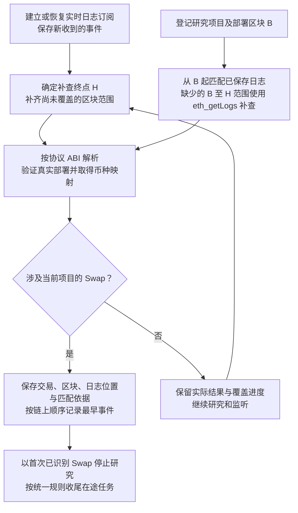

# Token 首次已识别 Swap 事件调研

> 需求状态：讨论中
>
> 细分状态：2026-09-08 调研记录，尚未实现。首版范围为 Ethereum Mainnet（`chain_id = 1`）。首版七个协议、按链共享事件监控、实时订阅与历史补查、覆盖表达及扩展回补规则已经确认；其他协议保留为调研，不属于首版覆盖。

## 业务目的与已确认边界

系统在第一板块研究 Token 项目的可核对事实。一旦在当前支持协议与覆盖版本中识别到最早一笔涉及该项目的有效 Swap，即以“首次已识别 Swap”为原因停止研究，不等待资料全部采集完成。本文不声称识别全市场绝对首笔，也不设计项目筛选、交接或交易执行。

首版固定覆盖 Ethereum 上的 Uniswap V2、Uniswap V3、Uniswap V4、Sushi V2、Sushi V3、PancakeSwap V2、PancakeSwap V3。识别不限定交易顶层调用固定 Router，也不限定报价资产；经聚合器或通用路由进入支持池的交易仍可由底层池事件识别。池创建、池初始化、添加任意流动性、普通转账或授权都不作为研究停止事件。

与本次调研相关的其他决定：

- AI 只生成源码静态事实报告，不输出风险评级；第一板块不执行程序筛选或排除。Swap 停止不依赖报告或其他资料完成。
- 后台自动采集 L1–L5 钱包资料并展示五层结果；普通与内部交易均查询部署前 `0..B-1`，分别倒序取第一页最多 300 条原始记录，内部记录关联的新增顶层交易也加入钱包行为分析。该 [内部 ETH 转账需求](token-wallet-internal-transfers-flow.md)不改变本项目的 Swap 覆盖或停止规则，不能把内部 ETH 入账本身认定为 Swap。Swap 到来时按统一任务收尾规则取消未开始任务，让已开始任务在有限重试后完成，不等待五层齐备。
- 按链共享事件监控同时覆盖目标 Token `Approval` / `Transfer` 和部署者／当前 owner 主动交易。活动区块时间不晚于当前期限时，`Approval` 仅记录证据并续期，`Transfer` 续期、缺源码重查并按管理员配置刷新（默认 Token 当前状态和 Ave 持币资料），监控地址主动交易仅续期和缺源码重查。授权、转账或监控地址活动不等于成交。
- 本轮不考虑区块被替换后的重组与回滚。断线、进程重启、重复日志和项目登记晚于事件发生仍需处理。

总体业务规则见 [Token 目标设计](token.md)，研究职责见 [项目研究流程](token-research-flow.md)，源码请求与补采见 [源码获取流程](token-contract-source-flow.md)。

## 如何确定候选协议

本次结合 Ethereum 上的协议活跃度与事件结构选取调研候选。活跃度参考 [DefiLlama Ethereum DEX 汇总接口](https://api.llama.fi/overview/dexs/Ethereum?excludeTotalDataChart=true&excludeTotalDataChartBreakdown=true&dataType=dailyVolume)，调研取样时间为 `2026-09-08 11:51 UTC`。它是可变化的全市场成交量快照，不是新部署 Token 的成交分布，也不是本文已完成的协议覆盖排名。

首版已经选择 Uniswap V2/V3/V4、Sushi V2/V3、PancakeSwap V2/V3。Curve、Fluid、Maverick、Balancer、DODO、RFQ 与订单结算等均不属于首版，但保留以下调研供以后扩展。任何未支持路径都必须标记为覆盖外或未知，不能据此判断项目尚未交易。

下列签名使用 ABI 规范类型，不包含参数名称或 `indexed`，例如 `uint` 写为 `uint256`。`topic0` 由完整规范签名计算 Keccak；解码时还必须使用对应版本的 indexed 布局。相同 topic 不保证 indexed 布局、发出方或业务含义相同。规则依据见 [Solidity 事件 ABI](https://docs.soliditylang.org/en/latest/abi-spec.html#events)。

## Uniswap、Sushi 与 PancakeSwap

| 协议与版本 | 规范事件签名 | 日志发出位置 | 项目币种映射 |
| --- | --- | --- | --- |
| Uniswap V2、Sushi V2、PancakeSwap V2 | `Swap(address,uint256,uint256,uint256,uint256,address)` | Pair 合约 | Pair 对应的 `token0`、`token1` |
| Uniswap V3、Sushi V3 | `Swap(address,address,int256,int256,uint160,uint128,int24)` | Pool 合约 | Pool 对应的 `token0`、`token1` |
| PancakeSwap V3 | `Swap(address,address,int256,int256,uint160,uint128,int24,uint128,uint128)` | Pool 合约 | Pool 对应的 `token0`、`token1` |
| Uniswap V4 | `Swap(bytes32,address,int128,int128,uint160,uint128,int24,uint24)` | PoolManager 合约 | `poolId` 对应的 `currency0`、`currency1` |

官方事件定义：[Uniswap V2](https://raw.githubusercontent.com/Uniswap/v2-core/master/contracts/interfaces/IUniswapV2Pair.sol)、[Sushi V2](https://raw.githubusercontent.com/sushiswap/v2-core/master/contracts/interfaces/IUniswapV2Pair.sol)、[PancakeSwap V2](https://raw.githubusercontent.com/pancakeswap/pancake-smart-contracts/master/projects/exchange-protocol/contracts/interfaces/IPancakePair.sol)、[Uniswap V3](https://raw.githubusercontent.com/Uniswap/v3-core/main/contracts/interfaces/pool/IUniswapV3PoolEvents.sol)、[Sushi V3](https://raw.githubusercontent.com/sushiswap/v3-core/master/contracts/interfaces/pool/IUniswapV3PoolEvents.sol)、[PancakeSwap V3](https://raw.githubusercontent.com/pancakeswap/pancake-v3-contracts/main/projects/v3-core/contracts/interfaces/pool/IPancakeV3PoolEvents.sol)、[Uniswap V4](https://raw.githubusercontent.com/Uniswap/v4-core/main/src/interfaces/IPoolManager.sol)。

PancakeSwap V3 比 Uniswap V3 多两个 `uint128` 协议费字段，topic0 不同，不能直接套用 Uniswap V3 的订阅条件。

V4 的池没有各自独立合约地址。官方 PoolManager 发出的 `Initialize(bytes32,address,address,uint24,int24,address,uint160,int24)` 提供 `poolId`、两种资产及完整 PoolKey；`id`、`currency0`、`currency1` 为 indexed 字段。PoolKey 包含 `currency0`、`currency1`、`fee`、`tickSpacing` 和 `hooks`，其 ABI 编码哈希得到 poolId。native ETH 的零地址表示遵循协议定义，不作为无效币种丢弃。[PoolKey 定义](https://raw.githubusercontent.com/Uniswap/v4-core/main/src/types/PoolKey.sol)、[PoolId 计算](https://raw.githubusercontent.com/Uniswap/v4-core/main/src/types/PoolId.sol)、[V4 架构](https://developers.uniswap.org/docs/protocols/v4/concepts/architecture)

### Ethereum Mainnet 部署依据

| 协议 | Factory / PoolManager | 官方部署依据 |
| --- | --- | --- |
| Uniswap V2 | `0x5C69bEe701ef814a2B6a3EDD4B1652CB9cc5aA6f` | [V2 deployments](https://developers.uniswap.org/docs/protocols/v2/deployments) |
| Uniswap V3 | `0x1F98431c8aD98523631AE4a59f267346ea31F984` | [Ethereum deployments](https://developers.uniswap.org/docs/protocols/v3/deployments/v3-ethereum-deployments) |
| Uniswap V4 | `0x000000000004444c5dc75cB358380D2e3dE08A90` | [V4 deployments](https://developers.uniswap.org/docs/protocols/v4/deployments) |
| Sushi V2 | `0xC0AEe478e3658e2610c5F7A4A2E1777cE9e4f2Ac` | [Ethereum 部署记录](https://raw.githubusercontent.com/sushiswap/v2-core/master/deployments/ethereum/UniswapV2Factory.json) |
| Sushi V3 | `0xbACEB8eC6b9355Dfc0269C18bac9d6E2Bdc29C4F` | [Ethereum 部署记录](https://raw.githubusercontent.com/sushiswap/v3-core/master/deployments/ethereum/UniswapV3Factory.json) |
| PancakeSwap V2 | `0x1097053Fd2ea711dad45caCcc45EfF7548fCB362` | [V2 addresses](https://developer.pancakeswap.finance/contracts/v2/addresses) |
| PancakeSwap V3 | `0x0BFbCF9fa4f9C56B0F40a671Ad40E0805A091865` | [V3 addresses](https://developer.pancakeswap.finance/contracts/v3/addresses) |

这些地址是本次调研的 Ethereum 部署依据，不表示代码已配置或已开始订阅。PancakeSwap V3 另有 PoolDeployer，使用 CREATE2 推导池地址时不能把所有 V3 协议的实际部署者都当作 Factory。实施时需将链、协议版本、可信部署地址与 ABI 一起确定。

## 其他候选事件族

### Curve

| 协议版本或路径 | 规范事件签名 | 发出位置与币种映射 |
| --- | --- | --- |
| StableSwap / StableSwap NG | `TokenExchange(address,int128,uint256,int128,uint256)` | 池合约；用 `sold_id`、`bought_id` 对应池的币种索引 |
| 支持 underlying 交换的对应池实现 | `TokenExchangeUnderlying(address,int128,uint256,int128,uint256)` | 对应池合约；按该版本的 underlying 币种映射，不能直接复用表层 `coins` 索引 |
| 旧 Crypto 池 | `TokenExchange(address,uint256,uint256,uint256,uint256)` | 池合约；交换索引对应 `coins` |
| 当前 Tricrypto NG、Twocrypto NG v2.1.0 接口 | `TokenExchange(address,uint256,uint256,uint256,uint256,uint256,uint256)` | 池合约；交换索引对应 `coins`，最后两项为 fee 与 price scale 数据 |

Curve 的签名和解码必须按池实现版本区分。所核实 Tricrypto 实现的 `buyer` 为 indexed，最后一项为 `packed_price_scale`；当前 Twocrypto 接口的 `buyer` 不为 indexed，最后一项为 `price_scale`。两者虽然规范签名相同，却不能使用完全相同的 topics/data 解码布局。不能用某一份最新接口反推所有历史已部署池都使用该布局。

官方依据：[StableSwap NG](https://raw.githubusercontent.com/curvefi/stableswap-ng/main/contracts/main/CurveStableSwapNG.vy)、[StableSwap Meta NG underlying 事件](https://raw.githubusercontent.com/curvefi/stableswap-ng/main/contracts/main/CurveStableSwapMetaNG.vy)、[旧 Crypto 池](https://raw.githubusercontent.com/curvefi/curve-crypto-contract/master/contracts/two/CurveCryptoSwap2ETH.vy)、[Tricrypto NG](https://raw.githubusercontent.com/curvefi/tricrypto-ng/main/contracts/main/CurveTricryptoOptimizedWETH.vy)、[Twocrypto NG 接口](https://raw.githubusercontent.com/curvefi/twocrypto-ng/main/interfaces/ITwocrypto.vyi)、[部署目录](https://docs.curve.finance/developer/deployments)。

### Balancer

| 版本 | 规范事件签名 | 发出位置与币种映射 |
| --- | --- | --- |
| Balancer V2 | `Swap(bytes32,address,address,uint256,uint256)` | Vault；事件直接给出 poolId、tokenIn、tokenOut，按可信 Vault 的池登记关系校验 |
| Balancer V3 | `Swap(address,address,address,uint256,uint256,uint256,uint256)` | Vault；事件直接给出 pool、tokenIn、tokenOut，按可信 Vault 的池登记关系校验 |

V2 和 V3 的 Vault 地址、事件参数及池标识方式分别处理，不将 V2 poolId 当作 V3 pool 地址。官方定义见 [Balancer V2 IVault](https://github.com/balancer/balancer-v2-monorepo/blob/master/pkg/interfaces/contracts/vault/IVault.sol) 与 [Balancer V3 IVaultEvents](https://github.com/balancer/balancer-v3-monorepo/blob/main/pkg/interfaces/contracts/vault/IVaultEvents.sol)。实施前仍需选定 Ethereum 的实际 Vault 部署及适用版本。

### Fluid、Maverick 与 DODO

| 协议与版本 | 规范事件签名 | 发出位置与币种映射 |
| --- | --- | --- |
| Fluid DEX T1 | `Swap(bool,uint256,uint256,address)` | 池合约；通过 `constantsView` 的 token0/token1 与方向字段映射实际币种 |
| Fluid DEX Lite | `LogSwap(uint256,uint256)` | DexLite 合约；参数为压缩数据，需按该部署版本解码 dexId 及成交字段，并关联币种配置 |
| Maverick V2 | `PoolSwap(address,address,(uint256,bool,bool,int32),uint256,uint256)` | 池合约；通过 tokenA/tokenB 与 SwapParams 的 tokenAIn 对应交换币种 |
| DODO V2 DVM / DPP | `DODOSwap(address,address,uint256,uint256,address,address)` | DVM / DPP 池合约；事件直接给出 fromToken、toToken 及数量，仍需验证池身份 |

Fluid T1 与 Lite 不是同一种事件解析。Lite 不能把两个 `uint256` 直接理解为两种币的输入输出数量；必须遵循源码的位字段布局和 dexId 关系。依据见 [T1 events](https://github.com/Instadapp/fluid-contracts-public/blob/main/contracts/protocols/dex/poolT1/coreModule/events.sol)、[T1 interface](https://docs.fluid.io/autogenerated-docs/protocols/dex/interfaces/iDexT1.sol/interface.IFluidDexT1.html)、[Lite LogSwap](https://docs.fluid.io/autogenerated-docs/protocols/dexLite/other/events.sol/event.LogSwap.html)、[Lite 编码实现](https://github.com/Instadapp/fluid-contracts-public/blob/main/contracts/protocols/dexLite/core/coreInternals.sol) 与 [部署记录](https://github.com/instadapp/fluid-contracts-public/blob/main/deployments/deployments.md)。

Fluid DEX V2 的 [官方集成文档](https://docs.fluid.io/integrate/dex-v2-swaps.html#contract-addresses)在本次核对时仍将 Ethereum 地址列为 TBD，不能将它写作已明确的 Ethereum 接入部署，也不能与上表 T1、Lite 混为同一版本。

Maverick 的 SwapParams 在规范签名中展开为 tuple 类型，不能把结构体名称直接放入 topic0 计算字符串。依据见 [Maverick V2 Pool 接口](https://docs.mav.xyz/technical-reference/maverick-v2/v2-contracts/maverick-v2-common-contracts/interfaces/imaverickv2pool) 与 [V2 部署地址](https://docs.mav.xyz/technical-reference/contract-addresses/v2-contract-addresses)。

DODO 表中只列已核实的 DVM / DPP 事件，不能据此声称覆盖其所有池型与历史版本。源码见 [DVMTrader](https://raw.githubusercontent.com/DODOEX/contractV2/main/contracts/DODOVendingMachine/impl/DVMTrader.sol) 与 [DPPTrader](https://raw.githubusercontent.com/DODOEX/contractV2/main/contracts/DODOPrivatePool/impl/DPPTrader.sol)。

### 聚合器、RFQ 与订单结算

经由 1inch、0x 等路由进入已支持 AMM 池的交易，可以由底层池事件识别，不要求交易顶层 `to` 一定是某个固定 Router。但 RFQ、订单撮合或结算不保证经过 AMM 池，单靠上述池事件不能覆盖所有成交路径。

例如 CoW Settlement 定义 `Trade(address,address,address,uint256,uint256,uint256,bytes)`，直接包含成交代币和数量，属于应另行评估的结算事件。是否将这类路径纳入项目“首次交易”截止、如何验证结算部署以及与底层 AMM 日志合并，留待设计；不能把缺少 `Swap` 名称等同于没有交易。[CoW GPv2Settlement](https://raw.githubusercontent.com/cowprotocol/contracts/main/src/contracts/GPv2Settlement.sol)

## 已确认的最小识别资料与真实部署校验

仅订阅项目 Token 地址的日志会漏掉以上大多数 Swap，因为日志通常由池、Vault 或 PoolManager 发出。必须维护最低限度的交易场所身份与币种映射，为事件匹配服务；Swap 识别本身不因此扩展到通用流动性、深度、价格、底池质量或买入路径研究。L1 资产估值另允许按链、按资产使用首版七协议可信部署的固定直接或最多两跳 DEX 现货路径，读取与余额相同观察区块的必要池状态和价格，详见 [L1 资产余额与 USDT 估值](token-wallet-research-flow.md#l1-资产余额与-usdt-估值)。估值路径不限制 Swap 停止识别的报价资产或交易路径。

| 结构 | 必须保存的最小映射与校验 |
| --- | --- |
| V2 Pair | 可信 Factory、Pair、token0、token1；以官方 Factory 的 `PairCreated` 或 `getPair(token0,token1) == log.address` 验证 |
| V3 Pool | 可信 Factory、Pool、token0、token1、fee；以官方 Factory 的 `PoolCreated` 或 `getPool(token0,token1,fee) == log.address` 验证 |
| V4 PoolManager | 可信 PoolManager、poolId、完整 PoolKey；从该 Manager 的 Initialize 建立映射，并可核对 PoolKey 编码哈希 |
| Curve 与其他独立池 | 对应协议和实现版本的可信 Factory、Registry 或部署记录、池地址、币种索引或配置；按该版本的实际接口校验 |
| Vault / DexLite 等共享合约 | 可信部署地址、协议版本，以及 poolId / pool / dexId 对应币种；不把共享合约地址本身视为某个 Token 的池 |

V2/V3 身份校验的官方结构见 [Uniswap V2 Factory](https://raw.githubusercontent.com/Uniswap/v2-core/master/contracts/UniswapV2Factory.sol) 与 [Uniswap V3 Factory](https://raw.githubusercontent.com/Uniswap/v3-core/main/contracts/UniswapV3Factory.sol)。真实 Factory 登记可以验证归属；一个未知池自行返回 `factory()` 等于官方地址，并不足以证明它由该 Factory 创建。

任意合约都可以发出同名甚至相同 topic0 的事件。因此必须组合校验链、可信发出方或池归属、协议版本 ABI、日志布局和币种映射，再以目标 Token 的合约地址匹配项目，不能凭符号、名称、调用函数名或 topic0 单独结束研究。

池创建、初始化和币种映射是识别基础，不是截止事件。多资产池只匹配本次实际交换的币种，不因目标 Token 出现在池的其他币种位置就视为它已经成交。不同协议的 native ETH / WETH 表达分别按协议解释。

## 已确认的实时订阅与历史补查规则

Geth 官方说明，订阅只发送当前事件，不补发历史；连接关闭时该连接上的订阅被移除。因此已确认使用实时日志订阅降低发现延迟，并使用 `eth_getLogs` 补足启动、断线、重启、动态目标变化和项目登记时差。每条链使用一套共享事件监控，不为每个项目建立独立订阅系统；它独立于项目发现扫描已有的逐块流水线。[Geth 日志订阅](https://geth.ethereum.org/docs/interacting-with-geth/rpc/pubsub)

共享监控维护目标 Token 日志、监控地址主动交易及 Swap 的动态范围：`Approval` / `Transfer` 覆盖所有研究中项目的 Token 地址；部署者／当前 owner 活动从本链成功顶层交易中匹配 `from`；Swap 按首版七协议的可信 Pair、Pool、PoolManager 等发出方与事件主题接收，再根据池或 `poolId` 的实际币种映射匹配所有研究中项目。各范围共享连续性原则，但顶层交易覆盖不能由日志覆盖代替，事件解析和业务动作也不能混用。

部署者从部署交易之后监控，当前 owner 从成功读取它的观察区块开始监控；更换 owner 后停止旧 owner 监控，部署者始终保留。地址或角色重合时同一项目同一交易只处理一次。只有成功、顶层且 `from` 为监控地址的交易才有效，零 ETH 合约调用可续期，入账、失败交易和内部调用不可续期。该规则不受资金来源图的单笔最小金额限制，且不触发其他资料刷新。

不活跃超时必须等待 `Approval`、`Transfer`、部署者交易、各有效监控区间的当前 owner 交易以及 Swap 均完整覆盖越过当前期限，且期限内不存在待处理的有效活动或 Swap。迟到活动不能续期、重查源码、刷新资料或恢复项目。完整期限与地址生命周期规则见 [项目事件监控流程](token-project-activity-flow.md)。

| 符号 | 含义 |
| --- | --- |
| `B` | 当前项目部署区块，首次已识别 Swap 补查包含该区块 |
| `H` | 本次补查确定的终点高度，不使用查询期间不断移动的隐含终点 |
| 日志覆盖游标 | 对选定协议和过滤范围已经完整取得并持久保存的连续区块进度，不等于最后收到一条日志的高度 |

已确认流程如下；具体进程、存储结构、地址分片与调度尚未确定。

连续性规则：

1. 先建立订阅并接收新日志，再固定历史补查终点，补查与实时接收允许重叠并去重，避免先查历史再开始订阅形成空档。
2. 项目首次登记时补查 `B..H`，两端包含。该范围不同于钱包历史的 `0..B-1`；部署和 Swap 可以发生在同一区块，不能从 `B+1` 才开始。
3. 扫描器发现项目、验证 Token、写入项目与日志到达可能存在先后差异。不能直接丢弃“当前数据库还没有该项目”的全部交易依据；可保留事件后关联，或在项目登记时补查，并明确所选方式的覆盖范围。
4. 断线或重启后根据持久覆盖进度补查。只有整个查询区间的日志完整取得并持久保存后才推进该区间进度；无匹配日志的区块也可以形成已覆盖范围。查询失败或截断不当作空结果或成功覆盖。
5. 按 `chain_id`、交易哈希和 `logIndex` 去重。以 `blockNumber`、`transactionIndex`、`logIndex` 的链上顺序选取最早事件，不能以网络到达顺序定义“首笔”。
6. 若某条可信事件已证明支持协议内发生 Swap，可据此停止继续研究；要把它标为当前覆盖版本内的最早已识别事件，仍须补齐此前尚未覆盖的范围。记录事件发生时间和系统发现时间，不能把迟发现包装为实时发现。
7. 对尚未解析的池身份或币种映射保留待解析依据，补齐后重新匹配。原始日志已取得与项目事件已完整识别是不同进度，不能用前者代替后者。
8. 动态目标发生变化时不得形成未覆盖空档。具体地址分片、订阅重建、并发和背压由技术设计确定，不能用每项目一套独立订阅作为扩展方式。
9. 实时接收中的内存缓冲不构成覆盖进度或业务完成依据。进程退出后允许丢弃内存内容，但必须能够依据持久进度与链上日志补回。

`eth_getLogs` 的区块范围是包含两端的范围；接口依据见 [Ethereum execution APIs](https://raw.githubusercontent.com/ethereum/execution-apis/main/src/eth/filter.yaml)。请求分段大小、并发数、失败重试、通知及本地事件保存范围待实现设计，不在本文自行设置阈值。

### 池映射可能早于项目部署区块

项目 Swap 补查从 `B` 开始，不表示所有池创建与初始化资料都从 `B` 才存在。根据官方 Factory / PoolManager 源码，调用方可以为预先知道的代币地址创建或初始化池；这类池映射可能早于该地址部署 Token。

V4 尤其需要注意：PoolManager 的源码说明 PoolKey 不保存在普通状态映射中，调用方每次提供 PoolKey，Initialize 事件则记录完整键。因此遇到未知 poolId 时，建议复用完整的既有映射，或按官方 Manager 地址及 poolId 回查 Initialize，必要时查到 Manager 的部署起点。不能因为 `B..H` 没有 Initialize 就认定该 Swap 与项目无关。[V4 PoolManager](https://raw.githubusercontent.com/Uniswap/v4-core/main/src/PoolManager.sol)

同一区块可以出现池创建、初始化和 Swap，处理顺序与补查都必须覆盖它们；不应依赖人工添加池地址后才开始保存交易日志。

## 覆盖表达与扩展规则

未发现匹配事件，只说明在首版七协议、项目记录的覆盖版本、实际完成的区块范围和已解析资料中尚未发现；不能直接声称该项目在 Ethereum 全部交易场所都没有交易。每个项目都要保存并展示协议清单、覆盖版本、连续日志覆盖进度，以及未知池、版本不匹配、映射缺失或技术失败等原因。

可信 Swap 证明发生了协议定义的交换路径，不自动证明任意钱包现在都能正常买卖。例如 V2 flash swap 和带 hooks 的 V4 Swap 都纳入停止口径。只要通过对应官方协议语义、可信部署和币种映射验证为有效 Swap 且涉及目标 Token，就停止研究；不增加成交金额、钱包身份、买卖方向或“普通交易”阈值。[V2 Pair 实现](https://raw.githubusercontent.com/Uniswap/v2-core/master/contracts/UniswapV2Pair.sol)、[V4 PoolManager 实现](https://raw.githubusercontent.com/Uniswap/v4-core/main/src/PoolManager.sol)

以后新增协议适配器时，仅对当时仍在研究的项目从各自部署区块回补，并使用新版覆盖继续判断。已经因首次已识别 Swap、不活跃超时或管理员人工操作停止的项目，保留其停止时使用的协议覆盖版本、进度与结论，不因新版适配器重新匹配、改写停止原因或恢复研究。

需求确认后仍需在技术设计中细化：

- 七个首版协议各 Ethereum 部署对应的精确 ABI、可信地址配置和版本标识；不能只按协议品牌选择解码器。
- 实时日志接收、历史补查、协议解析、项目关联和截止写入的具体组件划分、存储结构与持久化边界；已确认的共享监控和连续性规则不再作为待选项。
- 解析失败分类、覆盖版本和进度的存储／展示结构，以及多池或多条证据的合并方式。
- RFQ、订单成交和结算事件属于未来协议扩展，不纳入首版停止口径；何时扩展另行讨论。
- 具体发现和停止时效目标仍待明确。

本文只支撑“首次已识别 Swap”及其研究停止，不负责完整钱包买卖归因、交易路由构建、下单或卖出策略。返回 [Token 目标设计](token.md) 或 [研究资料索引](README.md)。
