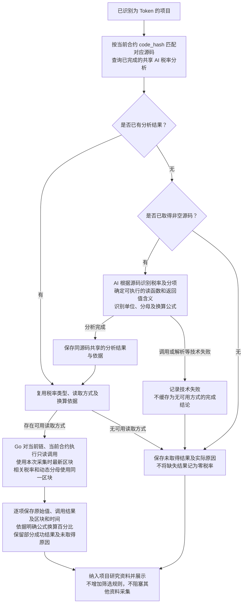

# Token 税率读取流程

> 关联目标技术设计：[对应子系统方案](../../design/token-intelligence/source-facts-and-read-plans.md)（分节已确认，书面待审阅；尚未实现）。

> 需求状态：讨论中
>
> 细分状态：目标设计草案，尚未实现。本图记录已确认的 AI 税率读取方式分析、Go 链上读取与研究资料展示范围。

首版仅研究 Ethereum Mainnet，源码等 Etherscan 请求使用免费 Key；后续扩展其他链时现有免费 Key 全部替换为付费 Key。税率由 Go 对当前合约执行只读链上调用取得。

## 入口与目的

由 AI 分析实际取得的合约源码，找出能够读取税率的函数及返回值的含义，再由 Go 程序调用当前链、当前合约，取得本次采集时的税率配置。合约可以有买入税、卖出税、普通转账税或多个税费分项，按源码实际存在的配置记录，不要求每个合约都有固定的三类税率。

同一份源码的 AI 读取与解释方案通过运行时字节码 `code_hash` 匹配后复用；每个部署实例的实际税率分别读取和保存。本板块只采集、解析、保存和展示资料，不增加税率阈值、风险评级、筛选或项目排除规则。源码 AI 同样只生成事实报告和依据，见 [AI 静态质检流程](token-contract-review-flow.md)。

## 流程图

图中连线表示后台研究任务的资料依赖，不规定具体子任务串行或并发调度，也不阻塞该块识别结果、项目资料及研究任务保存后的区块推进。某项读取失败时保留其他成功结果；税率资料不成为静态报告、owner、税费接收钱包或其他资料完成的前置条件。

税率只可被管理员配置为具有续期资格的目标 Token `Transfer` 所触发的刷新组；`Approval` 和部署者／当前 owner 主动交易不得触发税率刷新。刷新仍按执行时最新区块读取同一时点的相关值，只展示最近一次成功事实；失败时保留旧值并单独记录最近失败时间和原因。

项目因首次已识别 Swap、不活跃超时或管理员手动操作停止时，未开始的税率任务取消，已开始任务按原有限重试规则收尾；停止后不再读取项目税率。在途任务结束后冻结项目专属税率快照。按 `code_hash` 共享的税率语义、源码依据和读取方案始终展示最新有效版本，但不触发已停止项目重新读取。具体衔接见 [项目事实研究流程](token-research-flow.md)。

## AI 分析与读取说明

AI 根据税费计算和转账逻辑判断函数返回值的实际含义，不只按 `buyTax`、`sellFee` 等名称识别，也不预设固定 getter 名单。读取说明应足够让 Go 构造只读调用、解码返回值并提取对应税率。

| 分析内容 | 已确认的要求 |
| --- | --- |
| 税率类型与分项 | 记录源码中实际存在的买入、卖出、普通转账或其他类型，以及对应的总税率或分项含义和源码依据。未发现某一类型不自动补为零。 |
| 可执行读取方式 | 给出函数签名、必要参数类型与确定取值或取值依据、返回类型，以及税率所在字段或数组元素。需要但无法确定的参数不能由 Go 补猜，不将模糊函数名视为可用方案。 |
| 单位、分母与换算 | 根据源码确定返回值的单位、分母和百分比换算公式；分母由链上状态决定且可读取时，一并提供对应的读取方式。无法确定换算时保留原始值及原因。 |
| 总税与分项关系 | 仅按源码明确的计算关系解释或汇总，不把总税和已包含在总税中的分项重复相加，也不假定所有分项都适用于同一种交易。 |

例如，只有源码明确使用分母 `10000`，且某税率读函数返回 `500` 时，才能按 `500 / 10000 × 100% = 5%` 展示。`10000` 只是示例，不能作为所有合约的固定默认值，也不能从代币 `decimals` 推断税率的单位。需要的动态分母未取得或无法用于换算时，保存已取得的税率原始值与无法换算的原因。

源码中已知的固定税率可以保留为分析依据，但不能标记为本次链上读取值。本轮不增加直接提取税率、直接读取存储、固定函数探测、构造参数采集或模拟交易作为读取兜底；Go 执行明确的只读调用，不执行 AI 生成的任意程序。

## 采集时点与保存结果

Go 在本次税率采集开始时选定最新区块，对当前链、当前合约执行 AI 确定的调用。同一次税率配置涉及的多个 getter、分项和动态分母使用同一区块，避免组合不同时点的配置；与 owner、税费接收钱包及余额等其他采集不要求共用同一区块。

每项资料保留税率类型或分项含义、函数签名与参数、返回类型及原始值、单位或分母、可确定时的换算公式与百分比，并关联源码依据、当前链、合约地址、实际区块及时间。部分调用成功时逐项保留成功结果和其他项的失败或缺失原因。

展示结果表达该区块可读取的税率配置。源码中的适用条件、交易类型或豁免规则可能影响某笔交易的实际扣费，因此不能将配置值直接表述为任意钱包交易时一定支付的税率。本轮不扩展到链上核实角色、白名单、豁免或其他条件状态。某个 getter 返回 `0` 只表示对应读取项为零，不据此宣称整个合约全局无税。

## 共享分析与范围边界

按 `code_hash` 匹配对应源码及已完成的 AI 税率分析后，直接复用读取与解释方案；只有尚无完成结果且已取得实际非空源码时，才进行 AI 分析。共享内容包括税率语义、源码依据、可执行调用描述及换算关系，也包括已完成的“未识别可用读取方式”结论。技术失败不作为该结论复用，也不覆盖已有有效分析。

实际税率属于部署实例在某个区块的配置，不能把另一合约的税率或历史快照作为当前实例的本次结果。Go 调用失败不改变共享的源码分析结论。未取得源码、没有可用读取方式、AI 技术失败、部分成功和链上调用失败均保存实际结果与原因，不填充 `0` 或“无税”，继续其他研究资料采集与展示。

税率分析与 [静态质检报告](token-contract-review-flow.md)、[owner 分析](token-owner-wallet-flow.md)、[税费接收钱包分析](token-fee-recipient-wallet-flow.md) 各自复用，不强制合并为一次 AI 调用，也不互相等待。税率链上读取不纳入静态质检的链上核实范围；未取得税率不影响已知关联钱包的历史交易、资金来源或余额采集。

本轮只分析实际取得的源码，不额外解析代理实现地址，也不获取或分析代理实现及外部依赖源码。若当前源码不足以确定可执行读取方式或换算含义，保存这一限制；已经明确的当前合约只读调用仍按本流程执行。

## 目标技术设计衔接

读取与换算说明的具体数据结构、多个读取入口的选择及结果冲突处理、采集调度、失败重试、刷新任务与共享分析版本机制见关联目标技术设计，尚未实现。本轮不增加全部税率项必须取得的研究完成门槛。

## 关联文档

- [Token 目标设计](token.md)
- [研究资料整理流程](token-research-materials-flow.md)
- [合约源码获取流程](token-contract-source-flow.md)
- [合约源码 AI 静态质检与报告复用](token-contract-review-flow.md)
- [Token owner 钱包获取与研究流程](token-owner-wallet-flow.md)
- [税费接收钱包获取与研究流程](token-fee-recipient-wallet-flow.md)
- [返回业务设计与流程图索引](README.md)
