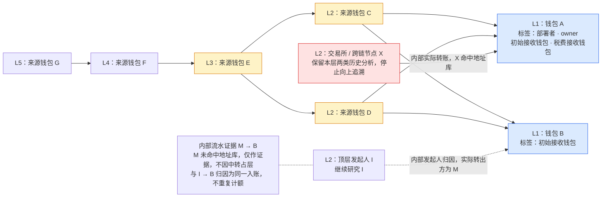

# Token 钱包资金来源关系图

> 关联目标技术设计：[对应子系统方案](../../design/token-intelligence/wallet-evidence-and-valuation.md)（分节已确认，书面待审阅；尚未实现）。

> 需求状态：讨论中
>
> 细分状态：目标设计草案，尚未实现。本文件说明已确认的项目资金门槛快照、普通与内部入账关系、L1–L5 分层展示、共享与终止节点及交易证据交互。当前阶段只采集、解析并展示钱包资料，不据此筛选过滤项目。具体流程见 [多层关联钱包研究](token-wallet-research-flow.md)和[内部 ETH 转账识别流程](token-wallet-internal-transfers-flow.md)。
>

## 目的与图示

以 L1 直接关联钱包为研究入口，沿入账关系向上查找 L2、L3、L4、L5，帮助识别共同资金来源，并查看这些钱包过去直接部署的合约与交互代币。

资金图、多个角色标签、历史项目清单、余额及交易明细均用于展示事实。本阶段不按钱包资料产生项目风险评分、通过／不通过或排除结果；图上折叠、显示筛选和路径核对不属于项目筛选过滤。

图中为示例地址，不代表真实项目。普通直接入账和内部 ETH 入账均要求成功、未回滚、非零且单条达到项目门槛，多笔小额不累计形成边。连线由直接来源或归因来源指向接收钱包，必须明确关系类型：普通直接转账和命中地址库的内部实际转账表示实际方向，内部发起人归因表示顶层发起人与入账的归因关系。研究从 L1 逆着这些关系向上追溯；L1 起算为第一层，L5 对应四轮来源扩展。内部归因规则及实际转出证据不能省略，也不能把归因画成已证实的实际出资路径。

钱包 A 同时是当前项目的部署者、owner、初始接收钱包和税费接收钱包，只显示一个节点和四个角色标签。C 向 A、B 两个钱包普通转账，因此显示为一个来源节点、两条连线；不会因为 A 有四个标签而复制 A 或 C 到 A 的连线。C 与 D 又共享 E 这一上游来源。X 是内部转账的实际转出方且命中管理员维护的交易所／跨链地址库，优先保留 X→A 并完成 X 自身普通／内部历史及行为分析，在 X 终止；该交易的顶层发起人只保留为证据，不穿透追溯。

I 发起交易、未命中地址库的 M 内部转账给 B 时，图中虚线 I→B 是发起人归因，继续研究 I；M→B 实际流水作为证据保留，M 不因中转占用层级。没有标注的实线表示普通直接转账。归因金额是实际转入 B 的金额，不能据此证明 I 实际出资或控制 M、B。共同来源或标签本身也不证明这些钱包属于同一个团队。

## 节点、连线与层级

| 对象 | 已确认的设计 |
| --- | --- |
| 钱包节点 | 按链和地址唯一保存和计数。一个节点可同时显示部署者、owner、初始接收钱包、税费接收钱包等多个角色标签，已有标签不被新角色覆盖。 |
| 角色标签 | 按具体项目保留全部已确认角色及证据，同一标签去重；其他项目的角色不自动成为当前项目的角色。交易、余额与历史分析按地址及对应数据范围复用，不因标签数量重复采集。 |
| 钱包层级 | L1 是直接关联入口，其他节点按已发现关系中距离任一 L1 的最短上游追溯距离分层。共享来源只显示一次，跨层关系仍保留；发现更短路径时更新层级并复用历史分析。 |
| 资金连线 | 按链、来源、接收方、资产及关系类型合并同方向关系，区分普通直接转账、内部发起人归因和命中地址库的内部实际转账。显示去重后的金额、明细笔数、首次和最近交易时间；正反方向分别表达。实际流水与归因视角不重复计额。 |
| 交易证据 | 普通交易按链和交易哈希去重；不同内部转账按可区分的内部记录身份分别保存，不能仅按顶层哈希合并。点击连线查看每条金额、区块、区块内交易序号、时间、顶层哈希，以及内部实际转出方、顶层发起人、记录身份和归因依据；保留来源样本关联与缺失原因。 |
| 循环与回流 | 保留指向已有节点的连线，不复制地址、不沿循环无限展开。已经取得的图内钱包之间的关系保留，L5 不继续引入 L6 来源钱包。 |
| 终止节点 | L1–L5 任一地址精确命中管理员按链维护的交易所／跨链地址库时，显示类型、名称与依据，保留本层普通／内部各最多 300 条原始历史、行为分析及已有资金边，但不再发现上游。内部实际转出方命中优先于发起人归因；未触发该例外时，发起人自身命中也终止。 |

资金来源树是分层阅读方式，底层保存有向关系图，不要求每个钱包只有一个来源，也不删除跨分支与循环关系。内部中转地址仅作为证据时，不因中转加入来源层；实际转出方命中管理员地址库时，才按对应来源层显示为终止节点。合约部署、代币交互清单通过钱包详情查看，不混作资金来源连线。

## 展开、折叠与研究入口

- 后台自动采集并分析 L1–L5，前端默认展示五层结果；未取得的分支保留实际进度或原因。
- 展开与折叠仅改变显示，不触发或控制后台取数。后台对各层按统一窗口取数并复用已有分析；L5 仍分析部署与代币交互，仅停止继续发现 L6。
- 点击任一钱包查看两份历史行为清单：成功顶层直接部署过的合约，以及交易或交互过的项目；以普通样本与内部记录关联的顶层交易并集去重分析，内部记录不扩展内部合约部署识别。交互覆盖不同 DEX、协议版本与路由，区分实际买卖、授权、普通转账、被动收款和其他交互，只记录有证据属于该钱包的行为，可继续查看交易证据及已匹配的项目、研究报告。具体规则见 [交易项目识别的协议覆盖](token-wallet-research-flow.md#交易项目识别的协议覆盖)。
- 折叠分支只改变显示，已取得的钱包、资金关系和交易明细仍保留。共同来源与其他仍展开分支相连时，不因折叠一个分支而丢失其关系。
- 记录图的展开状态，方便继续研究。显示筛选与底层数据分开，显示金额、笔数和交易明细始终使用同一范围，不因隐藏部分交易而展示不相符的汇总。
- 区分尚未采集完成、已折叠、达到 L5 边界、命中交易所／跨链而终止，以及已查询样本内没有达到门槛的来源。普通／内部两类历史分别表达无记录、达到各自 300 条上限、查询失败及部分取得；内部归因缺少发起人或先后证据时单独保留原因。任何一种显示状态都不代表已取得完整钱包历史或调用轨迹。

五层只限制深度，来源分支仍可能很多。除项目开始时保存的原生币最小金额门槛外，不增加每层来源数量上限，通过地址去重和交易所／跨链终止节点减少无效扩展；具体并发、限流、断点进度和失败恢复见关联目标技术设计。项目因首次已识别 Swap、不活跃超时或管理员手动操作停止时，不等待五层全部完成：未开始任务取消，已开始任务按原有限重试规则收尾并保存；折叠状态不影响后台研究。

## 统一采样与资金路径口径

所有层均使用当前项目部署区块 `B`，通过 Etherscan 按地址 `account/txlist`、`account/txlistinternal` 分别查询 `startblock=0`、`endblock=B-1`、`sort=desc`、`page=1`、`offset=300`。首版 Ethereum Mainnet 使用免费 API Key 支持的地址查询，不依赖付费全链区块范围查询。例如 `B=30000`，每个钱包查询 `0–29999` 内普通／内部各最多 300 条原始记录，互不挤占额度。取得样本后再判断成功、金额和用途，过滤后不翻页补满；新增内部记录关联的顶层交易加入行为分析，补充必要回执日志不改变两份有界原始样本。

管理员按链配置原生币最小资金来源金额，项目开始时保存配置快照，整个项目固定使用该快照；ETH 默认 `0.01 ETH`，未来 BSC 默认 `0.01 BNB`。普通成功直接入账与成功、未回滚的内部入账均需非零且单条金额大于等于门槛，才形成资金关系和上游来源。`0.0099 ETH` 不形成边，`0.01 ETH` 形成边，同一顶层交易中的两条 `0.006 ETH` 内部入账也不累计，不使用净额判断。小额记录仍留在各自原始样本；代币入账、失败、回滚和零值记录不纳入首版来源扩展。该门槛不适用于部署者／当前 owner 的活动续期，内部历史识别不改变研究期活动与停止规则。

A 发起顶层交易、C 内部转账给 W 时：C 命中管理员本链交易所／跨链地址库，优先显示 C→W 并在 C 终止，A 仅保留发起证据；C 未命中则显示 A→W 发起人归因并继续研究 A，C 作为实际流水证据。A 自身命中时沿用终止规则。无法取得 A 时保存已知流水与缺失原因，不猜测来源；未触发 C 地址库优先终止例外且 W 自己发起调用收到内部回款时，不新增外部来源。内部出账保留和分析，不自动扩展下游。同一内部流水的实际与归因展示不能重复统计为两笔入账。

管理员地址库按链记录地址、类型（交易所或跨链）、名称和依据，并按地址精确匹配。新增标签时，研究中项目取消该节点尚未开始的上游扩展，已有事实保留；已开始的任务可收尾，但不得继续派生。移除标签后，研究中项目可恢复此前未执行的上游追溯；已停止项目保持冻结，不重开。

图中的连线表达历史实际转账或发起人归因，连续连线不自动代表同一笔钱的连续流动，归因边不能描述为已证实的实际资金路径。核对实际入账的上游路径时，逐跳要求上游入账早于下游出账，按区块与区块内交易序号判断；同一顶层交易内缺少可靠先后证据时，不断言资金先入后出，不符合或未知顺序的连线仍可作为历史关系显示。这项路径核对不改变采样窗口，不单凭时间顺序判断混合资金归属，也不把发起人归因升级为实际出资证明。具体示例见 [历史关系与具体资金路径](token-wallet-research-flow.md#历史关系与具体资金路径)。

## 参考方案

以下链接是数据组织和交互的参考，目标功能由自己的采集与证据支撑；本轮未确定采购或整体接入任何产品。

| 参考 | 借鉴内容与适用边界 |
| --- | --- |
| [GraphSense](https://graphsense.org/documentation.html) | 参考地址、交易、实体及标签的数据组织与交互式关系图。核心分析库和界面采用 MIT 协议，商业扩展另有授权；完整部署涉及链数据采集和 Cassandra，不能等同于直接替换现有 Etherscan 采集。 |
| [MetaSleuth 节点交互](https://docs.metasleuth.io/user-manual/getting-started/what-are-nodes) | 参考钱包节点分别向资金来源、资金去向展开，以及在节点上呈现地址信息与标签。本项目当前重点为上游来源。 |
| [Arkham Tracer](https://codex.arkm.com/the-intelligence-platform/tracer) | 参考流入／流出切换、逐个加入关联地址、连线交易明细、筛选和保存研究图。 |
| [chainmap 源码](https://github.com/gl0bal01/chainmap) | 参考 Etherscan 数据驱动的指定深度遍历、采样、循环处理与连线合并。它是轻量 MIT 开源实现，生产成熟度尚未核实；其默认查询范围和展开方向需要按本项目规则调整。 |

## 关联文档

- [多层关联钱包研究流程](token-wallet-research-flow.md)
- [内部 ETH 转账识别流程](token-wallet-internal-transfers-flow.md)
- [税费接收钱包获取与研究流程](token-fee-recipient-wallet-flow.md)
- [Token 目标设计](token.md)
- [研究资料整理流程](token-research-materials-flow.md)
- [返回业务设计与流程图索引](README.md)
