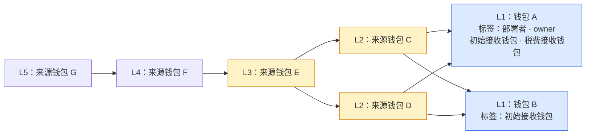

# Token 钱包资金来源关系图

> 需求状态：讨论中
>
> 细分状态：目标设计草案，尚未实现。本文件说明已确认的 L1–L5 分层展示、共享来源与交易证据交互。当前阶段只采集、解析并展示钱包资料，不据此筛选过滤项目。具体流程见 [多层关联钱包研究](token-wallet-research-flow.md)。

## 目的与图示

以 L1 直接关联钱包为研究入口，沿入账关系向上查找 L2、L3、L4、L5，帮助识别共同资金来源，并查看这些钱包过去直接部署的合约与交互代币。

资金图、多个角色标签、历史项目清单、余额及交易明细均用于展示事实。本阶段不按钱包资料产生项目风险评分、通过／不通过或排除结果；图上折叠、显示筛选和路径核对不属于项目筛选过滤。

图中为示例地址，不代表真实项目。箭头表示实际资金方向，由来源指向接收钱包；研究从 L1 逆着箭头向上追溯。L1 起算为第一层，L5 对应四轮来源扩展。

钱包 A 同时是当前项目的部署者、owner、初始接收钱包和税费接收钱包，只显示一个节点和四个角色标签。C 向 A、B 两个钱包转账，因此显示为一个来源节点、两条连线；不会因为 A 有四个标签而复制 A 或 C 到 A 的连线。C 与 D 又共享 E 这一上游来源。E 是值得继续查看历史行为的关联线索，共同来源本身不证明这些钱包属于同一个团队。

## 节点、连线与层级

| 对象 | 已确认的设计 |
| --- | --- |
| 钱包节点 | 按链和地址唯一保存和计数。一个节点可同时显示部署者、owner、初始接收钱包、税费接收钱包等多个角色标签，已有标签不被新角色覆盖。 |
| 角色标签 | 按具体项目保留全部已确认角色及证据，同一标签去重；其他项目的角色不自动成为当前项目的角色。交易、余额与历史分析按地址及对应数据范围复用，不因标签数量重复采集。 |
| 钱包层级 | L1 是直接关联入口，其他节点按已发现关系中距离任一 L1 的最短上游追溯距离分层。共享来源只显示一次，跨层关系仍保留；发现更短路径时更新层级并复用历史分析。 |
| 资金连线 | 按链、来源、接收方和资产合并同方向转账。显示去重后的金额、笔数、首次和最近交易时间；正反方向分别表达。 |
| 交易证据 | 同一笔普通交易按链和交易哈希去重，保留来源样本关联。点击连线查看构成该汇总的每笔交易：金额、区块、区块内交易序号、时间和交易哈希。 |
| 循环与回流 | 保留指向已有节点的连线，不复制地址、不沿循环无限展开。已经取得的图内钱包之间的关系保留，L5 不继续引入 L6 来源钱包。 |

资金来源树是分层阅读方式，底层保存有向关系图，不要求每个钱包只有一个来源，也不删除跨分支与循环关系。合约部署、代币交互清单通过钱包详情查看，不混作资金来源连线。

## 展开、折叠与研究入口

- 后台自动采集并分析 L1–L5，前端默认展示五层结果；未取得的分支保留实际进度或原因。
- 展开与折叠仅改变显示，不触发或控制后台取数。后台对各层按统一窗口取数并复用已有分析；L5 仍分析部署与代币交互，仅停止继续发现 L6。
- 点击任一钱包查看两份历史清单：成功直接部署过的合约，以及交易或交互过的项目；后者覆盖不同 DEX、协议版本与路由，区分实际买卖、授权、普通转账和其他交互，可继续查看对应交易证据及已匹配的项目、研究报告。具体规则见 [交易项目识别的协议覆盖](token-wallet-research-flow.md#交易项目识别的协议覆盖)。
- 折叠分支只改变显示，已取得的钱包、资金关系和交易明细仍保留。共同来源与其他仍展开分支相连时，不因折叠一个分支而丢失其关系。
- 记录图的展开状态，方便继续研究。显示筛选与底层数据分开，显示金额、笔数和交易明细始终使用同一范围，不因隐藏部分交易而展示不相符的汇总。
- 区分尚未采集完成、已折叠、达到 L5 边界，以及已查询样本内没有来源；达到每钱包 300 笔采样上限时保留该事实。任何一种显示状态都不代表已取得完整钱包历史。

五层只限制深度，来源分支仍可能很多。当前不增加额外金额门槛或每层来源数量上限，通过地址去重减少重复采集与显示；具体并发、限流、断点进度和失败恢复待细化。项目首次实际 Swap 出现时研究结束，不等待五层全部完成，保留已取得的部分数据；折叠状态不影响后台研究。

## 统一采样与资金路径口径

所有层均使用当前项目部署区块 `B`，通过 Etherscan `account/txlist` 查询 `startblock=0`、`endblock=B-1`、`sort=desc`、`page=1`、`offset=300`。例如 `B=30000`，每个钱包查询 `0–29999` 内最近最多 300 笔普通交易。首版只从样本内成功、金额大于零的直接原生币入账发现来源，不纳入代币入账或内部转账来源。

图中的连线表达历史转账关系，连续连线不自动代表同一笔钱的连续流动。查看某笔入账的上游路径时，需要逐跳核对上游入账早于下游出账，按区块与区块内交易序号判断；不符合的连线仍可作为历史关系显示。这项路径筛选不改变各层的采样窗口，也不单凭时间顺序判断混合资金中的金额归属。具体示例见 [历史关系与具体资金路径](token-wallet-research-flow.md#历史关系与具体资金路径)。

## 参考方案

以下链接是数据组织和交互的参考，目标功能由自己的采集与证据支撑；本轮未确定采购或整体接入任何产品。

| 参考 | 借鉴内容与适用边界 |
| --- | --- |
| [GraphSense](https://graphsense.org/documentation.html) | 参考地址、交易、实体及标签的数据组织与交互式关系图。核心分析库和界面采用 MIT 协议，商业扩展另有授权；完整部署涉及链数据采集和 Cassandra，不能等同于直接替换现有 Etherscan 采集。 |
| [MetaSleuth 节点交互](https://docs.metasleuth.io/user-manual/getting-started/what-are-nodes) | 参考钱包节点分别向资金来源、资金去向展开，以及在节点上呈现地址信息与标签。本项目当前重点为上游来源。 |
| [Arkham Tracer](https://codex.arkm.com/the-intelligence-platform/tracer) | 参考流入／流出切换、逐个加入关联地址、连线交易明细、筛选和保存研究图。 |
| [chainmap 源码](https://github.com/gl0bal01/chainmap) | 参考 Etherscan 数据驱动的指定深度遍历、采样、循环处理与连线合并。它是轻量 MIT 开源实现，生产成熟度尚未核实；其默认查询范围和展开方向需要按本项目规则调整。 |

## 关联文档

- [多层关联钱包研究流程](token-wallet-research-flow.md)
- [税费接收钱包获取与研究流程](token-fee-recipient-wallet-flow.md)
- [Token 目标设计](token.md)
- [研究资料整理流程](token-research-materials-flow.md)
- [返回业务设计与流程图索引](README.md)
