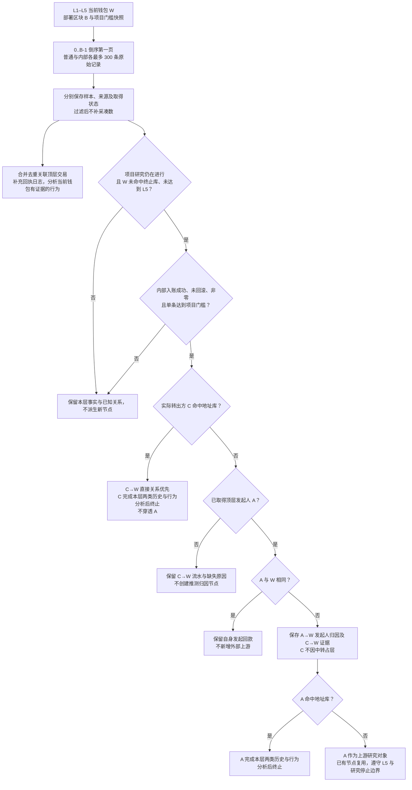

# Token 钱包内部 ETH 转账需求目标

> 需求状态：讨论中
>
> 细分状态：内部历史采样、发起人归因、地址库优先终止及行为分析范围已作为单项决定确认，尚未实现；不代表 Token 整体需求确认或后端实现授权。
>
> 关联技术设计：未创建

## 背景与问题

当前钱包历史实现只取得部署前最多 300 笔普通交易。钱包通过合约收到的内部 ETH 转账可能不出现在该钱包的普通交易列表中，仅分析普通交易会缺少这类收支及相关交易证据。

本能力补充 [L1–L5 钱包研究](token-wallet-research-flow.md)与[资金来源图](token-wallet-funding-graph.md)：按钱包地址独立取得内部记录，并按顶层交易发起人归因以继续研究上游。归因与实际 ETH 流水分别表达，不把调用发起人等同于已经证实的实际出资人。

## 目标

- 保存各层钱包部署前的内部 ETH 收支、取得状态与来源依据。
- 将满足项目金额门槛的内部入账纳入资金研究，保留真实转出方、顶层发起人和归因口径。
- 将内部记录关联的新增顶层交易加入钱包行为分析，区分主动行为与被动收款。
- 在交易所／跨链终止、五层深度及项目研究停止边界内自动采集，不依赖前端展开。

## 非目标

- 不改变研究期间的活动续期、源码补采或资料刷新规则，不以内部收支新增续期活动。
- 不改变 Swap 停止规则，不新增工厂内部部署或内部 `CREATE/CREATE2` 项目发现。
- 不扩展 ERC-20 等代币资金来源，不获取完整钱包历史或完整调用轨迹，不自动向出账接收方扩展下游。
- 不评级、不筛选，不推断共同控制、合约权限或资金最终所有权。
- 本轮仅整理需求，不修改 API、Proto、数据库、源码或 UI；组件和接口契约留到技术设计。

## 角色与权限

Token `READ` 或 `READ_WRITE` 成员可以查看内部收支、资金关系、行为分析及取得状态。资金门槛和交易所／跨链地址库继续由管理员按链维护；成员不能通过查看或展开绕过研究停止、层级或终止节点规则。管理员手动停止及停止后不可重开的规则不变。

## 业务术语

| 术语 | 含义 |
| --- | --- |
| 部署区块 B | 当前被研究 Token 项目的部署区块，决定所有层钱包的统一历史截止点 |
| 内部记录 | Etherscan 按地址返回的单条内部交易记录；原始记录不保证成功、有金额或形成资金边 |
| 实际转出方 C | 一条内部 ETH 入账证据中实际向接收钱包 W 转出 ETH 的地址 |
| 顶层发起人 A | 该内部记录所属顶层交易的发送方，不等同于内部记录的实际转出方 |
| 发起人归因 A→W | 以顶层发起人为上游研究对象的业务关系；金额来自实际转入 W 的内部流水，不表示 A 已被证实实际出资 |
| 直接转账关系 | 普通交易中实际发送方到接收方的转账，或地址库优先终止时保留的内部 C→W 关系；需保留各自记录类别 |

## 业务规则与不变量

### 采样与提供方边界

每个去重钱包的普通交易与内部交易分别使用 `0..B-1`、倒序、第一页、最多 300 条原始记录，两类额度独立，不按时间合并截成总计 300 条。`B=0` 时没有部署前区块，保存有效空范围，不查询部署区块及之后的资料。

先取得原始样本，再按成功状态、金额和用途分析。失败、零金额或低于门槛的返回记录保留在对应样本中，不通过排除它们后翻页凑足 300 条。两类采样分别保存实际数量、查询范围、查询时间和来源；不足 300 条时保留实际结果，达到 300 条时标明采样上限，不宣称完整历史。来源节点何时发现、何时采集及其转账发生时间都不改变 B−1 截止点。

首版只运行 Ethereum Mainnet，使用免费 Etherscan 的按地址内部交易查询能力。指定地址后可限制区块范围；不依赖付费的全链区块范围内部交易查询，也不以“仅查询原有 300 笔普通交易的内部记录”替代独立地址采样。

截至 2026-09-09 核对的官方文档：[按地址查询](https://docs.etherscan.io/api-reference/endpoint/txlistinternal)支持分页、排序和区块范围；[按区块范围查询](https://docs.etherscan.io/api-reference/endpoint/txlistinternal-blockrange)要求 Standard 或以上套餐。免费版按地址查询自 2026-07-01 起每次最多返回 1,000 条，见[变更公告](https://docs.etherscan.io/changelog)，本需求仍固定只取第一页最多 300 条。[按交易哈希查询](https://docs.etherscan.io/api-reference/endpoint/txlistinternal-txhash)明确只返回非零金额内部交易，不能据此承诺完整调用轨迹或内部部署覆盖，也不能把该过滤说明泛化到地址接口。本次为文档核对，未使用仓库 Key 实际调用；请求调度与失败恢复留到后续技术设计。

### 金额与证据

形成内部入账资金关系须同时满足：实际成功且未回滚、非零 ETH、实际接收方为当前钱包，以及单条金额达到项目开始时保存的门槛快照。ETH 默认 `0.01 ETH`，后续管理员调整不改变当前项目各层使用的门槛。

每条内部转账独立判断。同一顶层交易内 C→W 两次 `0.006 ETH` 也不累计跨过 `0.01 ETH`；不同交易同样不累计，不改成净入账判断。内部出账保留和分析，但不自动创建下游研究对象。失败或回滚记录不能产生成功资金关系；无法确认成功时保留未确定原因。

同一交易的不同内部转账分别保存证据，不能只按交易哈希把它们合为一笔。重复取得的同一条记录不重复计数，跨钱包样本关联保留。普通交易和内部流水中的同一实际转账不得重复计额；内部流水与其归因展示也是同一笔入账的不同表达，不能相加计为两笔。证据至少能追溯链、交易、区块与时间、实际转出和接收地址、金额、成功情况、顶层发起人及可区分同交易多条内部记录的依据；具体字段与去重契约留到技术设计。

### 发起人归因与地址库优先级

当前钱包允许扩展上游时，对每条达标内部入账依次应用以下规则：

1. 实际转出方 C 命中当前链管理员交易所／跨链地址库时，优先保存 **C→W** 及库中类型、名称、依据。C 作为下一层终止节点，完成本层普通与内部两类历史及行为分析，但不继续穿透或追溯 A；A 只保留为顶层发起证据。
2. C 未命中时，按实际取得的顶层发起人形成 **A→W 发起人归因**，继续研究 A。C 仅作为实际转出证据，不因中转占用 L1–L5 层级，也不因此自动采集 C 的历史；C 因其他角色已经在图中时仍保留其既有事实。
3. A 自身命中地址库时，仍保留 A→W 归因与 C→W 证据，并对 A 应用本层分析后停止上溯的规则。
4. 未取得 A 时，保留已知内部流水及缺失原因，不猜测 A、不创建推测归因节点，也不以猜测扩展上游；已经明确命中地址库的 C 可按第 1 条保留终止事实。
5. 未触发第 1 条地址库优先终止例外且 A 与 W 相同时，保留自身发起与内部回款证据，不新增外部来源节点，不把该记录统计为外部来源。

地址库优先判断只使用已取得的实际转出方与顶层发起人，不宣称已经检查全部中间调用。提供方标签不能自动替代管理员地址库。地址库标签变更沿用既有规则：只调整研究中项目尚未执行的后续扩展，原始交易证据和已取得节点保留；已开始任务可收尾但不继续派生，已停止项目不重开。

普通直接关系、内部发起人归因与内部地址库终止关系须能辨别；展示汇总与明细使用相同记录范围及关系口径，不把混合关系标成已证实的直接转账。A 能发起调用不证明 A 有特殊权限、控制 C 或实际向 C 出资。

### 行为分析与路径表达

普通交易样本与内部记录关联的顶层交易共同形成行为分析范围，同一顶层交易去重分析。新增交易可以补充必要的交易事实、回执和日志，只将有证据属于当前钱包的买卖、授权、转账、被动收款及其他交互归给该钱包；不将整笔交易的所有行为都算作该钱包行为。明确买卖仍限于首版七协议可信证据，覆盖外保持未分类。

普通交易中的成功直接部署清单继续按原规则整理；内部记录中的创建信息不作为内部合约部署识别或新增项目发现入口。补充交易详情不会再扩大两类各 300 条的历史采样入口。

归因关系表达顶层发起关联，不等于资金从 A 实际流出的路径。交易时间不能被描述成未经证实的 A 出账时间。对实际转账路径继续核对先后关系；同一交易内缺少可靠先后证据时，只保留关系与未知原因，不断言资金先入后出。时序相符也不自动证明混合资金的归属。

## 主流程

普通与内部记录分别保存取得结果，行为分析和资金关系分析使用已有证据独立推进；图中顺序表示业务判断依赖，不规定内部任务结构。

## 状态转换

本能力不新增项目研究状态。内部收支与归因不会触发研究期续期、源码补采或其他刷新，也不会改变首次已识别 Swap、超时和人工停止的语义。普通活动不整体重抓固定历史或关系图；新 owner／税费地址成为 L1 时，按本需求启动该地址的两类初始历史研究。

停止时取消未开始任务，已开始任务按原有限重试规则收尾；停止后不派生新的下游任务，在途结束后项目专属事实冻结。达到 L5 或当前节点命中终止库时，仍完成本层两类历史与行为分析，但不创建下一层；已有节点与循环关系继续按统一规则去重复用。

## 异常与边界场景

- 查询成功无记录、达到采样上限、技术失败及两类资料部分取得分别表达；一类失败不把另一类已取得事实写成不存在。
- 缺少父交易、回执、日志、发起人、成功或顺序证据时，保留已有资料与具体缺失，不伪造金额、买卖行为、归因或路径；缺失补充资料不扩大历史窗口。
- 失败和回滚内部记录可以作为原始事实保留，但不进入成功资金汇总；样本内没有达标来源不代表完整历史中没有来源。
- 相同钱包有多个角色时，两类历史各采一份；跨项目复用须匹配链、地址、截止区块、两类采样及分析规则，不能只按地址永久复用。

## 输入与可见输出

输入为项目所属链、部署区块、已知研究钱包、项目金额门槛快照及管理员地址库。输出包括普通／内部样本的独立取得状态、内部收支明细、实际转出方与顶层发起人、关系类别及归因说明、金额与逐条证据、行为分析和上游研究结果或终止／未取得原因。前端布局、字段级接口、存储结构与调度方式不在本文定义。

## 验收场景

| 场景 | 预期结果 |
| --- | --- |
| 一个钱包普通交易 300 条、内部交易 300 条 | 两类样本分别保存，不互相挤占，分别标明采样上限 |
| 内部第一页含失败、零金额和低额记录 | 原样保留并分别分析，不翻页补足达标记录 |
| 同一顶层交易内 C→W 两次 0.006 ETH，门槛 0.01 ETH | 两条分别未达标，不累计形成资金边 |
| A 调用 C，C 给 W 成功转入 0.02 ETH，均未命中终止库 | 展示 A→W 发起人归因并研究 A；C→W 真实流水保留，C 不因中转占层 |
| 上述 C 命中交易所／跨链地址库 | 在 C 终止，不穿透 A；C 完成本层两类历史与行为分析 |
| C 未命中而 A 命中终止库 | 保留归因与真实流水，A 完成本层分析后终止 |
| W 发起调用并收到内部回款，实际转出方未命中地址库 | 保存自身发起证据，不新增外部来源节点或外部来源统计 |
| 同一交易有多条内部转账，且被多个钱包样本重复取得 | 不同条分别保存与判断，同一条不重复计额；真实流水与归因不相加 |
| 内部记录关联到原有普通交易样本之外的交易 | 加入行为分析，补充证据并区分主动与被动，不自动认定当前钱包参与整笔交易的全部行为 |
| 查询失败、子调用回滚或顶层发起人缺失 | 分别保存原因，不伪造成功资金关系或推测归因 |
| 同一交易内无法确认两条流水的先后 | 保留实际关系，不断言形成连续资金路径 |
| L5、终止标签变更或项目已停止 | 遵守原有深度、在途收尾与不可重开规则，不通过内部记录绕过边界 |

上述场景用于需求与图文一致性核对，本轮不添加或运行测试。

## 已确认决定

- 本能力只扩展 L1–L5 部署前历史、资金图及行为分析，研究期活动规则不变。
- 普通与内部两类各自倒序第一页最多 300 条原始记录，单条金额独立判断，小额不累计。
- 内部记录关联的新增顶层交易同时参与钱包行为分析。
- 内部入账按顶层发起人归因并追溯，实际转出方保留为证据；归因不代表实际出资已经证实。
- 实际转出方命中管理员交易所／跨链地址库时，优先在该地址终止，不再穿透发起人。
- 本轮只更新需求，本文与 Token 整体仍为讨论中；单项选择不构成整份需求确认或后端实现授权。

## 待确认问题

本轮范围内的核心业务选择已明确。业务延迟／SLO 继续沿用 [Token 整体待确认事项](token.md#仍待明确的事项)；组件、接口、限流、证据规范、采集与补充资料的失败恢复在需求确认后的技术设计中确定。本轮不预设这些后端方案，也不把当前实现说明改成已具备内部转账能力。

当前普通交易实现见[已实现的钱包普通交易设计](../../design/token-intelligence/wallet-normal-transactions.md)；该文档只说明现状，不是本能力的目标技术设计。返回 [Token 目标设计](token.md)、[钱包研究](token-wallet-research-flow.md)、[资金来源图](token-wallet-funding-graph.md)或[需求索引](README.md)。
