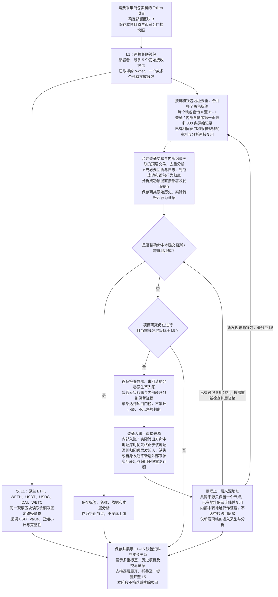

# Token 多层关联钱包研究流程

> 关联目标技术设计：[对应子系统方案](../../design/token-intelligence/wallet-evidence-and-valuation.md)（分节已确认，书面待审阅；尚未实现）。

> 需求状态：讨论中
>
> 细分状态：目标设计草案，尚未实现。本文件记录已确认的 L1–L5 钱包资料采集、解析与展示范围，当前阶段不执行钱包数据驱动的项目筛选过滤；每个钱包部署前普通交易和内部交易分别倒序取第一页最多 300 条原始记录，内部 ETH 入账按顶层发起人归因，并保留实际转出证据。
>

## 入口与目的

首版仅 ETH 主网。输入是需要采集钱包资料的 Token 项目、项目部署区块，以及已取得的直接关联钱包。解析这些钱包直接部署过的合约、交易或交互过的项目，并逐层查找资金来源，最多追溯到 L5。各层执行相同的历史行为分析，保存历史项目与资金往来的交易依据，关联当前项目展示。

L1 为第一层直接关联钱包，包括部署者、最多 5 个初始接收钱包、已取得的 owner 及税费接收钱包。初始接收钱包的选择沿用 [Token 目标设计](token.md#研究证据与完成条件)；owner 按 [owner 获取流程](token-owner-wallet-flow.md)，先复用或由 AI 分析源码确定读取方式，再由 Go 程序读取当前合约的链上地址。税费接收钱包按 [税费接收钱包获取流程](token-fee-recipient-wallet-flow.md)，由 AI 提取源码中的固定地址，或确定读函数交由 Go 读取当前链上状态；一个合约可同时包含这两种来源，合并取得的全部地址纳入 L1。5 个上限只限制初始接收钱包；owner 和税费接收钱包可为合约地址。未取得或只取得部分结果时，记录原因并继续研究其他已知钱包。

[Ave 当前持币地址采集](token-holder-flow.md)作为独立研究资料，提供持币地址总数和 Top 100 明细，可将其中地址匹配这里已有的项目角色及资金来源关系供展示。持有目标代币本身不使地址自动成为 L1，也不触发每钱包普通／内部各最多 300 条历史、L2–L5 资金来源或其他资产余额采集；已经属于 L1–L5 的地址仍沿用其原有范围。持币查询时间不改变本流程的部署前历史窗口。

项目开始时保存当时按链配置的原生币最小资金来源金额，作为该项目整个 L1–L5 研究的固定门槛快照。ETH 默认 `0.01 ETH`；未来 BSC 默认 `0.01 BNB`，具体资产地址与估值路径在接入 BSC 时确定。

后台自动从 L1 找资金来源形成 L2，再从 L2 找到 L3、从 L3 找到 L4、从 L4 找到 L5，不等待用户展开图。L5 对应从 L1 向上追溯四轮；L5 钱包仍需采集历史并分析部署与代币交互，但不继续发现 L6。命中管理员交易所／跨链地址库的钱包也完成本层历史与行为分析，但作为终止节点不再发现上游。共同来源和循环转账按下文去重规则处理，不为每条路径复制钱包。

展示采用按 L1–L5 分层的资金来源树，底层保留完整有向关系图，并区分普通直接转账、内部发起人归因和内部实际转账证据。图示与交互说明见 [钱包资金来源关系图](token-wallet-funding-graph.md)，内部 ETH 转账的独立需求及来源限制见 [内部 ETH 转账识别流程](token-wallet-internal-transfers-flow.md)。

## 当前阶段：采集、解析与展示

本阶段流程为“采集数据 → 解析事实与关联关系 → 保存并展示”。历史行为分析用于整理钱包直接创建过什么项目、交易或交互过什么项目，以及资金从哪里来；这些解析结果与角色标签、交易证据、余额一起展示。

当前不设置基于上述钱包数据的风险评级、通过／不通过判断或项目排除逻辑。多重身份、共同资金来源、历史项目关联、余额高低，以及资料缺失或解析未完成，都不作为本阶段过滤项目的条件。采集失败或结果为空按实际情况记录和展示，不转成项目筛选结论。

展示筛选、分支折叠及路径时间顺序核对只改变所查看的资料，不删除项目或产生项目排除结果。源码 AI 仅生成事实报告；程序筛选不属于当前第一板块。项目按统一规则因首次已识别 Swap、不活跃超时或管理员手动操作停止。

## 流程图

图中表示后台自动逐层采集的依赖。除交易所／跨链终止节点和 L5 深度边界外，L1–L5 已发现分支均自动研究并展示五层结果。命中已有钱包时复用分析，尚未处理来源则按层级继续，同一窗口与深度内已处理的来源不重复遍历。折叠仅改变显示。项目停止时未开始任务取消，已开始任务按原有限重试规则收尾，停止后不得产生新的下游钱包任务。

## 各层共用的历史窗口

从每钱包加入 L1 起，普通历史、内部历史及六项资产首轮快照分别以 [P95 ≤ 10 分钟可查](token.md#l1-首轮资料与五层研究进度)为设计目标。行为补证、解析和 L2–L5 持续推进并展示进度，深层任务在项目间公平使用剩余配额，不设统一整图完成期限。失败和部分结果如实展示；时效目标不减少采样或分支范围，也不延后研究停止。

L1–L5 均以当前项目部署区块 `B` 为基准，通过 Etherscan 按地址的 `account/txlist` 和 `account/txlistinternal` 分别获取每个去重钱包的普通交易与内部交易。首版 Ethereum Mainnet 使用免费 API Key 支持的按地址查询，不依赖付费全链区块范围查询；接口能力与限制见 [内部 ETH 转账识别流程](token-wallet-internal-transfers-flow.md)。两类历史分别使用以下规则：

| 参数 | 固定规则 |
| --- | --- |
| `startblock` | `0` |
| `endblock` | `B - 1` |
| `sort` | `desc`，从新到旧 |
| `page` | `1`，只取第一页 |
| `offset` | `300` 条原始记录；两类独立计数，不足时保留实际返回数量，无记录时保留空结果 |

项目部署在第 `30000` 区块时，L1–L5 都查询 `0–29999` 范围内普通交易最多 300 条、内部交易最多 300 条原始记录，两类互不挤占额度。来源钱包被发现的时间、向下游钱包转账的时间，以及采集时的最新区块，均不改变这一截止高度。上限按每个钱包、每种历史分别计算，不是整个项目的总量，也不额外翻页扩展为完整历史。

先取得这两份有界原始样本，再判断成功状态、金额和业务用途；不在过滤失败、回滚或小额记录后继续翻页凑满 300 条。普通／内部历史分别表达无记录、达到采样上限、查询失败及部分取得状态，不能用一类成功或空结果覆盖另一类缺失。内部记录不等于完整调用轨迹；按需补充其顶层交易、回执和日志不扩大原始采样页，不将缺失证据解释为没有内部转账。

## 逐层发现资金来源

管理员按链配置原生币最小资金来源金额。项目开始时保存配置快照，之后即使管理员修改链级配置，该项目 L1–L5 的所有节点仍使用同一快照，不重算已有或后续资金边。首版 ETH 默认门槛为 `0.01 ETH`；未来 BSC 默认门槛为 `0.01 BNB`。

首版资金来源关系由当前钱包的两类固定样本形成。普通交易必须成功、属于顶层交易且 `to` 精确等于当前钱包；内部转账必须成功、未回滚且实际转入当前钱包。两者均要求非零原生币入账，单条实际入账金额大于等于本项目门槛快照。

每笔普通交易、每条内部转账独立判断，不把同一地址、不同地址或同一顶层交易中的多笔小额转账累计后跨过门槛，也不改用净额判断。低于门槛的记录仍完整保留在对应原始最多 300 条历史中，但不形成资金来源关系或派生上游节点。例如 `0.0099 ETH` 不形成资金边，`0.01 ETH` 形成资金边，同一顶层交易中的两条 `0.006 ETH` 内部入账也不累计。失败、回滚、零值记录和代币入账不形成本版资金来源关系。

普通入账使用直接转出地址。内部入账按以下已确认优先级归因，完整规则见 [内部 ETH 转账识别流程](token-wallet-internal-transfers-flow.md)：

1. A 发起顶层交易，C 内部转账给当前钱包 W；若实际转出方 C 精确命中管理员本链交易所／跨链地址库，优先保留 C→W 并在 C 终止。C 进入相应来源层并完成本层普通／内部历史与行为分析；A 仅作发起证据，不穿透或追溯 A。
2. C 未命中时，默认形成 A→W 的“内部发起人归因”关系并继续研究 A，C 保留为实际转出证据，不因中转占用层级。A 自身命中地址库时，沿用本层分析后终止的规则。
3. 未触发第 1 条地址库优先终止例外时：无法取得 A，保存已知内部流水和缺失原因，不猜测归因地址或据此扩展上游；W 自己发起调用并收到内部回款，保留自身发起事实，不新增外部来源节点。内部出账保存和分析，不自动扩展下游。

归因金额是实际转入 W 的金额，不表示已经证明 A 实际出资、控制 C 或控制 W；C→W 的实际流水与 A→W 的归因展示是同一入账证据的不同视角，不能作为两笔入账重复统计。

每条资金关系保留以下内容：

| 内容 | 用途 |
| --- | --- |
| 链、关系类型、来源地址、接收钱包 | 箭头始终由直接来源或归因来源指向接收方，明确普通直接转账、内部发起人归因或命中地址库的内部实际转账 |
| 实际转出方与顶层发起人 | 内部记录保留 C→W 流水、A 的发起依据及地址库命中依据；未知字段保留缺失原因 |
| 原生币种类与转账金额 | 记录单条实际转入金额；流水与归因不重复计额 |
| 顶层交易哈希、内部记录身份、区块、区块内交易序号、时间 | 支持查回具体交易和不同内部明细、去重及核对部署前依据；同交易缺少可靠内部顺序时不推断先后 |
| 项目、钱包角色和样本来源 | 保留部署者、初始接收钱包、owner、税费接收钱包等角色，以及在哪个钱包的历史样本中发现此关系 |

从符合门槛的关系提取来源地址，逐层加入 L2–L5。多个钱包共用同一来源时，来源只分析一次，各条资金关系仍分别保留。来源已经出现在图中时连接已有节点，保留回流或跨层关系，避免沿循环重复采集。L5 不因外部入账继续新增 L6 钱包；已纳入图的钱包之间已发现的资金关系仍保留。

首版只覆盖这两类样本中达到项目门槛的直接原生币入账与内部 ETH 入账。USDT 等代币资金来源未纳入本版来源扩展；样本内没有来源记录不代表钱包从未收到资金。除上述项目门槛外，不增加每层来源钱包数量上限。五层仅限制追溯深度，分支仍可能很多，后台自动采集五层，前端展示五层结果；折叠只控制显示，不作为取数入口或停止采集的依据。项目停止时保留已完成层级、在途任务最终结果和未取得原因。

资金来源门槛只用于判断历史入账是否形成资金关系，不适用于部署者／当前 owner 的研究期活动。监控地址主动发出的成功顶层交易即使原生币金额为零也可续期，详见 [项目事件监控流程](token-project-activity-flow.md)。本轮内部转账识别只补充部署前研究，不改变研究期续期、Swap 停止或工厂内部部署发现的范围。

## 交易所与跨链终止节点

管理员按链维护可信地址库，每条记录至少表达地址、类型（交易所或跨链）、展示名称和判断依据。只有当前链地址精确命中该库时，才应用终止规则；Ave 或其他提供方标签可以同时展示，但不自动替代管理员地址库的判断。

L1–L5 任一钱包命中后：

- 保留该节点的交易所／跨链类型、名称、依据，以及已经形成的下游资金边和转账证据；
- 仍按统一窗口取得该节点普通／内部各最多 300 条原始记录，完成本层的历史部署和代币交互分析；
- 不再从该节点的入账历史发现、创建或派生更上游资金来源节点。

地址库变化只非破坏性地影响研究中项目。新增标签后，取消该节点尚未开始的上游扩展，保留已有节点、连线和事实；已经开始的任务允许按原规则收尾，但其结果不得继续派生新上游任务。移除标签后，研究中项目可以恢复该节点此前尚未执行的上游追溯。已经停止的项目保持冻结，不因标签新增或移除而重开，也不改写历史快照。

## L1 资产余额与 USDT 估值

ETH 首版对每个去重后的 L1 钱包固定读取六项资产：原生 ETH、WETH、USDT、USDC、DAI、WBTC。L2–L5 仍不读取余额。每项保存原始余额和独立的 USDT value，并计算钱包的已知 USDT 小计；结果同时明确六项固定资产的总值是完整还是不完整，不声称覆盖钱包所有资产。

| 规则 | 已确认口径 |
| --- | --- |
| 统一观察时点 | 一次钱包资产快照中的余额、估值路径所需池状态和价格全部使用同一观察区块，并保存该区块和时间 |
| 估值路径 | 按链、按资产使用管理员配置的固定 DEX 现货路径；可直接兑换到 USDT，或最多经过一个中间资产形成两跳路径。路径中的池只能来自首版七个协议的可信部署 |
| ETH | 读取原生 ETH 余额，价格复用 WETH 的配置路径；不要求把 ETH 实际包装后再计值 |
| USDT | 按 USDT 自身精度直接计入 USDT value，不经过 DEX 路径 |
| 其他资产 | WETH、USDC、DAI、WBTC 按各自配置路径估值，不固定假设 USDC、DAI 或其他资产与 USDT 为 `1:1` |
| 零余额 | 可以直接保存零余额和零 USDT value，不因缺少价格路径把钱包标记为不完整 |
| 非零但无法估值 | 池缺失、储备为零、链上读取失败或路径不可用时，保存失败原因，不以零替代；其他资产结果和已知小计继续保留，总值标记为“不完整”并列出缺失资产 |
| 证据 | 每项保留实际价格路径、使用的池、观察区块、区块时间和采集时间，以及成功结果或失败原因；无需路径的 USDT 直接计值或零余额保留实际依据 |

本次已知小计只累计同一观察区块内可确定的逐项价值，不使用上次成功余额或价格填补缺项。余额读取失败也不得按零处理，须列出缺失资产并把总值标记为不完整。历史快照可保留，但不能用旧完整总值掩盖当前快照的不完整状态。

路径配置变化只影响之后产生的资产刷新，不回算或改写历史快照。BSC 的资产范围、合约地址和估值路径留到接入 BSC 时确定；当前只保留同代码独立实例原则和 `0.01 BNB` 默认资金门槛。

## 历史关系与具体资金路径

资金关系图区分样本内的实际转账和内部发起人归因关系。归因边不等于已证实的实际资金路径；多条连线在地址上连通，也不直接证明同一笔资金沿该路径流动。

例如项目部署区块为 `30000`，L2 在 `25000` 区块转账给 L1，L3 在 `28000` 区块才转账给 L2。两笔交易均属于部署前历史关系，但后一笔不能解释前一笔的资金来源。

查看某笔入账的上游路径时，实际转账证据逐跳要求上游入账早于对应下游出账，按区块高度及区块内交易序号判断；同一顶层交易内缺少可靠先后证据时，保留未知顺序，不断言资金先入后出。不符合顺序的关系仍留在历史图中，不标为该笔入账的上游路径；发起人归因关系始终保持归因标识，不能仅因时间顺序相符升级为实际资金路径。这个筛选只作用于已取得的交易证据，不改变各层 `B - 1` 截止高度和每钱包两类各最多 300 条原始记录的规则。时间顺序一致只是实际路径成立的必要条件，不自动证明混合资金中的金额归属。

## 各层共用的历史行为分析

L1–L5 每个钱包都整理以下两份清单；L5 停止向外扩展不影响其自身历史分析：

| 分析内容 | 识别与保存内容 |
| --- | --- |
| 直接部署过的合约 | 识别由该钱包发起且成功的顶层合约创建交易，保存创建出的合约地址、交易哈希、区块与时间；进一步识别是否为 Token，匹配数据库已有项目及研究报告。失败创建保留为交易尝试，不计入成功部署清单。 |
| 交易或交互过的项目 | 结合调用数据和与该钱包有关的回执日志，整理代币地址、行为、交易哈希、区块与时间，按链和代币合约地址关联项目；识别有证据的买入、卖出，并与授权、普通转账、被动收款及其他交互分别记录，不将被动收款直接视为主动参与项目。 |

行为分析入口是普通交易样本与内部记录关联的顶层交易的并集，按链和顶层交易哈希去重；内部记录关联的交易即使不在原 300 笔普通交易内，也加入分析并补充必要交易内容、回执和日志。补充资料不另取新历史页，也不扩大普通／内部原始样本。

直接部署地址可由 Etherscan 的 `contractAddress` 或创建交易回执取得，仍仅识别由当前钱包发起且成功的顶层直接创建；内部记录不作为新增项目发现或内部合约部署识别入口。代币交互不能仅由顶层交易的 `to` 推断：`to` 可能是路由合约，需要结合输入与代币事件分析。只把有证据属于当前钱包的买卖和交互记入该钱包清单，不将整笔交易中的所有代币事件直接归为其行为，也不把仅收到内部转账视为主动参与。内部查询提供的记录不代表完整调用轨迹。

直接部署和交互结果以交易证据为依据；匹配到已有项目及报告时保留引用。没有在样本中发现历史部署或某代币交互，只说明本次样本未发现，不代表完整历史中没有发生。

交易回执提供创建出的 `contractAddress` 和 `logs`，ERC-20 定义了 `Transfer`、`Approval` 等事件。技术依据见 [交易回执结构](https://ethereum.org/developers/docs/apis/json-rpc/#eth_gettransactionreceipt)、[ERC-20 事件规范](https://eips.ethereum.org/EIPS/eip-20)。

### 交易项目识别的协议覆盖

钱包历史中的“交易过什么项目”以实际涉及的代币项目为识别目标。首版只有 Uniswap V2、Uniswap V3、Uniswap V4、Sushi V2、Sushi V3、PancakeSwap V2、PancakeSwap V3 可以形成明确买入／卖出结论；聚合器、通用路由或多跳交易最终进入上述支持池时，可由可信底层池证据识别。RFQ、订单结算、自定义路由或其他未支持路径保留为未分类事实。

已确认以下规则：

- **采样入口不按协议过滤。** 从每个钱包部署前普通／内部各最多 300 条原始记录出发，对普通交易与内部记录关联的顶层交易去重分析；不先按 V2 的 `Swap` 事件、固定 Router、Factory 或几个方法名筛选，也不把采样改成“最近 300 笔 DEX 交易”或过滤后补满额度。
- **先保留钱包与代币的关系。** 从上述顶层交易集合的调用数据和回执中提取能够归属于该钱包的代币及行为依据，按链和代币合约地址关联项目。DEX、路由和池是交易路径信息，不能替代实际项目地址；同一项目通过不同交易入口参与时仍归入同一个项目。
- **买卖识别结合协议语义。** 在已取得证据上解析对应协议、版本与路由的调用内容和执行日志，区分买入、卖出、授权、普通转账、被动收款和其他交互。仅出现 `Transfer`、代币净流入／净流出或某个名为 `swap` 的调用，均不足以单独认定买卖；交易成功也不代表组合调用中的每个子操作都执行成功。
- **多跳与组合交易保留实际归属。** 区分钱包实际支付／接收的代币与路由中间经过的代币，不将整笔交易中出现的全部代币都认定为该钱包主动交易过的项目。具体行为及相关代币保留对应调用或日志依据。
- **协议尚未识别时保留已有事实。** 保留原始交易、回执，以及能确定的钱包代币关系和行为；未能确认买卖时标记为未分类，不强行填写买入或卖出，也不把协议未识别解释为该钱包没有交易过项目。首版以外协议的扩展另行讨论。

Etherscan 的 [普通交易接口](https://docs.etherscan.io/api-reference/endpoint/txlist)和[交易回执接口](https://docs.etherscan.io/api-reference/endpoint/ethgettransactionreceipt)提供交易与日志事实，具体项目及行为由本项目解析。以 [Uniswap Universal Router](https://developers.uniswap.org/docs/protocols/universal-router/concepts/commands) 为例，同一个 `execute` 入口可以包含 V2、V3、V4 交易命令以及其他操作，因此不能仅凭顶层方法名确定交易版本或参与项目。

[两个独立 BSC 索引器已确认删除、尚未实施](../blockchain-data/bsc-indexer-removal.md)，不再作为钱包历史研究的后续依赖；本阶段 ETH 范围及未来 BSC 接入方向不受此删除决定影响。[ATHENA 聚合合约](../../design/token-intelligence/athena-contract.md)中的 V2 范围属于当前池与状态查询，不作为钱包历史研究的唯一交易入口或协议覆盖上限。本节的历史交易解析不开展通用底池研究；只允许为 L1 资产估值读取固定可信路径在同一观察区块的必要池状态。

## 去重、复用与项目关联

### 同一钱包的多重身份与标签

同一钱包可以同时是当前项目的部署者、owner、初始接收钱包和税费接收钱包。角色采用可同时存在的多个标签表达，不互斥，不选取一个角色覆盖其他角色；重复发现相同角色时合并该标签，并保留取得角色的依据。一个地址对应多个税费用途时，同样保留各用途与识别依据。

例如钱包 A 同时满足上述四种身份，在当前项目中只保存和展示一个钱包节点，节点同时显示“部署者”“owner”“初始接收钱包”“税费接收钱包”四个标签。钱包数量计为一个，同一历史窗口只采集普通／内部各一份最多 300 条原始记录并复用分析，不因四个标签而分别采集四套；同一数据时点的余额也按地址复用。

角色标签关联具体项目及其证据。某钱包是项目 A 的 owner，不表示它也是项目 B 的 owner；跨项目复用地址资料时仍分别保留各项目角色。L1–L5 是当前项目资金图中的层级，与角色标签分别记录，多种身份不产生多个节点或重复资金连线。

旧 owner 或税费钱包失去最后一个当前角色后，保留历史 L1 入口，继续其未完成的历史与上游研究；当前角色与历史关联分别展示。仅结束失效的当前角色及旧 owner 活动监控，不撤销历史研究范围，仍遵守 L5、管理员地址库终止和项目停止规则。零地址原值保留为事实，不作为 L1 钱包或活动监控地址；owner 冲突时不擅自选择地址，详见 [owner 读取结果](token-owner-wallet-flow.md)。

### 地址与交易复用

同一项目内按链和钱包地址去重，保留钱包的全部角色与资金关联；各层使用相同窗口，已取得的交易和分析可共享复用。L1 保持为直接关联入口，其他节点按已发现关系中距离任一 L1 的最短上游追溯距离分层，层级等于该距离加一。发现更短路径时更新层级，复用既有分析并按新层级判断可展开范围；不能因访问顺序不同而漏掉五层范围内的来源。

同一笔交易可能同时出现在多个钱包样本中。普通转账按链和交易哈希去重；同一顶层交易中的不同内部转账必须分别保存、判断和计数，按可区分的内部记录身份去重，不能只按顶层哈希合并掉不同内部流水。重复取得同一记录不重复计额，样本与钱包的关联分别保留。顶层交易的行为分析复用，钱包行为归属分别保留。

连线按链、来源、接收方、资产及关系类型合并，汇总金额与笔数使用去重后的转账明细；普通直接转账与内部发起人归因必须可区分，内部实际流水与其归因展示不能作为两笔入账累计。完整关系图、当前展开状态、显示筛选条件分别保存，折叠或筛选不删除交易依据，显示的汇总与其可查看的明细保持一致。

跨项目复用钱包分析时，需匹配链、钱包地址、截止区块、历史类型和采样规则。钱包历史会随时间变化，不能只按地址永久复用某次 300 条结果，也不能用普通交易资料代替内部交易资料。具体缓存、项目样本固定和分析版本见关联目标技术设计。

最终关联当前项目的钱包角色、两份历史行为清单、资金关系和交易证据，供查看、展开与核对。共同资金来源本身不直接等同于同一团队；即使关联历史项目已有风险报告，本阶段也只展示项目关联及报告引用，不将其传递为当前项目的排除结论。

钱包历史研究独立于 [源码 AI 静态质检](token-contract-review-flow.md)，不把钱包关系或回执解析纳入源码报告的链上核实。L1 固定采集原生 ETH、WETH、USDT、USDC、DAI、WBTC 的余额及逐项 USDT value；L2–L5 只研究历史交易、行为及资金关系，不采集资产余额。

## 当前实现与待细化内容

当前已实现部署前最多 300 笔普通交易的采集、明细保存和摘要，见 [钱包普通交易现状](../../design/token-intelligence/wallet-normal-transactions.md)。Etherscan Manager 已返回 `contractAddress`，但 Token 的 [交易字段映射](../../../internal/token/adapters/normaltransactions/provider.go)与[交易模型](../../../internal/token/collection/model.go)尚未保存该字段，也尚未提供本流程所需的回执日志与多层历史行为分析。

初始接收钱包由 10 个缩减为 5 个、owner 与税费接收钱包的获取及纳入 L1、L1 六项资产同区块估值、项目门槛快照、内部交易独立采样与发起人归因、交易所／跨链实际转出方优先终止、逐层发现 L2–L5、各层历史行为分析与结果复用、资金来源图及交互均待代码实现。本轮只更新业务需求文档，不修改当前已实现技术设计、API、Proto、存储、源码或 UI。

首版七协议的具体解析、必要补充数据、回执获取与失败处理、并发与限流、进度保存、失败恢复、存储、查询及展示接口见关联目标技术设计，尚未实现。自动五层取数不依赖前端；项目停止不等待未完成分支，按统一任务收尾规则保存结果。普通活动不会刷新既有固定历史窗口或整个关系图；活动刷新得到新 owner 或税费接收地址时，才为该新 L1 地址执行一次完整初始研究。

## 关联文档

- [Token 目标设计](token.md)
- [钱包资金来源关系图](token-wallet-funding-graph.md)
- [内部 ETH 转账识别流程](token-wallet-internal-transfers-flow.md)
- [研究资料整理流程](token-research-materials-flow.md)
- [项目事实研究流程](token-research-flow.md)
- [合约 owner 获取与关联钱包采集](token-owner-wallet-flow.md)
- [税费接收钱包获取与关联钱包采集](token-fee-recipient-wallet-flow.md)
- [当前持币地址信息采集](token-holder-flow.md)
- [返回业务设计与流程图索引](README.md)
