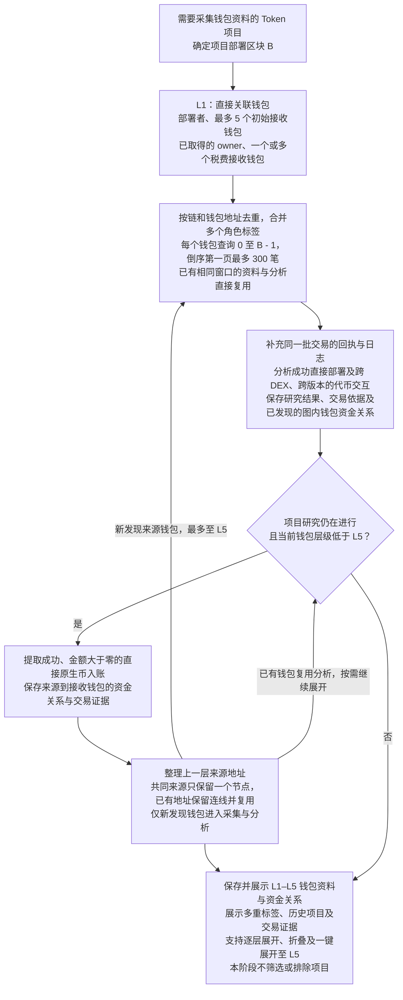

# Token 多层关联钱包研究流程

> 需求状态：讨论中
>
> 细分状态：目标设计草案，尚未实现。本文件记录已确认的 L1–L5 钱包资料采集、解析与展示范围，当前阶段不执行钱包数据驱动的项目筛选过滤；每个钱包部署前最近最多 300 笔普通交易的查询规则沿用当前实现。

## 入口与目的

首版仅 ETH 主网。输入是需要采集钱包资料的 Token 项目、项目部署区块，以及已取得的直接关联钱包。解析这些钱包直接部署过的合约、交易或交互过的项目，并逐层查找资金来源，最多追溯到 L5。各层执行相同的历史行为分析，保存历史项目与资金往来的交易依据，关联当前项目展示。

L1 为第一层直接关联钱包，包括部署者、最多 5 个初始接收钱包、已取得的 owner 及税费接收钱包。初始接收钱包的选择沿用 [Token 目标设计](token.md#研究证据与完成条件)；owner 按 [owner 获取流程](token-owner-wallet-flow.md)，先复用或由 AI 分析源码确定读取方式，再由 Go 程序读取当前合约的链上地址。税费接收钱包按 [税费接收钱包获取流程](token-fee-recipient-wallet-flow.md)，由 AI 提取源码中的固定地址，或确定读函数交由 Go 读取当前链上状态；一个合约可同时包含这两种来源，合并取得的全部地址纳入 L1。5 个上限只限制初始接收钱包；owner 和税费接收钱包可为合约地址。未取得或只取得部分结果时，记录原因并继续研究其他已知钱包。

[Ave 当前持币地址采集](token-holder-flow.md)作为独立研究资料，提供持币地址总数和 Top 100 明细，可将其中地址匹配这里已有的项目角色及资金来源关系供展示。持有目标代币本身不使地址自动成为 L1，也不触发每钱包 300 笔交易、L2–L5 资金来源或其他资产余额采集；已经属于 L1–L5 的地址仍沿用其原有范围。持币查询时间不改变本流程的部署前历史窗口。

后台自动从 L1 找资金来源形成 L2，再从 L2 找到 L3、从 L3 找到 L4、从 L4 找到 L5，不等待用户展开图。L5 对应从 L1 向上追溯四轮；L5 钱包仍需采集历史并分析部署与代币交互，但不继续发现 L6。共同来源和循环转账按下文去重规则处理，不为每条路径复制钱包。

展示采用按 L1–L5 分层的资金来源树，底层保留完整有向关系图。图示与交互说明见 [钱包资金来源关系图](token-wallet-funding-graph.md)。

## 当前阶段：采集、解析与展示

本阶段流程为“采集数据 → 解析事实与关联关系 → 保存并展示”。历史行为分析用于整理钱包直接创建过什么项目、交易或交互过什么项目，以及资金从哪里来；这些解析结果与角色标签、交易证据、余额一起展示。

当前不设置基于上述钱包数据的风险评级、通过／不通过判断或项目排除逻辑。多重身份、共同资金来源、历史项目关联、余额高低，以及资料缺失或解析未完成，都不作为本阶段过滤项目的条件。采集失败或结果为空按实际情况记录和展示，不转成项目筛选结论。

钱包数据的进一步筛选规则暂不设计；展示筛选、分支折叠及路径时间顺序核对只改变所查看的资料，不删除项目或产生项目排除结果。源码 AI 仅生成质检报告，后续由程序按管理员维护的规则判断风险；本钱包流程不执行该筛选。项目首次实际 Swap 出现后结束研究，未交接项目放弃本轮参与。

## 流程图

图中表示后台自动逐层采集的依赖，L1–L5 所有发现分支均自动研究，展示五层结果。命中已有钱包时复用分析，尚未处理来源则按层级继续，同一窗口与深度内已处理的来源不重复遍历。折叠仅改变显示。首次 Swap 截止研究，未交接项目放弃本轮参与；具体并发、限流与在途任务收尾仍待细化。

## 各层共用的历史窗口

L1–L5 均以当前项目部署区块 `B` 为基准，通过 Etherscan `account/txlist` 获取每个去重钱包的普通交易：

| 参数 | 固定规则 |
| --- | --- |
| `startblock` | `0` |
| `endblock` | `B - 1` |
| `sort` | `desc`，从新到旧 |
| `page` | `1`，只取第一页 |
| `offset` | `300`，不足时保留实际返回数量，无交易时保留空结果 |

项目部署在第 `30000` 区块时，L1–L5 都查询 `0–29999` 范围内最近的最多 300 笔。来源钱包被发现的时间、向下游钱包转账的时间，以及采集时的最新区块，均不改变这一截止高度。300 笔按每个钱包计算，不是整个项目的总量，也不额外翻页扩展为完整历史。

## 逐层发现资金来源

首版资金来源定义为：在当前待展开钱包的上述交易样本中，交易成功、接收地址为该钱包、原生币转入金额大于零的发送地址。L1–L4 使用相同规则发现上一层来源。首版链上原生币为 ETH；交易失败不能形成实际资金转入的依据。

每条资金关系保留以下内容：

| 内容 | 用途 |
| --- | --- |
| 链、来源地址、接收钱包 | 表达资金从哪个地址转入哪个钱包，箭头始终为来源到接收方 |
| 原生币种类与转账金额 | 记录实际交易中的转入金额 |
| 交易哈希、区块、区块内交易序号、时间 | 支持查回具体交易、判断先后顺序及核对部署前的关联依据 |
| 项目、钱包角色和样本来源 | 保留部署者、初始接收钱包、owner、税费接收钱包等角色，以及在哪个钱包的历史样本中发现此关系 |

从这些关系提取来源地址，逐层加入 L2–L5。多个钱包共用同一来源时，来源只分析一次，各条资金关系仍分别保留。来源已经出现在图中时连接已有节点，保留回流或跨层关系，避免沿循环重复采集。L5 不因外部入账继续新增 L6 钱包；已纳入图的钱包之间已发现的资金关系仍保留。

首版只覆盖这批样本中的直接原生币入账。USDT 等代币资金来源和内部转账未纳入本版来源扩展；样本内没有来源记录不代表钱包从未收到资金。当前不增加其他金额门槛或每层来源钱包数量上限。五层仅限制追溯深度，分支仍可能很多，后台自动采集五层，前端展示五层结果；折叠只控制显示，不作为取数入口或停止采集的依据。首次 Swap 后停止研究，保留已完成层级和未完成原因。

## 历史关系与具体资金路径

资金关系图展示样本内实际发生过的转账。多条连线在地址上连通，不直接证明同一笔资金沿该路径流动。

例如项目部署区块为 `30000`，L2 在 `25000` 区块转账给 L1，L3 在 `28000` 区块才转账给 L2。两笔交易均属于部署前历史关系，但后一笔不能解释前一笔的资金来源。

查看某笔入账的上游路径时，逐跳要求上游入账早于对应下游出账，按区块高度及区块内交易序号判断；不符合顺序的关系仍留在历史图中，不标为该笔入账的上游路径。这个筛选只作用于已取得的交易证据，不改变各层 `B - 1` 截止高度和每钱包最多 300 笔规则。时间顺序一致只是路径成立的必要条件，不自动证明混合资金中的金额归属。

## 各层共用的历史行为分析

L1–L5 每个钱包都整理以下两份清单；L5 停止向外扩展不影响其自身历史分析：

| 分析内容 | 识别与保存内容 |
| --- | --- |
| 直接部署过的合约 | 识别由该钱包发起且成功的顶层合约创建交易，保存创建出的合约地址、交易哈希、区块与时间；进一步识别是否为 Token，匹配数据库已有项目及研究报告。失败创建保留为交易尝试，不计入成功部署清单。 |
| 交易或交互过的项目 | 结合调用数据和与该钱包有关的回执日志，整理代币地址、行为、交易哈希、区块与时间，按链和代币合约地址关联项目；识别有证据的买入、卖出，并与授权、普通转账、被动收款及其他交互分别记录，不将被动收款直接视为主动参与项目。 |

直接部署地址可由 Etherscan 的 `contractAddress` 或创建交易回执取得。代币交互不能仅由普通交易的 `to` 推断：`to` 可能是路由合约，需要结合输入与代币事件分析。补充的是已选定交易的回执和日志，不扩大每个钱包的 300 笔普通交易范围，也不将整笔交易中的所有代币事件都直接归为该钱包的行为。

直接部署和交互结果以交易证据为依据；匹配到已有项目及报告时保留引用。没有在样本中发现历史部署或某代币交互，只说明本次样本未发现，不代表完整历史中没有发生。

交易回执提供创建出的 `contractAddress` 和 `logs`，ERC-20 定义了 `Transfer`、`Approval` 等事件。技术依据见 [交易回执结构](https://ethereum.org/developers/docs/apis/json-rpc/#eth_gettransactionreceipt)、[ERC-20 事件规范](https://eips.ethereum.org/EIPS/eip-20)。

### 交易项目识别的协议覆盖

钱包历史中的“交易过什么项目”以实际涉及的代币项目为识别目标，不限定为 PancakeSwap V2 或 Uniswap V2。目标覆盖当前研究链范围内不同 DEX、协议版本与交易入口，包括 V2、V3、V4 等交易机制、聚合器、通用路由和自定义路由，以及同一笔交易内的多跳或组合交易；这些是覆盖方向，不是已经实现的完整协议清单。

已确认以下规则：

- **采样入口不按协议过滤。** 仍从每个钱包部署前最近最多 300 笔普通交易出发，不先按 V2 的 `Swap` 事件、固定 Router、Factory 或几个方法名筛选，也不把采样改成“最近 300 笔 DEX 交易”。
- **先保留钱包与代币的关系。** 从同一批交易的调用数据和回执中提取能够归属于该钱包的代币及行为依据，按链和代币合约地址关联项目。DEX、路由和池是交易路径信息，不能替代实际项目地址；同一项目通过不同交易入口参与时仍归入同一个项目。
- **买卖识别结合协议语义。** 在已取得证据上解析对应协议、版本与路由的调用内容和执行日志，区分买入、卖出、授权、普通转账、被动收款和其他交互。仅出现 `Transfer`、代币净流入／净流出或某个名为 `swap` 的调用，均不足以单独认定买卖；交易成功也不代表组合调用中的每个子操作都执行成功。
- **多跳与组合交易保留实际归属。** 区分钱包实际支付／接收的代币与路由中间经过的代币，不将整笔交易中出现的全部代币都认定为该钱包主动交易过的项目。具体行为及相关代币保留对应调用或日志依据。
- **协议尚未识别时保留已有事实。** 保留原始交易、回执，以及能确定的钱包代币关系和行为；未能确认买卖时不强行填写买入或卖出，也不把协议未识别解释为该钱包没有交易过项目。不同协议的解析规则与必要补充数据后续细化，不承诺仅凭通用日志完整识别所有交易路径。

Etherscan 的 [普通交易接口](https://docs.etherscan.io/api-reference/endpoint/txlist)和[交易回执接口](https://docs.etherscan.io/api-reference/endpoint/ethgettransactionreceipt)提供交易与日志事实，具体项目及行为由本项目解析。以 [Uniswap Universal Router](https://developers.uniswap.org/docs/protocols/universal-router/concepts/commands) 为例，同一个 `execute` 入口可以包含 V2、V3、V4 交易命令以及其他操作，因此不能仅凭顶层方法名确定交易版本或参与项目。

仓库现有、独立于本阶段 ETH 范围的 [BSC V2 Swap 索引](../../design/blockchain-data/bsc-v2-swap-transactions.md)仅筛选包含固定 V2 `Swap` topic 的交易哈希，[ATHENA 聚合合约](../../design/token-intelligence/athena-contract.md)中的 V2 范围属于池与状态查询。两者均不作为钱包历史研究的唯一交易入口或协议覆盖上限。本节只规定历史交易解析，不要求研究阶段新增底池状态采集，也不改变资金来源图仅通过直接原生币入账向上扩展的规则。

## 去重、复用与项目关联

### 同一钱包的多重身份与标签

同一钱包可以同时是当前项目的部署者、owner、初始接收钱包和税费接收钱包。角色采用可同时存在的多个标签表达，不互斥，不选取一个角色覆盖其他角色；重复发现相同角色时合并该标签，并保留取得角色的依据。一个地址对应多个税费用途时，同样保留各用途与识别依据。

例如钱包 A 同时满足上述四种身份，在当前项目中只保存和展示一个钱包节点，节点同时显示“部署者”“owner”“初始接收钱包”“税费接收钱包”四个标签。钱包数量计为一个，同一历史窗口只采集一份最多 300 笔普通交易并复用分析，不因四个标签而分别采集四份；同一数据时点的余额也按地址复用。

角色标签关联具体项目及其证据。某钱包是项目 A 的 owner，不表示它也是项目 B 的 owner；跨项目复用地址资料时仍分别保留各项目角色。L1–L5 是当前项目资金图中的层级，与角色标签分别记录，多种身份不产生多个节点或重复资金连线。

### 地址与交易复用

同一项目内按链和钱包地址去重，保留钱包的全部角色与资金关联；各层使用相同窗口，已取得的交易和分析可共享复用。L1 保持为直接关联入口，其他节点按已发现关系中距离任一 L1 的最短上游追溯距离分层，层级等于该距离加一。发现更短路径时更新层级，复用既有分析并按新层级判断可展开范围；不能因访问顺序不同而漏掉五层范围内的来源。

同一笔交易可能同时出现在多个钱包样本中；资金事实按链和交易哈希去重，样本与钱包的关联分别保留。连线按链、来源、接收方和资产合并，汇总金额与笔数使用去重后的交易。完整关系图、当前展开状态、显示筛选条件分别保存，折叠或筛选不删除交易依据，显示的汇总与其可查看的明细保持一致。

跨项目复用钱包分析时，需匹配链、钱包地址、截止区块和采样规则。钱包历史会随时间变化，不能只按地址永久复用某次 300 笔结果。具体缓存结构及分析规则变化后的更新方式后续设计。

最终关联当前项目的钱包角色、两份历史行为清单、资金关系和交易证据，供查看、展开与核对。共同资金来源本身不直接等同于同一团队；即使关联历史项目已有风险报告，本阶段也只展示项目关联及报告引用，不将其传递为当前项目的排除结论。

钱包历史研究独立于 [源码 AI 静态质检](token-contract-review-flow.md)，不把钱包关系或回执解析纳入源码报告的链上核实。L1 继续按既定范围采集已追踪代币余额；L2–L5 的新增范围为历史交易、行为研究及资金关系，没有增加这些来源钱包的余额采集要求。

## 当前实现与待细化内容

当前已实现部署前最多 300 笔普通交易的采集、明细保存和摘要，见 [钱包普通交易现状](../../design/token-intelligence/wallet-normal-transactions.md)。Etherscan Manager 已返回 `contractAddress`，但 Token 的 [交易字段映射](../../../internal/token/adapters/normaltransactions/provider.go)与[交易模型](../../../internal/token/collection/model.go)尚未保存该字段，也尚未提供本流程所需的回执日志与多层历史行为分析。

初始接收钱包由 10 个缩减为 5 个、owner 与税费接收钱包的获取及纳入 L1、逐层发现 L2–L5、各层历史行为分析与结果复用、资金来源图及交互均待代码实现。本轮只更新业务设计文档。

跨 DEX、跨版本及路由的具体解析覆盖、必要补充数据、回执获取与失败处理、并发与限流、进度保存、失败恢复、存储、查询及展示接口仍待细化。自动五层取数不依赖前端；研究截止时不等待未完成分支，保留已取得结果。沿用现有采集和数据库能力承载地址、资金关系与交易证据，具体技术结构后续设计；钱包数据驱动的项目筛选不纳入当前阶段。

## 关联文档

- [Token 目标设计](token.md)
- [钱包资金来源关系图](token-wallet-funding-graph.md)
- [研究资料整理流程](token-research-materials-flow.md)
- [项目研究与筛选流程](token-research-flow.md)
- [合约 owner 获取与关联钱包采集](token-owner-wallet-flow.md)
- [税费接收钱包获取与关联钱包采集](token-fee-recipient-wallet-flow.md)
- [当前持币地址信息采集](token-holder-flow.md)
- [返回业务设计与流程图索引](README.md)
