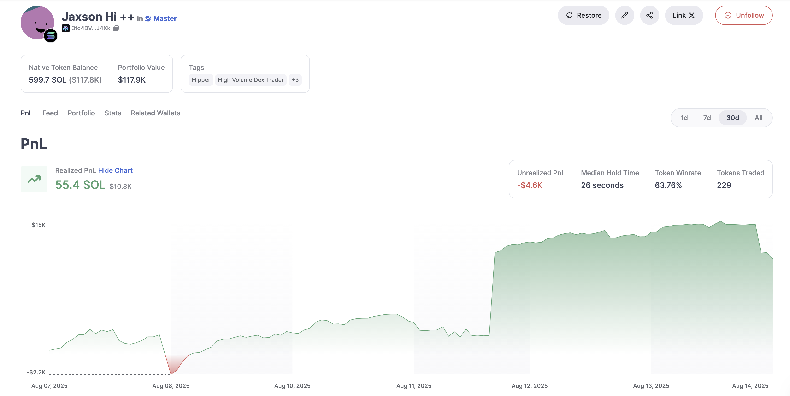

# 钱包交易与战绩产品选型调研

> 调研日期：2026-09-13。范围：Ethereum 主网的钱包交易记录、逐代币盈亏、胜率，以及直接使用成品或接入 API 的成本。
>
> 本轮核对官方产品页、帮助文档、API 文档和公开价格，未登录付费账户、购买订阅或调用需凭据的接口。功能覆盖属于官方资料证据，尚未进行同一钱包的跨产品结果实测。价格以美元计，标明年付条件；交易手续费不作为查询订阅费。

## 选型结论与已确认决定

**用户已选择 Nansen API，并确定将其接入 ATHENA；不再设计和实现本地钱包战绩计算引擎。** 当前有效需求见[钱包交易与战绩](wallet-trading-performance.md)。用户在后续核验后决定首版暂不接入胜率，先把 Nansen 返回的交易、持仓和盈亏展示清楚；胜率调查不再作为推进前置。下文各家产品的胜率能力和其他比较保留为当时的选型证据，不表示首版接入所有指标、同时接入或自动切换供应商。

初期约 3–5 个用户、查询频率低，且本地开发也需要免费额度。使用方向为 **Nansen Free API 起步，额度不足时按需购买 $10／10,000 credits**，无须为 API 订阅网页 Pro。供应商与接入方向已确认，具体接入细则继续维护；一次 Ethereum 战绩摘要实测返回 HTTP 200，消耗 1 credit。用户随后提供新的开发 Key 并自行充值 10 美元，账户接口复查返回 HTTP 200、Free 套餐、余额 10,000 credits。以上是各次验证快照，记录见[当前需求中的验证结果](wallet-trading-performance.md#api-key-最小真实验证2026-09-13)；完整字段验收和集成尚未完成。费用测算见下文。

本轮调研比较了两种减少开发的方式：

- **直接使用服务商网站**：沿用其钱包界面和指标定义，可以省去本功能的页面及结算开发。
- **接入现成 PnL API**：服务商提供交易解析与盈亏结果，ATHENA 实现查询入口、展示和必要的数据管理。

调研还比较了只买交易明细 API、由 ATHENA 计算的第三种方式。用户最终选择接入 Nansen 的现成战绩结果，不采用自行维护成本账本的方式。

未核实到产品能直接、完整配置成此前的所有自定规则，尤其是“以最新基础币价格重算历史 USD”和“只统计 WETH／USDC／USDT 直接成交段并合并成本”。用户已改为采用 Nansen 的数据与计算定义，原规则保留在[本地计算方案历史记录](wallet-trading-performance-local-calculation-history.md)，不再作为本地实现或强制等价适配要求；供应商字段含义仍须核验后准确展示。

## 先看哪些产品

| 公司／产品 | 产品长什么样、能看什么 | 公开价格及条件 | 本轮判断 |
| --- | --- | --- | --- |
| **Nansen** | 钱包 Profiler，查看代币盈亏、持仓、交易历史、地址标签；有已实现／未实现盈亏视图，API 提供胜率。[产品入口](https://app.nansen.ai/)、[Profiler 说明](https://academy.nansen.ai/articles/0252026-how-to-confirm-conviction-by-identifying-holding-patterns-with-profiler) | 有 Free；Pro **月付 $69**，**年付 $588，折合 $49/月**。[官方订阅价](https://academy.nansen.ai/articles/9412804-about-nansen-pro) | 优先体验的完整成品；Ethereum 钱包 PnL API 也可评估。 |
| **Cielo** | 以钱包追踪为中心，包含 PnL、交易动态、Portfolio、Stats 和通知；未实现盈亏及部分统计属于 Pro／Whale。[产品入口](https://app.cielo.finance/)、[钱包界面说明](https://docs.cielo.finance/wallet-tracking/my-wallets/wallet-profiles) | 网站有免费层；本轮未核实网站 Pro／Whale 的公开现金标价。**API Builder $89/月，Architect $188/月**，不能当成网页会员价。[API 价目](https://developer.cielo.finance/docs/getting-started) | 很接近本次钱包战绩需求，ETH PnL API 的范围与计费较明确。 |
| **DexCheck** | 输入地址进入 Wallet Analyzer，查看盈亏、交易历史和持仓；钱包页还有胜率、已实现／未实现收益等指标。[产品入口](https://dexcheck.ai/app/wallet-analyzer) | 官方称基础 Analyzer 免费；高级功能另有权限。通用 API 当前列 **$49／$99／$299** 三档付费价格及月调用额度。[API 价目](https://apidocs.dexcheck.ai/docs/dexcheck-api-overview) | 适合低成本先看界面；钱包 PnL WebSocket 所需具体套餐、费用周期与额度须在开通页确认。 |
| **GMGN** | 钱包分析与交易终端结合，ETH 地址页面可作为交易记录和钱包表现的产品参考。[ETH 地址示例](https://gmgn.ai/eth/address/0x5b506958c77fc30ca9727745b969b7f44e31cc1e) | 本轮未核实独立钱包分析订阅价或数据 API 价目，不把交易手续费当查询费。 | 网页可看；当前公开 Agent API 文档列 SOL、BSC、Base，并明确 ETH 接入中，暂不作为已支持 ETH 的 API 候选。[官方 API 范围](https://docs.gmgn.ai/index/gmgn-agent-api) |
| **Moralis** | 面向开发者的 Wallet PnL Summary／Breakdown 和 Swap 明细接口，需要自己的界面。[PnL 产品文档](https://docs.moralis.com/data-api/evm/wallet/wallet-pnl) | 官方月付：**Starter $149，Pro $249，Business $749**。[当前月付价目](https://docs.moralis.com/get-started/pricing) | 适合评估 API 接入，成本方法接近加权平均，但其现成结果有明确范围差异。 |
| **Zerion API** | 钱包数据平台，直接返回已实现／未实现收益、费用、投入额和资产分类，也提供交易明细。[PnL 接口](https://developers.zerion.io/api-reference/wallets/get-wallet-pnl) | Developer **免费**；Builder **$149/月**；Startup **$499/月**。[当前官网价目](https://zerion.io/api/#pricing) | 可免费验证接口；默认 FIFO，与此前选择的移动加权平均不同。 |

这些产品的 Ethereum 支持须按具体功能判断，不能用“平台支持 Ethereum”代替“该 PnL 接口支持 Ethereum”。Nansen 的[PnL 请求参数](https://docs.nansen.ai/api/profiler/address-pnl-and-trade-performance)列出 Ethereum，Cielo 的[Token PnL 接口](https://developer.cielo.finance/reference/gettokenspnl)明确提供 Ethereum 过滤，DexCheck 的[钱包 PnL WebSocket](https://apidocs.dexcheck.ai/reference/wallet-analyzer-websocket)单独列出支持范围。

## 产品界面参考

Cielo 的官方钱包页面把信息分为 PnL、Feed、Portfolio、Stats 等页签：先看钱包表现，再下钻具体代币和交易。下图是官方文档使用的 **2025 年 Solana 示例**，只用于说明页面布局，不是本次 ETH 钱包实测或当前订阅权限证明。[图片来源与功能说明](https://docs.cielo.finance/wallet-tracking/my-wallets/wallet-profiles)

Nansen 则围绕 Profiler 的 PnL、Transactions 和单个代币分析展开，支持从钱包总体表现下钻交易历史和买卖位置；可先看[交易历史操作说明](https://academy.nansen.ai/articles/8002716-use-transaction-history-and-reverse-engineer-entry-points)，再进入其[网页产品](https://app.nansen.ai/)。这些是官方界面说明，本轮没有登录验证付费功能。

## API 如何收费

**一次接口调用不等于完整分析一个钱包。** 多页代币、多个时间窗口、交易明细、刷新及重试都可能增加用量，也不能把接口请求数当成 Etherscan 原始交易笔数。

| 服务商 | 计费单位及公开额度 | 钱包 PnL 的实际约束 |
| --- | --- | --- |
| **Nansen** | API 不要求先订阅 Pro。Free 有 100 初始 credits，每日余额回补至 10；Pro 帮助页列每月 2,000 credits。另购 **$10／10,000 credits**，购买额度一年有效。[API 帮助页](https://academy.nansen.ai/en/articles/0938495-get-started-with-api) | PnL summary 和逐币 PnL 在端点总览均列 1 credit／请求。[端点用量](https://docs.nansen.ai/api/overview)；Pro 网站会员不等于无限 API。 |
| **Cielo** | Free 5,000 credits，仅 `/feed`；Builder $89、100,000 credits；Architect $188、250,000 credits。官方另注年付优惠 10%，结算方式以开通页为准。[计费表](https://developer.cielo.finance/docs/getting-started) | Token PnL **5 credits／请求**，需 Builder 起，支持分页、Ethereum、1d／7d／30d／max。首次可能返回 202，要求稍后重试。[端点文档](https://developer.cielo.finance/reference/gettokenspnl) |
| **Moralis** | 月付 Starter 含 200 万 CU，Pro 1 亿 CU，Business 5 亿 CU。[套餐](https://docs.moralis.com/get-started/pricing) | CU 表中钱包 PnL 明细 50 CU、摘要 30 CU、Swap 明细 50 CU／调用。[CU 表](https://docs.moralis.com/data-api/pricing)；FAQ 仍列免费 Starter 4 万 CU／日，但当前价目将 Starter 列为付费且未展示 Free，不能确认新账户仍可获得该免费额度或免费调用主网 PnL。[FAQ](https://moralis.com/faq/what-are-the-limits-for-api-requests/) |
| **Zerion** | Free 2,000 请求／日；Builder 25 万／月；Startup 100 万／月。[实时官网价目](https://zerion.io/api/#pricing) | PnL、Portfolio Chart、DeFi Positions 均受计划额度 25% 的专门限制，且不适用超额扩容；三类端点是否共用该限制未公开说明。不要把套餐全部请求额度当成可用 PnL 额度。 |
| **DexCheck** | 通用 API Free 2 万调用／月；Startup $49、100 万／月；Pro $99、500 万／月；Advanced $299、2,000 万／月，页面展示了划线优惠价。[价目](https://apidocs.dexcheck.ai/docs/dexcheck-api-overview) | 钱包分析位于付费 WebSocket 分类，公开页没有充分解释它与通用 REST 套餐额度的对应关系，故不以 $49 承诺买到完整钱包分析服务。[钱包 WebSocket](https://apidocs.dexcheck.ai/reference/wallet-analyzer-websocket) |

仅为理解计费、假设只调用上述单一端点且没有额外分页或重试：

- Nansen 按 1 credit／请求和 $10／10,000 credits，折合每次 $0.001 的额度消耗；这与官网另列的 x402 **$0.01 起／查询**是不同支付方式。[API 产品页](https://nansen.ai/api)
- Cielo Builder 的 100,000 credits 理论可供 20,000 次 Token PnL 请求；用满时分摊约 $0.00445／请求，订阅实际仍按套餐收费。
- Zerion 若额度全部用于 PnL 且按一调用一请求计，25% 限制对应 Free 至多约 500 次／日、Builder 62,500 次／月。高成本端点是否共享限额及实际扣费以后台为准。

Nansen 的产品页仍使用“starting credits”，较新的帮助页明确写每月 2,000；本报告按帮助页表达，同时保留页面差异。Zerion 价目已用当日官网 HTML 复核；不是仅引用旧搜索摘要。Moralis 年付展示本轮未核清，报告只列有明确说明的月付价。

## 免费 API 额度专项核对

2026-09-13 根据用户追问再次核对官方资料。此处比较可供程序调用的 API，不把免费网站功能或付费会员附赠额度视为免费 API 套餐；未注册账户或实际调用接口。

| 产品 | 免费额度与补充周期 | 免费查询钱包盈亏是否可行 |
| --- | --- | --- |
| **Nansen** | 首次 100 credits；每日余额回补至 10 credits，不是每日额外累加 10。Free 限速 15 请求／秒、300 请求／分钟。[免费计划](https://academy.nansen.ai/en/articles/0938495-get-started-with-api) | **可以按公开方案试用**。PnL 摘要、逐币 PnL 各 1 credit／请求；单查一个端点时，初始额度约 100 次，耗尽后每日回补可供约 10 次。[端点消耗](https://docs.nansen.ai/api/overview) |
| **Zerion** | Developer 每日 2,000 请求、3 请求／秒；PnL、Portfolio Chart、DeFi Positions 受计划额度 25% 限制。[免费计划](https://zerion.io/api/#pricing) | **可以按公开方案试用**。仅使用 PnL 时推算上限为 500 请求／日；三类端点是否共享限额未明确，混用时不承诺独立 500 次。接口支持 Ethereum 主网。[PnL 文档](https://developers.zerion.io/api-reference/wallets/get-wallet-pnl) |
| **Cielo** | 免费 5,000 credits、10 credits／秒；公开文档未明确免费额度的重置周期，不承诺每月补充。[免费计划](https://developer.cielo.finance/docs/getting-started) | **不开放免费 PnL**。权限表仅开放 `/feed`，逐币 PnL、盈亏汇总及交易统计均需付费。[权限表](https://developer.cielo.finance/docs/endpoints-accessibility-by-plan) |
| **DexCheck** | 通用 Free 每月 20,000 次调用、每分钟 100 次。[免费计划](https://apidocs.dexcheck.ai/docs/dexcheck-api-overview) | 钱包 PnL 位于 **Paid Websockets** 分类，不能将通用免费额度当作免费钱包盈亏额度。[钱包接口](https://apidocs.dexcheck.ai/reference/wallet-analyzer-websocket)、[付费分类](https://apidocs.dexcheck.ai/reference/paid-websockets) |
| **Moralis** | FAQ 仍标示 40,000 CU／日、1,000 CU／秒，但与当前 Starter 付费价目冲突，**当前免费额度未确认**。[FAQ](https://moralis.com/faq/what-are-the-limits-for-api-requests/)、[当前价目](https://docs.moralis.com/get-started/pricing) | 新免费账户的 Ethereum 主网 PnL 权限未确认，不列为已确认可免费调用的方案。接口未列入 Premium 清单不等于免费权限已获证实。[Premium 清单](https://docs.moralis.com/data-api/introduction/resources/premium-endpoints) |

Cielo `/feed` 文档列普通请求 5 credits、按钱包过滤 3 credits；若不开启额外市值数据，5,000 credits 分别约可供 1,000 次或 1,666 次完整请求。开启市值数据会加倍扣费。这些是交易动态请求，不是现成 PnL。[Feed 消耗说明](https://developer.cielo.finance/reference/getfeed) 其营销页另列免费可用 2 个端点，与权限文档的 1 个不一致，本轮以具体权限表判断，未将未知的额外端点计入。[营销页](https://api-info.cielo.finance/)

免费额度比较中 **Zerion 与 Nansen** 的 PnL 能力较明确；最终已选择 Nansen。上述次数均为接口请求数，不是交易笔数或可完整分析的钱包数；例如 Nansen 每个钱包都取一次摘要和一次逐币明细，至少需要 2 credits，分页或其他调用另计。资料核对不代表已经注册或调用接口。

## 成熟产品怎样定义盈亏

下面是公开接口和文档能够证明的产品设计，不推测供应商内部数据库或解析架构。差异栏对照的是原本地计算方案，仅保留选型过程的比较，不作为当前接入的本地计算要求。

| 产品 | 公开口径 | 与此前 ATHENA 规则的差异 |
| --- | --- | --- |
| **Nansen** | 按钱包、时间和代币提供 PnL；摘要有胜率，明细分已实现／未实现。买卖次数字段的定义包含流入／流出或 DEX 买卖。[PnL 文档](https://docs.nansen.ai/api/profiler/address-pnl-and-trade-performance) | 成本法及转账如何影响收益需核验；不能仅凭字段名字认定普通转出不计盈亏。没有发现最新基础币价重算历史、三项基础币白名单和中间段选择的对应配置。 |
| **Moralis** | 文档称接近加权平均；按交易对独立计算，Swap 日志价格转 USD；当前文档只列标准 V2／V3 Swap 事件签名，PnL 仅已实现且不含 Gas。[计算说明](https://docs.moralis.com/data-api/data-features/data-enrichment/profitability-pnl) | 与我们的跨交易对合并账本不同；也不能将其默认 USD 结果视为按本次最新基础币价重算。事件签名不等于仅覆盖两家 DEX；V4 与其他事件格式须另核。 |
| **Zerion** | 默认 FIFO，返回已实现／未实现、费用、外部收付和成本字段；支持链及资产过滤。[接口](https://developers.zerion.io/api-reference/wallets/get-wallet-pnl) | 成本法直接不同，最新基础币价回算及只纳入合格直接段未获确认。支持完整 PnL 不代表执行我们的规则。 |
| **Cielo** | PnL API 可按时间、链、代币筛选，并可选择是否将 CEX 转账纳入；默认不纳入 CEX 转账。[PnL 接口](https://developer.cielo.finance/reference/gettokenspnl) | 成本匹配法、普通转入来源成本、跨交易对成本合并和多跳归属未在本轮公开资料中核实。 |
| **DexCheck** | 钱包分析分已实现、未实现、外部及总收益，并有时间窗口。[钱包接口](https://apidocs.dexcheck.ai/reference/wallet-analyzer-websocket) | 这些字段的成本匹配、外部转账及窗口起点定义需实测，不能简单加总后称为同一口径的战绩。 |

由这些产品可归纳出的设计方式是：把钱包总览、逐币表现、原始交易明细分层展示；把已实现与未实现收益区分；以时间窗口和链／代币过滤控制分析范围，并把转账、费用、空投等特殊行为单独定义。这是本轮比较得出的归纳，不代表所有供应商采用相同算法。

“胜率”尤其需要核对分母。Nansen 文档描述以盈利销售判断胜率；其他产品的指标可能按代币、已关闭仓位或交易计算。本轮不将不同供应商的同名百分比直接排序，也不从一个钱包汇总 PnL 反推胜率。

## 历史与边界限制

- Nansen 的 Ethereum 数据覆盖文档起点为 2015-07-30，但单接口仍受请求范围限制；PnL 摘要文档提示可能存在约一小时缓存，不能承诺查询后每个字段都立刻更新。[数据覆盖](https://docs.nansen.ai/api/data-coverage)、[PnL 文档](https://docs.nansen.ai/api/profiler/address-pnl-and-trade-performance)
- Cielo 的 `max` 表示接口时间选项，不自动证明每个协议、转账和每一笔历史都有完整成本依据；其 FAQ 也说明复杂交易可能影响 PnL 准确性。[FAQ](https://docs.cielo.finance/faq)
- Zerion 文档列首次数据准备可能返回 503，超大钱包及自定义历史时间点存在限制；这些需要纳入试用，不仅比较成功响应的示例。[PnL 产品说明](https://zerion.io/api/endpoints/wallet-pnl)
- Moralis 等供应商提供[已解析 Swap 明细](https://docs.moralis.com/data-api/evm/wallet/wallet-swaps)，但能否保留 `USDT → CC → AA` 中 CC 的中间成交段，仍须用交易哈希逐条验证。本轮没有把它直接判定为可替代我们的取数与结算链路。

## 其他已查看的公司

| 产品 | 为什么暂不放在优先名单 |
| --- | --- |
| **Arkham** | 有钱包持仓、交易历史和 PnL 图，官方说明以资产初次转入的价值作为成本基础；更偏地址实体和资金流研究。本轮未取得可比较的公开 API 套餐金额，网页免费注册也不代表全部 API 免费。[钱包界面与截图](https://codex.arkm.com/the-intelligence-platform/profiler)、[API 产品页](https://arkm.com/api) |
| **DeBank Cloud** | 官方 User API 重点是余额、DeFi 仓位和历史，未在本轮文档中找到可直接替代逐币胜率／PnL 的端点。旧入口仍列 100 万 units／200 USDC，并注明已升级 Cloud，采购前需核对当前后台价。[接口](https://docs.cloud.debank.com/en/readme/api-pro-reference/user)、[旧入口价目](https://open.debank.com/) |
| **Ave.ai** | 项目已有相关背景，值得询问现有套餐能否扩展；但本轮公开 v2 文档主要核实到代币、价格等数据，没有找到可直接确认的钱包盈亏接口和数据套餐金额。交易 API 的费用不能当成查询费用。[公开 API 文档](https://docs.ave.ai/reference/api-reference/v2) |

## 3–5 个用户的初期套餐建议

**用户提供的规模**：平台初期约 3–5 个用户，低频查询钱包；本地开发和验证也消耗 API 额度。用户没有指定每日钱包数，下面的频率均为预算假设。

**已选择 Nansen API，使用方向为 Free 起步、按需充值额度，无须购买网页 Pro。** 其现成摘要包含盈亏与 `win_rate`，明细提供逐币买卖、成本、持仓和收益，另有钱包交易接口，较贴近钱包战绩功能。[PnL 文档](https://docs.nansen.ai/api/profiler/address-pnl-and-trade-performance)、[端点与用量](https://docs.nansen.ai/api/overview) 免费额度可做初步样本验证；持续联调或小范围上线时，按需购买 $10／10,000 credits，购买额度有效期一年，按实际消耗使用，无须为了 API 订阅 Pro。[官方计费](https://academy.nansen.ai/en/articles/0938495-get-started-with-api)

仅假设一次查看取盈亏摘要、逐币明细一页、交易记录一页，各消耗 1 credit，合计 3 credits；不代表取得整个钱包的全部历史。按 5 个用户、每月 30 天计算：

| 假设查询频率 | 月查看次数 | 月额度消耗 | 按购买单价折算的额度成本 |
| --- | --- | --- | --- |
| 每人每天 1 次 | 150 | 450 credits | $0.45 |
| 每人每天 5 次 | 750 | 2,250 credits | $2.25 |
| 每人每天 10 次 | 1,500 | 4,500 credits | $4.50 |

以上不是月度订阅价或完整生产成本：未抵扣免费额度，未计开发、分页、重试及其他端点；实际购买支出按充值额度支付，例如先购买 $10。按同一 3 credits 假设，初始 100 credits 可支持约 33 轮基础查看，之后每天回补的 10 credits 仅够约 3 轮，不能承诺覆盖 5 个用户和持续联调。开发时可保存固定响应作为本地测试样本，重复调试使用本地样本，实际数据和接口行为验证仍调用真实 API。

**此前比较的 Zerion 方案**：免费额度更充裕，适合严格零预算的接口体验；但现有 PnL 为 FIFO，公开接口未发现直接提供胜率，不能用逐币盈利比例冒充逐笔交易胜率。若采用它，需要接受其收益口径，并另行定义、实现和核验胜率。[免费额度](https://zerion.io/api/#pricing)、[PnL 口径](https://developers.zerion.io/api-reference/wallets/get-wallet-pnl)

Nansen 接入仍需按实际展示字段处理范围和含义：摘要可能缓存约一小时；成本法、转账处理及历史范围不能直接认定与原方案一致。`win_rate` 的单位与分母疑点保留为研究记录，首版已暂缓其接入与专项核实。最近 300／1,000 笔窗口、指定基础币成交段和最新价重算已退出本地实现范围，不为复现它们另建引擎。[接口定义](https://docs.nansen.ai/api/profiler/address-pnl-and-trade-performance) 官方再分发指南将钱包 PnL／摘要列为允许，交易明细需署名，同时仍有一般使用条款和竞争性使用限制；这不是对所有数据及所有用途的授权。[再分发指南](https://docs.nansen.ai/guides/redistribution-guide)

供应商及不自研计算的方向已经用户确认；用户已注册、自行充值并提供开发 Key，凭据与账户额度已有实测记录；随后完成两个钱包、三个目标接口及筛选／排序对照的两轮样本核验，详见[样本核验报告](nansen-api-validation-2026-09-13.md)。费用测算仍是使用量假设；当前按暂缓胜率后的范围继续字段映射与设计，系统接入尚未完成。

## 后续接入工作

1. **细化保留数据的展示映射**：围绕钱包总览、逐币表现和交易明细，明确展示名称、供应商字段、单位、范围与空值处理；沿用已确认的时间窗口、分页及筛选，首版不接入胜率。
2. **按展示需要核对接口数据**：复用已有样本，针对代币覆盖、排序、收发方向、持仓时间及更新时效处理实际差异；不把未知字段补成零，不继续把胜率公式或全部内部算法的澄清作为统一前置。
3. **形成 ATHENA 接入设计**：确定服务端调用、凭据、权限、刷新与结果复用、额度管理和失败处理，再按项目流程推进实现。

验证样本可覆盖普通买卖、部分卖出、外部转入后卖出、跨交易对、多跳、含税代币及窗口外买入。目标是确认 Nansen 的返回含义和展示覆盖，不是复现已经归档的本地成本规则。

若接入 ATHENA，最终套餐还需明确允许的应用内展示和缓存范围；例如 Nansen 官方区分可再分发与禁止再分发的端点，不能把网页会员等同于整套数据的展示授权。[官方 API 使用说明](https://academy.nansen.ai/en/articles/0938495-get-started-with-api)

**用户确认的当前安排（2026-09-13）：选择 Nansen API 接入 ATHENA，首版暂缓胜率，先清楚展示供应商的交易、持仓及盈亏；停止本地钱包战绩计算方案的设计与实现。** 选型及调整后的首版业务清单已确认，Key 与三个目标接口已有真实样本证据，字段展示映射、接入技术设计和实现尚未完成。原本地规则及未确认的 AA 成本建议已归档，不再作为当前接入要求。

[返回 Token 需求索引](README.md)
