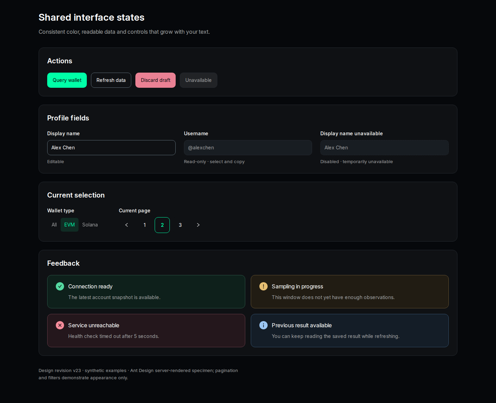

# v23 全站一致性修订

用户在总体设计审阅后要求先修复问题。本次修订保留 Nansen 单一深色、Inter／JetBrains Mono 和已确认的信息结构，补齐最终颜色、文字放大、组件状态、数字列与管理员图标的一致性。正式 `ui/` 与后端未修改；v1–v22、Token v1 的 HTML、截图和审批原件保留。

权威规则见[一致性契约](../../theme-consistency-contract.md)。本包是修订设计参考；没有新增用户逐图审批记录，不把生成样板视为正式页面已完成。

## 修复结果

| 原审阅项 | 本次修正 | 证据 |
| --- | --- | --- |
| R1：组件偏色、Market Radar 局部近似色 | 在完整深色算法之后映射最终颜色；四类反馈与按钮各态使用公共 token；品牌与业务语义分开 | [真实 Ant 样本](ant-specimen.html)、[最终 Ant 检查](evidence/checks-ant-final.json)、[Radar](theme-market-radar-v21.html?view=realtime) |
| R2：Ant 字号不变、服务状态重叠、头像溢出 | 补 Ant 6 字号变量的 rem 桥接，控件可增长；服务错误转独立行；顶栏头像用 rem | [200% 字号](screenshots/ant-text-200.png)、[服务状态](screenshots/service-text-200.png)、[Token 头像](screenshots/token-text-200.png) |
| R3：选中与只读状态不一致 | 分段深青底／青绿字，页码青绿边框；会员／管理员只读同一外观并保留选中复制，禁用输入另有区别 | [Wallets](screenshots/wallets-desktop.png)、[Combinations](screenshots/combinations-desktop.png)、[Executions](screenshots/executions-desktop.png)、[管理员 Profile](screenshots/profile-mobile.png) |
| R4：可比较数值列未对齐 | 余额／金额及对应标签右对齐、等宽数字；保留全部原始精度，文字列不强制右对齐 | [Worm Assets](screenshots/assets-desktop.png)、[Market Radar Hot](screenshots/radar-hot-desktop.png) |
| R5：两份计划可能各建主题 | Token 任务 9 明确依赖全站 T1／T2；公共字体只存一份，移除路由主题覆盖方案 | [全站计划](../../../../superpowers/plans/2026-09-14-web-ui-theme-refactor.md)、[Token 计划](../../../../superpowers/plans/2026-09-14-token-wallet-analytics.md) |
| 其他：标题、图标与文档状态 | 20px／600 区块标题、13px／400 组标题；管理员沿 v15 图标映射；更新“仍待逐页确认／尚无计划”等旧结论 | [Profile 桌面导航](screenshots/profile-desktop.png)、[主题需求](../../visual-theme.md) |

## 代表效果



[手机共用组件](screenshots/ant-mobile.png)与[200% 字号](screenshots/ant-text-200.png)可对照查看。Ant 样本由实际安装的 React／Ant Design 生成，分页和筛选为静态外观示例；输入、文字选择、键盘焦点及鼠标伪状态使用浏览器真实行为。

## 文件与复现

| 文件 | 用途 |
| --- | --- |
| [tokens.css](tokens.css) | 本修订包唯一颜色与文字角色来源，沿已确认配色 |
| [theme-reference.cjs](theme-reference.cjs) | 可执行的最终色映射；供正式 Provider 迁为 TypeScript |
| [corrections.css](corrections.css) | rem 桥接、共用状态、局部重排与数字列修正 |
| [build.cjs](build.cjs) | 从冻结原件生成八个修订 HTML 和一个 Ant SSR 样本 |
| [verify.cjs](verify.cjs) | 44 个视图及有界定向检查，可重现实际绘制与字号测量 |
| [manifest.json](manifest.json) | 八份原件及修订稿的 SHA-256、运行库版本 |

使用仓库指定 Node 24.14.1 与当前安装的 React 18.3.1、Ant Design 6.4.3、CSS-in-JS 2.1.2、Playwright 1.60.0；不需要安装其他组件库。以下从仓库根目录运行；预览进程由启动者在检查后停止：

```bash
node docs/requirements/web-ui/previews/theme-consistency-v23/build.cjs
python3 -m http.server 41823 --bind 127.0.0.1 --directory .
```

另一个终端执行：

```bash
node docs/requirements/web-ui/previews/theme-consistency-v23/verify.cjs
```

结果写入 `.superpowers/ui-theme-fixes-20260914/`。`--ant-only` 仅复核 Ant 样本，`--columns-only` 仅复核 Wallets／Worm Assets，报告明确标记局部范围。Token 原件的 CSP 原样保留：其修订稿由构建程序内联同一份 token／修正 CSS，没有允许额外来源，也不启用任何网络业务请求。

## 验证记录与边界

- 11 个视图 × 4 个条件＝**44 个视图**：1440×1050、390×844、320×844、720×1000 且根字号 200%。覆盖九份 HTML，Market Radar 三个页签分别检查。
- 修正后的整批检查 **164／166 通过**；剩余两项是 Ant 字号在 0.2 秒 CSS 过渡中被提前读取。保留[原始整批结果](evidence/checks-batch.json)，修正检查时机后定向复核四种视口，并补齐 Input 最小高度：**31／31 通过**，见[最终结果](evidence/checks-ant-final.json)。没有将失败原始记录改成绿色。
- 实际 Ant 按钮／输入／提示正文 **14→28px**，正文 **16→32px**；按钮与输入最小高度 **44→88px**。主按钮和危险按钮 normal／hover／active、四类反馈色、只读可选择、禁用区别和键盘焦点通过。
- Service Status 在 720px／200% 下状态和完整错误说明不交叠；修订稿整批无页面横向溢出、脚本错误或资源失败。管理员只读与导航图标、金额列、选中状态、Token 头像均有计算样式或边界证据。
- 最后核对发现 Wallets 与 Worm Assets 复用行类名，已把对齐规则限定为明确的 `athena-numeric-column`，保留 Wallets 的 Type／Source 文字列左对齐。两页四种视口的[27 项定向检查](evidence/checks-columns-final.json)全部通过，避免修订引入跨页影响。
- 第一轮保留在[初检结果](evidence/checks-initial.json)，包括 Ant 6 未经转换的 CSS 字号变量和 Token CSP 阻止外链样式；均在修订稿中处理。[闭环记录](evidence/resolution.json)分别关联整批与定向结果。
- 计划中 Provider 示例及完整色值映射已对当前安装的类型定义进行独立 `tsc --strict --noEmit` 检查。它证明示例类型可用，不等于正式 UI 已构建或部署。
- 本轮未进行全栈 `make run`、真实登录／供应商请求、正式 React 浮层和全组件交互、完整读屏或浏览器原生缩放验收。这些仍属于 T1–T10 的实施验证。本次静态预览与浏览器均已停止；既有开发环境保持原样。

原始字体、HTML、PNG 和审批资产不因本修订失效。Inter 是用户确认的品牌选择，沿用既有规则，不重新选择字体或关闭设计检查。
