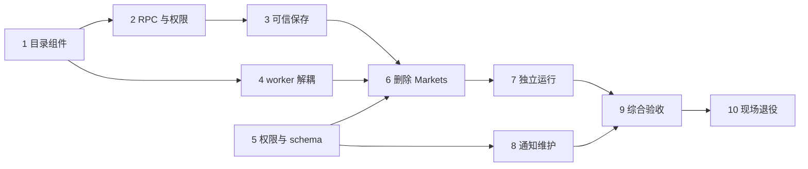

# 删除 Worm Markets、保留 Worm Trading 实施计划

> **执行代理：**逐项执行时使用 `superpowers:subagent-driven-development`（推荐）或 `superpowers:executing-plans`；步骤用 `- [ ]` 跟踪。本文只编制计划，尚未执行代码修改、服务发布或数据删除。

**目标：**让 Trading 独立承担交易所需的市场目录与保存校验，完整移除 Markets 的服务、契约、权限、运行配置和专属数据，保留 Trading 的连接、组合、执行与平仓事实。

**架构：**API 负责交互身份、请求准入和响应投影；Trading 通过内部 gRPC 提供目录与可信组合写入，后台 worker 直接调用同进程目录组件。Trading 使用独立账户状态连接池核验三个新增／改变边界的请求权限；目录不建立持久读模型。退役只处理 Markets 专属资源及五个精确通知来源。

**技术栈：**Go 1.27.1、gRPC／Protobuf、PostgreSQL／pgx／sqlc／Goose、React／TypeScript、Node 24.14.1、Yarn、Playwright。

**设计依据：**[已审阅设计](../specs/2026-09-16-worm-trading-market-query-design.md)、[需求](../../requirements/development-runtime/worm-markets-removal.md)、[服务开发规范 SDS-R1 至 SDS-R8](../../developer-guide/service-development-standards.md)。用户于 2026-09-16 完成整体审阅并要求编制本计划。

## 全局约束

- 规划基线为 `c841579e`。2026-09-16 整合 BSC／Sports 清理后，账户 `000004_remove_sports_access.sql` 已落地，现行模块集合为八项；Markets 退役应追加下一空号（当前预期 `000005`），完成后再收敛为七项。执行前仍核对最新提交与实际 migration 编号，不改写已应用迁移，不恢复已删除的 BSC／Sports 内容。
- 方案 A、专属数据直接删除、账户权限 reader 均已确认，无须重复讨论。实施期间不保留 Markets 兼容服务、重定向、双实现或功能开关。
- Trading 三组导航、七条路由、28 项业务 HTTP 及专属二次验证保留；新增目录只属于内部 gRPC。API Key 不获得交互式目录／组合权限。
- 目录只调用 `GetEvent`／`GetMarket`；最多八个子市场并发，一次组合保存最多四个事件并发。供应商顺序、不可用原因、精确 YES／NO 补值与缺价行为保持。
- 官方 Worm 地址固定。目录与 public Estimate 共用未认证限流器：100 次／分钟、burst 2；认证调用的现有限流器独立。
- `ATHENA_WORM_TRADING_WORM_API_ATTEMPT_TIMEOUT` 默认 5 秒；新增 `ATHENA_WORM_TRADING_CATALOG_BUDGET` 默认 45 秒，必须为正且不小于单次超时。限流等待计入总预算，调用者更早的 deadline 优先。
- 新目录 RPC 及组合 Create／Update 要求现有内部 Bearer、恰好一个规范 `x-athena-account-id`、当前账户矩阵及 Trading READ／READ_WRITE。owner 必须匹配；管理员不绕过业务规则。
- `ATHENA_ACCOUNT_STATE_POSTGRES_DSN` 是 Trading 显式只读权限依赖，命令拥有独立池并负责关闭；不自动迁移账户 schema，不共享 API runtime，不承诺跨库原子撤权。
- 保留 Trading 的持久快照、digest、revision、凭据 key、签名 token、任务、锁、尝试与未知结果。账户 revision 更新可能要求重新验证；不自动授权或重放请求。
- 先完成 SQL／Proto 源批次，再运行对应生成器并调整消费者；不手改生成文件。`make sqlc-local` 每个稳定 SQL 输入批次只运行一次，不为最终验收无条件重跑。
- 目标全栈为 11 个应用、5 个应用数据库；它们是相邻全栈方案的目标，不是本次强制实现的现状。访问方案公共 RPC 从 42 变为 39；其他编号不重排。
- 实现测试使用受控 Worm／Wallet／Solana 边界；真实环境只读验收不下单、不平仓、不撤销真实凭据、不发送测试通知。数据退役按任务 10 的已核实目标执行。
- 实施使用 `.worktrees/` 下隔离工作区；遵循根 `AGENTS.md`、[工具选择](../../developer-guide/toolchain-guide.md#按任务选择工具)及[本地运行与收尾](../../developer-guide/running-locally.md)。本轮文档编制不启动环境。

## 文件与职责地图

| 单元 | 源文件与责任 | 生成物／验证 |
| --- | --- | --- |
| 目录组件 | 新建 `internal/wormtrading/order_event_catalog.go`；修改 `worm_api.go`、`wormtrading.proto` | `internal/wormtrading/apiclient/wormtrading.pb.go`；新建目录与工厂测试 |
| 权限与注入 | 新建 `internal/wormtrading/account_access.go`；修改 `service.go`、`server.go`、Trading command | 新建权限、命令配置与 gRPC 边界测试 |
| API 与可信保存 | 修改 `internal/server/worm_combinations.go`、`internal/wormtrading/market_combinations.go` | 新建 HTTP／RPC 测试和组合存储集成测试 |
| worker | 修改 `internal/wormtrading/execution_plan_worker.go`、`execution_worker.go` | 新建目录故障、预览与执行恢复测试 |
| 权限 schema | `internal/accountaccess/access.go`、`internal/server/account/{account.proto,account.go}`、账户 SQL／新迁移 | account sqlc、`internal/accountstate/schema/contract.json`、公共 account 生成物与 UI 权限测试 |
| Markets 删除 | `cmd/athena-worm-markets/`、`internal/wormmarkets/`、`internal/server/wormmarkets/`、专属共享模型 | 客户端／Swagger／生成 wiring；只删除实际无消费者的产物 |
| 运行与 schema | 新建 Trading 独立 `main.go`、独立迁移命令；修改 `internal/devruntime/`、Compose、bootstrap | 独立构建、声明依赖、无 Markets 启停验证 |
| 通知维护 | 新建 `internal/notification/store/retired_worm_markets.go`、查询与 `tools/retire-worm-markets-notifications/` | notification sqlc；许可竞争、幂等和超时测试 |
| 退役工具 | 新建 `tools/retire-worm-markets-data/` | 精确库归属、前置条件、无强制断连的删除测试 |
| 验收文档 | 新建 `docs/testing/worm-markets-retirement-acceptance.md` | 记录源码检查、受控写路径、真实只读、现场退役和资源收尾五类证据 |

本文出现的新增文件均由对应任务创建；目录式范围只用于删除整模块或审阅生成产物，手写修改文件在各任务列明。测试代码片段使用所在包名和标准 import；`require` 来自仓库已有 `github.com/stretchr/testify/require`。片段给出关键断言及接口，配套表格中的每行场景各写一个命名测试，不把一个巨大测试代替独立失败定位。

## 顺序与提交边界



默认按任务编号执行。任务 5、8 在接口稳定后可独立开展，但 account SQL、生成器和共享文件只由一个执行者修改。中间提交便于审阅，不分别部署；任务 1–9 通过后形成一个一致发布版本。

每项有行为变化的任务按“测试／确认失败／实现／确认通过／提交”推进。较多测试场景逐个完成该循环；下面命令不代替每个新增用例实际观察失败。代码提交前仅暂存该任务的差异并检查 `git diff --cached --stat`，不使用 `git add .`。

## 任务 1：建立 Trading 自有目录与共用限流

**文件：**新建 `internal/wormtrading/order_event_catalog.go`、`order_event_catalog_test.go`、`worm_api_test.go`；修改 `internal/wormtrading/worm_api.go`、`wormtrading.proto`；读取迁移来源 `internal/wormmarkets/order_event_catalog.go` 及其 `service.go` 中的 URL／错误辅助函数。

**接口：**新增以下进程内接口；目录消息字段从 Markets proto 原样迁至 Trading 命名空间，暂不注册公共 API。工厂内部 `newClient` 改返回 `utilworm.Client`，现有两个工厂方法继续返回其原受限接口。

```go
type WormCatalogClient interface {
    GetEvent(context.Context, string) (*utilworm.Event, error)
    GetMarket(context.Context, string) (*utilworm.Market, error)
}
type OrderEventCatalogReader interface {
    GetOrderEventCatalog(context.Context, *apiclient.GetOrderEventCatalogRequest) (*apiclient.GetOrderEventCatalogResponse, error)
}
type orderEventCatalogReader struct {
    client WormCatalogClient
    budget time.Duration
    observe func(error)
}
func NewOrderEventCatalogReader(client WormCatalogClient, budget time.Duration, observe func(error)) (OrderEventCatalogReader, error)
// 在 WormAPIClientFactory 中增加；由原工厂的同一 limiter 创建。
// NewCatalogClient() (WormCatalogClient, error)
```

- [ ] 写入新消息并 `make protogen`，先为组件写最小桩及失败测试。RPC 声明留给任务 2，避免此时对外暴露未授权的入口。

```go
type catalogClientFunc struct {
    event func(context.Context, string) (*utilworm.Event, error)
    market func(context.Context, string) (*utilworm.Market, error)
}
func (f catalogClientFunc) GetEvent(c context.Context, id string) (*utilworm.Event, error) { return f.event(c, id) }
func (f catalogClientFunc) GetMarket(c context.Context, id string) (*utilworm.Market, error) { return f.market(c, id) }

func TestOrderEventCatalogRejectsInvalidIDBeforeProvider(t *testing.T) {
    client := catalogClientFunc{
        event: func(context.Context, string) (*utilworm.Event, error) { t.Fatal("invalid ID reached provider"); return nil, nil },
        market: func(context.Context, string) (*utilworm.Market, error) { t.Fatal("unexpected market read"); return nil, nil },
    }
    reader, err := NewOrderEventCatalogReader(client, 45*time.Second, nil)
    require.NoError(t, err)
    _, err = reader.GetOrderEventCatalog(context.Background(), &apiclient.GetOrderEventCatalogRequest{EventConditionId: "invalid"})
    require.Equal(t, codes.InvalidArgument, status.Code(err))
}
```

- [ ] 执行 `go test ./internal/wormtrading -run '^TestOrderEventCatalog' -count=1`。先补齐空接口骨架使测试可编译，确认失败是无效 ID 未拒绝，而不是 import／生成器错误。
- [ ] 迁入目录业务规则及其必要纯函数；`normalizeAssetURL` 按官方地址解析，不迁入 Markets 的可配置 provider 或存储。构造函数拒绝 nil client／非正 budget。每次入口创建预算上下文；事件失败优先映射取消、deadline、404，再映射依赖失败。子项失败保持原不可用记录，整个父上下文已结束则返回其明确错误。

```go
func (f *officialWormAPIClientFactory) NewCatalogClient() (WormCatalogClient, error) {
    return f.newClient("", "")
}
// GetOrderEventCatalog 内，ID 校验通过后覆盖其后所有 provider 调用和限流等待。
catalogCtx, cancel := context.WithTimeout(ctx, r.budget)
defer cancel()
event, err := r.client.GetEvent(catalogCtx, eventConditionID)
```

- [ ] 每行单独补齐用例并完成红／绿循环：规范／重复／错配 ID；供应商顺序；一个事件一次读取、每个唯一子项一次读取；子项 404／网络失败保留；open、margin、backend、YES／NO、每方向杠杆≥1；缺价不禁选；精确价格边界 0、1、超长小数与 NO 补值；并发≤8；取消不再派发；限流等待耗尽预算。
- [ ] 在 `worm_api_test.go` 注入计数 limiter，确认 Catalog 与 Estimate 消耗同一实例、认证客户端消耗另一个实例。用受控 HTTP transport／客户端检查读取路径无 Estimate／mutation；生产构造器仍无 BaseURL 参数。不要靠真实网络时间测试 RPM。reader 的日志记录耗时、事件 ID 与稳定错误码；构造器的 `observe` 绑定 `wormCapabilities.recordWormResult`，覆盖 RPC／保存／worker 三类调用。观察器只报告实际 provider 结果，不把无效用户输入记成供应商故障；测试传 nil，健康 SERVING 不作为真实交易成功证据。
- [ ] 执行 `go test -race ./internal/wormtrading ./util/worm -count=1`，预期上述断言通过；审阅 Proto 生成差异，提交 `feat: move order catalog reads into Worm Trading`。

## 任务 2：目录内部 RPC、服务侧权限与 API 读入口

**文件：**新建 `internal/wormtrading/account_access.go`、`account_access_test.go`、`server_catalog_test.go`、`internal/server/worm_catalog_test.go`、`cmd/athena-worm-trading/commands/athena-worm-trading_test.go`；修改 `internal/wormtrading/{wormtrading.proto,service.go,server.go}`、`internal/server/worm_combinations.go`、`cmd/athena-worm-trading/commands/athena-worm-trading.go`。

**接口：**消费任务 1 的 reader；新增下列类型／字段。`authorizeCatalogAccount` 返回规范账户 ID；owner 为空表示目录读取，非空必须完全匹配。Bearer 仍由现有 gRPC interceptor 校验。

```go
const AccountIDMetadataKey = "x-athena-account-id"
const DefaultWormCatalogBudget = 45 * time.Second
type AccountAccessReader interface {
    GetAccountAccess(context.Context, string) (accountaccess.Access, error)
}
// ServiceOptions / ServerOpts 新增：
// AccountAccessReader AccountAccessReader
// CatalogReader OrderEventCatalogReader
// WormCatalogBudget time.Duration
func (s *Service) authorizeCatalogAccount(ctx context.Context, owner string, required accountaccess.AccessLevel) (string, error)
```

- [ ] 写权限测试；用下列函数型 reader，避免连接数据库就能验证判定逻辑。

```go
type accountAccessFunc func(context.Context, string) (accountaccess.Access, error)
func (f accountAccessFunc) GetAccountAccess(c context.Context, id string) (accountaccess.Access, error) { return f(c, id) }

func TestCatalogAccountRejectsDuplicateIdentity(t *testing.T) {
    id := "d30fa35d-78a6-43d6-8faf-ed5b1b9e63d1"
    s := &Service{accountAccessReader: accountAccessFunc(func(context.Context, string) (accountaccess.Access, error) {
        t.Fatal("ambiguous identity reached account store"); return accountaccess.Access{}, nil
    })}
    ctx := metadata.NewIncomingContext(context.Background(), metadata.Pairs(AccountIDMetadataKey, id, AccountIDMetadataKey, id))
    _, err := s.authorizeCatalogAccount(ctx, "", accountaccess.AccessLevelRead)
    require.Equal(t, codes.Unauthenticated, status.Code(err))
}
```

- [ ] 执行 `go test ./internal/wormtrading -run '^TestCatalogAccount' -count=1`，补齐接口骨架后确认当前缺失的身份校验导致断言失败。
- [ ] 增加内部 RPC 并生成；实现 ID 的唯一性、非零规范 UUID、owner 一致性、实时读取及矩阵判定。`pgx.ErrNoRows`／NotFound → PermissionDenied，读取故障 → Unavailable，取消／deadline 保留；无效持久矩阵返回 Internal 且拒绝。`LoginEnabled=false` 或管理员进入业务入口均拒绝；READ 接受 read／read_write，写入只接受 read_write。

```proto
rpc GetOrderEventCatalog(GetOrderEventCatalogRequest) returns (GetOrderEventCatalogResponse);
```

```go
func (s *Service) GetOrderEventCatalog(ctx context.Context, req *apiclient.GetOrderEventCatalogRequest) (*apiclient.GetOrderEventCatalogResponse, error) {
    if _, err := s.authorizeCatalogAccount(ctx, "", accountaccess.AccessLevelRead); err != nil { return nil, err }
    return s.catalogReader.GetOrderEventCatalog(ctx, req)
}
```

- [ ] 修改构造器：生产默认由同一个 `WormAPIClientFactory` 创建 CatalogReader；测试允许注入受限 reader。增加 `Service` 的 `accountAccessReader`、`catalogReader`、`wormCatalogBudget` 字段。缺 reader 或无效预算使构造失败。命令通过 `accountstore.NewSQLStoreSource()(cmd.Context())` 打开已验证 schema 的独立池并 `defer utilio.Close(accountStore)`；命令变量／flag 增加 catalog budget，检查 budget≥attempt timeout。
- [ ] API 的 GET 处理先沿用 `authenticateInteractiveWormTradingHTTP`，从返回的真实会话身份创建内部 metadata，保留其余必要内部 metadata，使用 `Set` 替换同名键。调用 `WormTradingClientset.WormTrading().GetOrderEventCatalog`，响应投影改用 Trading 消息。不要复制浏览器 header 中的身份。

```go
md, _ := metadata.FromOutgoingContext(ctx)
md = md.Copy()
md.Set("x-athena-account-id", authenticatedAccountID)
ctx = metadata.NewOutgoingContext(ctx, md)
```

- [ ] 补齐 bufconn gRPC 测试：缺／错 Bearer、缺／重复／非规范身份、Markets-only、READ／READ_WRITE、停用登录、管理员、账户不存在／库故障；断言拒绝时 provider 零调用。HTTP 测试覆盖 API Key 拒绝及伪造 header 无效。用两次请求间修改 reader 返回值证明没有权限缓存。
- [ ] 执行 `make protogen` 后调整消费者，运行 `go test ./internal/wormtrading ./internal/server ./cmd/athena-worm-trading/commands -count=1`。预期合法交互 GET 保持原响应，拒绝路径正确。提交 `feat: authorize Trading catalog reads against current account access`。

## 任务 3：由 Trading 生成组合可信快照

**文件：**修改 `internal/wormtrading/{wormtrading.proto,market_combinations.go}`、`internal/server/worm_combinations.go`；新建 `internal/wormtrading/market_combination_resolver.go`、`market_combinations_test.go`、`store/market_combinations_integration_test.go`、`internal/server/worm_combinations_test.go`。现有 `store/market_combinations.go` 只在测试发现原子性缺口时作本范围修复。

**接口：**内部 `MarketCombinationItemInput` 只剩用户选择；保存快照仍使用现有 `wormstore.MarketCombinationItemInput`，结果消息不变。reader 使用任务 1，服务授权使用任务 2。

```proto
message MarketCombinationItemInput {
  string event_condition_id = 1;
  reserved 2, 3, 5, 6, 8;
  reserved "event_title", "event_logo", "market_title", "market_logo", "outcome_label";
  string market_condition_id = 4;
  bool is_yes = 7;
}
```

```go
func (s *Service) resolveMarketCombinationItems(ctx context.Context, selections []*apiclient.MarketCombinationItemInput) ([]wormstore.MarketCombinationItemInput, error)
```

- [ ] 写保存错误场景测试；下列 store spy 只覆盖目标方法，嵌入接口的其他方法若被误调用会直接失败。测试设置 `started=true` 仅适用于 service 单元测试，不启动后台 worker。

```go
type combinationStoreSpy struct {
    wormstore.Store
    saved []wormstore.MarketCombinationItemInput
}
func (f *combinationStoreSpy) CreateMarketCombination(_ context.Context, owner, name string, items []wormstore.MarketCombinationItemInput) (*wormstore.MarketCombination, error) {
    f.saved = append([]wormstore.MarketCombinationItemInput(nil), items...)
    return &wormstore.MarketCombination{OwnerAccountID: owner, Name: name, Revision: 1}, nil
}
func TestMarketCombinationRejectsEmptySelection(t *testing.T) {
    s := &Service{wormCatalogBudget: 45*time.Second}
    _, err := s.resolveMarketCombinationItems(context.Background(), nil)
    require.Equal(t, codes.InvalidArgument, status.Code(err))
}
```

- [ ] 运行 `go test ./internal/wormtrading -run '^TestMarketCombination' -count=1`，确认空选择未拒绝／当前保存仍信任输入快照的行为失败；不是只验证 spy 是否被调用。
- [ ] 修改 proto、执行 `make protogen`，同步 API 输入转换和 Trading 消费者。删除 API 的远端目录聚合／权威验证；保留 body 限制、名称和选择语法校验。API 保存调用写入可信身份 metadata。Trading Create／Update 首先要求 READ_WRITE 与 owner 匹配，Update 要求正 revision。
- [ ] 将 API 当前 `resolveWormCombinationItems` 的去重、事件归属、方向和快照组装迁至 resolver，用内部 reader、一个父预算与并发4，按原选择顺序组装。所有远端读取完成后再调用原 store，不把查询放进 DB 事务。

```go
resolveCtx, cancel := context.WithTimeout(ctx, s.wormCatalogBudget)
defer cancel()
group, groupCtx := errgroup.WithContext(resolveCtx)
group.SetLimit(4)
// 每个唯一事件的任务传 groupCtx 给 catalogReader；结果按输入 ordinal 组装。
```

- [ ] 分别验证服务实际返回／保存的标题来自目录、篡改旧字段不能影响结果、跨事件顺序、重复市场、市场不属于事件、不可选方向、404 与超时。空选择／重复选择／非法 ID 返回 InvalidArgument；已不存在或不可选的合法选择返回 FailedPrecondition；依赖故障、取消、deadline 不伪装成成功保存。
- [ ] 在真实隔离 PostgreSQL 中用 `pgtest.New(t, wormstore.Migrations(), "migrations")` 验证创建 revision=1、更新期望 revision 冲突、活动 Run 锁、删除锁与有序 items。用查询阻塞／释放屏障，让读取后另一事务修改 revision，再断言最终保存冲突；由此验证事务重检，而不是在 fake 中假定冲突。
- [ ] 运行 `go test ./internal/wormtrading ./internal/server -count=1` 及 `go test -tags=integration ./internal/wormtrading/store -run 'MarketCombination' -count=1`，预期可信快照和并发不变量通过。提交 `refactor: validate market combination selections in Trading`。

## 任务 4：预览与执行前检查解除 Markets 依赖

**文件：**修改 `internal/wormtrading/{execution_plan_worker.go,execution_worker.go,service.go,server.go}`、`cmd/athena-worm-trading/commands/athena-worm-trading.go`；新建 `internal/wormtrading/execution_catalog_test.go`、`execution_worker_test.go`。核对 `position_cash_out_worker.go`、`position_cash_out_batch_worker.go` 的实际恢复消费者，不改变外部副作用协议。

**接口：**保留 `readExecutionPlanCatalogs(context.Context, []wormstore.ExecutionPlanItem) ([]executionPlanCatalogItem, error)` 和 `executeFreshPreflight` 的现有参数；前者消费 `OrderEventCatalogReader`，不经过服务 RPC 的交互鉴权。

- [ ] 写目录故障测试：

```go
type catalogReaderFunc func(context.Context, *apiclient.GetOrderEventCatalogRequest) (*apiclient.GetOrderEventCatalogResponse, error)
func (f catalogReaderFunc) GetOrderEventCatalog(c context.Context, r *apiclient.GetOrderEventCatalogRequest) (*apiclient.GetOrderEventCatalogResponse, error) { return f(c, r) }

func TestExecutionCatalogPropagatesCancellation(t *testing.T) {
    ctx, cancel := context.WithCancel(context.Background())
    cancel()
    s := &Service{wormCatalogBudget: 45*time.Second, catalogReader: catalogReaderFunc(func(c context.Context, _ *apiclient.GetOrderEventCatalogRequest) (*apiclient.GetOrderEventCatalogResponse, error) {
        return nil, status.FromContextError(c.Err()).Err()
    })}
    _, err := s.readExecutionPlanCatalogs(ctx, []wormstore.ExecutionPlanItem{{EventConditionID: "11111111111111111111111111111111"}})
    require.Error(t, err)
}
```

- [ ] 添加合法目录用例，断言输出可交易项而非仅 `require.Error`；旧实现因没有 MarketsClientset 失败，构成实际切换的红测试。运行 `go test ./internal/wormtrading -run '^TestExecutionCatalog' -count=1`。
- [ ] 替换旧 client 调用和 `wormmarketsapiclient` 类型为 Trading 类型，同一 build/preflight 内仍按唯一事件读取；共享 worker 上下文与目录预算，保持原 failure reason code（其中“markets”可以表示交易市场，不能机械删除）。

```go
catalogCtx, cancel := context.WithTimeout(ctx, s.wormCatalogBudget)
defer cancel()
response, err := s.catalogReader.GetOrderEventCatalog(catalogCtx, &apiclient.GetOrderEventCatalogRequest{EventConditionId: item.EventConditionID})
```

- [ ] 删除 `ServiceOptions`、`ServerOpts`、`Service` 中的 `WormMarketsClientset`、命令 env／flag／构造与 close；构造函数改为验证 catalogReader。不能通过空 client 或 dummy 地址满足旧检查。
- [ ] 加屏障测试：预览成功后把同一市场改为 closed，执行 fresh preflight 必须失败，受控 Worm Web 客户端的 Open 次数为零；目录不可达时也为零。合法路径确认只在既有 proof、余额、敞口、锁校验后出现一次 Open；预览全程 mutation 为零。
- [ ] 使用现有 durable store 方法布置 Run 与 Cash Out 状态，补入 `execution_worker_test.go`／任务 9 的集成夹具，验证暂停／恢复、unknown 不重放、同钱包市场隔离、单笔与批量 Cash Out 互斥及批量 USDC 门槛。无需改持久格式，也不为测试放宽 proof。
- [ ] 运行 `go test -race ./internal/wormtrading ./cmd/athena-worm-trading/commands -count=1`，确认构造与 worker 不需要 Markets；提交 `refactor: remove Markets dependency from Trading workers`。

## 任务 5：移除 Markets 授权并升级账户 schema

**文件：**修改 `internal/accountaccess/access.go`、`internal/server/account/{account.proto,account.go}`、`internal/accountstate/store/{sql_store.go,queries/account_access.sql,queries/account_directory.sql}`、`ui/src/app/shared/access-modules.ts`；扩展现有 `internal/accountstate/store/access_integration_test.go`、`ui/src/app/shared/access-modules.test.ts`；新建 `internal/accountstate/store/worm_markets_removal_integration_test.go`。生成 account sqlc／公共 account／schema contract。新迁移名规则见第一步。

**接口：**`accountaccess.AllModules()` 不再包含 `worm_markets`；账户 API 枚举保留其余数字，移除编号5并 reserved；Trading 编号11不变。以整合后的八项权限为基线，删除 Markets 后为七项；执行时核对最新正式模块集合。

- [ ] 执行 `rg --files internal/accountstate/store/migrations | sort` 并读取相邻 [BSC／Sports 计划](2026-09-16-module-removal-cleanup.md)。整合基线已包含并应用 `000004_remove_sports_access.sql`，当前应新建 `000005_remove_worm_markets_access.sql`。若更多迁移已落地，取最大实际版本+1，以六位编号写入实施记录；不得改写任何已应用迁移。
- [ ] 写全新库断言：

```go
func TestNewAccountHasNoWormMarketsGrant(t *testing.T) {
    db := pgtest.New(t, migrations.FS, migrations.Dir)
    ctx := context.Background()
    s := accountstore.NewSQLStore(db.Pool)
    account, err := s.EnsureDevelopmentAccount(ctx, accountcredentials.DevelopmentRoleMember)
    require.NoError(t, err)
    access, err := s.GetAccountAccess(ctx, account.ID)
    require.NoError(t, err)
    _, exists := access.Modules[accountaccess.Module("worm_markets")]
    require.False(t, exists)
    require.Contains(t, access.Modules, accountaccess.ModuleWormTrading)
    require.NoError(t, access.Validate())
}
```

- [ ] 运行 `go test -tags=integration ./internal/accountstate/store -run 'WormMarkets' -count=1`，预期当前默认矩阵含 Markets 而失败。
- [ ] 写追加迁移：按权限发布既有机制锁定受影响账户、删除精确模块行、递增其 `account_access.revision`，收紧 module check。保存其他权限与账户，不得恢复已删除的 Sports 模块。已应用的000001至000004全部保留。下面是同一事务内的核心数据变更；完整迁移同时更新 constraint。

```sql
WITH affected AS (
  DELETE FROM account_module_access WHERE module = 'worm_markets'
  RETURNING account_id
)
UPDATE account_access SET revision = revision + 1
WHERE account_id IN (SELECT account_id FROM affected);
```

- [ ] 删除 default seed SQL、UpdateAccountModuleAccess CASE 与 Go 参数中的 Markets 项；修改 module enum 和 UI 权限选项。最终约束从当前实际合法模块集合生成／写出，减去 Markets，尊重已落地 Sports 删除。迁移 Down 明确拒绝恢复已删除权限，不伪造历史 grant。

```proto
reserved 5;
reserved "ACCOUNT_DATA_MODULE_WORM_MARKETS";
```

- [ ] 完成该批 SQL 后运行 `make sqlc-local`；再调整生成参数消费者。运行 `make protogen` 和 `make account-state-schema-contract`，审阅最终约束、所有账户初始化入口及数字映射。
- [ ] 用 `pgtest.NewUnmigrated` 及 Goose `UpToContext` 建立已应用000004的升级 fixture，记录 Trading／其他 grant、账户 revision、通知及业务关联后执行新的 Markets 迁移；断言只删 Markets、revision 正确、原 proof 按旧规则失效而任务仍存。另验证从000003依次执行实际 Sports 迁移及 Markets 迁移的完整升级链；两类升级结果与全新库的最终 schema catalog 一致，三类 Sports 权限仍被约束拒绝。所有 fixture 复用正式历史迁移，不再构造 Markets→Sports 的反序路径或改写已应用文件。
- [ ] 运行 `go test ./internal/accountaccess ./internal/server/account -count=1`、`go test -tags=integration ./internal/accountstate/store ./internal/accountstate/schema -count=1`，以及 `cd ui && yarn test --runInBand src/app/shared/access-modules.test.ts`。预期无 Markets 授权、其他编号／授权保持。提交 `refactor: remove Worm Markets account grants`。

## 任务 6：删除 Markets 服务、公共契约和运行残留

**删除：**`cmd/athena-worm-markets/`、`internal/wormmarkets/`、`internal/server/wormmarkets/`、`pkg/apis/application/v1alpha1/worm_markets_types.go` 及其确认无消费者的 Markets 生成包。

**修改：**`cmd/main.go`、`cmd/athena-server/commands/athena-server.go`、`common/common.go`、`internal/server/{athena-server.go,authz.go}`、`internal/server/servicestatus/service_status.go`、`internal/migration/modules.go`、`internal/devruntime/{registry.go,fullstack.go}`、`sqlc.yaml`、`docker-compose.prod.yml`、`hack/postgres/init/00-databases.sql`、`hack/lib/account-state-deploy.sh`、`hack/generate-proto.sh`、`tools/prod-env-reset/main.go`、`ui/src/app/admin/pages/service-status.tsx`、`ui/src/assets/docs/ai/{modules.md,errors-and-pagination.md}`。

**测试：**扩展 `internal/devruntime/{registry_test.go,fullstack_test.go}`、`ui/src/app/admin/pages/service-status.test.tsx`；新建 `internal/server/worm_markets_removal_test.go`。运行配置 `.env`／`.env.prod` 只在实际存在的目标副本中删除精确 Markets 键，不重写其他 key，也不把本机配置提交进仓库。

**接口：**不存在 Markets HTTP／公共或内部 gRPC 注册、Service Status 条目、默认端口、迁移模块或环境键。Trading 与 `util/worm` 保留。

- [ ] 给现有全栈 schema 注册写失败断言：

```go
func TestFullStackDoesNotPrepareWormMarkets(t *testing.T) {
    for _, module := range fullStackModules() {
        if module.Name == "worm-markets" || module.Database == "worm_markets" {
            t.Fatalf("retired module would be recreated: %+v", module)
        }
    }
}
```

- [ ] 运行 `go test ./internal/devruntime -run '^TestFullStackDoesNotPrepareWormMarkets$' -count=1`，预期失败；API 测试同时验证原三条 Markets 公共 RPC 无注册、旧 HTTP 路径不再提供业务响应，Trading GET 仍在。
- [ ] 先 `rg -n 'wormmarkets|WormMarkets|WORM_MARKETS|worm-markets|worm_markets' cmd common internal pkg ui sqlc.yaml docker-compose.prod.yml hack tools` 记录所有消费者，再按上表删模块及 wiring。对 `Worm`、`MARKETS_UNAVAILABLE`、Trading 数据库里的 `worm_market_combinations` 不作通配删除。
- [ ] 删除源入口后运行 `make sqlc-local`、`make protogen`，检查 `pkg/apiclient/wormmarkets/`、`assets/swagger.json`、共享 generated proto／deepcopy 等实际产物。生成器不会主动清理的孤儿文件按来源确认删除；`*_types.go` 删除涉及 `pkg/apis/application/v1alpha1/zz_generated.deepcopy.go`，使用 `make clientgen` 重新生成其来源产物。保留 `util/worm` 的协议类型及仍被 Trading／Wallet 使用的签名与认证代码。
- [ ] 删除 Markets 权限和健康文案，复用已确认单一深色主题，不重排 Trading 导航。更新 AI API 说明，避免页面仍指引已删 RPC；历史批准记录保持事实并引用退役设计，不批量改写历史。
- [ ] 运行 `go test ./internal/server/... ./internal/devruntime ./internal/migration -count=1`、`go build ./cmd/athena-server`，以及 UI 的 access／status／Trading scope 测试；运行 `cd ui && yarn tsc --noEmit --project ./src/app`。残留搜索预期仅出现历史迁移／历史文档／退役工具／删除断言，不允许活跃依赖。提交 `refactor: retire Worm Markets service and public APIs`。

## 任务 7：Trading 独立构建、schema 和最小运行

**文件：**新建 `cmd/athena-worm-trading/main.go`、`cmd/athena-worm-trading-migrate/main.go`、`cmd/athena-worm-trading-migrate/main_test.go`、`internal/wormtrading/store/schema.go`、`schema_integration_test.go`、`internal/devruntime/worm_trading.go`、`worm_trading_test.go`、`worm_trading_integration_test.go`；修改 `internal/devruntime/{registry.go,launch.go,environment.go,fullstack.go}`、`internal/wormtrading/store/sql_store.go`、Trading command、`Makefile`、`docker-compose.prod.yml`、`docs/developer-guide/running-locally.md`。

**接口：**`make build-service SERVICE=worm-trading`、`make run-service SERVICE=worm-trading INSTANCE=worm-retirement DB_MODE=managed` 正向选择账户库、Trading 库与配置过的 Wallet signer／Solana 依赖；不准备 Markets 或不相关业务 schema。外部 DB 模式只 verify，不创建／迁移。独立迁移工具支持 `up`／`verify`，只导入 Trading migrations，不构建全服务分派入口。

- [ ] 写运行选择红测试：

```go
func TestWormTradingIsAnIndependentService(t *testing.T) {
    specs, err := ResolveServices([]string{"worm-trading"})
    require.NoError(t, err)
    require.Len(t, specs, 1)
    require.Equal(t, "./cmd/athena-worm-trading", specs[0].BuildPackage)
    require.Contains(t, specs[0].EnvironmentKeys, "ATHENA_ACCOUNT_STATE_POSTGRES_DSN")
    require.Contains(t, specs[0].EnvironmentKeys, "ATHENA_WORM_TRADING_CATALOG_BUDGET")
    require.NotContains(t, specs[0].EnvironmentKeys, "ATHENA_WORM_MARKETS_SERVER_ADDRESS")
}
```

- [ ] 执行 `go test ./internal/devruntime -run '^TestWormTrading' -count=1`，当前未知 service 的失败必须可复现。
- [ ] 新入口直接调用已有 command，独立构建不依赖 `cmd/main.go`。迁移命令使用现有 Cobra 的 `up`／`verify` 子命令、正数 `--timeout` 默认120s及显式 `ATHENA_WORM_TRADING_POSTGRES_DSN`；up 调用 `postgres.Migrate(ctx, dsn, wormstore.Migrations(), "migrations")`。
- [ ] 在 store 中实现 `func VerifySchema(ctx context.Context, pool *pgxpool.Pool) error`：用只读 RepeatableRead 事务，先检查 `to_regclass('public.goose_db_version')`，再按账户 schema 的有效版本查询方式比较 Trading embed 中完整版本集合。缺版本、未来版本、缺失下列业务表均失败：连接／凭据／连接尝试、组合／items、plan／wallets／items／steps、Run／wallets／items／steps／authorizations／coordinators／commands／mutation attempts／三类锁、单笔 Cash Out／authorizations／commands／attempts、batch／wallets／wallet locks／items／authorizations／commands、wallet selections／items／retirements。精确表名取各 Trading migration 的 `CREATE TABLE`，不把数据库 Ping 当成 schema verify。该检查验证版本与所需关系存在，不宣称已做账户库那样的完整 catalog 指纹比较。
- [ ] Trading `NewSQLStoreSource` 改为显式 DSN → `postgres.OpenPool` → `VerifySchema`，失败关闭池；正常启动不再调用 `ConnectAndMigrate`，也不回落默认库。独立工具的 verify 复用此路径，缺库时不得创建 `goose_db_version`。用只读角色、旧库、空库、未来版本库和迁移后库验证行为。schema 新建仅发生在显式工具或受控 managed 准备阶段。

```go
package main

import (
    "fmt"
    "os"
    "github.com/useryege/athena/cmd/athena-worm-trading/commands"
)
func main() {
    if err := commands.NewCommand().Execute(); err != nil {
        fmt.Fprintln(os.Stderr, err)
        os.Exit(1)
    }
}
```

- [ ] 将 Trading 的环境键逐个加入 registry：Trading DSN／监听地址／端口／Solana URL／RPC 超时与限流／Worm 单次超时／catalog及position预算／position并发／加密 key／内部 token／Wallet signer 地址与 token／账户 DSN。不得用 `ATHENA_WORM_*` 通配透传。复用实例环境映射把 API 的 Trading 地址指向该实例。
- [ ] 在 `worm_trading.go` 新增 `func (m *Manager) prepareWormTradingDatabase(ctx context.Context, env map[string]string) error`：managed 模式从本实例 PostgreSQL 地址创建／升级 `worm_trading`，使用新独立迁移二进制；external 模式只验证显式DSN。`launch.go` 的 `runResolved` 在账户 schema 准备后、服务启动前且仅在 selected Trading 时调用。账户 schema 继续由现有 owner 管理；Trading service 只 verify。
- [ ] 当前 registry 不支持独立 Wallet，独立 Trading 使用显式配置的现有 signer；隔离启动测试使用任务 owned 的签名替身。真实 UI 验收使用正确的默认 `make run` 提供账户／Wallet／API／UI，再以 external DB 模式启动独立 Trading，显式引用该环境的账户库、Trading库与Wallet signer；API启动前绑定其Trading地址。不扩展 Wallet 的业务边界或整套 11 应用运行图，不另建空账户库并把跨环境身份当作同一账户。记录两个实例的借用关系，Trading停止时不停止被借用的依赖。
- [ ] 为启动和停止补测试：预算非法、账户 schema错误、凭据 key／signer token缺失均拒绝启动；Worm provider运行中失败只影响目录／需上游操作；原组合／历史仍可读。现有 `grpcServer.GracefulStop` 改成有界等待后 `Stop`，再调用现有 `server.Stop`，不把进程退出解释为外部请求取消。确认两个连接池关闭、worker释放、owned进程退出。
- [ ] 运行 `go build ./cmd/athena-worm-trading ./cmd/athena-worm-trading-migrate`、相关 command／devruntime 测试；在隔离集成环境验证无 Markets env／数据库／进程也能启动。记录 `make runtime-status INSTANCE=worm-retirement` 与相同 instance 的停止结果。提交 `feat: support standalone Worm Trading runtime`。

## 任务 8：五来源通知的有界退役维护

**文件：**新建 `internal/notification/store/{retired_worm_markets.go,retired_worm_markets_integration_test.go,queries/retired_worm_markets.sql}`、`tools/retire-worm-markets-notifications/{main.go,main_test.go}`；生成 `internal/notification/store/sqlc/`。复用现有 `attempts.go`／`queries/delivery_attempts.sql` 的 system row permit lock，不改发送事实。

**接口：**store 暴露一次有界批次，命令负责循环和总 deadline，默认只报告；`--apply` 才取消 pending。不存在任意来源／前缀参数。

```go
type WormMarketsRetirementCounts struct {
    Cancelled int64
    Pending int64
    Sending int64
}
func (s *SQLStore) RetireWormMarketsNotifications(ctx context.Context, batchSize int32) (WormMarketsRetirementCounts, error)
func (s *SQLStore) CountWormMarketsNotifications(ctx context.Context) (WormMarketsRetirementCounts, error)
```

- [ ] 利用现有 `attemptFixture(t, "system")`、`deliveryState` 写许可边界测试，先将 fixture source 更新为本次精确来源：

```go
func TestRetireWormMarketsDoesNotRewriteSending(t *testing.T) {
    s, ref := attemptFixture(t, "system")
    ctx := context.Background()
    _, err := s.pool.Exec(ctx, "UPDATE system_notification_deliveries SET source=$1 WHERE id=$2", "worm-markets.new-event", ref.ID)
    require.NoError(t, err)
    _, err = s.Authorize(ctx, testPermitCandidate(ref), uuid.New(), nil)
    require.NoError(t, err)
    counts, err := s.RetireWormMarketsNotifications(ctx, 100)
    require.NoError(t, err)
    require.EqualValues(t, 1, counts.Sending)
    require.Equal(t, "sending", deliveryState(t, s, ref))
}
```

- [ ] 另写 pending 必须变 cancelled 的红测试，运行 `go test -tags=integration ./internal/notification/store -run 'RetireWormMarkets' -count=1`；不能只用保持旧状态的用例证明新功能。
- [ ] 新查询固定五个 source；按 ID 顺序 `FOR UPDATE SKIP LOCKED` 限量锁定，更新时再次要求 `status='pending'`。取消与发送 Authorize 争用同一行锁，先获发送许可的 sending 留给现有结果／恢复机制。

```sql
WITH candidates AS (
  SELECT id FROM system_notification_deliveries
  WHERE status = 'pending' AND source IN (
    'worm-markets.new-event', 'worm-markets.live-event',
    'worm-markets.price-alert-80-20', 'worm-markets.price-alert-90-10',
    'worm-markets.price-alert-95-5'
  )
  ORDER BY id LIMIT $1 FOR UPDATE SKIP LOCKED
)
UPDATE system_notification_deliveries d
SET status='cancelled', error_message='WORM_MARKETS_RETIRED', locked_at=NULL, locked_by=NULL
FROM candidates c WHERE d.id=c.id AND d.status='pending';
```

- [ ] 完成查询后 `make sqlc-local`。维护命令使用账户状态同一 schema 的 Notification SQLStore，新建独立池并关闭；`--timeout` 默认2m、`--batch-size` 默认100且正数，输出 JSON counts；超时非零退出，报告 remaining pending／sending。结果回到 pending 后下一轮取消；sent／failed／unknown、attempt、topic、Bot offset 和其他来源完全保留。已取消行不可获得新 permit。若 Sports 工具已经实现，只复用通用锁与循环，不引入其来源集合。
- [ ] 补测试：五来源全覆盖、近似名称不匹配、其他来源、双向锁竞争、retry回pending、unknown不重试、重复执行零新增变更、报告模式不写入、超时不谎报完成。运行 Notification store 集成测试和工具单测后提交 `feat: retire pending Worm Markets notifications precisely`。

## 任务 9：跨层验收与退役前证据

**文件：**新建 `docs/testing/worm-markets-retirement-acceptance.md`、`internal/wormtrading/retirement_integration_test.go`、`ui/e2e/worm-trading-retirement.spec.ts`、`ui/playwright.worm-retirement.config.ts`；修改 `ui/e2e/theme-refactor/{worm-assets-combinations.ts,worm-executions.ts}`，将隔离写场景注册到现有 `theme-refactor.spec.ts`。扩展现有 `ui/src/app/member/pages/{worm-trading-scope.test.tsx,worm-combination-delete-scope.test.tsx,worm-execution-scope.test.tsx}`。

**接口：**受控集成夹具使用真实 Trading SQLStore、任务 1 的受限 catalog client 和现有 Worm Web／Wallet signer 接口。隔离写路径进入既有 theme suite；新增 browser spec 只跑真实只读路径，不执行保存／连接／交易等写入。独立 Playwright 配置显式匹配该 spec，避免被原配置的固定 testMatch 排除。

- [ ] 在 `retirement_integration_test.go` 创建 `newRetirementFixture(t *testing.T) *retirementFixture`；该测试类型包含 `Service *Service`、`Store *wormstore.SQLStore`、`OpenCalls atomic.Int64`、`CloseCalls atomic.Int64`、`CatalogCalls atomic.Int64`，工厂内部使用 `pgtest.New`、真实凭据 cipher、受控 Worm／Wallet／Solana 接口和合法 proof。每个外部 mutation 先记录请求，返回确定回执；另提供 context 截断／unknown 分支，禁止真实网络 fallback。
- [ ] 为新行为补失败回归：原连接／组合／plan／Run／Cash Out／batch 在仅取消 Markets 依赖后仍可读取；新目录用于新保存和 fresh preflight；失效权限只拒绝新交互，已受理worker沿原状态机恢复；unknown重启后Open／Close计数不增加。计划刚写成时不填写测试结果。
- [ ] 用浏览器真实组件测试验证 UI 权限、错误和保留入口，关键断言包括：

```ts
await expect(page.getByText('Worm Markets', {exact: true})).toHaveCount(0);
await expect(page.getByRole('menuitem', {name: 'Assets', exact: true})).toBeVisible();
await expect(page.getByRole('menuitem', {name: 'Combinations', exact: true})).toBeVisible();
await expect(page.getByRole('menuitem', {name: 'Executions', exact: true})).toBeVisible();
```

隔离路径覆盖组合编辑／保存／预览、目录部分失败和授权拒绝；真实只读路径覆盖七条路由中的可用列表／已有详情、Assets／Executions 读取以及新目录 GET。空环境无法读取历史详情时使用隔离 fixture 补齐并明确实际覆盖；不在真实环境制造交易以填报告。沿用既定 Inter／JetBrains Mono 与单一深色主题；手机／桌面各查导航及错误状态。

- [ ] 先运行相关单元／集成套件；数据库测试通过 `ATHENA_TEST_PG_ADMIN_DSN` 指向确认归属的隔离 PostgreSQL，不用生产库。综合命令：

```bash
go test ./internal/wormtrading/... ./internal/server/... ./internal/accountaccess ./internal/devruntime ./internal/notification/... -count=1
go test -tags=integration ./internal/wormtrading/... ./internal/accountstate/store ./internal/accountstate/schema ./internal/notification/store ./internal/devruntime -count=1
go build ./cmd/athena-worm-trading ./cmd/athena-worm-trading-migrate ./cmd/athena-server
git diff --check
```

UI 在已选择项目 Node 的 `ui/` 执行 `yarn tsc --noEmit --project ./src/app`、`yarn build`、相关 Jest 文件及受影响 ESLint；Shell 变化使用 `./dist/shellcheck -x -P .` 后接本次修改的脚本实路径。不为文档／未影响的组件扩大测试集合。

- [ ] 使用 [浏览器验收技能](../../../.codex/skills/athena-browser-acceptance/SKILL.md) 准备实际目标：先核对已有环境 worktree／instance，健康则复用；否则在目标仓库按本地说明选择 Node，持久会话执行 `make run`，再按任务 7 接入 Trading。验证会员／管理员 bootstrap 后执行 `make ui-acceptance UI_ACCEPTANCE_MODE=smoke`；该内置 smoke 只证明 shell，不代替新增 Trading 只读 spec。隔离写场景执行 `make ui-acceptance UI_ACCEPTANCE_GREP='worm-retirement'`，新场景标题带该前缀，报告只标记 filtered UI fixture 证据。
- [ ] 新只读配置复用 `ui/playwright.config.ts` 的 localhost 校验、系统 Chrome 与报告设置，将 `projects` 换成两个精确 `testMatch: 'worm-trading-retirement.spec.ts'` 的只读项目；从真实浏览器完成会员／管理员登录后分别保存本机测试 session，禁止使用 harness 身份替代真实验收。配置读取 `ATHENA_WORM_RETIREMENT_MEMBER_STATE`／`ATHENA_WORM_RETIREMENT_ADMIN_STATE` 的绝对路径，session不提交。两个项目分别匹配 `@member`／`@admin` 测试，不混用状态。验证目标与输出目录后在 `ui/` 执行：

```bash
ATHENA_UI_E2E_MODE=smoke yarn playwright test --config=playwright.worm-retirement.config.ts
```

该命令还必须设置 `ATHENA_UI_E2E_BASE_URL`、`ATHENA_UI_E2E_OUTPUT_DIR`、两个 session路径；值来自实际验收清单，不写虚构已存在路径。记录实际地址、测试数、trace／截图和退出码；0 tests 或 skipped 不能算通过。
- [ ] 用同一开发实例注入目录 provider 不可达与账户读取失败；验证新请求明确失败、组合／历史不清空、不相关模块仍可用。故障注入只限此任务 owned 的依赖／替身，不能停止借用的账户库。恢复依赖后重验。
- [ ] 在报告按 SDS-R1–R8 列证据，分别记录“实现／隔离副作用／真实只读／通知收尾／现场数据”状态。审阅任务 1–8 的最终差异，按 requesting-code-review 与 verification-before-completion 工作流处理可证实问题；修复只重跑受影响项。验证通过提交 `test: verify Trading without Worm Markets`，此时仍不可宣称现场退役完成。

## 任务 10：一致发布、精确数据退役与环境收尾

**文件：**新建 `tools/retire-worm-markets-data/{main.go,main_test.go,main_integration_test.go}`；更新验收报告、当前需求／设计状态、`docs/design/market-intelligence/worm-markets.md`、`docs/design/trading/worm-*.md`、相关运行文档。历史批准记录不改成“从未有 Markets”。

**接口：**一次性工具默认报告；读取 `ATHENA_RETIRE_WORM_MARKETS_ADMIN_DSN`，要求显式 `--database` 与 `--expected-owner`，只对该数据库执行 inventory／drop；`--apply` 才写，正数 `--timeout` 默认30s覆盖连接、锁等待和删除。拒绝 `postgres`／template0／template1、当前连接库、已核实保留服务DSN解析到的所有库以及活跃连接；保留清单缺失／归属不明确时拒绝 apply，不使用 `WITH (FORCE)`，不删共享卷或容器。支持目标已不存在时幂等报告。

- [ ] 先用隔离 PostgreSQL 写工具红测试：保留库／owner不符／仍有连接必须拒绝，目标专属空闲库可删除，第二次报告already absent；测试清理仅自己的 `athena_test_` 库。工具的 DB 名转义使用 pgx identifier，DSN 不拼进 Shell。

```go
func dropRetiredDatabase(ctx context.Context, conn *pgx.Conn, database string) error {
    _, err := conn.Exec(ctx, "DROP DATABASE " + pgx.Identifier{database}.Sanitize())
    return err
}
```

上面函数仅在完成 owner、保留库和连接检查后调用；SQL 自身还会拒绝检查后新出现的连接。报告记录 database／owner／server identity／连接数／动作结果，不把密码或密钥写进退役报告。实现与隔离验证先提交 `feat: add precise Worm Markets database retirement tool`，再进入现场阶段。

- [ ] 从目标实际进程、部署文件、DSN、容器标签与挂载建立唯一资源清单，填写验收报告；记录 Trading key 的引用位置与稳定性、在途 task／lock／attempt 状态，以及 API／Trading／Markets 的准确停止和启动命令。数据库默认名只是参考，不能凭 `worm_markets` 字样猜目标。不存在的环境记“不适用”，不创建旧 Markets 来完成删除指标。
- [ ] 形成任务 1–9 的同一部署版本，在目标维护窗口关闭新交互入口；有界停止旧 API／Trading，停止 Markets 并移除 restart／systemd／Compose 拉起来源。遇到未完成外部请求按原 unknown／recover 语义记录，不能当成已撤销。
- [ ] 账户 schema 同库旧消费者按现有发布流程退出后执行完整迁移链和 schema verify；保留已整合的 Sports 000004，再追加 Markets 迁移，不能绕过历史版本。启动一致版本，保留所有 Trading 凭据 key、签名 token 与数据库。发布后核对新目录、组合保存受控证据和历史读取，执行任务 9 的真实只读验收。
- [ ] 确认 Markets 生产者全部停止后运行通知工具报告，再执行 `go run ./tools/retire-worm-markets-notifications --apply --timeout=2m --batch-size=100`。等待既有 sending 的有界结果，重新检查五来源 pending=0、sending=0；超时停止退役并记录残留，保留其他系统通知服务及历史。
- [ ] 对已核对目标执行数据工具报告并审阅具体库／owner，再用相同参数加 `--apply`。数据库名和 owner 用来自 inventory 的任务变量传参，使用 Shell 双引号防止分词；不使用通配或自动扫描后批量删除。直接删除专属库，无备份／归档／Trading迁移；如存在真正独立存储，只删除资源清单中明确独占的对象。共享 PostgreSQL 容器和卷保留。
- [ ] 复查旧进程／地址／端口／DSN／schema注册／初始化脚本／部署入口都不再生效；再次正常运行准备流程，确认不会重建 Markets。比较前后 Trading 记录、连接解密读取、任务状态与通知 attempts，异常保留证据并修复向前，不恢复 Markets 兼容实现。
- [ ] 结束任务前，从相同 worktree 用匹配 `INSTANCE` 的 `make stop-instance` 或原 `make stop` 停止本任务临时服务／替身／owned容器，核对进程退出和端口释放，保留数据库／数据卷／日志／报告。用户原环境和借用基础设施保持原样；用户明确要求保留的环境列地址、instance、日志及准确停止命令。
- [ ] 更新事实状态并提交文档；最终交付分别报告实现、真实验收、通知收尾和数据退役。必要项未通过则明确未完成。累计主动执行严格超过600秒时按 `AGENTS.md` 发送一次如实结果邮件，等待命令结束再交付。

## 完成条件与设计覆盖自查

| 设计部分 | 实施任务 | 可复核结果 |
| --- | --- | --- |
| §1–2 唯一业务 owner／依赖迁移 | 1、3、4、6 | API 不直读供应商，worker 不自调 gRPC，无 Markets client |
| §3.1 内部契约／可信保存 | 2、3、6 | GET 路径保留；选择输入收敛；公共 Markets 三 RPC 删除 |
| §3.2 目录规则 | 1、3、4 | 顺序／子项失败／方向／杠杆／精确价格测试 |
| §3.3 限流、预算、状态 | 1、2、4、7、9 | 同 limiter；deadline覆盖等待；历史读取独立 |
| §4 身份、权限、事务 | 2、3、5、7、9 | 三方法当前权限、owner；独立池；事务重检与旧 proof规则 |
| §5 代码、授权、配置删除 | 5、6、7 | 来源生成到消费者一致；数字保留；追加迁移不恢复 Sports |
| §6.1 数据精确删除 | 10 | 真实inventory、无活跃连接、独占库删除、共享资源保留 |
| §6.2 通知许可与历史 | 8、10 | 精确五来源、竞争测试、pending／sending归零、attempt保留 |
| §6.3 发布与恢复 | 7、9、10 | 一致版本／schema维护／原凭据／无副作用重放 |
| §7 相邻方案 | 5、6、7 | Sports不前置；11／5／39仅为正确目标；最小独立运行 |
| §8 验证证据 | 1–10 | 单测、真实DB、隔离写路径、真实只读、退役与收尾分开记录 |

计划自查：已核对每节设计覆盖、接口名称与消息字段、源到生成器顺序、相邻迁移编号竞争、授权／真实副作用边界和环境收尾。本文件的复选框均保持未执行；文档通过静态检查不代表实现或运行验收通过。
