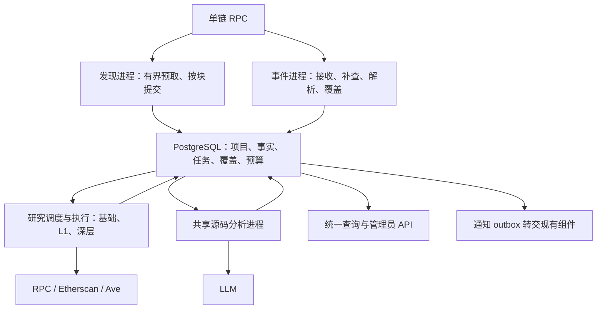

# ATHENA Token 第一板块设计规格

> 状态：分节业务与架构方案已确认，书面规格待审阅；尚未实现，性能尚未验证。
>
> 日期：2026-09-10。任务范围为设计、文档同步及规格核对，不修改业务源码，不进入实现计划或第二板块。

## 目标与设计包

为 Ethereum Mainnet 新 Token 建立持续、可恢复的事实研究链路：按区块发现，独立采集源码、当前状态、持币及钱包证据，按有效活动续期，在首次已识别 Swap、不活跃超时或管理员操作时停止研究。事实一项就绪即可查询，不等待统一画像完成。

本任务按 Superpowers architectural 路径完成需求核对、时效选择、三方案比较和逐节设计讨论。本 spec 规定跨子系统契约；下列五份长期文档承载可独立阅读的内部设计，与本文件共同构成审阅范围。

| 子系统 | 长期设计 | 对外承诺 |
| --- | --- | --- |
| 发现与生命周期 | [发现、覆盖、活动和停止](../../design/token-intelligence/discovery-research-lifecycle.md) | 逐块提交、连续覆盖、有序续期及持久停止 |
| 研究运行时 | [任务、配额、刷新和恢复](../../design/token-intelligence/research-task-runtime.md) | 独立持久任务、有限重试、并发裁决与资源公平 |
| 源码事实 | [共享产物和声明式读取](../../design/token-intelligence/source-facts-and-read-plans.md) | 五项独立产物、逐部署实际读取和版本依据 |
| 钱包研究 | [历史证据、五层关系和估值](../../design/token-intelligence/wallet-evidence-and-valuation.md) | 双样本、实流/归因区分、历史 L1 和同块资产快照 |
| 查询管理 | [事实读取和管理员命令](../../design/token-intelligence/research-query-and-administration.md) | 即时分项事实、可见进度、权限及幂等管理 |

业务依据为[Token 主需求](../../requirements/token/token.md)与[细分流程索引](../../requirements/token/README.md)。文档状态描述确认及实现事实，不构成额外流程开关。后续实现应按上述子系统拆分可验证工作，不能将整包视为一个无边界的大任务。

Token 的[设计与实施顺序](../../requirements/token/token.md#已明确的实施顺序与前端范围)为“设计后端 → 设计前端 → 实现后端 → 实现前端”。本 spec 与五份子系统文档覆盖后端方案；后端编码前还需完成前端页面结构、用户操作、状态展示和数据需求设计，并核对、调整本设计包中的 API、数据契约及权限。前后端方案对齐并按 Superpowers 完成设计审阅后，先实现后端，再实现前端。

## 已确认业务决定

沿用既有决定，不重新开放以下范围：

- 首版 chain ID 1；同代码单链实例，跨链只共享允许共享的源码/分析/API，链上观察与项目任务均有链身份。现有免费 Etherscan 查询源码、普通历史和按地址内部历史；持币总数及 Top 100 由 Ave 获取。
- 初次按真实区块时间定位三天起点；每轮最多 100 块并行预取，按高度严格串行识别和保存。失败不能越过，逐次失败通知并无限重试；追平等待 1 秒。不考虑重组，不发现工厂内部 CREATE/CREATE2，不以部署回执成功作为发现前置。
- 顶层创建推导地址后按最新显式观察块判断代码和六项 Token 条件；最终 Token/非 Token 结论与全项诊断保存，业务拒绝不重检。研究当前状态刷新不改写初始识别。
- 第一板块仅事实，无 AI 评级、风险门槛、筛选、自动排除、关注移交或买入。七个支持协议内真实 Token Swap（含 flash swap）停止研究，添加流动性不停止；覆盖外的交易未知。
- 默认观察 72 小时。期限内含边界时点的 Approval、Transfer、部署者/当前 owner 成功主动顶层交易可续期；仅 Transfer 可按映射刷新资料，Approval 不补源码。Transfer 或部署者/owner 主动交易可在仍无非空源码时补采。无周期源码轮询。
- 源码按运行时 code hash 复用非空内容；五项静态产物分别共享，实际 owner/税费地址/税率逐部署读取。AI 只分析实际源码，不追加代理实现、外部依赖或网页。
- L1 为部署者、最多 5 个初始接收钱包、取得的非零 owner/税费钱包；各地址普通及内部历史独立取部署前第一页各最多 300 条。L1–L5 全分支自动推进，资金单条门槛、地址库和 L5 决定边界，不按层限制钱包数。
- 内部资金保留真实转出证据，通常按顶层发起人归因；实际转出方命中管理员地址库时优先在该方终止。实流与归因不重复计额，归因不证明控制或实际出资。
- L1 六资产 ETH/WETH/USDT/USDC/DAI/WBTC 使用同块余额及固定可信 DEX 最多两跳现货路径估值，部分结果保留本次已知小计。L2–L5 不读余额。
- 研究停止后不重开：未开始任务取消，已开始逻辑任务按有限重试收尾，之后项目专属事实冻结；共享有效产物继续展示最新版本。正常停止不通知管理员。

本轮进一步确认的业务边界：

| 决定 | 结果 |
| --- | --- |
| 主停止原因 | 首次成功持久写入值保留；后续更早 Swap 证据另存 |
| 失败通知责任 | 每次真实扫描失败可靠交入现有通知组件；最终投递沿用其现有机制 |
| 任务已经开始 | 取得配额并持久登记执行；只领取任务或等待配额不算。在途 retry_wait 继续有限收尾 |
| 刷新冷却 | 默认每项目每组 10 分钟，从本轮首次实际派发起算，技术重试不重置 |
| 每轮请求次数 | 源码最多 4 次、其他瞬态采集最多 3 次、AI 最多 2 次；额度等待不计请求 |
| 零地址与 owner 冲突 | 零原值保留但不研究；明确零 owner 清除其当前角色/监控。无法消解的冲突保留最近成功 owner 与监控并展示本次冲突 |
| 历史 L1 | 旧 owner/税费钱包失去最后当前角色后仍为历史 L1 入口，继续未完成历史/上游；只关闭失效当前身份和旧 owner 监控 |

## 已确认时效目标

以下是设计目标，不是已测结果。各链路独立统计，不混合样本，也不把首次被 worker 领取当作起点。

| 链路 | 起点 → 完成点 | 目标 |
| --- | --- | --- |
| 正常发现 | 配置节点首次能查询新区块 → 项目及初始研究任务可靠保存 | P95 ≤ 15 秒 |
| 已登记目标活动 | 同上，活动所在块 → 有资格的活动续期可靠保存 | P95 ≤ 15 秒 |
| 已登记目标 Swap | 同上，Swap 所在块 → 有效 Swap 触发停止可靠保存 | P95 ≤ 15 秒 |
| 初次三天发现补扫 | 开始历史扫描 → 发现游标追平最新高度 | 2 小时内 |
| 正常新项目基础资料 | 项目提交 → Token 当前状态、源码首次查询、Ave 总数/Top 100 各真实首轮结果可查 | 各 P95 ≤ 1 分钟 |
| 无缓存的五项 AI | 非空源码保存 → 各有效产物保存 | 各 P95 ≤ 5 分钟 |
| 新 L1 资料 | 钱包加入项目 L1 → 普通历史、内部历史、六资产快照各首轮可查 | 各 P95 ≤ 10 分钟 |
| 活动刷新 | 依赖就绪且冷却到期 → 各首轮结果可查 | 各 P95 ≤ 1 分钟 |
| 不超过一小时的断线 | 上游恢复 → 已登记目标相应连续覆盖补齐并追平 | 5 分钟内 |
| 不活跃停止 | 时间、覆盖与解析等全部条件满足 → 停止持久化 | P95 ≤ 15 秒 |
| 人工停止 | 有效管理员请求到达 API → 停止持久化且禁止新的首次启动 | P95 ≤ 2 秒 |

基础资料、L1 及刷新“首轮可查”可以是实际成功、空结果、未收录或失败待重试，单纯排队不算；成功率另行衡量，不以快速失败代替资料采集。AI 必须是有效产物。已有合法缓存直接可查，单独记录缓存命中，不能以大量命中掩盖无缓存目标。

三天补扫期间不另开新块优先发现通道，研究不必全部完成。长时间恢复、动态新增目标历史补查、补扫产生的研究积压及 L2–L5 没有统一完成期限，持续公平推进并显示积压、进度与可解释 ETA。正常运行的超额负载仍报告时效违约，不通过把任务改名为后台来移出统计。

## 总体架构选择

| 方案 | 收益 | 代价及判断 |
| --- | --- | --- |
| **A：职责分进程 + PostgreSQL 持久任务（采用）** | 项目/任务/事实可事务提交；扫描、事件、研究和 AI 可分别分配 CPU、连接与配额；便于停止和启动裁决 | 需要设计队列索引、短事务、租约与共享预算；高峰必须实测数据库及提供方瓶颈 |
| B：单链大进程 + 内部队列 | 部署较少，初期连接简单 | 研究及 AI 的资源压力影响实时链路，重启故障域大；仍需持久任务才能恢复，不适合本轮时效隔离 |
| C：持久消息流 + 业务数据库 | 可扩展事件扇出、重放与消费者隔离 | 双存储一致性、消费进度和运维成本增加；当前规模尚无证据证明额外基础设施必要 |

选择 A 的依据是已确认的一致性和实时隔离需求，而非现有技术栈不可变。Kafka 等可在实际事件扇出或吞吐证据需要时重新评估；不预先建立一套备用消息路径。PostgreSQL `SKIP LOCKED` 可用于多消费者队列，但其跳锁读取不适合直接证明业务顺序；连续活动仍由专属游标与项目事务保证。[PostgreSQL SELECT](https://www.postgresql.org/docs/current/sql-select.html)

各进程可使用同一构建产物的不同启动角色；单链角色必须校验唯一 chain ID。发现和事件拥有各自租约与持久进度，研究/AI 可多实例。数据库连接池按角色限制，实时 RPC 预留额度不被钱包研究借走。进程隔离仍共享数据库和部分提供方，因此不宣称消除了所有公共故障点。

## 跨子系统契约

| 契约 | 必须保持的约束 |
| --- | --- |
| 项目 | `project.research_state` 仅 researching/stopped；主 stop reason 为 swap/inactive/manual；`revision` 用于并发，`facts_frozen_at` 表达收尾完成 |
| 发现提交 | 同一块候选结论、项目、初始需求及游标在一个事务；部署回执和初始接收钱包移入后台。无候选块同样推进游标 |
| 事件覆盖 | 接收最大高度、连续完整采集、映射解析及项目活动应用进度分别保存，不能互相代替 |
| owner 观察 | 实际读取前对尚未应用的最新块 B 建屏障；成功安装有效区间并补覆盖，失败释放。AI 准备不建屏障，Swap/人工停止不等待 |
| 活动应用 | 按块/交易/日志顺序、前序完整后处理；期限为活动时间 + 当时配置时长，不能用 max 修补乱序；合法动作与游标同事务提交 |
| 任务 | 业务 generation 与 claim generation 分开；外呼在事务外，结果提交检查租约/版本；停止与首次执行原子裁决 |
| 分项事实 | 不可变观察 + 最新成功/尝试指针；独立发布，无六源屏障，不覆盖失败前的有效值，资产同次快照例外明确 |
| 共享需求 | AI/固定样本可共享执行，项目订阅和角色仍独立；停止项目不能由共享新结果派生自己的新任务 |
| 钱包图 | 历史 L1 不因角色变化删除；距任一 L1 最短距离决定层级，证据去重与项目角色不混淆 |
| 命令与通知 | 管理命令幂等及版本校验；每真实扫描失败独立 ID；无网络请求进入业务提交事务 |

源码、调用结果、日志和钱包样本各保留实际来源及版本。研究数据库不得以通用 JSON 任务包替代全部身份约束；热查询和幂等键使用类型化字段/唯一索引，大证据独立存储。PostgreSQL 通知只做唤醒，任务本身可扫描恢复，不依赖通知历史。[PostgreSQL NOTIFY](https://www.postgresql.org/docs/current/sql-notify.html)

## 持久化、资源与失败恢复

所有工作都能由已提交状态重建。按链的实时控制循环与研究任务采用不同执行池，不能依赖长研究租约恢复来满足 15 秒控制目标。租约过期须递增 claim generation；过期执行者不能改写 head 或继续派生。外部请求可能已经发生但响应丢失，保存不确定尝试并保守计次，不宣称外部 exactly-once。

共享提供方预算同时约束 account/key/endpoint 的速率、日额度和并发，多实例或多网关不增加供应商额度。采集时效优先队列与深层公平队列使用受控份额；深层没有数量截断。各技术初值、退避及共享停止锁序见运行时文档，部署前按实际容量校准。

API 使用独立读池，写操作短事务；停止通过项目行立即阻止新启动，后台分批标记未开始任务取消。大规模钱包证据按链/时间或哈希分区、热任务索引与小批量归档随体量执行，归档不能删除事实依据或未完成工作。备份同时涵盖业务库、配置版本及扫描故障持久日志，恢复后从已提交游标/租约重新执行，不以备份时间冒充已完整覆盖。

## 技术核验与实施前容量条件

本轮核对了实际源码和官方文档，未使用测试 Key 做供应商容量压测，未运行目标架构。

| 已核验事实 | 对方案的影响 |
| --- | --- |
| Ethereum 每槽 12 秒，但可能空槽 | 三天约 21,600 个出块机会；两小时边追边新增需约 `21600/7200+1/12≈3.1` 块/秒，仅估算。[Ethereum](https://ethereum.org/developers/docs/consensus-mechanisms/pos/block-proposal/) |
| Geth 订阅仅当前事件，断开会丢失，节点追赶可能只通知最后区块 | 订阅只加速；HTTP 补查和连续覆盖为恢复依据。[Geth pub/sub](https://geth.ethereum.org/docs/interacting-with-geth/rpc/pubsub) |
| Etherscan Free 文档列 3 请求/秒及每日 100,000 次 | 日均约 1.16 次/秒，不能以 3 请求/秒全天持续推算；也不能把多个 key 简单相乘。实际账户/端点额度需核验。[Rate limits](https://docs.etherscan.io/rate-limits) |
| 普通/内部按地址接口支持指定区间和倒序分页，当前免费单页上限 1,000 | 本需求每类 300 符合公开上限，仍需验证实际响应/身份字段；不能由公开接口存在推断数据完整。[普通](https://docs.etherscan.io/api-reference/endpoint/txlist)、[内部](https://docs.etherscan.io/api-reference/endpoint/txlistinternal)、[变更记录](https://docs.etherscan.io/changelog) |
| Ave v2 提供 Token detail 和 Top100 接口 | 分别取总数和有界明细，不能当固定链上块快照；实际账号额度和新币收录延迟待测。[Ave v2](https://docs.ave.ai/reference/api-reference/v2) |
| V4 Swap 只有 poolId，PoolManager 无全池 PoolKey getter | 必须恢复可信 Initialize 映射，未知不能视为不相关；Initialize 可能早于 Token 部署，映射准备成本独立记录，详见生命周期文档及其源码依据 |

容量输入包括：实际部署数/块、研究中项目数、监控地址数、各协议日志密度、新 L1 速率、每层来源分布、同哈希/同窗口缓存命中、源码输入规模、模型延迟、各账户额度、节点日志范围限制、数据库连接/IOPS。实施验收前采样并保存这些输入，缺少任何输入时不声称目标可达。

研究流量下界可以按 `2 × 新钱包数` 估算双历史请求，另加顶层交易/回执补证；AI 无缓存请求下界为 `5 × 新源码数`；源码每轮和重试、Ave 每次两项、六资产及路径调用分别计入实际模型。资金图存在共享、循环和停止，不能只用平均“每项目五个钱包”代替实测分布。

如果额度或节点能力不足，输出缺口、积压及目标违约；不自动买套餐、不换数据源、不减少五层范围、不跳历史、不快速失败冒充采集。部署配额或承载规模需要用户另行提供/选择时，用测得差距形成下一次具体决策，当前不预先捏造额度。

## 验收设计

正确性先验证以下不变量，性能必须在同一业务规则下测量：

| 场景 | 验收重点 |
| --- | --- |
| 区块乱序到达、批量部分失败、提交前后崩溃 | 可并行预取，只有下一高度可应用；不丢候选、项目或初始需求，不越过失败 |
| 实时和历史重叠/乱序、owner 观察晚到 | 去重、区间覆盖和顺序应用正确；无错误迟到判断或追溯改写 |
| 伪造 Swap、币种映射未知、真实 flash swap | 可信协议身份和实际币种证明；未知阻挡超时，真实 Swap 快速停止 |
| 人工/Swap/超时与首次启动并发 | 主原因首次提交胜出；未开始任务不能新启动，在途有限收尾 |
| 失租、DB 失败、429/日额度/错误 key | stale worker 被隔离、尝试计次正确、恢复不伪造事实 |
| 同源码重检与停止项目共享 | 最新有效版本不被失败覆盖，不重开项目专属采集 |
| 内部明细重复/同额多条/自身回款/库命中 | 实流与归因不重复计额，优先终止及缺证据处理正确 |
| 旧 owner/fee、短路径、循环、标签变动 | 历史 L1 保留，五层按最短距离推进，不遗漏允许的未执行扩展 |
| 估值路径失败、资产缺项、图并发翻页 | 同块部分小计真实，整数精度无损，读取不截断后台范围 |

性能场景分别为：三天真实区块回放；正常追平同时运行基础、L1、深层、AI 与 API 的混合负载；累计一小时缺口后的恢复。覆盖未知 V4 映射、缓存未命中和大项目，不能只测热缓存。冷启动映射准备与历史研究积压另列，不计作三天发现游标已经完成的研究结果。

正常目标以启动后追平阶段至少连续 24 小时的观测为首轮验收窗口，滚动 1 小时及每日分组报告。每项附样本数；少于 100 项时报告逐项延迟及样本不足，不宣称已经证明 P95 稳定。24 小时是技术验收窗口，不是新增业务时限。

节点可服务时点由独立轻量高度探测器记录单调时钟、墙钟和探测间隔；它近似首次可查询的上界，报告误差，不能用 worker 首次取块时刻替代。端到端内部耗时用单调时钟，跨进程时间戳校时；区块时间只用于业务期限。验收同时报告提供方外部等待和内部排队，不能用“依赖故障”悄悄删除样本。

截止已到仍未完成的对象计为超标；图未知总量不用伪造完成率。主动停止导致的合法取消单独报告，已经超过目标的取消不抹去此前违约。基础采集同时给出成功率、空结果率、技术失败率；AI 使用有效产物完成率。2 小时/5 分钟追平目标按每次场景分别检查，不与 P95 目标混淆。

## 当前实现差距与直接替换范围

| 现状依据 | 目标处理 |
| --- | --- |
| [ChainProcessor](../../../internal/token/discovery/application/chain_processor.go) 当前逐块获取/处理，100 常量不是已完成的预取流水线 | 重新实现有界预取及逐块提交；保留单调游标一致性 |
| [CandidateInspector](../../../internal/token/adapters/evm/candidate_inspector.go) 同步取回执/初始钱包，当前上限 10，调用隐式 latest | 回执和最多 5 初始钱包后台化；固定观察块及完整诊断 |
| [ATHENA.sol](../../../pkg/abi/ATHENA/ATHENA.sol) 已有地址数组接口和 gas/字符串限制 | 保留单元素数组能力，重构返回诊断/内部代码检查；不能误写为缺少单地址调用能力 |
| [collection model](../../../internal/token/collection/model.go) 六种一次性任务；[结果提交](../../../internal/token/adapters/postgres/collection_result_store.go) 汇合构建画像 | 直接换成持久依赖任务、分项事实和需求订阅，移除六源终态屏障 |
| [当前读模型](../../design/token-intelligence/project-read-model.md) 依赖不可变画像与市场/交易对信号 | 替换分项查询、覆盖进度、钱包证据和管理命令，清理不再使用字段与生成契约 |
| [Etherscan manager](../../../internal/etherscanmanager/manager.go) 轮转不是跨进程配额 | 增加共享预算、请求计次和暂停恢复；复用网络适配基础 |
| 当前无完整活动/七协议生命周期、五层双历史、五类 AI 与声明式读取 | 按五份目标设计新增对应职责，不将独立 BSC Swap 服务视为首版 ETH 覆盖 |

后续实现直接替换废弃能力及消费者，不保留旧六源、模拟、市场风险或画像 API 兼容层。本次只改文档，既有“已实现”设计仍描述当前源码；五份目标文档标识未来替换边界。

## 未决事项与审阅边界

业务时效、组件边界和本轮特殊结果已经逐节确认；未决的是书面设计整包审阅、实际承载规模与部署资源校准，以及实现后的正确性/性能验证。模型供应商与版本、节点及提供方实际配额、历史日志查询能力等是需核验的部署输入，不是允许忽略的设计空白。

第二板块筛选/交易执行、BSC 资产与路径细节和非 HTTPS 链接扩展均留到各自后续任务。前端页面由后续设计任务补齐，并在后端编码前与本设计包对齐。本次完成点为可审阅规格、同步长期文档和文档验证；不表示实现获授权，不发送计划实施完成邮件。
