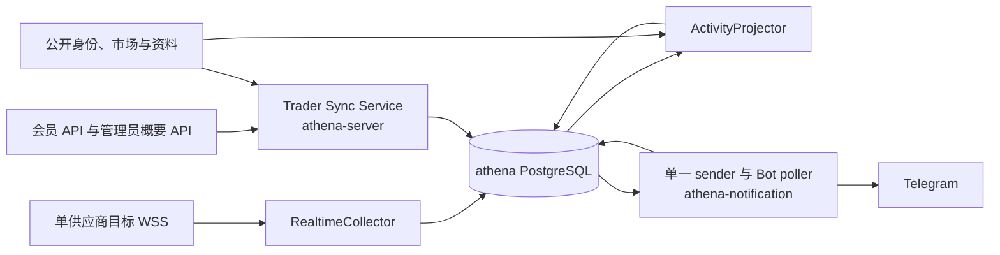
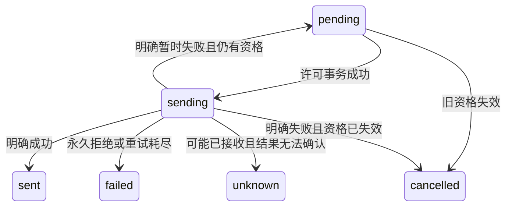

# Trader Sync / Activity Alerts 后端设计规格

> 日期：2026-09-10。状态：已确认待实现；用户已整体确认完整书面规格。
>
> 后端设计已整体确认并形成[实现计划](../plans/2026-09-10-trader-sync-activity-alerts.md)，尚未执行。用户随后要求先补 UI；[UI spec](2026-09-10-trader-sync-activity-alerts-ui-design.md)已整体确认，第 4 节的 UI 读取契约补充同时获确认；已有业务及后端架构决定继续有效。实现计划已扩展为21项前后端联合任务，尚未执行。

## 1. 目标、依据与决定

为 ATHENA 用户监控人工选择的低频 Polymarket 目标钱包，保留逐条已识别成交，并按用户独立发送 Telegram 私聊提醒。首期支持 10 名用户，每人最多 10 个未取消订阅，覆盖 100 个订阅关系及最多 100 个不同目标。不执行交易，不自动筛选交易者，不承诺中断期间的完整成交历史。

本规格与[长期需求](../../requirements/polymarket-copy-trading/target-trade-monitoring-notifications.md)、[长期后端设计](../../design/trading/trader-sync-activity-alerts.md)共同构成设计依据；前者维护业务规则，后者维护组件和源码边界，本规格固定本次可审阅的完整方案与验收条件。遇到差异先修正文档，不凭聊天或较旧草案擅自覆盖业务决定。

本轮沿用原有业务决定，并已逐节确认以下调整：

| 已确认决定 | 具体边界 |
| --- | --- |
| 链上结算时间 | 以最终确认记录的区块时间判断生效；不将其称为链下撮合时间。生效前撮合、生效后结算可计入。 |
| 即时生效、无历史回补 | 基线建立后立即生效，无额外 5 分钟等待；断线、重启、故障均不补遗漏。可靠保存的候选可继续处理。 |
| 全部通知同库 | Notification 全部数据并入 athena 数据库；保留 athena-server 与 athena-notification 两个进程和模块接口。 |
| 发送许可界定撤权 | 撤权/解绑/重绑提交后禁止新许可，终止未授权旧资格；此前 sending 单条可稍后收到，未知不重发，不等网络回执。 |
| 采集路线 | 单供应商 WSS 共享目标，先可靠保存，再等待规范链最终确认；开发先用 Chainstack，dRPC 仅供手动切换。 |
| 同用户集中成交 | 保留前 10 条逐条提醒，允许按 Telegram 限速排队；平稳流量保留成功回执 P95≤5 秒，集中成交单列并保留总体统计。 |
| 摘要 | 用户级滚动 60 秒超过 10 条后汇总；相邻两批首条实际提交至少间隔 60 秒，首条待汇总活动形成后 60 秒内开始提交本批首条；超长分多条完整展示。 |
| 确认卡与缺失资料 | 地址/Profile URL 都必须确认身份；辅助资料 unavailable 不阻止创建，不编造 0 或其他统计替代值。 |

架构比较过三个方案：A 全部 Notification 同库；B 只把账户通知移入账户库、系统通知保留原库；C 保留数据库隔离、以事件和幂等协议协调。选择 A：当前没有必须保留数据库隔离的业务要求，同库可原子处理权限、绑定、活动、投递及 Bot update，免去双 store 和跨库协调。代价是扩大数据库共同故障范围，并需替换通知迁移归属和部署配置。保留模块接口以限制代码耦合，后续需求可重新评估架构。

## 2. 业务不变量与状态

- 所有 member 数据按认证上下文中的 account UUID 隔离；同目标的不同用户拥有独立订阅、备注、活动、突发统计和投递。
- 同 owner-wallet 只允许一个未取消订阅。pending_baseline、monitoring、paused、error、permission_disabled 均占配额；cancelled 不可恢复并释放配额，重新订阅生成新 ID。
- 用户可暂停 monitoring/error，恢复 paused/permission_disabled，或取消任意非 cancelled 订阅；每次操作须仍具有产品权限。错误状态在依赖恢复后自动恢复，不能把自动恢复当成用户新激活。
- 暂停、取消或撤权后，不再为其形成新活动；已经形成的活动持久保留。仅暂停/取消保留旧通知队列，撤权/解绑/重绑终止旧资格中未授权部分。
- 重新授权只恢复产品和历史读取权限；订阅继续 permission_disabled，由用户逐个手动恢复新基线。旧队列不复活。
- 只识别实际成交 BUY/SELL，覆盖自身 Maker/Taker 订单记录；无最小金额、市场、Outcome、方向过滤。不将挂单或 SPLIT/MERGE 当作成交。
- 同一公开源记录只形成一次该订阅活动，不将同交易哈希的不同自身日志合并，不等待整单、不补成整张订单量。
- 私有备注按 Unicode code point 最多 20 个，超限拒绝、按纯文本展示；取消保留，重新订阅自动沿用。活动与通知使用形成时备注快照，编辑不改变历史。
- 活动及其外发资格在同一事务形成。未绑定仅保留站内；后来绑定/重绑不补之前的活动。每个摘要部分单独取得发送许可。

生命周期将用户意图与采集健康分开保存。`desired_state` 为 enabled/paused/permission_disabled/cancelled；`observation_state` 为 pending_baseline/healthy/interrupted。API 投影为上述六种用户状态，附原因和生效时间。permission_disabled/paused/cancelled 优先于观察状态。这样连接异常不会误取消已经可靠收到、仍符合原区间的候选。

`activation_generation` 在创建及用户手动恢复时建立新值；改备注、修改显示资料、基线重试、断线自动恢复不改变它。`collector_epoch` 表示一次观察连接的代次，不能替代激活代次。活动资格以接收时绑定的成功基线/区间、原激活代次及当前用户意图为依据。

## 3. 组件、数据库与进程

| 模块 | 职责及接口边界 |
| --- | --- |
| TargetResolver | 规范化输入，取得并复核身份，生成确认卡及 owner 绑定 token；不改变订阅。 |
| SubscriptionService | 配额、唯一性、状态和备注；提交基线请求，不执行外部发送。 |
| RealtimeCollector | 维护共享目标集合、过滤与 epoch，持久接收 raw log 和原始候选归属；不补历史。 |
| ActivityProjector | 最终确认、版本解码与市场补全；对每个 owner 独立形成活动。 |
| AccountDeliveryPlanner | 与活动共用事务，冻结绑定、备注、普通/摘要归属；不持有 Bot token。 |
| Notification sender | 统一 Bot/chat 调度预算、持久发送许可、显式单次调用及结果 CAS；不执行交易。 |
| Bot poller | 消费 update；同库原子更新绑定、offset 与回复 outbox，回复交 sender。 |

账户权限、Trader Sync、Telegram 绑定、账户投递、系统群组投递、Bot offset 与回复 outbox 全部位于 athena。各进程各自建立连接池，各模块保持 query adapter，通过 composition root 注入受控事务，不各自复制权限数据。

沿用 `internal/accountstate/store/migrations` 作为唯一权威 schema；Notification 不再维护独立迁移编号域。各 sqlc query 包引用同一真实 schema 输入。两个进程可经现有跨进程 migration lock 初始化同一迁移集，不依赖启动先后。Notification 使用 `ATHENA_SERVER_POSTGRES_DSN`，移除独立通知 DSN 和数据库初始化归属。项目尚未上线，不设计双写、兼容读取或旧数据库迁移协议；实际数据库调整不属于本次授权。

采集和发送各保留一个运行实例。采集用持久 epoch/fencing token 防止旧实例继续写入；Notification 的数据库 lease 不能阻止旧实例访问 Telegram，因此不可仅凭锁过期自动并行接管。恢复 sender 前必须确认旧进程已停止，详情见第 8 节。

## 4. 公共接口与数据契约

新增权限 `trader_sync`，只允许 NONE/READ_WRITE；读接口用模块 read requirement，已获授权用户的 READ_WRITE 满足它。拒绝将该模块配置成 READ。现有九模块矩阵扩展至十模块，所有认证及前后端消费者保持一致。

沿用有效会员登录/API Key 与产品权限的组合；管理员身份不获得 member 数据读取权。Telegram 绑定维持交互登录要求。登录/API Key 停用不自动等同产品 grant 撤销，后台权限依数据库中的产品 grant 判断。

| RPC | 请求与响应 |
| --- | --- |
| ResolveTarget | 地址或受限 Profile URL；返回规范钱包、确认 token/到期时间、完整确认卡与字段可用性。 |
| CreateSubscription | confirmation token、request_id、可选 note；返回 pending_baseline 订阅。note 未传沿用旧备注，显式空字符串清空。 |
| ListSubscriptions / GetSubscription | owner 内分页/ID 查询；状态、revision、明确生效区间、私有备注、监控中断和旧队列概要。 |
| PauseSubscription / ResumeSubscription / CancelSubscription | subscription_id、expected_revision、request_id；返回新的状态及 revision。 |
| UpdateTargetNote | 规范 wallet、expected_revision、note、request_id；允许编辑已取消目标保留的备注，不变更订阅边界。 |
| ListActivities / GetActivity | owner 内时间/订阅过滤及分页；逐条成交、资料、时间证据、备注快照、投递及批次进度。 |
| ListSubscriptionHistory | owner 内分页读取订阅生效区间及中断时间线，避免详情无界内嵌历史。 |
| GetSummaryBatch / ListSummaryParts | owner 内冻结批次概要、完整分条分页；parts 可过滤同批次 activity_id。 |
| ListSubscriptionSummaries / GetSubscriptionSummary | 独立管理员接口；用户身份、完整目标钱包、生命周期/健康、活动及结果数量。 |
| GetTraderSyncRuntimeStatus | 管理员安全概要：连接、目标/关系数量、积压、缺失和异常统计。 |

公共 JSON 的资源 ID、金额和 position 使用字符串；revision 等 uint64 在实际 gateway 中也用字符串，时间为 UTC RFC3339Nano。可缺值/时间/对象统一省略缺失 key，availability/evidence 显式保留；非 nil 空串、false、真 0 必须输出。Create 的 note:null 与未传均表示沿用，note.value 空串表示清空。分页规范 query 为 `page.page_size`、`page.cursor`，服务器沿用 runtime 对 protobuf JSONName 别名的接受。

方法按仓库 gRPC 规范使用动词开头 PascalCase。member 请求没有 account_id，由服务端注入；所有查询和写入均包含 owner 条件，跨 owner 与不存在资源都返回 NotFound。管理员 DTO/SQL 从源头不选择私有备注、活动正文、消息正文和逐条投递，无管理用户订阅或重发入口。

分页默认 50、最多 100，游标签名并绑定身份、过滤条件、方向及相应页边界。UI 补充将活动排序修订为 owner 内形成顺序 `id DESC`，其 bigint ID 在账户 gate 内由持久 sequence（CACHE 1、正向、NO CYCLE）分配，不预取或回拨；读取在同 gate 取得该 owner 已提交 max(id) 为 snapshot。recorded_at 继续记录真实时间，避免将可回退时钟当新活动水位。其他资源按相应稳定时间/ID，摘要部分按序号。

写请求以 owner、操作、request_id 及 payload digest 幂等，重复键不同 payload 拒绝；读幂等结果前仍检查当前权限。已提交 Create 成功在权限检查后优先于 token 到期/消费判定返回，避免响应丢失后不能恢复结果。资源版本竞争返回 Aborted；配额满 ResourceExhausted，重复目标 AlreadyExists，输入 InvalidArgument，过期/失效确认 FailedPrecondition。只有成功事务保存成功幂等结果；失败不会占配额。

确认卡包含头像、显示名、完整规范钱包、认证、加入时间、当前持仓价值、最大单笔盈利、Predictions，以及六个 P/L 区间和曲线，默认 1Y。每项使用 `availability`、`reason_code`、`source`、`queried_at` 与可选 value；未知不是 0。金额使用十进制字符串或整数原量加 decimals，position/token ID 以字符串传输，不经 JavaScript number。时间为带 UTC 语义的 timestamp；source/clock/precision 分开保存。

Activity DTO 包含 source_record_id、钱包、BUY/SELL、原量/份额/费用及币种、结算时间、接收和形成时间、可用市场引用、资料缺失状态与备注快照。Combo 是单个活动，保留自身 Outcome、腿数组与逻辑关系。Delivery DTO 分别暴露 authorized_at、可缺失 started_at、结果时间、状态/原因；不把获许可或已提交显示为成功。

### UI 设计补充的读取边界

以下为随 UI 书面规格整体确认的契约补全，尚未实现；完整定义与验收见 [UI spec 第 10 节](2026-09-10-trader-sync-activity-alerts-ui-design.md#10-前后端契约补全)。

- Resolve 补充 owner 保存备注的存在性/revision、现有未取消订阅和配额快照；六区间各自返回标题值与曲线的独立可用性。Create 仍在事务中最终判断。
- ListActivities 增加 summary_batch_id 过滤。首次返回 snapshot 和 refresh_cursor；next_cursor 固定 snapshot，refresh_cursor 重读原页固定成员并查询 has_newer，用户点击后才取得最新 snapshot。结算时间筛选为 `[from,to)`，UI 使用 UTC+8 输入、后端 UTC 语义。
- 活动明确固定 notification_mode=in_app_only/ordinary/summary；summary 分 waiting/frozen/cancelled_before_freeze。当前绑定不能改写形成时资格。
- 详情只返回观察和投递概要，生效/中断历史由 ListSubscriptionHistory、摘要部分由 ListSummaryParts 分页读取；全部 attempts 后端保留，UI 只取当前结果、次数和最近 attempt，不内嵌无界数组。
- GetSummaryBatch 展示全批统计，活动读取相关 parts；一个活动跨多部分不能只返回第一部分。全部 member 批次/分条读取重查 grant 与 owner，管理员不能复用。
- 管理员概要增加 as_of，关联投递计数按 distinct delivery 而非 attempt；跨订阅共享摘要部分使各行不可相加，全局单独 distinct 聚合。运行积压明确单位、窗口或 service_epoch。

## 5. 目标身份、P/L 与市场资料

地址解析以官方 public-profile 的明确钱包身份为准，不从名字推测关联钱包。Profile URL 只接受 HTTPS 的 Polymarket 允许域名和已核准的 `@handle` 路径；限制重定向和响应大小，不执行页面脚本。读取具体官方页面的明确结构化身份及 canonical，再以 public-profile 交叉核对。无法唯一解析或发生冲突即拒绝，不退回搜索首条。协议适配器变化时失败可见，不静默选中另一账户。

确认 token 有效期 5 分钟，绑定 owner、规范钱包及身份资料摘要；辅助收益缺失不影响身份确认。创建时重新核验当前身份映射；若指向另一钱包或身份无法可靠核验，要求重新解析确认，不能悄悄改变目标。token 成功使用后与该创建幂等结果绑定，不能用另一 request_id 重复消费。

本轮官方 Profile 的 Predictions 确认直接使用 `/traded.traded`；可以按此证据取原值，不重算。加入时间用明确 joinDate 来源，不擅自拿不同含义的 createdAt 代替。收益来源采用官方页面/服务的严格适配器，规则详见[P/L 契约](../../requirements/polymarket-copy-trading/profile-pnl-contract-verification.md)：

- 实际请求基础区间为 1D/1W/1M/ALL，1Y/YTD 使用 ALL；采样精度按已验证动态算法，不伪造 interval=1y/ytd。
- 原始曲线保留 t/p，不把所有曲线先减首点。区间标题按已验证历史长度及首尾规则处理；1M 的 30 天裁切与 31 天历史阈值分别遵守。
- 可用输出保留实际请求参数、参考时间、时区和原始来源；YTD 时区、精确显示舍入或参考时间规则不能核准时，对相关字段返回 unavailable。可验证原始曲线与精确显示值分别标状态。
- 请求错误、非合法数组、乱序、裁切后不足两点、缺少必要 ALL 历史或来源变化均不造零；可从页面取得的明确原值直接使用并记录来源。六区间不以排行榜或持仓求和替代。
- 只在创建前查询；无创建后收益刷新任务。确认卡可重新 ResolveTarget 重试，不影响既有订阅。

普通成交按精确 token/market 查询 Gamma，显式考虑 open/closed，按 token 下标匹配真实 Outcome。Combo 用当前 CombinatorialModule `getLegs(bytes31)` 取得腿：迁移 Binary 腿经 legacyConditionId/getLegacyPositionId 转旧 CTF token；其余已知腿使用公开 Combo markets 分页索引 PositionId→market ID，再精确查询 Gamma 核对 positionIds、condition 和 Outcome。该索引持久保存已见映射，包括之后关闭的市场；周期刷新仅补市场元数据，不读取历史成交。

目录每页最多 100、支持 cursor，没有任意 PositionId 直接查询契约；不得在热路径无界扫完整目录。默认后台每 10 分钟开始一轮、有上轮则继续其游标不重叠启动，最多每秒一页，外部失败退避；查询和缓存指标独立统计。现有持仓和生命周期只作可选交叉核验，不能要求钱包仍有持仓或每次 TRADE 都带 SPLIT。

元数据先与 finality 并行补全；最终确认可用后最多另等 2 秒。未取得资料则形成独立活动，保留 PositionId、已知腿、未知字段及原因。getLegs 整体失败时 legs 与腿数均 unavailable，不能用空数组或 0 代替；已知 N 条腿但 M 条缺资料时，N/M 才有明确值。异步补资料只更新可变显示资料，不改成交原始事实、备注或已冻结消息，不创建/重发通知。组合 YES 是所有腿的合取，NO 是整体合取的补集，不逐腿取反，也不把组合成交方向称为各腿分别成交。

## 6. 采集、基线与最终确认

### 6.1 来源与单位

链为 Polygon PoS（137）；部署地址、当前实现和证据以[数据源契约核验](../../requirements/polymarket-copy-trading/source-contract-verification.md)中的具体值为准。普通 CTF、Neg Risk、Combos Exchange 的自身 OrderFilled 是源单位；topics[2] 是自身资金钱包，topics[3] 的对手方不另计，OrdersMatched 不另计。源记录不是完整订单，也不宣称与所有 Data API 行永久一一对应。

BUY 抵押币量为 makerAmountFilled、份额为 takerAmountFilled；SELL 相反。当前三个来源抵押币均核验为 pUSD、6 位 decimals，份额亦 6 位；费用独立存储，BUY 另收费、SELL 从收入扣费。保存原整数与来源版本，不把成交额当作含费现金变化，不因 usdcSize 名称更换币种。

代理地址与实现版本分别登记。Exchange 执行版本证据按规范 blockHash 缓存，不用最新实现证明旧区块行为。区块末实现槽不能单独证明日志执行时的版本：需核对候选块及父块版本、已核准代理的升级记录语义，并针对该已知区块检查升级记录；存在升级或无法排除同块变化时保持 unverified，待证据足够才解码，不按末状态猜测。该查询只验证已收候选的版本，不从中形成其他成交或扫描遗漏区间。版本/升级查询费用另计。

未知 Exchange 实现、Archive 拒绝或缺少必要执行版本证据时保留 raw/unverified。CombinatorialModule/BinaryModule 的版本与 getLegs/映射调用属于资料核验，失败只使对应 metadata unavailable，不能阻塞已能确认归属、方向与金额的真实 TRADE。核心版本和代理版本的证据均可追溯。

### 6.2 共享过滤和基线

默认一条 WSS，普通 CTF/Neg Risk 合用一类 logs 过滤，Combos 独立一类，钱包 OR 每组最多 100。按全体 enabled 订阅目标去重，暂停/取消/撤权且无其他有效订阅时移出；已收到候选继续按原资格处理。目标变更先安装新过滤并取得 ACK，再卸载旧过滤，重复日志幂等；不重建已有目标的用户边界。添加新目标失败只使新目标等待/异常，不破坏已有有效过滤。

创建/手动恢复在 pending_baseline 事务内同时创建尚未确定边界的 baseline attempt，并在安装过滤前注册接收归属；自动恢复同样先注册新 attempt。注册与该钱包的 raw 持久化用同一钱包 intake gate 串行，保存注册前已观察的最高高度，避免共享过滤已有推送却尚无候选归属的空窗。全部相关过滤 ACK 后，读取新鲜 latest H，要求其高度不低于注册时已观察高度；选择 `effective_at=max(数据库当前时刻的下一整秒,H.timestamp+1秒)`。latest 调用须在 5 秒内完成，区块不落后数据库时钟超过 10 秒、不领先超过 2 秒，否则视为节点/时钟异常，不建立基线。

等待前为已注册 attempt 填写订阅 revision/generation、collector epoch、filter revision 与候选边界；若保存时边界已过去则重算将来边界。未定边界期间也保存 raw 及 attempt 归属，最终按成功边界裁定，不直接产生活动。到达边界后复核连接、权限、revision，成功原子把 attempt 转为 succeeded、生成有效区间。失败 attempt 永不成为后来基线的候选；服务重启对未提交成功的 attempt 明确失败并新建实时基线。

成交资格使用 `settled_at>=effective_at`，区间终点排他。尚未生效即终止时，允许 `ended_at<effective_at`，该区间不覆盖任何成交，仍保留真实终点。暂停/取消/撤权终点使用实际业务事务时间，不向后取整；区块只有秒精度，不伪造同块内逐成交亚秒时刻。用户修改与基线成功共用账户 gate，较新 revision 优先。生效边界建立后没有固定额外等待。

### 6.3 接收和投影

原始定位键为 `(chain_id,exchange_address,block_hash,transaction_hash,log_index)`，raw 第一次落库同时冻结候选订阅、generation 与 baseline/interval。重复返回只复用原事实，不能补建后来订阅的候选；同键后到的 removed=true 是状态证据，必须应用，不能被去重吞掉。原始接收失败不算可靠收到，要记录中断/可能遗漏，不借后续历史查询掩盖丢失。

共享 finalized 每 2 秒查询；latest 健康每 10 秒查询，不常驻全链 newHeads。候选高度不高于新读 finalized 时，重新查询已知 tx receipt，核验成功状态、当前规范链定位以及已接收日志的地址/topics/data/index，再取已知 blockHash 区块时间。确认前缓存回执不够；必要时用近期高度头交叉核验。回执中其他日志不转为新活动。

单次 finality 查询失败保留候选并重试，不以错误响应推进水位，也不单凭该错误丢弃仍健康的 WSS。采集可用性与确认/资料处理积压分别报告；只有真实失去观察能力或无法核准其健康时关闭观察 epoch，不能将所有处理延迟描述为发生了接收中断。

removed 或明确规范链重定位使该 raw 候选无效；null/403/超时只是未能确认，不当作孤块。重新包含的交易只有再次真实接收的新日志才可形成新候选，不能从查询中补建。只有最终确认后才投影活动；若后续出现与已形成活动冲突的深度重组，保留原事实并标 finality 一致性异常，隔离同交易的新分叉候选，不再自动形成第二份活动或提醒。不能简单以 txHash+logIndex 跨分叉去重，因为区块级 logIndex 可能改变。

活动插入以 `(subscription_id,source_record_id)` 唯一。每个 owner 在独立短事务里重查 grant、desired_state=enabled、相同 generation 和原基线成功/区间，插入活动、备注快照及当前绑定资格、普通或摘要归属。不因为 collector epoch 已关闭或当前 observation_state=interrupted 而拒绝原本合格的持久候选。用户暂停/取消/撤权或手动新 generation 则使旧未形成候选失去资格。

### 6.4 中断和恢复

断线、Run 重启、写库失败或健康异常保存中断原因、最后可靠观察与可判断边界；未知时间显式缺失，不编造遗漏数量。恢复创建新 collector epoch 和新实时区间，同 generation 下旧成功区间的持久候选可继续。没有 range cursor、pending backfill 或短暂补漏模式。旧中断不标为已补齐。

Chainstack 对旧按高度查询有 Archive 限制，本轮已知 blockHash/tx receipt 路径可读，但不保证所有旧版本状态查询可用。无法取得规范链/版本证据的持久候选继续 unverified 并可见积压；不以 finalized 高度单独确认任意旧哈希。手动切换 dRPC 也建立新实时边界，不补故障段。

同一 WSS 每 15 秒发送带关联值的 ping，5 秒内未收到对应 pong 即关闭连接、终结 epoch 并记录中断；HTTP latest 成功不能覆盖 WSS 失活。没有匹配日志本身是正常状态。心跳控制帧流量与实际计费用量保留观测，不把它当作额外成交或全链订阅。

WSS ACK、ping/pong、节点头新鲜只证明观察健康，不能证明服务商没有静默漏推。“监控中”不表示历史完整。当前功能不增加第二路成交比对或修补采集。

## 7. 持久实体与事务约束

| 实体 | 必要内容/约束 |
| --- | --- |
| targets / target_notes | 规范钱包唯一；私有 note 单独以 owner-wallet 唯一，并保存 revision。 |
| target_confirmations / request_results | token digest、owner、规范身份、到期与消费信息；操作幂等键及 payload digest、结果。 |
| subscriptions | owner、target、desired/observation state、revision、generation、各生命周期时间；owner-target 非 cancelled 部分唯一索引。 |
| baseline_attempts / monitor_intervals | 候选与成功边界、原 generation/epoch/filter、预期 revision；attempt 状态单向终结，不覆盖旧区间。 |
| collector_epochs / interruptions | 运行 incarnation/fencing token、过滤集合版本、可靠观察/中断/恢复及不确定性。 |
| source_records / source_candidates | 不变 raw、定位、首次接收、确认/版本证据、状态；候选绑定原 subscription/generation/attempt，唯一关系防重新归属。 |
| activities | owner、subscription、generation、interval、source、成交事实、备注与形成时间；每订阅源记录唯一，无自动 TTL。 |
| market_metadata / combo_leg_index | 来源键、精确映射与核验时间、可用性、刷新游标；保留已见关闭市场。与成交事实分离。 |
| summary_batches / items / parts | owner、binding revision、最老成员时间、真实首条起点或缺失、不可变成员/内容与 part 序号；activity 只属一个外发形态。 |
| account_deliveries / delivery_attempts | 业务来源与资格、永久 eligibility_revoked_at/原因、payload digest、当前状态及 next_attempt_at；每次独立 attempt、sender incarnation、许可/起点/结果时间、provider message ID 和原因。 |
| bot_updates / offsets / reply_outbox | Bot/update 唯一，消费结果、绑定事务、持久回复与消费进度同库原子。 |

以上为逻辑实体，表名统一用所属模块前缀；已有 Notification 实体直接调整，不平行创建两套有效表。涉及 owner 的组合引用通过复合唯一键/FK 或同事务一致性约束保证同 owner，不只靠 DTO 校验。活动历史、取消订阅、备注及投递审计不自动过期；短期 token 和结束的无业务事实任务可清理，不破坏去重或用户可见历史。

账户 gate 使用统一命名空间和 account UUID 的 advisory lock。权限变更、订阅、活动形成、绑定、发送许可使用同一键；普通事务使用 transaction lock。基线注册采用 account gate→wallet intake gate，原始接收只取 intake gate、不反向取得账户 gate；投影只取账户 gate，避免锁序循环。绑定唯一 Telegram 身份锁在账户 gate 后取得，多账户操作必须统一排序。当前全局权限更新 mutex 改按账户串行，数据库 revision CAS 仍是并发依据。

权限缓存只能快速拒绝，所有允许行为由数据库核验。`recorded_at` 在取得 gate 后取数据库真实时间，不用事务开始时的 NOW()；插入成功提交后才视为形成，记录到提交的耗时纳入延迟。先赋时间后提交使计时包含事务成本，不以提前启动事务的时间或人为延后赋时规避指标。

member 读取在同一数据库事务/gate 下核验 grant 并取得 owner 数据；撤权后发起的新读取不因旧权限缓存获准。已在撤权前完成授权读取的响应可能随后返回，数据库事务不持锁等待客户端收包。

## 8. 发送许可、撤权和结果恢复

权限撤销在同一账户事务里更新 grant、关闭区间、设置 permission_disabled、取消无执行中许可的投递和未冻结摘要成员，同时给全部旧 Trader Sync delivery（包括 sending）保存永久的 eligibility_revoked_at/原因。该标记不撤销当前已授权 attempt，但永远阻止后续 attempt；重新授权不会清除。旧 attempt 此后明确成功/未知照实保存，明确失败则 cancelled，不因 grant 已重新开启而重试。解绑/重绑提高 binding revision，并终止旧 revision 的待发工作；不抹去已发送或未知结果。产品 grant 只控制 Trader Sync 来源，不给其他合法账户通知强加该权限。

sender 准备 worker 与有效速率槽后，在短事务里复核当前资格和状态，提交 attempt 与 sending 即取得许可；随后释放 gate，执行一次显式 Telegram 调用。撤权只需等待该短事务，已有许可可完成，包括许可已提交而尚未调用的窗口。每 chat 最多一个执行中尝试；摘要每一部分独立许可。许可本身不豁免后续收到的动态限流：尚未开始 HTTP 时沿用同一 permit/attempt 在独立可取消的 pre-start 闸门等待，不能再次授权或计次。最后预算准入与预算收紧确定排序，真实 started 回调仍为常量时间；五秒 HTTP 超时从预算准入后开始，本地预算等待另记并保留总体时延。

attempt 是一次发送事实，delivery 可经多个明确失败的 attempt 完成有限重试。总尝试最多 5 次，退避 1/2/4/8 秒；429 至少等 Retry-After，下一次仍重新授权。只有明确证明本次未成功的暂时错误可重试；本地未发出请求、明确 Telegram 拒绝与可能已接收分别分类。禁止 HTTP client、SDK 或代理隐藏重试。

许可事务提交结果不确定时不盲发，先读取持久 attempt；不能恢复确认则不再发。明确成功后写库失败只补记同一 attempt 的 sent/message ID，不重新调用 Telegram。结果以 `(delivery_id,attempt_id,status=sending)` CAS 更新；sent/failed/unknown/cancelled 终态不被迟到回调复活。

超时、断流、取消或无法解析结果且可能已接收时 unknown，永不自动重发。缺少 started_at 与结果未知是两件事：即使起点补记失败，明确成功回执仍记 sent；started_at 继续缺失。已知结果在内存中可有限重试持久化，结果证据随进程丢失则 unknown。

Notification 首期为单 sender/poller 进程。失去 DB 锁/连接时停止新授权并退出调度，旧许可保持事实，不假定 DB 能撤回 Telegram 请求。仅在确认旧进程停止后恢复遗留 sending：有明确结果则补记，无结果则 CAS→unknown。不能因为 lease 到期直接重发或并行启动另一个 sender。

Bot update 的绑定修改、消费进度与回复 outbox 在同一事务；update_id 幂等防止重放提高绑定 revision 或产生重复回复。失败不推进 offset，成功提交后重启从持久进度继续。回复走同一 sender 总预算，不在 poller 事务内调用 Telegram。

## 9. 突发摘要与调度

按账户 gate 顺序统计所有新活动，滚动窗口为 `(recorded_at−60s,recorded_at]`，同刻用稳定 ID 排序。纳入当前活动后≤10则逐条，>10则摘要；计数包含未绑定活动，但未绑定活动没有投递资格，不能因后来绑定进入队列。频率回落只改变后续活动，已有摘要成员不改为逐条补发。

同用户、同 binding revision 的待汇总成员在首条发送前一次冻结；包括此刻全部合格待汇总活动、备注快照、市场/Outcome/方向、完整链接及计数。一个活动的普通/摘要归属固定。摘要分条后保存不可变 payload、序号与活动→部分映射，不在重试时重算内容。

设最老待汇总活动为 a、上一批首条真实调用起点为 s，则本批首条最早不早于 s+60 秒，目标最晚为 a+60 秒。首次无上一批，准备好就尽早发。只能以 provider 实际开始本次显式调用记起点，不能以入队、冻结或授权代替。

**首条特例：**先备好 worker、chat/Bot 槽及可预计算内容，用固定连接获取账户 session gate；冻结全部成员并提交首条许可后直接进入 provider。provider 在真实调用入口发 started 握手，协调路径补记该起点后即释放 gate，不等待 HTTP 回执。结果回调另开短事务/CAS。同一 gate 下后续活动才赋 recorded_at，消除“已经冻结但尚未开始”时遗漏到下一批的成员。

若冻结 f、开始 s、新活动 t 满足 f<t<s，下一批同时要求 start≥s+60、start≤t+60 会无解；短 gate 是为消除此窗口。它在无新增预算等待的正常路径中消除该窗口，不证明任意精度实时保证。本地 DB、渲染、调度延迟造成的 miss 如实计入，不改成外部故障，不人为拖延活动形成以制造余量。session lock 释放异常须关闭连接，不能带锁还池。

若许可提交后、实际 HTTP 前收到新的 Retry-After，必须释放短 gate 再等待；同一存活 Send 在预算恢复后重取同 owner gate，核对原冻结批次、permit/attempt/实例事实并做与预算收紧定序的非阻塞最终准入，再完成真实 started 握手。等待不重冻结、不重新授权、不变更原 payload/chat；owner 的持久未解决首条 head 阻止后批冻结抢先。崩溃后仍走明确停止恢复，不能凭 started 缺失重发。该动态等待可能出现 f<t<s；两个 60 秒数值不变，实际失约保留总体统计，并保存 f、最老待汇总活动、s、预算阻塞及本地/外部原因，不以重写时间或隐藏样本宣称达标。

实际起点未能持久化时保留缺失；确认旧 sender 停止后，以恢复时刻作为下一批间隔的保守基点，标为异常恢复，不伪造历史起点。运行内使用 monotonic 时间维护至少 60 秒间隔，同时保存 UTC 时间；跨重启/进程比较保留时钟来源和偏差，不可信时相应时效不可判定。

摘要展示覆盖时间、总数、各目标数量、完整站内链接，以及全部目标/市场/Outcome/方向/市场链接。按目标、备注快照、市场、Outcome、方向汇总相同展示行；备注不同不覆盖。按 4096 个解析后字符限制分成完整展示行，标批次 n/m。长标题可缩短但不省略市场或错误改名；Combo 跨条明确延续同一组合，不拆成独立腿交易。

部分结果独立保存，sent/unknown 不重发，明确暂时失败仅重试该部分，不重发整批、不重置批次首次起点。只有全部 sent 才显示整批成功，其他情况展示各状态计数。活动关联多个部分时全部呈现，不把其中一个成功当作完整成功。

统一 sender 替换当前全局串行 1.1 秒出口：跨 chat 有界并行、同 chat 串行；按账户公平轮转与截止时间选择就绪工作。默认跨 chat 并发 12、Bot 20 次/秒、私聊间隔至少 1 秒、群组不超过 20 次/分钟、单次调用超时 5 秒；429 动态缩紧预算。官方限额可能变化，这些是保守初值而非供应商保证。

全部账户提醒、系统群组通知、Bot 绑定回复共用预算，仍各自保留权限和内容。预算等待在账户 gate 前完成；槽已过期则重新排程。调度预留即将到期的下一批首条预算，旧批次后续部分和 Bot 回复不得长期挤占；必要时批次交错发送。冻结后不擅自丢成员或换摘要为逐条。队列不设静默丢弃上限，积压可见。

集中成交仍保留最前 10 条普通消息；同 chat 限速造成的排队如实展示。运行统计在活动形成时记录到达间隔和当时同 owner 队列竞争，用于独立的集中排队分类，不以最终超时反推分类、不把正常慢样本改成高频。跨用户公平性同时纳入验收，不能用某用户集中成交豁免其他用户延迟。

## 10. 失败、配置和时效证据

| 情况 | 确定行为 |
| --- | --- |
| 身份失败 / 辅助资料缺失 | 身份失败拒绝；辅助缺失独立 unavailable，可继续确认，不能造零。 |
| 未知合约版本 / 无法规范链确认 | 保存 raw/unverified 和异常；不猜测解码，不产生伪成交。 |
| 接收后崩溃 | 只继续持久且原基线成功的候选，按当前 generation/意图判断；失败基线不能复活。 |
| 断线、节点滞后、写库失败 | 中断可见，新实时边界恢复，无任何范围回补。 |
| Telegram 明确拒绝 | 永久失败终结；暂时失败在资格有效时有限重试。 |
| Telegram 结果未知 | 持久 unknown，不重发，不算成功或确定失败。 |
| 取消订阅但旧队列未完 | 旧活动/资格继续；释放名额，新订阅不会复用旧活动。 |
| 撤权/解绑/重绑 | 未授权旧资格终止；已授权单条可完成/未知，其余部分不连带获授权。 |
| 资料晚补齐 | 仅更新可变显示资料，保留冻结快照与缺失历史，不补发 Telegram。 |

技术默认值集中配置：HTTP/WSS 端点、chain ID/来源和解码器版本、finality=2s、latest=10s、RPC timeout=5s、基线头滞后≤10s/超前≤2s、过滤组≤100、资料并发=4、最终确认后补资料预算=2s，以及第 9 节通知预算。重连按 1/2/4/8/16/30 秒上限退避并加入抖动；每次恢复都重新建立边界。参数只影响健康和资源，不改变业务配额、保留事实或无回补决定。

用户状态含明确生效时间、最近可靠观察、中断范围/不确定性、资料缺失、旧通知待发及结果。管理员仅有概要统计。指标包括 source 接收/确认/投影积压、filter/epoch、权限与绑定取消、gate 等待、finality/metadata 成本、队列年龄、普通 ACK 延迟、摘要首条延迟、每部分 ACK 与批次进度、unknown/failed/clock 异常。

时效目标保持：公开可查询→站内 P95≤15s/P99≤30s；平稳普通活动→Telegram 成功回执 P95≤5s；摘要 oldest→first actual start≤60s，批次 start 间隔≥60s。集中普通消息、异常和不完整结果另列且保留总体统计；未完成不能因没有 ACK 而从结果报表消失。Telegram 最终设备送达/阅读不是成功定义。

公开可查询时刻默认未知，WSS received_at 不能代替它。直接可测的是 received→recorded、finality 等待、recorded→authorized/started/ACK；若真实公开时刻不晚于收到，则 received→recorded 只是该段总延迟的下界。没有额外证据，settled→received 不能拆成公开前延迟与采集延迟；区块/主机钟未校准时不提供伪精确上界。带独立公开观测区间的样本可报告上下界及来源，时间不可核准的真实 P95/P99 标为不可判定，不声明验收通过。

容量算例为 100 不同目标×100 日志/日×30 天=300,000 推送；另计 1,296,000 finality、259,200 latest、最多各 300,000 已知区块头/回执，合计约 2,455,200 RU，占 Chainstack 3M 的 81.84%，dRPC 按每次20 CU 为49.104M/210M（23.38%）。版本核验、Combo 调用、重连/重复推送、订阅变更及其他开发服务另计；每目标100日志/日是算例而非低频定义或免费保证。缓存相同 block/tx 可降调用，但不能省去必要的确认后证据。

## 11. 验证矩阵与证据边界

本任务完成的是文档、源码和外部只读核验：两个服务商接受 100 钱包 OR，三真实活跃钱包+97 人工地址有匹配推送，重合的 39 条逐项一致；观察窗口不同，不能据差异声称丢日志。一次 finalized 请求失败已保留。当前三代理实现、抵押币、getLegs、两迁移 Binary 腿、module 1/2 目录映射、精确 Profile 与 Predictions 有证据；P/L 只有部分页面数据与消费算法，直接请求超时，未完成全六区间运行验证。

原始证据与官方来源集中于[协议核验](../../requirements/polymarket-copy-trading/source-contract-verification.md)、[P/L 核验](../../requirements/polymarket-copy-trading/profile-pnl-contract-verification.md)、[节点与容量核验](../../requirements/polymarket-copy-trading/collector-contract-verification.md)。没有完成真实 100 活跃目标压力测试、长期稳定性或 Telegram 端到端验收，不能将这些研究样本标为产品通过。

后续实现的必要验收如下；此表定义成功条件，不是本任务已执行测试：

| 范围 | 必须验证的场景与结果 |
| --- | --- |
| 权限/隐私/配额 | 10×10 全不同目标及10用户共享同目标；并发第10/11个创建、相同目标、取消重建、owner伪造/游标串用；管理员仅安全概要，十模块矩阵消费一致。 |
| 身份/确认卡/备注 | 地址与精确URL、相似搜索名、canonical冲突、身份变更/超时、token过期/重复消费；六区间缺失/真0独立；20/21 Unicode字符、未传/清空/沿用、快照不追溯。 |
| 来源/金额 | 三Exchange、BUY/SELL、Maker/Taker、多自身日志同tx、同日志重复；金额/fee/币种；Combo迁移Binary与其他腿映射、已关闭/空持仓/缺失资料，未知版本不盲解。 |
| 基线/状态 | ACK前/后、同秒、头时钟超前、候选持久前后崩溃、baseline提交不确定、暂停/撤权竞争、新generation；失败attempt不归后继基线。 |
| 断线/恢复 | 无日志健康、断线/Run重启/DB失败/Archive拒绝/removed/规范链重定位；无eth_getLogs范围回补，旧合格持久候选继续，旧未知间隔仍可见。 |
| 投递原子性 | 活动与绑定资格同事务；普通/摘要分配唯一；暂停/取消旧队列继续；撤权/解绑/重绑前后授权竞争，已有sending允许完成，其他部分终止；撤权→重新授权→旧attempt明确暂时失败仍终止。 |
| 结果恢复 | 授权前崩溃、提交不确定、许可后调用前崩溃、请求超时、ACK成功写库失败、起点缺失但明确成功、迟到结果CAS；unknown/sent不重发，已知暂时失败最多5次。 |
| 摘要和预算 | 第10/11条、滚动窗口60秒端点、同秒、跨目标/备注变化、冻结→真实started间候选；相邻批次≥60秒且最老成员≤60秒开始，失约真实计数。 |
| 超长和公平性 | 多市场/Combo跨条、解析后4096限制、混合部分结果；上一批未完新批到期、系统消息/Bot回复竞争；某用户12条集中时首10排队、其余汇总，其他用户普通提醒保持独立。 |
| 运维/性能 | 单实例恢复无并行发送、DB锁丢失、时钟偏差、429、积压；100关系/100唯一目标全路径运行；真实/可控时间证据分别报告，未知不当通过，额度包含所有调用。 |

长期需求 45 条规则和 39 条验收由长期设计的覆盖表映射至这些模块；实现时保留可重现的日志/调用计数、时间及故障注入证据。可控模拟验证确定性边界，真实小规模联调验证来源及 Telegram 行为，再以首期矩阵判断容量；不同证据不能互相冒充。

## 12. 源码影响、长期文档与书面审阅

预计新增 `internal/tradersync/`、`internal/server/tradersync/` 和 Trader Sync application types；调整 accountaccess/accountstate 的权限与事务、Notification 全部存储/worker/poller、Polymarket 类型化适配，以及服务注册与运行初始化。长期设计的[源码影响表](../../design/trading/trader-sync-activity-alerts.md#源码影响)提供当前真实入口和关键符号。

实现时必须同步 schema→sqlc、application types→proto/gateway/apiclient/Swagger 及真实前后端消费者，不手改生成代码；新产品页面布局和对应读取补全见[UI spec](2026-09-10-trader-sync-activity-alerts-ui-design.md)。本任务不改这些文件、不生成代码、不启动业务服务、不发 Telegram 或完成邮件。

相关长期文档已同步本轮业务边界、所选架构与证据；既有 accountaccess、Notification、运行设计继续描述当前已实现行为，不把此方案提前标为已运行。没有待用户选择的技术事实；协议升级、资料不可用和未完成运行测试均有明确处理或验收条件。

用户已整体确认后端与 UI 两份书面规格，读取/分页补充也已确认；现已按 writing-plans 形成[21项前后端联合实现任务与验收计划](../plans/2026-09-10-trader-sync-activity-alerts.md)。当前未开始业务实现或运行验收。
