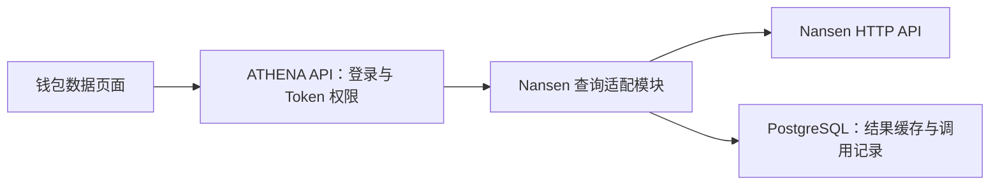

# Token 钱包数据展示：Nansen 后端接入设计

> 状态：后端设计草案，2026-09-14。业务方向已确认；本文具体化工程方案，尚未实现，不将本次讨论扩大为旧分析规则或胜率设计。[页面设计 v1](../../requirements/token/wallet-analytics-page-proposal.md)已于同日获用户确认，[完整实施计划](../plans/2026-09-14-token-wallet-analytics.md)已整理，任务尚未执行。
>
> 依据：[当前需求](../../requirements/token/wallet-trading-performance.md)、[接口样本核验](../../requirements/token/nansen-api-validation-2026-09-13.md)、[服务开发规范](../../developer-guide/service-development-standards.md)。长期设计入口见[钱包数据展示](../../design/token-intelligence/wallet-analytics.md)。

## 1. 目标与约束

输入任意合法 Ethereum 钱包地址，展示 Nansen 的钱包总览、逐币表现和交易明细。金额与数量来自供应商，后端只负责查询、字段转换、排序分页、权限、缓存及调用管理。

- Ethereum Mainnet 固定；最近 7／30／90 天，默认 30 天；代币仅按完整合约地址精确筛选，总览不随代币筛选变化。
- 摘要只取已实现盈亏与交易过的代币数量；逐币和交易字段沿用需求中的映射。胜率不进入返回契约。
- 10 分钟有效缓存、24 小时成功结果保留、按需刷新、手动刷新、分区失败回显和跨用户共享沿用原决定。
- `NANSEN_API_KEY` 由服务端环境加载；有 Token `READ`／`READ_WRITE` 的用户共用额度。首版不设每日查询次数上限，低于 1,000 credits 只提示，实际不足按失败规则处理。
- 不新增 Etherscan 采集、链日志解析、交易分类、基础币筛选、成本账本、金额重算、多跳还原或 DEX 专项接口。

## 2. 现状与接入位置

| 已读源码 | 当前事实 | 本次设计的影响 |
| --- | --- | --- |
| [Token API 启动](../../../cmd/athena-token-api/commands/athena-token-api.go) | 启动读取链注册表、同步 Token 链配置并创建 EVM client registry | 新查询不依赖这个启动链路。 |
| [Token 内部服务器](../../../internal/tokenapi/server.go)、[现有公开 facade](../../../internal/server/tokenapi/tokenapi.go) | 现有项目、资料与操作接口经独立 Token API 提供；没有 Nansen 查询实现 | 现有项目接口保持原职责，新接口使用独立适配模块。 |
| [API Server](../../../internal/server/athena-server.go) | 已拥有账户存储、登录上下文、权限控制、gRPC 与 HTTP gateway 注册及资源关闭入口 | 在这里组合查询适配器与公开协议，不借用链扫描 runtime。 |
| [权限映射](../../../internal/server/authz.go)、[权限控制器](../../../internal/accountaccess/controller.go) | 每个公开 RPC 显式登记权限，当前账户权限经存储读取 | 新增方法全部要求 Token 查看权限，缓存返回也执行检查。 |
| [账户存储](../../../internal/accountstate/store/sql_store.go)、[schema 验证](../../../internal/accountstate/schema/schema.go) | API 持有 PostgreSQL pool，其他同进程 adapter 可显式借用；schema 由独立工具迁移、运行进程只读验证 | 新增查询缓存及调用记录的运维表，遵循同一迁移与契约校验方式。 |
| [环境变量白名单](../../../internal/devruntime/registry.go) | 本地运行器按进程选择环境变量，API 当前没有 Nansen Key 注入 | 实现时只给 API 进程加入 Nansen 配置；UI 不接收 Key。 |
| [会员入口](../../../ui/src/app/member/app.tsx) | Token 父菜单目前禁用，没有钱包数据页 | 页面实现阶段添加受权限控制的入口；设计文档不能当成已可访问。 |

### 方案选择

采用 **API Server 内的独立查询适配模块**，建议包为 `internal/tokenwalletanalytics/`，公开 transport 位于 `internal/server/tokenwalletanalytics/`。它只有请求期间的供应商访问、可重建结果缓存与调用记录，没有独立采集、持仓账本或脱离请求继续运行的业务任务。

比较过另外两种安排：接入旧 `athena-token-api` 会引入无关的链配置依赖及新的内部身份传递改造；新增独立进程会增加一套部署和内部 RPC，而当前能力属于协议适配与查询缓存。这里依据 SDS-R1、R2 的适配器与 API housekeeping 边界选择库形态，不以用户少作为理由。

模块 owner 是钱包数据查询；API Server 拥有 HTTP transport、模块生命周期及数据库 pool。模块借用 pool、只操作自己的表，不关闭共享连接。Nansen 或模块配置失败只影响新接口；共享 PostgreSQL 故障属于现有 API 的共同故障域。没有新的后台采集服务、消息队列或 Redis 依赖。

## 3. 页面调用契约

公开服务建议命名 `tokenapi.TokenWalletAnalyticsService`，方法按项目 RPC 命名规则定义。以下为目标接口，尚未生成 proto、网关或客户端。

| RPC | HTTP 目标路径 | 职责 |
| --- | --- | --- |
| `CreateWalletAnalyticsQuery` | `POST /api/v1/tokens/wallet-analytics/queries` | 校验钱包和时间选项，建立一次查询上下文；只写本地上下文，不调用 Nansen。 |
| `GetWalletAnalyticsSummary` | `GET /api/v1/tokens/wallet-analytics/queries/{query_id}/summary` | 获取钱包整体摘要，参数中不接收代币筛选。 |
| `ListWalletTokenPerformances` | `GET /api/v1/tokens/wallet-analytics/queries/{query_id}/tokens` | 按完整代币地址、已实现盈亏方向及游标返回最多 20 行。 |
| `ListWalletTransactions` | `GET /api/v1/tokens/wallet-analytics/queries/{query_id}/transactions` | 按完整代币地址和游标返回最多 20 条时间倒序记录。 |
| `GetWalletAnalyticsQuota` | `GET /api/v1/tokens/wallet-analytics/quota` | 按需取得可用额度快照及低额度状态，不返回账户 Key。 |

首次查询先取得 `query_id`，随后三个区域分别请求并独立显示成功、加载或失败。慢的逐币请求不阻塞已经取得的摘要和交易。额度信息与统计数据分开失败；额度查询失败不抹掉可用结果。

区域请求携带随机 `request_id`：网络重发沿用原值，用户明确点击重试时使用新值。它用于本次刷新去重，不参与供应商数据的共享缓存键；三个区域的重试互不重置其他区域。

### 3.1 查询与日期

- 创建参数为 `wallet_address`、`period_days`（7／30／90，缺省 30）及 `refresh`（缺省 false）。不接受自选起止日期或其他链。
- 钱包与代币地址校验为完整 20 字节十六进制；地址按字节规范化用于查询和缓存，保留可读显示。不给合法地址附加“必须持币”“必须拥有”或非零地址的额外条件。
- 服务端以创建时的 UTC 秒确定 `to`，`from = to - period_days × 24h`。采用 Nansen 的闭区间；这不是本地时区的自然日，也不是后台按 10 分钟时间桶刷新。[官方日期约定](https://docs.nansen.ai/guides/data-methodology-and-technical-reference)
- `query_id` 是随机 UUID，对应上述上下文，24 小时后失效。它不替代权限，不携带用户自报身份，也不是可公开绕过登录的分享链接。
- 同一次查询需要重新取数的区域使用相同参考日期；筛选、排序和继续翻页沿用其所属上下文。再次查询或手动刷新建立新上下文。
- 有效缓存按相同钱包、时间选项和其他语义条件复用，响应保留它自己的实际 `from/to`，不改写成新查询的参考日期。新旧获取时间与实际范围可能不同，页面按各区域标明；这沿用已有缓存与分区结果规则，不承诺供应商原子快照。
- 后续页绑定首页实际结果的范围及快照，不使用新查询时间拼接旧首页。上下文过期或条件不匹配时明确要求重新查询，不静默重置为第一页。

### 3.2 返回外壳与数据

每个区域返回自己的 `result` 和 `meta`；列表附 `next_cursor`。`meta` 至少包含：

| 字段 | 含义 |
| --- | --- |
| `snapshot_id`、`source` | 不可变结果标识及固定来源 Nansen。 |
| `wallet_address`、`chain`、`period_days`、`range_from`、`range_to` | 该份结果实际对应的请求条件。 |
| `fetched_at`、`fresh_until`、`retain_until` | 成功接收并接受结果的时间及其 10 分钟、24 小时边界。 |
| `state` | `fresh`、`cached`、`stale` 或 `failed`；空数据是成功结果的内容，不混为调用失败。 |
| `issue` | 可选的稳定错误码、可读说明、可重试时间；旧结果回显时仍说明本次刷新失败。 |
| `coverage` | 本次返回的供应商范围、逐币是否收齐两组分页、交易分页是否结束；不宣称全部链上历史。 |

无成功结果的失败外壳不生成 `snapshot_id`、`fetched_at` 或零收益。认证、权限、参数、无效游标使用对应 gRPC／HTTP 错误；已授权查询遇到供应商失败则返回区域失败外壳，支持其他区域正常显示。

数字从供应商 JSON 的数值字面量读取，不经 `float64` 再转回字符串。公开金额与数量使用可缺失的十进制字符串，避免浏览器精度损失；有效零与缺失分开，保留微量余额。`tokens_sent/received` 缺失与空数组通过存在性信息区分。原始供应商 payload 仅供服务端核对，不新增原始 JSON 页面。

单字段缺失或 `null` 不使整个区域失败；可独立识别的异常值按该字段不可用并附问题说明，仍展示其他已知信息。只有响应外壳、数据集合或分页契约无法解释时才使区域获取失败。未知资产身份保留供应商行及来源，不按符号猜地址或错误合并。

摘要只映射 `realized_pnl_usd`、`traded_token_count`；逐币只映射需求已选择的符号、资产地址、买卖 USD 金额、持仓数量及价值、已实现与未实现盈亏。交易映射时间、资产数组、`volume_usd`、哈希，不推断买卖标签，不计算单笔收益。原生 ETH 的供应商标识与 WETH 合约分别保留。

时间优先按带时区字符串解析；无后缀 `block_timestamp` 按已有对照样本解释为 UTC，保留原值和解析依据。无法解析的时间显示不可用，不借用获取时间。

## 4. 供应商请求与逐币排序

| 区域 | 上游请求 | 获取方式 |
| --- | --- | --- |
| 总览 | `POST /api/v1/profiler/address/pnl-summary` | 钱包、ethereum 和固定日期；直接映射两个已选统计值。 |
| 逐币 | `POST /api/v1/profiler/address/pnl` | 分别获取 `show_realized=true` 和 `false` 的返回集合；地址筛选在两组请求中一致。 |
| 交易 | `POST /api/v1/profiler/address/transactions` | 每页 20 条，显式 `block_timestamp DESC`，按需请求下一页；`hide_spam_token=true` 固定为已核验请求采用的当前供应商默认，不新增本地过滤。 |
| 额度 | `GET /api/v1/account` | 页面需要且没有足够新的额度快照时才调用。 |

上游目标固定为 `https://api.nansen.ai`，Key 只放入 `apikey` 头。客户端不能传入 URL、任意供应商字段或其他端点；不通过新的 DEX、日志或价格请求补全结果。

### 4.1 为什么逐币需要两组请求

保存样本中，A 钱包 `true` 为空、`false` 有 10 行；B 钱包 `true` 有 3 行、`false` 有 2 行，后者遗漏零持仓 WETH 且未按请求的已实现收益降序返回。只取其中一组或只排列首页都不能满足当前列表目标。

因此采用以下**列表组织方案**：

1. 两组均从第一页开始，显式请求已实现盈亏降序，供应商页大小使用 1,000；这是逐币端点的文档上限，独立于页面每次显示 20 行。
2. 按各自 `pagination.is_last_page` 继续获取，直至两组都完成。少于页大小不能自行当作末页；缺失分页状态、空页仍声明有下一页、重复页或超界数据均停止并说明原因。
3. 以链和资产地址合并重复资产，保留来源。若同一资产多次返回不同值，选择最后成功收到的完整一行，绝不跨响应拼接金额或相加；原响应仍可核对。
4. 两组均完成后，按该行的 `pnl_usd_realised` 做精确数值排序；同金额按资产地址稳定排序，缺失金额始终置后。按已选方向每页返回 20 行。
5. 固定排序后的快照；加载更多和反向排序从完整快照读取，不重新拉取或只重排当前页。

这是对 Nansen 返回行的合并、排序和分页，不重算盈亏。完整的含义是本次两组供应商分页均已结束；供应商没有承诺跨请求的原子一致性，不能由此声称绝对完整的链上资产集合。[参数与分页契约](https://docs.nansen.ai/api/profiler/address-pnl-and-trade-performance)

成功发布逐币快照前不返回貌似完整的排名。某组失败时，该区域回显相同筛选条件的旧完整结果；没有旧结果则显示失败，摘要和交易继续显示。查询过大时提示缩小时间范围或使用已支持的合约地址筛选，不静默截断。

单次构建的工程边界：最多 20 次逐币 HTTP 请求、累计响应最多 64 MiB、整个请求最多 60 秒；单个响应最多 8 MiB。超出任一边界即停止，不转为后台无限采集。这些是单次资源保护，不是每日额度限制；更大集合仍需实现阶段用真实或受控场景验证。

### 4.2 交易分页与筛选

交易保留 Nansen 每条记录及其全部资产项，不按哈希拆分或合并。记录没有稳定独立 ID 时，以快照、供应商页号和行序号生成展示 ID；相同哈希不意味着同一条返回记录。

游标在服务端记录并绑定结果范围、钱包、时间选项、代币筛选、页号和供应商排序；客户端只能提交不可猜测的游标 ID。不得修改条件后复用游标。已读取页保留不可变快照，后续页使用同一日期参数；上游发生补录时可能影响其页码结果，不能声称已取得链上历史的原子快照。

只有上游明确末页才停止分页。非末页的空列表、时间跨页明显倒序异常或分页响应不匹配按覆盖异常处理；失败保留已加载记录及重试入口。精确代币查询向上游传 `token_address`，不局限于已加载数据，也不裁掉同一返回记录里的其他资产。

## 5. 缓存、并发与刷新

PostgreSQL 保存可重建的成功快照及其实际参数，避免进程重启丢失尚在 24 小时内的结果。首版不增加独立内存结果副本，减少多个 API 实例间的失效问题；共用结果的产品规则不要求特定存储介质。

区分两类键：语义查找键包含 Key 所属配置范围、钱包、时间选项、区域、代币筛选和映射版本，用于找到可复用结果；不可变快照键还包含实际日期及供应商参数。交易后续页键额外绑定首页范围和页号，逐币展示游标绑定完整快照与排序。Key 配置范围使用服务端摘要标识，不返回浏览器。

| 条件 | 行为 |
| --- | --- |
| 成功获取后不足 10 分钟，普通查询 | 返回缓存及原日期、原 `fetched_at`，不续期。 |
| 缓存缺失或已满 10 分钟 | 本次请求触发上游访问；没有查询时不访问 Nansen。 |
| 手动刷新 | 为当前可见条件执行一次新的供应商获取，绕过本地有效缓存；相同 `query_id`、区域、筛选／游标及 `request_id` 的重复投递复用同次结果。失败后的用户重试使用新 `request_id`，经过冷却检查后允许新尝试。 |
| 刷新失败，存在不足 24 小时的对应成功结果 | 返回旧快照、原日期和 `stale` 状态，附刷新失败原因；不延长任何时效。 |
| 对应结果已满 24 小时或从未成功 | 返回该区域失败，无伪造数据；其他成功区域继续正常显示。 |

同时查询同一语义条件时，在选定实际日期后合并等价的在途请求；匹配条件必须包括真正发往 Nansen 的参数，不能把不同日期误认为同一请求。用数据库唯一键和有截止时间的操作租约协调多实例；等待者不另发请求、不另记一次供应商消耗。

租约采用单调代次和拥有者标识，发布结果前校验拥有权；旧拥有者不能覆盖新结果。租期 75 秒，超过请求 60 秒上限；进程退出或任务取消后不启动恢复采集，下一次用户请求才可取得新租约。租约只防并发重复，不承诺 HTTP 已发送后进程崩溃时精确一次扣费。

网络等待期间不持有数据库事务。请求结束前原子保存成功快照和查找指针；逐币两组未完成时不替换成功指针。失败只更新本次操作信息。清理在查询入口及 API housekeeping 执行，读取时始终检查时间边界；过期实体稍后物理清理不意味着仍可返回。

三部分各自以成功完成时间开始 10 分钟和 24 小時計时，不借用查询创建时间；新查询上下文也不续期旧快照。新旧分区的来源、实际日期和状态分别返回。

## 6. 权限、额度和错误

认证身份来自现有 session／账户 API Key 上下文，所有新 RPC 在 `moduleGRPCRules` 登记 Token `READ`。适配模块的调用入口也通过显式授权依赖核对当前账号，不能靠传入 `query_id` 或游标跳过授权。

长请求或合并请求在返回结果前再次检查当前权限；等待期间被撤权的用户不获得共享结果。上游调用和调用记录使用已认证的发起账号；缓存响应不暴露其他平台用户身份。

所有上游调用经过共享限速器，首版主动上限 5 次／秒、最多 4 个并发请求，并遵守响应中更严格的窗口。限速状态以 Key 配置范围跨 API 实例共享；等待计入 60 秒预算，取消立即停止等待。官方当前 Free 限制为每秒 15 次、每分钟 300 次；收到 429 后遵守 `Retry-After`，不在当前查询中自动循环重试。[官方限流](https://docs.nansen.ai/getting-started/rate-limits)

额度优先采用最近供应商响应中的余额，带观测时间；未知或超过 10 分钟时由额度查询按需刷新账户信息。各次请求结束的余额不一定构成服务端严格有序的账本，不能用缺失头补成 0，或用本地估算强行覆盖供应商快照。跨用户充值需要后续真实响应确认后解除低额度状态。

| 情况 | 对外错误／状态 | 重试与旧结果 |
| --- | --- | --- |
| Key 未配置 | `PROVIDER_NOT_CONFIGURED` | 只影响钱包数据接口，不使其他 API 启动失败。 |
| 上游认证或套餐不足 | `PROVIDER_AUTH_FAILED`／`PROVIDER_PLAN_REQUIRED` | 显示服务配置或供应商限制；不当成用户登录失效。 |
| 明确额度不足 | `PROVIDER_CREDITS_EXHAUSTED` | 有效缓存正常使用；刷新失败按 24 小时旧结果规则处理，不自动充值或连续重试。 |
| 429 | `PROVIDER_RATE_LIMITED` | 附下一次可请求时间，共享冷却期间直接返回对应状态及可用缓存。 |
| 超时或服务异常 | `PROVIDER_TIMEOUT`／`PROVIDER_UNAVAILABLE` | 本次不自动重发；按既定失败规则返回。 |
| 分页或字段结构无法解释 | `PROVIDER_DATA_INVALID`／`PROVIDER_COVERAGE_INCOMPLETE` | 不把异常标成空数据或完整排名。 |
| 单次资源边界 | `QUERY_TOO_LARGE` | 明确说明当前逐币结果未完成；允许缩小范围或精确搜索。 |
| 本地快照或调用记录无法可靠保存 | `LOCAL_STORAGE_UNAVAILABLE` | 不声称结果已缓存或调用已记账，不为修复存储失败重发已完成的供应商请求。 |

额度不足状态不永久阻止新请求：后续显式查询可按需核对账户，确认已充值后继续；账户核对失败时不凭旧的余额推断永久不可用。缓存命中本身不需要先成功读取账户余额。

每次实际 HTTP 尝试保存：发起账号、固定端点、请求开始／结束时间、供应商 request ID、HTTP 状态、错误码、报价 credits、实际扣除 credits、返回余额及其存在性。发送前创建 attempt，返回后补齐；超时或进程退出导致结算未知时保留未知，不写成未消耗，也不按等待者数量重复计算。

按两组逐币各一页估算，一次首次完整查看通常涉及 1 次摘要、2 次逐币、1 次交易请求；按此前每次 1 credit 的样本约为 4 credits，后续分页另计。原选型报告的 3 credits 是每个端点只调用一次的估算，不能继续当作本设计的固定成本；真实消耗以响应为准。本轮设计没有调用收费接口。

## 7. 存储与生命周期

使用 API 已持有的 `ATHENA_ACCOUNT_STATE_POSTGRES_DSN` 数据库，adapter 显式借用 `accountStateStore.Pool()`。拟新增以下自身命名空间的表，不读写 Token 项目表或 Trader Sync 业务状态：

| 目标表 | 内容与寿命 |
| --- | --- |
| `wallet_analytics_queries` | 查询 UUID、规范化钱包、时间选项、参考日期、刷新标识、创建与到期时间；24 小时失效。 |
| `wallet_analytics_snapshots` | 不可变结果、原请求和响应、映射版本、来源、成功时间及时效；每份成功结果保留 24 小时。 |
| `wallet_analytics_lookups` | 语义键到最新成功快照的指针、后续页游标的实际参数；指向过期快照即不可用。 |
| `wallet_analytics_operations` | 请求合并、租约代次、结束状态以及同次刷新去重；不是持久业务任务队列。 |
| `wallet_analytics_provider_state` | 最近额度观测、限速窗口与冷却截止；不保存 Key 原值。 |
| `wallet_analytics_call_attempts` | 实际上游调用与消耗事实，首版持续保留用于核对；不受查询结果 24 小时清理影响。 |

运维记录不是交易、持仓或成本账本；删除缓存后只会重新请求供应商，不丢失本地权威盈亏。schema 变更进入现有迁移目录，更新 schema contract 并验证同库消费者；禁止让 API 启动时偷偷建表。后续部署使用已有显式迁移工具，再启动只读验证的进程。

模块读取 `NANSEN_API_KEY` 及下列可选工程配置；Key 仍使用已确认名称，未配置的工程项使用默认值。

| 环境变量 | 默认值与校验 |
| --- | --- |
| `ATHENA_NANSEN_HTTP_TIMEOUT` | `20s`；大于零，且不超过整个查询超时。 |
| `ATHENA_NANSEN_QUERY_TIMEOUT` | `60s`；大于零，最大 60 秒，始终小于固定的 75 秒租期。 |
| `ATHENA_NANSEN_PNL_PAGE_SIZE` | `1000`；1–1,000，只影响供应商逐币页，不改变 UI 每页 20 行。 |
| `ATHENA_NANSEN_PNL_MAX_REQUESTS` | `20`；2–20，同时受整个查询时间预算限制。 |
| `ATHENA_NANSEN_PNL_MAX_RESPONSE_BYTES` | `67108864`；正整数，最大 64 MiB；每个 HTTP 响应仍受固定 8 MiB 上限保护。 |

10 分钟有效期、24 小时保留、每页 20 条是本版业务常量。5 次／秒、4 个并发请求以及固定供应商 URL 不开放给浏览器修改；本版不增加配置页面。新增配置须进入 API 的实际环境白名单。

模块配置非法时记录具体字段并使该模块不可用，其他 API 正常工作。应用停机取消在途 HTTP 和等待者、停止本模块 housekeeping、关闭自有 HTTP 空闲连接；共享 pool 最后由 API owner 关闭。停止期间不安排重试、补采或新请求。

## 8. 文件与生成链路

以下为目标文件职责，未存在的路径只表示拟新增，不是当前可运行能力。

| 目标位置 | 职责 |
| --- | --- |
| `internal/tokenwalletanalytics/` | 请求模型、配置、查询协调、只读字段映射与列表组织。 |
| `internal/tokenwalletanalytics/nansen/` | 固定端点 HTTP client、数值字面量解析、响应头与供应商错误。 |
| `internal/tokenwalletanalytics/store/` | cache、lease、分页引用、额度状态、attempt 的受控 PostgreSQL adapter。 |
| `internal/server/tokenwalletanalytics/` | 公开 proto 与 handlers，只有用户协议转换。 |
| `internal/server/athena-server.go`、`internal/server/authz.go` | 模块组合、权限、gateway、HTTP no-store 头及关闭归属。 |
| `internal/accountstate/store/migrations/`、`internal/accountstate/schema/contract.json`、`sqlc.yaml` | 持久缓存运维表、共享 schema 契约与 store 生成输入。 |
| `internal/devruntime/registry.go` 及实际部署环境白名单 | 将 Key 和工程配置仅注入 API；不改成管理员配置表单。 |
| `pkg/apiclient/`、网关与 Swagger 生成输出 | 从公开 proto 生成，不手工维护重复协议。 |

SQL 和 `sqlc.yaml` 稳定后统一运行 `make sqlc-local`；proto 稳定后运行 `make protogen`，再适配调用方。schema 契约由 `make account-state-schema-contract` 对迁移后的测试库生成并审阅，不手工篡改契约清单。实际改动遵守[同步技能](../../../.codex/skills/sync-athena-changes/SKILL.md)。包含目标函数、文件、接口及测试的[完整实施计划](../plans/2026-09-14-token-wallet-analytics.md)已形成；页面设计已确认，正式实现尚未开始。

## 9. 验证与边界证据

本轮只做设计、源码核对、官方契约复查与保存样本的离线检查；不代表后端、数据库或页面通过验收。实现阶段覆盖：

| 验证 | 必须说明的结果 |
| --- | --- |
| 数据映射 | 两个摘要值、逐币八项与交易数组和原始响应对应；有效零、负零、缺失、微量数量及 ETH 标识保留。 |
| 完整逐币结果 | A 的空／非空两组、B 的重叠与已清仓 WETH、超过 20 行、跨页相同金额、重复行变化、任一组失败、资源边界；全部数据取得后排序再分页，不改金额。 |
| 查询与分页 | 同一时间选项共享缓存，新查询时间与缓存原日期区分；代币过滤不影响总览；旧首页后续页固定原范围；游标篡改、跨条件和过期均拒绝。 |
| 缓存与并发 | 成功后 9:59／10:00／23:59:59／24:00 边界、手动刷新一次、两实例请求合并、租约过期旧拥有者不能发布、等待者被撤权。 |
| 额度和错误 | 实扣与报价分开、未知扣款、低余额不拦截足额请求、充值后解除、429 冷却、缓存可用而余额查询失败。 |
| 服务边界 | 不启动 Token 扫描也能查询；Nansen Key 缺失不关闭无关 API；共享数据库迁移及各消费者只读验证通过；停机取消在途请求。 |
| 真实验收 | 最小必要的 Nansen 请求与保存样本对照，之后按页面方案执行真实浏览器查询、筛选、分页、刷新、权限与失败状态验收。 |

适用 SDS-R1／R2：请求适配与 housekeeping 的库边界；R3／R4：依托 API 现有入口但独立配置、取消与故障处理；R5：本任务尚未启动环境，实现验收按目标实例启停；R6：同进程显式借用 pool，不跨 RPC 传事务、不改变撤权事务；R7／R8：本文的 owner、依赖、配置与验证表即设计证据，当前只有文档及样本检查证据。

尚待实现阶段验证的限制：两组分页不能证明供应商的原子历史覆盖；1,000 行请求和更大集合的真实耗时尚未验证；无后缀 UTC 是已有样本支持的适配约定。它们不恢复旧算法，也不把供应商内部结算方法澄清设为前置。
