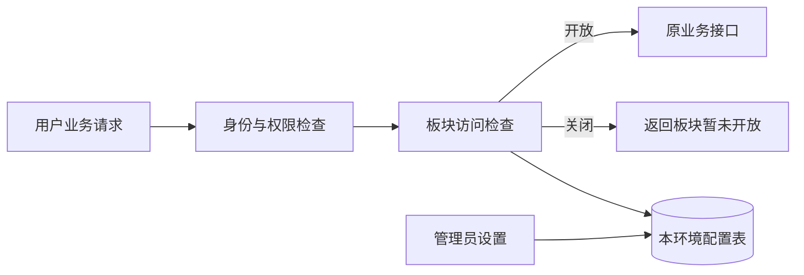

# 板块访问开关：接口、存储与页面接入设计

> 状态：2026-09-16 方案已获用户采用，尚未实施。用户表示“先通过你这套方案”，本设计与 make run 配套一起记录通过；[访问控制范围和默认／重启规则](../../requirements/development-runtime/business-access-control.md)继续有效。
>
> 本轮覆盖统一入口、配置与页面接入。[`make run` 启动配套](2026-09-15-local-full-stack-design.md)已获采用并补齐 Worm；两个 BSC 索引器与 Sports 删除、Worm 保留的[删除与清理配套设计](2026-09-16-module-removal-cleanup-design.md)已完成自查及补充；Token 详细接入继续延期。原 D01–D03 运行控制设计保持暂停。

> 范围修订（2026-09-16）：用户确认 Worm Markets／Trading 统一使用一个访问开关，并采用已受理工作继续、新用户请求拦截、重新开放不自动补发的交易处理方式。完整清单为六个可控板块、42 个现有公共 RPC，另覆盖 Worm 原始 HTTP、二次验证与七条页面路由；本文已补齐该接入设计，尚未实施。

## 1. 实现选择

采用**现有 API Server 统一检查 + PostgreSQL 持久配置 + 共用页面访问状态**。请求先完成原有身份与权限检查，再检查板块是否开放，最后执行业务处理。

| 选择 | 取舍 |
| --- | --- |
| API 每次请求读取配置（本期采用的提案） | 一次主键查询即可得到本环境当前设置，多 API 实例共用数据库，无缓存失效协议 |
| API 缓存配置、定期更新 | 减少数据库读取，但需额外定义多实例延迟与缓存失效；本期不采用 |
| 业务进程分别检查开关 | 增加每个业务的改造与维护范围，偏离只管理用户入口的目标；本期不采用 |

新增 `internal/server/moduleaccess/` 作为 API 内部的准入与管理模块，无独立命令、后台任务或部署。配置由 API 管理，业务服务维持自己的权限、后台任务和故障处理。

## 2. 接口拦截清单

### 2.1 公共 gRPC 接入清单

下表依据当前公共 proto 核对，六个板块共 **42 个受控 RPC**，包含原五板块 36 个和 Worm 6 个。登记使用完整 RPC 名称，不按 URL 文本模糊匹配。表中服务下每个方法均受该板块开关约束，原有读写权限和账户资格继续生效。

| 板块标识 | 公共服务 | 本期受控方法 |
| --- | --- | --- |
| `trader_sync` | `tradersync.TraderSyncService` | `ResolveTarget`、`CreateSubscription`、`ListSubscriptions`、`GetSubscription`、`PauseSubscription`、`ResumeSubscription`、`CancelSubscription`、`UpdateTargetNote`、`ListActivities`、`GetActivity`、`ListSubscriptionHistory`、`GetSummaryBatch`、`ListSummaryParts`、`ListSubscriptionSummaries`、`GetSubscriptionSummary` |
| `solana` | `solana.SolanaService` | `ListProjects`、`GetDiscoveryStatus` |
| `market_radar` | `marketradar.MarketRadarService` | `GetMarketRadarStatus`、`ListHotMarkets`、`ListRealtimeMarkets`、`ListMarketMovers` |
| `managed_oo` | `managedoo.ManagedOOService` | `GetManagedOOStatus`、`ScanManagedOOBlock`、`ListManagedOOProposals`、`ListManagedOODisputes` |
| `profit_sharing` | `profitsharing.ProfitSharingService` | `ListRounds`、`GetRound`、`CreateRound`、`UpdateRound`、`OpenRound`、`PublishRound`、`CloseBallot`、`UpdateProposal`、`SubmitProposal`、`ReopenProposal`、`SubmitVote` |
| `worm` | `wormmarkets.WormMarketsService` | `GetWormMarketsStatus`、`GetWormEvent`、`ListWormEvents` |
| `worm` | `wormtrading.WormTradingService` | `GetWormTradingStatus`、`ListWalletBalances`、`ListWalletTradingActivity` |

`worm` 是两项服务共用的访问配置标识；原 `worm_markets`、`worm_trading` 账户权限继续分别判断，不合并权限或程序。`token` 保留为未来板块标识，暂不设计旧 Token RPC、进程或页面的接入。管理员界面对 Token 显示“接入待重构”，没有开关，不声称旧 Token 接口已经受控。Token 接入时再补齐其公共接口清单；不据此开放新的 Token 页面或接口。

Trader Sync 将来加入的手动交易用户入口应归入 `trader_sync`，沿用其目标业务文档；本清单不把尚未实现的交易接口当作现有能力。

### 2.2 核心及现有权限边界

- 登录、bootstrap、账户、API Key 管理、Wallet、Notification、健康检查、Service Status 和 Etherscan 管理不受业务访问开关约束，仍执行各自原有鉴权。
- `/tradersync.TraderSyncService/GetTraderSyncRuntimeStatus` 属于管理员健康查询，保持可用；同服务的两个订阅概要接口属于业务访问，已经列入上表。
- Solana／Market Radar／Managed OO／Worm 的业务状态查询属于各自业务页面，列入受控范围；管理员通用健康接口继续提供健康信息。
- Profit Sharing 的会员资格、管理员操作与普通模块权限是不同授权路径，统一准入不能遗漏这些接口。Wallet 虽在模块权限表中，仍属常开核心能力。
- 业务间调用使用既有内部服务鉴权，访问开关不进入内部业务 gRPC 服务。内部端口继续只接受可信服务身份，不能提供面向用户的绕过入口；请求头、自称管理员或 `DisableAuth` 均不能跳过已接入板块的开关。
- Sports 属于待删除范围；Token 详细接入延期；Worm 属于保留并纳入本期接入的范围。不得将 Worm 误列为删除对象，或因入口遗漏默认放行。

### 2.3 检查位置与生效

在[统一认证拦截器](../../../internal/server/authz.go)调用 `authorizeGRPC` 成功后、调用业务 handler 前执行访问检查。这样原有管理员、Profit Sharing 等提前返回的授权分支都不会绕过检查。

现有 HTTP JSON 经 [grpc-gateway](../../../internal/server/athena-server.go)转为 gRPC，和直接公共 gRPC／gRPC-Web 请求共用该检查。检查同时接入 unary 和 stream 的入口；当前上表均为 unary。已经通过检查的请求允许完成，不中断已接收工作或追溯终止连接。

维护完整方法的访问分类：受控板块、核心豁免、明确延期／待删除。未分类的方法拒绝访问并报告配置缺失；覆盖检查枚举实际注册服务，防止新方法仅加入权限表就遗漏板块分类。独立 HTTP 业务 handler 必须调用同一检查函数；现有独立 Wallet／普通身份入口仍是核心，Worm 专属用户操作按第 2.4 节登记，不因使用 Wallet 或认证组件就成为核心豁免。

每次检查从本环境主数据库读取一行配置，使用当前请求 context，并将单次配置操作上限设为 2 秒（原请求剩余时间更短时优先使用）。不使用只读副本或跨请求缓存。管理员保存成功后的新检查读取新值；与保存重叠且已经读到旧值的请求视为已准入，不提供全系统停止屏障。

### 2.4 Worm 原始 HTTP 与二次验证入口

以下入口全部登记为 `worm`。路径按部署前缀归一化后精确匹配 HTTP 方法和路由模板，不用 `worm` 关键词或整个 `/auth/*` 前缀代替分类。保留原有交互式会话、账户／对象归属、读写权限、Origin、防重放、授权目的和期限检查；在这些请求的原认证／权限检查通过后、读取业务数据或产生授权／业务副作用前执行准入。

**业务 HTTP**：以下相对路径均以 `/api/v1/worm-trading` 开头，共 28 项现有方法／路由注册。冒号命令由既有 resource 解析器识别，分类覆盖命令分支，不仅覆盖集合入口。

| 接口族 | 现有方法与路径／命令 | 注册源码 |
| --- | --- | --- |
| 钱包选择 | `GET/PUT /wallet-selection` | `internal/server/worm_wallet_selection.go` |
| 钱包连接 | `GET /wallet-connections`；`POST/DELETE /wallet-connections/{connectionResource}`，含现有连接命令 | `internal/server/worm_connection.go` |
| 事件目录与组合 | `GET /events/{eventConditionId}`；`GET/POST /combinations`；`GET/PUT/DELETE /combinations/{combinationId}` | `internal/server/worm_combinations.go` |
| 执行预览 | `POST /execution-plans`；`GET /execution-plans/{planId}` 及 `/steps` | `internal/server/worm_execution_plans.go` |
| 交易 Run | `GET/POST /executions`；`GET /executions/{runId}` 及 `/steps`；`POST /executions/{executionMutationResource}` 及 `/executions/{runId}/steps/{executionStepMutationResource}`；包括 start、pause、continue、terminate、heartbeat、execute-next、reconcile | `internal/server/worm_executions.go` |
| 单笔 Cash Out | `POST /position-cash-outs`；`GET /position-cash-outs/{cashOutId}`；`POST /position-cash-outs/{cashOutMutationResource}` 的既有命令 | `internal/server/worm_position_cash_outs.go` |
| 批量 Cash Out | `POST /position-cash-out-batches`；`GET /position-cash-out-batches/active`、`/{batchId}`、`/{batchId}/items`；`POST /position-cash-out-batches/{batchMutationResource}`，含 cancel、pause、continue、terminate、check-status | `internal/server/worm_position_cash_out_batches.go` |

**Worm 专属二次验证**：同时覆盖 [API Server](../../../internal/server/athena-server.go) 的以下两套注册，沿用各 handler 当前允许的方法，不扩大允许的方法：

- `publicHandlers`：`/auth/worm-trading/google`、`/auth/worm-trading/executions/google`、`/auth/worm-trading/position-cash-outs/google`、`/auth/worm-trading/position-cash-out-batches/google`；`/auth/worm-trading/solana/challenge`、`/auth/worm-trading/solana/verify`；本地 `/auth/worm-trading/development`。
- 原始 mux：`POST /auth/worm-trading/executions/{runId}/solana/{challenge|verify}`、`POST /auth/worm-trading/position-cash-outs/{cashOutId}/solana/{challenge|verify}`、`POST /auth/worm-trading/position-cash-out-batches/{batchId}/solana/{challenge|verify}`，以及这三个对象路径下的 `POST .../development`。花括号中的 `challenge|verify` 表示两条现有固定路由，不是新通配接口。
- 共用 `/auth/google/callback` 保留普通登录与 Wallet 重新验证能力；四个 Worm purpose 的 callback 分支在校验并消费各自绑定的可信 state、确认会话与权限后，重新检查 `worm`，再签发 lease 或提交交易授权。发起验证时已开放不代表回调自动获准入；禁止依据未经验证的 query purpose、return URL 或 Cookie 名单独放行。

API 向 Google／Phantom 及开发验证处理器注入同一个访问检查能力，不要求这些模块或业务进程另建配置存储。关闭／无法确认时沿用本节规定的错误语义；JSON 错误保留 `ErrorInfo`，重定向回页面的验证流程传递专用关闭／无法确认原因并重新查询访问状态，不进入普通登录失败或登出分支。已消费的 state／challenge 不恢复、不自动重试授权，重新开放后由用户重新发起验证。

Worm HTTP handler 现有错误序列化也须保留第 4 节的稳定 reason；仅给 gRPC 错误增加详情不足以覆盖原始 HTTP。覆盖校验同时枚举 gRPC、业务 mux、`publicHandlers` 和共享 callback 的目的分支；开发身份模式也必须受控。暂停、终止、断开连接等仍是新的用户操作，本期没有关闭后的业务操作白名单；普通退出登录、核心 Wallet、账户权限及健康接口继续可用。

**内部端口边界**：Trading 已有内部 Bearer 认证；Markets 当前 `CreateGRPC` 没有内部认证拦截器，本期接入须补齐 Markets 的 unary／stream 服务鉴权和 API、Trading 客户端凭据注入。使用独立 `ATHENA_WORM_MARKETS_INTERNAL_AUTH_TOKEN`，沿用现有内部 token 的最少 32 字节、无空白校验；除健康探测外的内部 RPC 均认证，生产限制到受信任服务网络，本地绑定 loopback。业务用户只经 API 入口调用，不能直接借内部端口绕过访问检查；后台可信调用继续执行原业务权限，不读取访问开关。不新增服务或控制协议，具体注入与部署边界见[运行配套](2026-09-15-local-full-stack-design.md#33-worm-两服务接入)。

## 3. 配置存储

在现有账户状态数据库新增 `athena_module_access_setting`，由 API 的 moduleaccess 模块拥有，通过[账户状态 SQLStore](../../../internal/accountstate/store/sql_store.go)提供有限读写方法；沿用 API 已持有的连接池及关闭责任。

| 字段 | 类型与规则 |
| --- | --- |
| `module_key` | `TEXT PRIMARY KEY`；仅允许 `trader_sync`、`solana`、`market_radar`、`managed_oo`、`profit_sharing`、`worm` 六项；Token 暂不写入 |
| `is_open` | `BOOLEAN NOT NULL DEFAULT FALSE` |
| `updated_by_account_id` | 可空 UUID，引用 `athena_account.account_id`；管理员修改时由可信会话写入 |
| `updated_at` | 可空 `TIMESTAMPTZ`；管理员修改时使用数据库时间 |

- 缺少配置行表示尚未设置，按关闭返回，修改人和时间为空，界面显示“默认设置”。第一次管理修改执行 upsert，无需在每次启动时创建或重置记录。
- 不提供删除配置、全局重置或临时覆盖接口。已保存值在本地、生产各自的数据库内持久存在；重启不会改写。
- 一个设置写入在一个数据库事务内完成，提交成功后才响应成功。状态、修改人和时间一起保存；只保留最后一次修改信息，本期不新增操作历史系统。
- 多名管理员同时修改时按最后提交的设置为准。接口提交明确目标值；同值提交也属于一次设置，更新最后修改信息。不引入版本比较、长操作或命令队列。
- 只修改访问配置，不更新账户模块权限、权限 revision，也不触发撤权回调、订阅暂停或通知资格变更。
- 配置读取失败与缺行分开处理：缺行是默认关闭；数据库不可用是暂不可确认，不覆盖已有设置。

## 4. 公共接口与错误

新增 `internal/server/moduleaccess/moduleaccess.proto`，由 API Server 注册 `moduleaccess.ModuleAccessService`。这只是同一进程内的公共 API 服务定义。

| RPC | HTTP | 权限与返回 |
| --- | --- | --- |
| `ListModuleAccessStates` | `GET /api/v1/module-access-states` | 已认证账户可读，包括 Pending；返回全部已登记板块的 `module_key`、`state`，不包含管理员身份或业务数据；此接口本身不受开关约束 |
| `ListModuleAccessSettings` | `GET /api/v1/admin/module-access-settings` | 持久管理员角色；返回状态、最后修改人的账户 ID／用户名及修改时间 |
| `UpdateModuleAccessSetting` | `PUT /api/v1/admin/module-access-settings/{module_key}` | 持久管理员角色及交互式登录会话；本地沿用 `local-admin`。请求为 `module_key`、`state`，返回已提交的该行设置；API Key 不提供设置写入能力 |

状态枚举为 `MODULE_ACCESS_STATE_OPEN`、`MODULE_ACCESS_STATE_CLOSED`；协议保留的 `UNSPECIFIED = 0` 只表示缺失／无效输入，不能成为第三种业务配置状态。写入时未知标识、尚未接入的 Token 或未指定状态均返回 `InvalidArgument`。操作者、时间由服务端确定，客户端不能指定。

状态读取只回答环境是否开放，不替代原有账户权限或 Profit Sharing 资格。bootstrap 保持当前身份与设置职责；业务页在身份就绪后另行加载访问状态，开关查询失败不会阻止核心页面或登录。

| 情况 | gRPC／HTTP | 稳定 reason 与界面行为 |
| --- | --- | --- |
| 已关闭 | `Unavailable`／503 | `MODULE_ACCESS_CLOSED`；显示“该板块暂未开放”，停止该板块用户请求 |
| 配置暂不可读取 | `Unavailable`／503 | `MODULE_ACCESS_UNAVAILABLE`；显示“暂时无法确认板块访问状态”，允许重新检查 |
| 参数不合法 | `InvalidArgument`／400 | 指明无效字段，不修改设置 |
| 身份或角色不符合 | 沿用现有认证／授权错误 | 普通用户不能设置；真正的身份失效按原会话规则处理 |

前两个错误使用现有 `google.rpc.ErrorInfo` 方式，domain 为 `athena.module_access`，metadata 包含 `module_key`（列表整体读取失败时不提供）。错误消息不得使用现有账户维护专用文案“系统维护中”。[请求错误解析](../../../ui/src/app/shared/services/requests.ts)按稳定 reason 分类，不能把板块关闭处理成登出、撤权或服务健康结论。

更新超时或响应丢失时，界面显示“保存结果未确认”，重新读取当前设置；不自动重发修改。读取恢复后显示数据库实际值及最后修改信息，用户可以再明确设置。保存中的操作仅禁用对应行；独立的其他板块可继续操作。

## 5. 页面接入

### 5.1 管理员入口

在现有 **Service Status** 增加第四个页签 **Module Access（板块访问）**，保留默认 Services 及原三个来源的布局、独立请求和健康语义。开关页签的失败不遮盖健康页签，关闭某个板块也不会关闭这个管理入口。

桌面使用一张紧凑表：**板块／访问状态／最后修改人和时间／操作**。六个已登记板块各占一行，Worm 只显示一行，附注“Markets 与 Trading 共用”；Token 另显示“接入待重构”，无状态开关。手机沿用现有按行分组方式，把修改信息放在状态下面，按钮保留完整文字与可点区域。

页面固定说明：“关闭访问会拦截新的用户请求；后台任务和通知继续运行。”开放／关闭均使用明确文字按钮，点击后直接保存，不增加确认弹窗或全表保存步骤。等待时显示“保存中”，成功后才更新当前值；失败保留上次确认值并标注错误，状态无法确认时禁用设置直至重读成功。此处不展示启动、停止中或收尾进度。

管理员列表每 5 秒进行一次可见页刷新，也支持手动刷新；一次只保留一个读取请求。开始修改时使之前的列表响应失效，修改完成后重新读取，避免旧读取覆盖保存结果。同账号其他窗口或其他管理员的变化在下一次成功读取时显示；最后修改信息帮助核对当前值。

沿用[全站视觉主题](../../requirements/web-ui/visual-theme.md)和[Service Status 视觉基准](../../requirements/web-ui/service-status-proposal.md)：深色、青绿色强调、现有字体及桌面／手机组件。关闭使用中性状态，服务故障使用已有故障语义；键盘、焦点、屏幕阅读器状态反馈沿用共用组件。本文是交互与技术接入设计，尚未提供新页签的视觉验收证据。

### 5.2 用户与管理员业务页

新增共享访问状态 provider 和 `BusinessAccessBoundary`，挂在各自会员／管理员应用的已认证部分。先保留原有权限判断，再对业务路由加访问边界；核心路由不等待这份状态。会员端覆盖 Trader Sync、Solana、Market Radar、Managed OO、Profit Sharing、Worm 的全部详情与子页面；管理员端覆盖 Trader Sync 订阅概要和 Profit Sharing 页面。

Worm 现有七条会员路由统一使用 `worm`：`/worm-trading`、`/worm-trading/combinations`、`/worm-trading/combinations/new`、`/worm-trading/combinations/:id/edit`、`/worm-trading/combinations/:id/execute`、`/worm-trading/executions`、`/worm-trading/executions/:id`。沿用现有 Worm Trading 菜单和页面，不新增独立 Markets 导航。页面内的连接、授权、Cash Out 及弹窗一起受边界约束；未来新增 Worm 管理员业务页同样受控。

| 页面状态 | 行为 |
| --- | --- |
| 首次确认中 | 不挂载业务组件，显示检查状态，避免先请求数据再隐藏 |
| 已开放且原权限满足 | 挂载原业务组件，保留原读写限制 |
| 已关闭 | 隐藏业务正文及编辑草稿，停止页面业务请求，显示“该板块暂未开放”；保留当前 URL、侧栏和账户入口 |
| 断线或无法确认 | 隐藏业务正文，显示重新检查入口；不把上次开放值当作当前值 |
| 重新开放 | 重新确认原权限后加载当前页面数据，不重放先前操作或提交草稿 |

已获权限的菜单入口保留，进入后可看到明确关闭说明；无权限入口继续遵守原权限规则，不因此新增业务入口。关闭某个板块不能修改登录状态、账户授权或其他板块页面缓存。

已确认的“前台联网页面最多 5 秒隐藏”按以下方式落实：

- 已认证的前台应用每 2 秒单次查询最小状态接口；成功状态的新鲜期从该次请求发起时计，最长 5 秒。计时采用浏览器单调时钟，过期即转为无法确认并隐藏正文；迟到超过新鲜期的响应不能恢复开放显示。
- 页面隐藏、离线时使业务显示状态失效；恢复前台、focus、pageshow 或重连后先重新读取，再显示数据。已关闭时继续查询访问状态，以便发现重新开放。
- 收到 `MODULE_ACCESS_CLOSED` 时立即使对应板块缓存、先前发起的状态读取和业务读取范围失效，隐藏正文并触发重读；这些旧响应均不得恢复开放或填回正文。未确认错误也不能继续展示旧开放内容。
- 在[现有请求范围](../../../ui/src/app/shared/services/requests.ts)和[可见查询机制](../../../ui/src/app/shared/use-visible-query.ts)上增加板块显示范围，包含本地失效标记；关闭／身份变化／页面离开后，旧请求响应不得重新写回可见数据。卸载业务组件会关闭浏览器自己的轮询与订阅。

浏览器取消等待或清理草稿只控制页面展示，已经到达服务端并通过准入的工作仍按原业务规则完成。通知、后台扫描和外部调用不使用这个 provider，也不读取访问开关。

### 5.3 Worm 交易驱动与重新开放

- 关闭／无法确认／页面失效时，销毁当前页面驱动范围，停止读取轮询、Run 协调心跳和 `execute-next` 调度；使已排队定时器、迟到请求、钱包签名弹窗结果和验证回调失效。这些回调不能再触发下一次变更请求。停止本地驱动不自动发送 pause、terminate、Cash Out 或断开连接命令。
- 每次新 HTTP 请求单独准入；已创建 Run 不等于后续步骤已经受理。已受理的 Step 按既有 worker／恢复机制完成或失败；其后的 Step 若还需要新的浏览器请求，就必须重新通过访问检查。现有 30 秒协调租约及恢复规则继续适用，不增加新的“访问关闭”业务状态。
- 重新开放先读取当前 Run、预览或 Cash Out 实际状态，不自动恢复心跳、start、continue、execute-next 或授权提交。即使读到 Run 仍为运行态，也不凭挂载或返回页面启动驱动；由用户明确操作，按现有有效授权、协调权和可用动作继续，必要时重新验证。
- 单笔 Cash Out、已授权的批量 Cash Out 和预览构建如果已经由后台受理，继续按各自原规则推进；批次内部的后续项目不是新的浏览器请求，不能承诺关闭访问会暂停整批。尚未授权或需要人工继续的阶段不会因关闭／开放开关自动获授权。

本期不改变资产、仓位、订单、权限或授权有效期，也不让管理员获得代用户继续交易的权限。界面重新加载必须显示真实完成／失败／待处理结果，不根据关闭时间推断交易已取消。

## 6. 接入文件与同步边界

| 范围 | 实施位置及同步对象 |
| --- | --- |
| 数据库 | `internal/accountstate/store/migrations/`、`queries/`、SQLStore；同步实际受影响的 sqlc 输出与账户 schema contract，启动只验证 schema，不重置设置 |
| API | 新 moduleaccess proto／handler／准入函数，`internal/server/authz.go`、`athena-server.go`；更新生成 Go／gateway／Swagger 与实际消费者 |
| Worm 接入 | 七组原始 HTTP handler，Google／Phantom／开发验证及回调，Worm 请求服务和页面驱动；Markets 内部鉴权与 API／Trading 客户端配置，原业务 proto 与持久状态不因开关改名 |
| 前端 | 新共用访问状态与请求错误分类；会员／管理员 `app.tsx` 路由边界；管理员新页签组件及 service 注册，沿用现有样式组件 |
| 长期文档 | 当前访问需求、会员／管理员及共享应用壳、需求／设计索引同步状态；原运行控制文档继续保持历史标记 |

遵守[服务开发规范](../../developer-guide/service-development-standards.md) SDS-R2／R4／R6／R7／R8：这是 API 请求准入职责，无新增独立业务进程；账户数据库仍是已知共同依赖，沿用连接池归属；配置事务不跨 RPC，关闭访问不触发账户撤权事务。部署沿用现有 API，先准备新增 schema 再启用实现。生成源与消费者按实际依赖同步，不手改生成文件。

## 7. 验收与审阅范围

实现时至少验证以下六组行为：

1. 42 个当前受控 RPC、Worm 28 项业务 HTTP 注册、16 项专属验证注册及四种 Google 回调目的分类完整；HTTP JSON、直接 gRPC／gRPC-Web、原始 HTTP 和开发身份模式均被关闭开关拦截，管理员业务和原本允许的 API Key 调用同样受控，核心及健康入口可用。内部 Markets／Trading 无凭据调用拒绝，合法后台调用不受开关影响。
2. 首次默认关闭，开放与关闭均能保存；本地／生产配置隔离、整体和单进程重启均不改值；并发修改与响应丢失能如实显示当前设置。
3. 非管理员不能修改，管理员 API Key 不能写设置；关闭不更改账户权限、订阅状态或通知资格；原权限不足时仍拒绝业务请求。
4. 受控请求已准入后允许完成；后台任务、内部服务调用及通知继续运行。Worm 第二笔已受理、第三笔未准入时只处理已受理步骤；已授权后台 Cash Out 批次仍遵守原流程。验证发起后关闭、再返回 callback 时不签发新授权；普通登录不受影响。
5. 桌面／手机、根路径及 `/athena` 前缀下，页面首次确认、关闭、5 秒新鲜期、离线恢复、迟到响应、直接详情链接和保存错误均符合第 5 节；核心页面无需等待访问状态。Worm 七条路由、弹窗、排队定时器和迟到签名结果不会绕过边界；重新开放不自动恢复交易驱动或重发动作，管理员只有一行 Worm 设置。
6. 配置不可读、缺行、缺失状态字段、未知方法、未知板块分别按约定处理；“未开放”不会导致登出或显示虚假的服务故障。

本轮仅核对源码和文档；实施时完成适用的存储／API／UI 测试及真实浏览器验收。完整服务编排、删除实施和 Token 专属接入分别记录其范围与结果，不能由本方案的局部验收代替。

**确认记录（2026-09-16）**：用户先采用一张表与三个接口、统一准入边界、Service Status 新页签直接保存及 Token 延期。其后保留 Worm，并明确“统一使用一个开关。然后交易处理方式按照你的建议”。本文已补齐共用 `worm` 设置、完整用户入口、内部端口鉴权、七条页面路由和按请求处理的交易边界；相关运行配套同步更新。本次通过不代表代码已实施，原 D01–D03 仍暂停。
