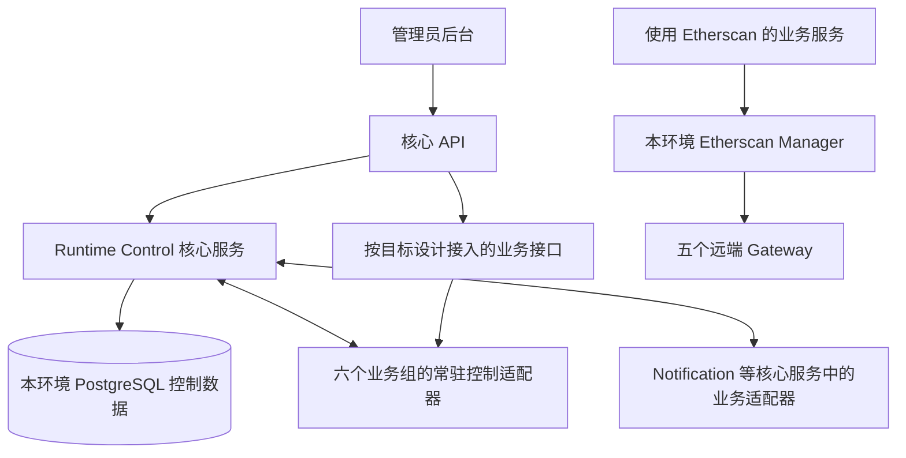

# 业务板块整组运行控制：历史技术设计

> 当前状态：已暂停，由[板块访问开关简化方案](../../requirements/development-runtime/business-access-control.md)接替本期讨论。2026-09-15 用户要求将范围收缩为用户流量拦截，后台程序和任务继续运行。
>
> D01（独立控制服务）、D02（运行状态模型）、D03（命令与生效点）在原范围下曾获确认，以下保留历史设计。它们尚未实施；本期不再新增 Runtime Control 服务或推进成员注册、失联、重启与收尾协议。Token 详细接入仍延期。

## 已确认的架构选择

**D01：新增一个常开的核心服务 `athena-runtime-control`，负责业务组状态与协调。** 用户于 2026-09-15 回复“可以沒問題”，接受此架构。管理员仍从现有后台操作；API 转发经过身份校验的控制请求；各业务进程自己关闭入口、启动任务和执行收尾。

该名称是目标新增命令，当前不存在。它不属于六个业务组，不提供管理员业务启停按钮；本地与生产各有自己的控制实例。现有 14 个业务进程的核对数字仅描述包含旧 Token 的当前源码，不能作为目标部署数量；新增控制服务作为已确认的目标核心成员单独登记。

### 方案比较

| 方案 | 主要做法 | 对当前需求的影响 |
| --- | --- | --- |
| A：独立控制服务＋PostgreSQL（已采用） | 一个独立服务持有控制状态、协调流程和操作记录，业务进程执行本组命令 | 职责可独立构建、测试和运行；复用现有数据库基础设施，需要增加一个核心进程及明确的控制协议 |
| B：在 API 内持续协调 | API 同时处理网页请求、后台成员监测、故障收尾和恢复协调 | 进程数少，但 API 会持有长时间运行的协调任务，扩大故障影响并与 SDS-R1／R2 的职责边界冲突，不建议用于本需求 |
| C：独立控制服务＋新增协调存储 | 使用额外的协调基础设施保存状态和管理租约 | 可以支撑更复杂的多实例协调，但增加部署、授权和故障恢复范围；当前需求尚未证明需要额外存储系统 |

选择 A 后，技术设计仍须证明停止与新请求的并发边界。使用 PostgreSQL、持久状态或心跳本身不等于已经满足“接受停止后立即拒绝新业务”。

## Token：保留业务组，详细接入设计延期

**范围调整，2026-09-15**：用户要求 Token 的详细设计等其重构完成后再进行。本轮只保留 Token 业务组及其遵守通用控制规则的接入边界；当前的通用状态、启停协议、故障处理和管理接口设计继续推进。

Token 的具体成员、任务暂停与恢复、扫描进度、重试、内部事务、通知与查询适配及专属验收，均留待重构完成后结合最终文档与实现设计。本轮不确定这些细节，也不要求先给旧九进程接入控制。

此前已确认的设计依据原则保持：Token 的[业务需求](../../requirements/token/README.md)与[重构设计包](2026-09-10-token-first-block-design.md)决定目标，旧代码仅作差距与清理依据。先前列出的目标职责、项目研究生命周期及 Nansen 适配细节从本轮详设范围移出；原 Token 文档保持其自身规则，未因本次延期而变更。

Token 仍属于长期目标中的六个业务组，不表示本轮已经完成其接入，也不表示允许其绕过默认停止和整组控制规则。通用框架可独立形成设计与验收范围，后续再补齐 Token 接入设计及证据。

## 组件职责

| 组件 | 已确认的职责边界 | 资源归属 |
| --- | --- | --- |
| 管理员页面 | 发起整组启动／停止，展示操作进度、成员状态、失败原因和最近确认时间 | 浏览器请求与页面缓存；不直接控制进程 |
| API Server | 识别用户与管理员权限、转发控制请求、提供页面所需的状态投影；业务代理入口同样执行准入检查 | 自身连接与请求；不持有业务 runtime 或替业务进程启动后台任务 |
| Runtime Control | 维护环境、组、成员与运行代次，校验控制权限和依赖，串行化相互冲突的决定，协调启动／停止及故障处理，保存审计记录 | 控制表、控制服务连接与协调任务；不关闭成员的数据库连接或进程 |
| 业务进程内的控制适配器 | 在进程启动时先关闭业务入口并注册身份，执行准备、运行与收尾，报告证据；管理接口和健康接口常驻 | 本进程任务、取消信号与资源；与业务实现保持明确接口 |
| Notification 等核心服务的业务适配器 | 按可信来源对附属业务任务执行控制；保留核心自身能力 | 例如暂停 Trader Sync 待发送通知，核心账户通知继续发送 |
| PostgreSQL | 持久保存控制决定、成员运行身份、操作进度与审计依据 | 复用本环境数据库基础设施，控制数据由独立模块及迁移维护 |

内部接口使用带服务身份的 gRPC；管理员操作还携带可信用户身份，由控制服务复核管理员权限。健康检查、成员管理和业务入口分开授权，不能用伪造的组名、用户字段或“核心请求”标记绕过停止限制。

控制记录与业务记录的事务仍由各自资源所有者负责，不通过 RPC 传递数据库事务。Notification 的发送许可与实际发送之间存在额外原子性要求，后续协议设计须明确受控 adapter 的同库边界或等价同步机制，不能仅凭一次远端许可就继续发送。

## 调用关系

图中的控制连接不表示所有业务数据都要经 Runtime Control 转发。业务数据仍由其所属服务处理；[D03 已确认设计](2026-09-15-business-group-control-commands.md)具体化命令、准入关闭确认与停止生效点。Runtime Control 不部署或启停远端 Gateway。

## 第二段已确认：通用业务组状态模型

**D02，2026-09-15**：用户回复“确认”，接受本段通用状态模型，供控制服务、业务适配器和管理员页面共同使用。这里只设计通用状态及其判断边界，不设计 Token 内部任务，也不提前确定数据库字段、RPC 消息或超时数值。

### 目标、执行阶段与异常分别记录

采用分别记录目标状态、执行阶段和异常信息的模型。若只使用一个“启动／停止”布尔值，会丢失准备和收尾过程；若把“运行中、启动失败、网络断开”等全部塞进同一个状态，则难以表达“启动失败后仍在收尾”。分开记录后，页面可以同时说明当前阶段和需要处理的问题。

| 信息 | 含义与取值边界 | 维护依据 |
| --- | --- | --- |
| 目标状态 | 运行或停止，表示控制服务当前要求达到的结果；默认停止 | 已接受的管理员命令，或按既定重启／故障规则作出的停止决定；被拒绝的命令不改变目标 |
| 执行阶段 | 已停止、启动中、运行中、停止中 | 控制决定及匹配本次运行身份的成员就绪／收尾证据；不直接复制目标值 |
| 异常信息 | 启动失败、停止超时、必需成员或依赖故障，附原因与受影响范围 | 实际失败与故障证据；可以与执行阶段同时存在 |
| 成员健康 | 进程、管理通道及所需能力是否可用 | 分别记录检查结果；进程在线不代表业务运行 |
| 状态确认情况 | 最近可信状态及确认时间，当前是否仍可确认 | 服务端证据与客户端连接情况；旧结果只能作为历史信息 |

控制服务是组级决定的权威来源，成员负责报告自身事实，页面负责展示。一次心跳或进程存活不能替代组就绪、收尾完成或业务准入证据；“运行中”文字也不能单独充当允许执行业务的凭据，具体准入协议在下一段设计。

### 四个执行阶段

| 阶段 | 必须表达的事实 | 新业务访问 |
| --- | --- | --- |
| 已停止 | 已确认业务执行及必要收尾结束，等待管理员开启 | 关闭 |
| 启动中 | 已接受启动，正在准备必需成员与依赖，尚未满足整组开放条件 | 关闭 |
| 运行中 | 本次启动所需成员及依赖已满足约定条件，整组已开放 | 仍需通过有效控制依据和原有用户／服务权限检查 |
| 停止中 | 已接受停止或触发既定故障停止，正在取消、收尾或确认剩余工作 | 关闭 |

默认停止首先约束目标和业务入口。初始化或重启后，若尚无可信的执行阶段或旧工作结束证据，应显示无法确认及待核对范围，不能仅因默认目标为停止就宣称已停止。

### 转换与异常展示

1. 接受启动后，目标为运行，执行阶段从已停止进入启动中；全部必需成员就绪后才进入运行中。启动请求被拒绝时保留原状态和拒绝原因，不自动排队执行。
2. 启动失败时，记录失败原因，目标转为停止；尚有收尾或结束待确认时处于停止中，确认结束后才为已停止。管理员可看到“启动失败，正在收尾”或“已停止，上次启动失败”，故障自行恢复不触发自动启动。
3. 接受停止时，目标转为停止，关闭新入口并进入停止中；确认必要工作结束后转为已停止。由于依赖约束被拒绝的停止请求不改变目标或执行阶段。
4. 必需成员、必需依赖故障或业务成员重启按 R08／R11／R14 触发所属组的停止流程；记录原因，未确认全组结束前不显示已停止。
5. 停止超时后，执行阶段仍为停止中，附停止超时异常；页面突出显示“停止异常／需处理”，继续保留收尾进度和未知范围。异常不能被普通心跳清除，只有取得结束证据后才能转为已停止；失败及超时事实保留在操作记录中。

以上描述控制服务接受操作后的已确认状态语义；目标变更、业务准入关闭和成员执行之间的衔接见 [D03 已确认设计](2026-09-15-business-group-control-commands.md)。已确认方案区分收到请求与停止接受：主动停止先预约、确认关闭后才提交生效；故障或重启仍直接设置停止目标并核对实际关闭范围。该机制已获确认，尚待实现验证，不能把写入状态记录当作已关闭远端入口的证据。

### 无法确认与管理员操作

无法取得可信状态时，页面使用“暂时无法确认服务状态”，隐藏业务数据，并把最近阶段标为过期信息；不把网络断开改写成已停止，也不伪造控制服务已接受新的停止命令。恢复连接后先重新确认，沿用 R20 的前台更新上限和恢复校验。

已停止后，管理员可重新发起启动，控制服务仍检查就绪条件及必需依赖；已接受的启停过程持续展示进度，不用按钮点击结果代替完成结果。停止中或仍有未确认收尾时不能用一次启动跳过收尾。重复命令、相反命令与多管理员并发的具体处理已整理为 [D03 已确认设计](2026-09-15-business-group-control-commands.md)，已获用户确认。

本段已确认“目标、执行阶段、异常和状态确认分开表达”，成员健康独立展示；已确认的产品行为直接沿用。后续验证应覆盖：目标停止但仍在收尾、启动失败的收尾、停止超时、依赖拒绝不改状态、进程在线但业务停止、重启初始证据不足及页面断线不误报；本轮只有文档静态核对，没有运行验证。

## 启动、停止与重启的分工

### 进程启动

1. 本地或生产编排启动核心服务、控制服务和所选业务进程。
2. 业务进程先建立管理能力，使用新的本次运行身份注册；业务入口和采集任务保持关闭。
3. 控制服务将进程身份、目标成员和当前组状态关联。单个业务成员重启必须使所属组回到停止与必要收尾流程，旧的启动决定不能自动打开新进程。
4. 管理员开启组后，由各成员准备业务所需资源并报告就绪；全部必需成员就绪后才开放整组业务。

Trader Sync 的当前进程生命周期同时拥有采集和 RPC，Solana 当前命令会启动扫描与补全；这些现有差距需要拆分“进程在线”与“业务运行”。Token 的具体适配推迟到重构完成后，本轮不按旧 Worker Host 设计接入。

### 管理员启动

控制服务复核管理员身份、环境、组和必需依赖，记录操作及目标代次，再协调各成员准备。成员反馈只对匹配的环境、进程身份和代次有效；部分准备失败使整组启动失败，已开始的业务任务按需求收尾，进程保持管理能力。

公共命令建议命名为 `StartBusinessGroup`、`StopBusinessGroup`、`GetBusinessGroup`、`ListBusinessGroups`、`GetBusinessGroupOperation`。名称遵守 [gRPC RPC 命名规范](../../../.codex/skills/grpc-rpc-naming/SKILL.md)，消息字段和正式 proto 在后续接口设计中定义；当前没有新增可调用 API。

### 管理员停止

控制服务先处理跨组依赖约束，并明确记录“停止何时被接受”。从该时点开始，新业务查询、写入、任务领取及未开始发送的业务通知均须被拒绝或暂停；成员取消可取消任务并报告必要收尾。

“停止中”和“已停止”由可验证的实际结果区分。控制服务保存成员报告和未结束工作，不以广播已发出、心跳在线或请求超时作为收尾已完成的证据。停止超时保持业务入口关闭并显示异常，未知外部结果不自动重发。

### 无法确认控制状态

拟采用保守的业务准入方式：业务入口无法取得有效控制依据时不接受新业务，进程继续保留管理与诊断能力，已有工作按其可取消和外部结果边界收尾。核心服务的独立功能仍按自身依赖提供服务；共享 PostgreSQL 故障可能同时影响多个核心和业务能力，不能宣称故障完全隔离。

控制服务重启后的操作恢复、旧成员隔离和新运行代次处理需要与 R08 一起设计，不能因读到数据库中的旧 `RUNNING` 状态就重新开放业务。其具体状态机是下一段设计范围，不在本段把缓存或心跳当作实现答案。

## 与现有实现的衔接

| 现有依据 | 对新设计的约束 |
| --- | --- |
| [本地运行器](../../../internal/devruntime/registry.go)与[全栈入口](../../../internal/devruntime/fullstack.go) | 新控制服务有独立构建／运行入口，并作为需要它的业务局部运行的明确依赖；局部运行不隐式启动其他业务组 |
| [Trader Sync 运行代次表](../../../internal/accountstate/store/migrations/000002_trader_sync_runtime_control.sql)与[运行时](../../../internal/tradersync/runtime.go) | 已有代次与资源所有权仅覆盖 Trader Sync；须明确与整组控制代次的分工，不能直接冒充全系统控制表 |
| [Trader Sync 内部鉴权](../../../internal/tradersync/transport/auth.go) | 保留服务身份、可信用户、权限及 deadline 检查，业务停止检查不能取代这些边界 |
| [Token 重构目标](2026-09-10-token-first-block-design.md) | 保留业务组与通用接入边界；详细适配待 Token 重构完成后另行设计，不依据旧九角色确定成员 |
| [Notification 调度器](../../../internal/notification/dispatcher.go)、[发送器](../../../internal/notification/sender.go)、[发送实例记录](../../../internal/notification/store/queries/sender.sql) | 已领取、已获许可和实际开始发送是不同阶段；需要控制发送开始点与停止接受点的并发，保留恢复与未知结果证据 |
| [本地与生产清单](../../requirements/development-runtime/service-inventory-review.md) | 六个业务组的目标成员按各自需求／设计落实，另新增已确认的核心控制进程；当前 14 角色仅作差距基线。补齐 Solana 和本地成员，不计入待删除功能，不操作五个远端 Gateway |

## 当前评审范围与后续设计

**已确认设计**：D01 采用方案 A，新增常开的 Runtime Control 独立核心服务，复用本环境 PostgreSQL，业务服务自行执行启停与收尾；D02 采用通用状态模型，分别表达目标、四个执行阶段、异常、成员健康与状态确认情况。Token 详细接入仍待其重构完成后设计；D03 命令与生效点也已确认；确认范围不扩展到后续尚未形成的故障协议、RPC 契约或实现。

**已确认设计 D03，2026-09-15**：[重复命令、并发与生效点](2026-09-15-business-group-control-commands.md)采用请求去重、控制版本校验、持久操作记录、跨组依赖占用，以及先关闭确认再报告停止生效的协议。用户回复“采用”，确认本段命令冲突和提交阶段语义；方案比较、通知现状差距、时序依据与验证场景已写入该文档，尚未实施。

接下来继续完成以下设计内容，逐项对照已有 R01–R21 和 A01–A35；Token 专属接入与验收细化待重构完成后进行，不作为通用框架设计完成的前置条件，不重复询问已确定的产品规则：

- 权威状态与操作记录：D02 已确认；D03 已确认命令身份、版本、并发与依赖裁决，继续形成完整持久化、成员注册与控制实例身份契约。
- 准入与停止并发：D03 已确认按组关闭确认和保守执行守卫；正式 adapter 接口、各入口覆盖、故障恢复及实际并发验证仍需补齐。
- 故障与重启：组成员、控制进程、网络和数据库故障下的拒绝、取消、收尾、超时及人工恢复。
- RPC、权限与状态展示：用户／服务身份、管理员范围、幂等请求、错误分类、管理信息、5 秒页面更新和恢复前校验。
- 接入、删除清理与验证：定义通用成员注册、就绪与结束证据及验证要求，继续梳理本轮其余业务组的接入；Token 的实际成员、内部衔接和专属验收留待重构完成后设计。

这些后续内容完成前，本文保持“架构已确认、完整技术设计未完成”的状态，不生成可执行实施计划，也不修改服务源码或部署。

## 本段静态验证

本轮仅核对目标文档、源码现状、需求覆盖、职责与资源边界、RPC 名称及文档链接。架构、状态模型、命令与生效点已确认；正式服务接口、完整故障恢复和持久化契约尚待具体设计。未进行构建、业务测试或运行验收。适用 SDS-R1、R2、R3、R4、R5、R6、R7、R8；行为与并发验证证据由后续完整方案及实施补齐。
