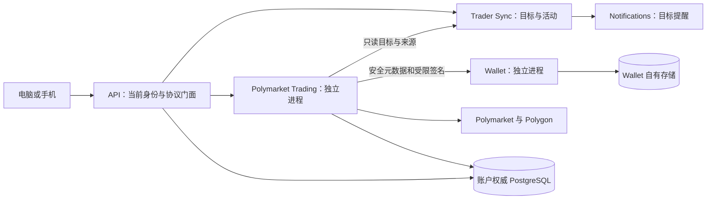

# Trader Sync 手动交易：完整开发规格

> 2026-09-15：完整规格待整体审阅。首版业务规则、服务分工、账户接入、报价／执行／资产占用、领取／持仓／历史同步，以及八个视图的桌面／手机页面方案均已分段确认。本文整合这些决定，补齐实现边界、接口之间的关系和验收条件；尚未实现本规格中的交易服务、专用签名、账户级单客户端登录或正式交易页面。
>
> 代码核对基线：`acbb9889bfbbb4080fb6504a31613ece89ccdc66`。已有 Activity Alerts 和全站共用深色主题已经实现。既有页面和源码中的样本、已通过的离线签名、静态预览检查不代表私有交易或全历史覆盖已通过真实验收。

## 1. 目标、范围与依据

用户在 ATHENA 查看目标的 Polymarket 成交，使用事前绑定的自有 EVM 钱包，自行决定买入本金或卖出比例，核对账户、价格保护和费用后手动提交；同时查看全部自有持仓、全部买卖历史、ATHENA 提交记录，并手动领取已结算资金。电脑与手机使用同一业务流程。

### 1.1 已确认设计的归属

| 主题 | 权威依据 | 当前事实 |
| --- | --- | --- |
| 25 项业务规则及补充选择 | [手动交易需求](../../requirements/polymarket-copy-trading/copy-trading.md) | 已确认 |
| 服务分工、范围与长期业务设计 | [总体设计](../../design/trading/polymarket-manual-trading.md) | 分段决定已确认 |
| 账户发现、复用、启用及受限准备 | [账户接入详细设计](../../design/trading/polymarket-account-onboarding.md) | 已确认，真实接入待验证 |
| 报价、签名、接收、发送及占用 | [执行详细设计](../../design/trading/polymarket-trade-execution.md) | 已确认，真实费用和并发行为待验证 |
| 领取、完整持仓及历史同步 | [领取与同步详细设计](../../design/trading/polymarket-redemption-and-sync.md) | 已确认，部署及完整覆盖待验证 |
| 单客户端登录 | [需求](../../requirements/identity-access/single-client-login.md)、[目标设计](../../design/identity-access/single-client-login.md) | 业务规则及与交易接收的顺序已确认 |
| 页面与视觉 | [长期交互设计](../../design/web-ui/trader-sync-manual-trading.md)、[页面方案 v1](../../requirements/web-ui/trader-sync-manual-trading-proposal.md)、[确认记录](../../requirements/web-ui/previews/trader-sync-manual-trading-v1/approval.json) | 2026-09-15 用户回复「认可」 |
| 服务工程约束 | [SDS-R1～R8](../../developer-guide/service-development-standards.md) | 本规格按第 13 节映射执行 |

上述详细设计作为本规格的组成部分，算法、来源和协议例子通过链接保留，不复制成另一套可独立漂移的规则。业务决定以用户已确认需求为准；静态原型中的虚构地址、固定行情、暂停时钟和示意计算只用于表达界面，不作为正式协议实现。

本次整合补足了当前会话字段与登录交换恢复、价格偏好的保存时点与读取接口、存储生成归属和初始工作预算。这些是供本次完整规格审阅的工程细节，不将此前分段认可记为对这些细节的单独批准。

### 1.2 首版边界

- 执行普通市场与 Neg Risk 单个选项的主动 BUY／SELL，以及支持路径上的手动 REDEEM。Combo 只承接持仓与历史展示，禁止买卖与领取；不再开展 Combo 专项研究。
- BUY／SELL 使用带价格保护的 FAK；允许部分成交，未成交余量结束。不提供挂单、自动跟单、策略设置、自动补单或自动领取。
- 一目标绑定一个自有 Wallet，同一 Wallet 只绑定一个目标；同一实际账户的多个 Wallet 别名不能绕过约束。换绑影响新的订单，已接收操作保持原账户。
- 资金由用户到 Polymarket 为同一真实交易账户入金。ATHENA 不增加入金转账、Bridge 地址、资金划转或提现功能。
- 自行买卖和领取的结果只显示在操作页与历史中；既有目标活动通知继续工作。
- 共用 Trader Sync 产品权限，另查 Wallet 权限、归属、启用及逐次确认；不新增管理员交易开关，不开放管理员或 API Key 交易入口。
- 同一账号只有一个有效交互式登录；共享同一会话的标签页属于同一客户端。不同账号 UUID 独立计算，会员与管理员账号不合并。
- 未解绑或已解绑的自有交易账户均保留资产、历史及适用的退出入口。全部数据范围包含绑定前及其他渠道，不能用当前目标绑定推断历史来源。

本次不因新服务扩展为全系统服务重构，也不增加仅为兼容旧 ATHENA 行为而存在的迁移路径、双实现或旧字段。核对真实历史链上合约属于完整历史需求。

## 2. 现状与交付边界

### 2.1 可复用的现有能力

| 现有入口 | 可复用范围 | 本规格必须新增的部分 |
| --- | --- | --- |
| [Trader Sync runtime](../../../internal/tradersync/runtime.go)、[API 门面](../../../internal/server/tradersync/tradersync.go) | 目标、活动、订阅及可见性；目标通知链路 | 交易绑定、账户、报价、执行与资产历史 |
| [Wallet 服务](../../../internal/wallet/service.go)、[Wallet proto](../../../internal/wallet/wallet.proto) | EVM 密钥保管、归属和已有专用能力的工程模式 | 独立授权的 Polymarket 签名，不能借用私钥展示或 Worm 许可 |
| [账户凭据](../../../internal/accountcredentials/manager.go)、[SessionManager](../../../util/session/sessionmanager.go) | 外部身份、JWT、当前访问资格 | 唯一有效登录的权威状态、原子替换及每次请求校验 |
| [账户门禁](../../../internal/accountstate/txgate/gate.go) | 同库账号排序和受控 adapter | 交易接收、占用与派发许可的同序事务 |
| [现有 Polymarket 数据工具](../../../util/polymarket/data.go) | 既有消费者的读取模式参考 | 经验证的当前 envelope／cursor 客户端和自有账户完整范围同步 |
| [本地运行服务目录](../../../internal/devruntime/registry.go) | 按服务选择依赖、动态端口、实例收尾 | 新服务的独立构建、配置及最小依赖条目 |

源码核对发现，现有 `IssueLoginSession` 生成 JWT，`RecordLogin` 更新审计，`AuthenticateToken` 校验权限和逐令牌撤销，但没有读取账号唯一有效登录 JTI。现有内存缓存和撤销通知不能直接满足立即替换。

### 2.2 交付物

必须一起交付账户会话存储与校验、独立交易服务、Wallet 专用 RPC、数据库与生成契约、API 门面、正式会员页面、运行配置与文档、验证及收尾证据。后端、生成客户端与实际 UI 消费者保持一致；静态样稿不能替代正式页面。

执行路径逐项提供协议证据。尚未核准的账户或合约路径显示具体不可用原因，不能凭 SDK 默认值放行；最终交付仍需满足全部已确认业务范围，不能把长期不可用状态算作需求实现完成。

## 3. 服务架构与数据归属

采用一个独立的 Go `Polymarket Trading` 服务，内部区分账户准备、报价与执行、原结果核对、当前资产、历史补齐。延续现有 Go／gRPC／PostgreSQL 工程体系；固定 SDK 是离线协议和签名对照依据，不在 API 进程运行其自动初始化／发送逻辑，不为初版增加 Node 交易进程或消息中间件。

目标活动、通知、页面读取和报价均不触发签名或发送。API 不持有交易 runtime，不启动交易 worker，不借用其他服务的内存对象。

### 3.1 所有者与事务

- 账户权威模块拥有登录、账号资格与权限状态的写入；交易服务通过受控本地 adapter 核准这些状态。
- 交易服务拥有自身账户映射、绑定、预览、尝试、步骤、占用、派发许可、资产／成交投影及同步表。接收与派发表和账户权威状态位于同一 PostgreSQL 数据库，保证同一原子不变量；表前缀采用 `polymarket_trading_`，不侵入其他服务的业务表写入。
- 共享数据库的 schema 继续由 `internal/accountstate/store/migrations` 和现有显式迁移入口统一管理；同步更新 schema contract／catalog 与生成配置。交易模块拥有自己的 query SQL／sqlc，服务启动只验证所需 schema，不新增另一套迁移编号或自动改库入口。schema 归口不改变业务表的服务所有权。
- 每个 runtime 拥有并关闭自己的连接池。adapter 借用调用方的事务或连接，不负责关闭资源。不得把事务、连接池或进程锁通过 RPC 传递。
- Wallet 私钥与其数据库保持原归属。当前 Wallet 无删除／转移归属能力；签名前仍复核 owner、EVM 类型、派生 signer 与真实账户控制。未来若新增可变归属，须先设计相应原子协调。
- 同库是明确的共同故障域；交易进程与 API 的生命周期独立，不声称数据库故障相互隔离。

### 3.2 目标代码边界

以下是拟新增路径或受影响入口，尚不是已经存在的命令和模块：

| 边界 | 目标组织 |
| --- | --- |
| 独立入口 | `cmd/athena-polymarket-trading/`，只构建本服务及声明依赖 |
| 业务实现 | `internal/polymarkettrading/` 下按账户、预览、执行、核对、投影、同步分包 |
| 存储与 API | 账户权威目录统一 migrations／schema contract；本模块 `store` 拥有 query SQL／sqlc；`apiclient` 中维护内部 proto 和安全 wire 模型 |
| Wallet 扩展 | 现有 Wallet proto、专用 Polymarket signer、身份与用途授权 |
| 登录基础能力 | accountstate 存储、accountcredentials、session 及全部实际请求消费者 |
| 公共门面 | `internal/server` 下交易门面及既有公共生成协议 |
| 前端 | 现有会员 Trader Sync 目录、服务客户端及共用会话失效处理 |
| 运行与部署 | devruntime 的 `polymarket-trading` 目标、部署描述、配置说明及停止入口 |

## 4. 单客户端登录与权限

### 4.1 权威会话状态

在账户数据库增加每个 `account_id` 唯一的当前会话记录，至少包含 `session_jti`、单调 `revision`、`identity_binding`、`activated_at`、`expires_at`。不保存明文 JWT 作为当前身份依据，不把设备名称或标签页 ID 当作会话证明。

登录生效逻辑必须把当前 `CreateExternalLogin` 的分步签发／审计改为明确的提交边界：

1. 验证 provider 身份、realm、账号绑定及登录资格，准备新 JTI 和可用的签名凭据；失败不修改旧会话。
2. 取得账号门禁，在本地事务中重新核对身份与资格，写入唯一当前 JTI／revision 与登录审计。事务成功是新登录生效点。
3. 并发成功登录按该提交顺序确定最后一个当前会话。未提交的新 JWT 不得被身份入口接受。
4. 同一已验证登录交换的重复回调使用稳定的交换标识，不重新激活它的旧 JTI。只有经过原交换身份核验、且该 JTI 仍当前有效时才能恢复原结果；已被后来登录替换则要求开始新登录。
5. 生效后响应丢失不能恢复旧登录；恢复同一交换或用户重新登录都维持至多一个当前会话。

登录交换标识必须关联服务端验证的 OAuth state／Phantom challenge 等实际认证上下文，不接受浏览器任意声明已验证身份。具体 provider 适配复用既有流程，不增设新的登录方式。

### 4.2 请求、退出与派生凭证

- 所有受保护的交互式请求必须读取权威当前会话，匹配账号、JTI、身份绑定和有效期；正向缓存不能在替换提交后继续放行旧 JTI。数据库不可用时不能回退到旧缓存授权。
- 交易、钱包敏感操作和其他有原子接收边界的写操作在该边界再次核准当前会话；不能只依赖 API 入口第一次核验。
- 新登录使后续旧凭据请求失效；已经在生效点之前合法接收的操作遵循其原业务契约。页面收到替换原因后清理敏感状态及执行许可，取消旧查询，隔离迟到响应。长连接后续业务消息也执行当前会话检查。
- 退出只撤销退出者自身 JTI；仅在当前 JTI 仍相等时清空当前记录。旧端迟到退出不能清除新会话。
- 派生的敏感操作凭证必须绑定原会话并在使用时核验。已有 API Key 与服务身份保持自己的能力边界，不成为浏览器客户端，也不获得交易写权限。
- 用户切换设备只改变有效会话；已合法接收的交易按持久意图继续，后续执行凭据不等于让旧 JWT 保持有效。

### 4.3 交易权限矩阵

| 操作 | 当前身份与资源资格 |
| --- | --- |
| 目标活动／原有提醒 | 沿既有 Trader Sync 规则；不能因缺 Wallet 权限关闭原提醒 |
| 私有账户、持仓、历史、可用资产、交易偏好读取 | 有效用户身份、Trader Sync、Wallet 读取资格、owner 范围；内部调用另外核准服务身份 |
| 绑定、启用、继续准备、买卖、领取 | 当前有效交互式会员会话、Trader Sync、Wallet 操作资格及钱包归属／账户控制；不得接受管理员或 API Key |
| 已接收操作的必要核对 | 专用后台服务身份和原尝试范围；撤权不删除原记录或授予用户继续读取的资格 |
| 普通当前资产与历史扫描 | 后台服务身份，以及持久的账号、Trader Sync、Wallet 读取与归属资格；资格撤销后停止新扫描，恢复后核验并从断点继续 |

普通扫描不依赖浏览器在线或当前登录 JTI；退出和会话替换本身不会暂停资产同步。新交互请求仍须通过当前会话校验，已接收尝试的必要结果核对使用原任务的受限服务身份，三者不能共用旧 JWT 来延续权限。

## 5. 账户、绑定与首次启用

### 5.1 身份与唯一性

稳定目标身份由当前 owner 与已核准的目标地址／网络定义，订阅和活动 ID 作为来源关联；不能用显示名称识别目标。交易账户身份由 owner、Wallet、chain、真实账户地址、账户类型及映射 revision 组成；签名 EOA、实际交易账户、官网 profile 和入金地址分别保存／展示。

当前绑定至少以数据库唯一约束保护 `(owner, target)`、`(owner, wallet_id)` 与规范化 `(chain, actual_account)` 的有效占用。跨用户的实际账户冲突只说明无法关联，不泄露另一方身份。`UpdateTradingBinding` 使用预期 revision，解绑保留账户、尝试和历史；目标订阅状态不能改写既有交易来源。

交易服务通过 Trader Sync 只读 API 核准目标／活动可见性；浏览器提交的目标、方向、Outcome 和账户仅是线索。账户与报价生成使用当前绑定。后端已接收尝试冻结的映射不会随之后换绑改变。

### 5.2 发现与准备

沿用[账户接入详细设计](../../design/trading/polymarket-account-onboarding.md)：只读发现 → 明确候选及控制证据 → 保存绑定 → 启用预览 → 用户确认 → 分步执行／核对 → 分项就绪。

- 优先复用可验证的已有 Deposit、Proxy、Safe 或受支持 EOA 路径。未知账户类型、SDK 的 SessionKey 回退或 Safe 的地址推算均不是控制证明；阈值及实际控制关系必须核准。
- 只有可靠确认尚不存在支持的对应账户，才可在启用预览中列出创建步骤，并由用户确认后创建。查询错误、候选不明确或暂不支持不能自动新建。
- 预览冻结真实账户／预期部署地址、必要步骤、合约地址、作用对象、最大 pUSD 额度、operator 范围、网络费用与版本。有效期由服务端按证据和步骤返回；接收及派发前重新核准，过期重做预览。
- 只准备当前路径必要的普通／Neg Risk 授权。长期最大资金额度和合约级持仓权限分别说明；不能照搬 SDK 的 V3、Perps、自动领取等通用集合，不增加有限额度表单或普通交易自动补授权。
- Builder／Relayer 凭据由 ATHENA 运营方配置；每个钱包的交易认证与签名身份独立。启用过程中需要的 CLOB 凭据加密持久化，不进入浏览器。
- 认证、授权、余额、当前可执行能力和历史覆盖分别表达。已核准本次操作条件可交易，不等待完整历史；资金未知则相应操作等待核对。
- 原启用步骤成功不重做；未知只查原结果。只有核准未发出／失败且用户确认新的剩余步骤预览，才执行 `ContinueTradingAccountEnablement`。

用户在 Polymarket 网站选定的账户、入金路径和 ATHENA 实际账户必须有同一性验证证据。仅点击网站或看到同名 profile 不能标为验证通过；本服务不导出私钥来自动完成网站操作。

## 6. 报价、金额与费用

### 6.1 统一预览对象

预览返回 `preview_id`、`kind`、owner 范围、来源／绑定 revision、Wallet／真实账户、市场／资产／Outcome、用户输入、协议配置版本、必要事实版本／时间、`issued_at`、`expires_at`、`server_time`、不可变摘要、`can_submit` 与明确原因。报价数值全部由服务端计算；客户端不能覆盖账户、方向、tick、费用或签名金额。

BUY／SELL 还返回参照价、预计均价、收紧后的保护价、原请求量、预计成交量、预计费用与支出／净收入、所需预留、当前可用资产及余量。深度不足时原请求与预计可成交量分别展示。

报价期限为 15 秒，从最早必要实时快照计算；生成时盘口、当前资产和费用读取年龄初值不超过 2 秒。链上最终性另行核准。修改输入、绑定、账户、tick、费用或其他必要事实使旧预览失效。前端倒计时和 Polymarket `expiration=0` 都不能代替后端期限。

### 6.2 价格及数量不变量

金额与份额用十进制字符串传输、整数／定点数计算。用户价格偏差 `s` 为 0%～99.99%，最多两位小数；首次没有偏好时为空。服务保存用户最后一次被合法接收的买卖提交中的偏差值，供 BUY／SELL 共用；报价读取、无效输入和未提交草稿不修改全局偏好。`GetTradingPreferences` 返回是否已有设置，不发明默认百分比。

买入参照卖一价，卖出参照买一价；预计均价另算。按当前合法价格范围和 tick 收紧：

- BUY：`floor_to_tick(reference × (1+s))`，实际签名 `offered/requested ≤ protected_price`。
- SELL：`ceil_to_tick(reference × (1-s))`，实际签名 `requested/offered ≥ protected_price`。

交叉相乘核验实际整数比例。非十进制整位 tick 仍须检查真实网格，不能仅数小数位。当前已核对构单路径按[详细算法](../../design/trading/polymarket-trade-execution.md#22-价格保护及金额精度)向上构造 requested：BUY offered 固定为原本金；SELL offered 固定为展示并确认的份额。任何 SDK 自动缩本金或改变比例均拒绝。

BUY 本金最多两位小数，费用另计，不提供含费「全部买入」。SELL 比例必须大于 0 且不超过 100%；按当前可卖份额计算，再向下取当前协议可表达的数量，展示尾数并核对本市场最小数量。100% 不包含其他操作占用，不能承诺总仓位归零。首次 SELL 不预选比例。

### 6.3 费用与预留

逐档模拟保护范围内深度并应用对应版本的费用规则和舍入；不能把平均价代入一次替代多档费用。费用缺项显示未取得；Builder 接入不授权增加 ATHENA 自定义收费。

预计总支出、资产预留和实际扣款分别保存。BUY 预留原本金和有证据的完整费用上界。已核对 V2 的 `ceil(principal × m / 10000)` 只在实际部署一致、当前上限非零、完整费用受该检查覆盖且执行期间规则成立时适用；`m=0` 是跳过该上限检查，不是免费。V3 或其他路径必须提供自身验证，不能套用。

例如本金 10、价格 0.50、示例费用率 0.05 可得到预计费 0.25／总支出 10.25；若仅假设可适用的上限为 500 bps，预留为 10.50。这些是算术例子，不是线上固定费率。预留不是签名中不可变的最高扣款保证；部署、计费范围和配置变动证据是第 12 节的必验项。

SELL 只有在核准从收入扣除全部费用的路径上才仅预留份额；其他必要资金一并列明。领取和 EOA 的 gas 与兑付币种分别显示，不把不同币种相减或用零代替未知。费用变化使旧预览失效；已发出后发现事实变化，保存实际证据并重核相关资产，不能改写原用户确认。

## 7. 持久接收、占用与派发

### 7.1 一次明确提交

唯一键为 `(owner, operation_kind, client_request_id)`，并绑定不可变确认摘要。当前身份有权调用后，先查原唯一键：同键同内容返回原尝试，不要求已消费预览再次有效；同键不同内容返回冲突。新尝试才做当前预览与资格校验。旧会话不能用幂等键绕过失效，新有效会话可以读取该 owner 的原记录。

接收事务保存当前会话核验、原 Wallet／账户／映射／来源、确认输入与预览、协议版本、业务校验结果和占用。有权提交但业务拒绝的尝试也保留；非法身份或外来 owner 不创建对方的记录。事务结果未知按原键回读，未证实合法接收不能签发发送许可。

### 7.2 资源与原子顺序

资源键至少包括 chain、实际账户、资产合约／token ID；不能按 Wallet 别名分开算同一资产。可用量排除已知本地待处理、上游活跃订单／未结算影响及未确认入账；对已知重叠影响按证据取并集，不能双扣。

例如余额 100 预留 30，已反映的实际扣款 12 使余额变为 88，剩余预留 18；可用为 70，不是再扣整笔 30 后的 58。占用调整、资产投影与相应版本更新在同一资源事务提交。

固定锁顺序：账号门禁 → 交易账户／绑定 → 市场范围记录 → 排序的具体资产键 → 尝试／步骤。买卖和领取均参加范围检查；投影更新不得逆序获取账号锁。外部读取放在短事务之外，回来后复核所依据版本。

- 普通 SELL 只占用本次份额；其他已核准可用份额仍能另行提交。
- 全余额领取占用该账户／资产合约／condition 的完整相关 Outcome 范围；已有未决买卖可能改变该范围时先核对原操作。范围内后来入账不能被另一笔本地操作重复使用。
- 其他市场、资产及钱包保持各自可用性；不设置整钱包长期交易互斥。
- 成功、终结失败或核准未发出时按精确证据调整／释放。未知、超时、重启、关闭页面、会话替换或租约到期都不自动释放。
- 本地占用不能冻结外部渠道资金；无法核准的资源显示待核对，不能把缺失当零或假设全渠道原子冻结。

### 7.3 Wallet 签名与完整发送包

合法接收后，按原尝试生成唯一 salt／nonce、结构化签名意图、协议参数和步骤 ID，持久保存。给 Wallet 的意图证明绑定 owner、原尝试／步骤、完整字段摘要、目的及期限，通过专用认证的服务调用传递；不靠浏览器声明，也不以已失效旧 JWT 充当后台执行凭据。

Wallet 独立验证调用方用途、当前 owner／EVM 密钥与控制关系，并重新构造或完整解码待签数据。相同步骤但不同摘要必须拒绝。新签名接口分别为认证、授权、订单和领取，不提供任意 digest／通用转账签名入口。验证不引入 Wallet 反向调用交易 runtime 的依赖。

签名、原包、认证所需凭据加密保存。CLOB 的 `orderType=FAK`、端点、owner 凭据关系及发送标志不全在 EIP-712 内，必须同时冻结完整外层请求与精确序列化字节；不得签名后被替换成 GTC。

### 7.4 一次派发许可与未知结果

最终派发按账户撤权相同门禁排序：最后资格复核 → 唯一派发记录提交 → 紧接的首次有界网络调用。门禁不等待撮合或结算；发送许可是本地持久授权点，不是送达证明。

首次派发前还须复核原预览期限、价格边界和必要实时事实；排队、签名或读取耗尽有效期时，核准未发出后结束并解除对应占用，用户刷新报价后主动发起新确认。不能把过期报价用于未来发送；已经派发的原操作可以继续核对超过 15 秒的撮合与结算。

新登录先提交则旧会话不能合法接收新尝试；原尝试先接收则可继续其冻结意图。模块／Wallet 操作权撤销另行复查：撤权先于发送许可则不派发，许可已生效的原包可能到达远端。门禁丢失时停止启动新调用，不把数据库锁宣传成远端 fencing。

许可后、发包前崩溃同样可能无法证明未发送，恢复只核对原结果。SDK、HTTP、代理、任务队列均关闭副作用自动重发，不能用租约转交、新 nonce、新 salt 或重新 POST 原包来补发。准备步骤的主动继续也必须先证实原步骤不再可能执行。

已核准为本次 FAK 的异常活跃余量可做窄范围撤销收尾，仅限原订单，撤销未知继续核对；不开放全账户撤单或挂单管理。

### 7.5 分开的结果事实

尝试状态、派发观察、订单状态、各成交结算、资产刷新分别保存。平台受理、MATCHED／MINED／RETRYING、外层回执成功、最终成交及到账不是同一状态。`404`、空成交 ID、等待结束或余额增加都不能独自证明原操作不存在或成功。

| 产品状态 | 证据要求与动作 |
| --- | --- |
| 未确认系统收到 | 浏览器保留原请求标识并查询，不伪造服务端 ID |
| 已拒绝且未发出 | 合法业务提交及拒绝原因持久化，证明没有派发 |
| 处理中 | 保存确切受理／派发阶段及已有标识，不显示最终数量 |
| 待核对 | 保留原尝试、原包和资源限制，只查询原结果 |
| 部分成交 | 汇总已核准成交，余量已证实结束；用户主动决定另一笔订单 |
| 未成交／失败 | 区分终结原因，确认未决影响已解除后释放 |
| 成功、资产更新中 | 操作结果已核准，列表／可用性尚在更新；不提前花费或重复入账 |

## 8. 手动领取

领取只使用最终结算与真实资产证据，不能仅凭市场关闭或 `redeemable=true` 给出正金额确认。每次冻结到账账户、资产合约、condition、全部影响 Outcome、数量方式、兑付分子／分母、费用与期限。

- 普通 CTF／适用 Neg Risk 全余额路径按实际调用完整列出其影响范围；Neg Risk 单 condition 不扩展成整个事件。YES 10、NO 3 在 1／0 兑付例中均被处理，到账 10 pUSD，NO 不能从确认页消失。
- 适用 Router 的独立普通 position 指定数量路径冻结已确认数量；同市场不同协议余额不拼成一个领取批次，协议解码成功不等于业务属于可执行单选项。
- 全余额确认明确覆盖执行时所列 Outcome 的全部余额。发送前发现变化须刷新并重新确认；发送后外部变化可能影响实际份额，保留预览与实际差异。
- CTF 按合约 index set 分项整数取整再汇总，不能先合并尾数。50/50 等结算和极小正额保留真实精度；零总兑付保留仓位，不自动烧毁清理。
- 缺少必要 operator 时先明确完成账户准备，再返回刷新并确认领取。领取本身不能隐式补授权，也不输入买卖价格偏差。
- 领取预览沿用 15 秒期限和原尝试协议。Wallet 的领取签名必须限制完整 calldata／batch、nonce、chain、账户、condition、范围、费用及固定收款账户，不能夹带任意转出。
- 核对该账户协议的内部执行结果、准确销毁／领取事件、实际到账及最终性；外层成功或余额增加不足以认定原尝试成功。未知不重签、不换 nonce、不重发。

## 9. 全部持仓与买卖历史

### 9.1 持仓发现与事实身份

仓位以实际账户、chain、资产合约和完整资产 ID 稳定识别；市场标题、Outcome 文案或当前目标不参与唯一键。当前余额、市场元资料、结算与可操作能力保留各自证据时间和状态。

普通持仓盘点联合 OPEN／CLOSED、归档和已知历史候选：OPEN 显式包含归档，CLOSED 不发送会被拒绝的 `include_archived=true`；全集盘点不加会排除无 `last_event_at` 行的时间条件。最低金额／数量过滤须实际验证，0 不自动表示无限制。

链上发现覆盖已核准历史合约的 TransferSingle／TransferBatch、相关成交和资产变动，从核准部署起点或有证据的账户起点连续扫描。不能只从绑定时间开始，不能因默认接口排除 inactive 而丢弃持仓。未知市场映射的已知资产保留为资料待核对。

持仓分为未结算、已结算、资料待核对；未结算优先，已结算内正额可领取优先。正份额小额和零价值记录仍显示，确认余额为零后才移出当前持仓并保留历史。不同钱包的同市场分别显示，单钱包读取失败不能清空其他钱包。

### 9.2 两种历史及精确关联

本系统记录表示实际发生的 ATHENA 提交，包括拒绝、失败、待核对和领取；成交历史只表示钱包真实 BUY／SELL，包含绑定前和其他渠道。外部转账、split／merge、领取等作为资产证据，不伪装成买卖或 ATHENA 提交。

事实分三层：

1. 原始观察保存 endpoint、查询指纹、扫描代次、请求／响应游标和页内序号，保留相同内容的多重行。
2. 精确事实使用已核准私有成交 ID，或 chain、block hash、tx hash、log index、批次元素／经济角色等完整身份。
3. 产品稳定 ID 关联其来源与核准状态；同一提交可关联多个 fill。无法唯一关联时保留组级待核对，不任选一个日志。

不能用交易 hash、时间＋asset ID、完整 JSON hash 或 opaque cursor 作为公开成交的唯一业务 ID。同一链上交易可能含多次完全相同的经济事件。

固定窗口扫描先完整保存临时代次，多重集合完成后原子替换该来源窗口；分页重试只替换该页，重叠窗口不直接追加。Trades 主观察与 Activity 交叉证据不作为两份成交累加。链重组和来源修正回退受影响事实与投影，不删除用户原确认；资产可用性同步重核。

### 9.3 断点、覆盖与稳定阅读

历史从核准账户历史起点读取，默认全部时间且包含 maker／taker；完整保留 `start/end`、过滤、角色、状态／协议、opaque cursor 与请求指纹。近期优先但保证旧历史持续获得资源；不使用最后秒减一等会跳过同秒数据的翻页方式。

近期重叠窗口按来源滞后及区块最终性确定，另定期重扫旧窗口以发现迟到修正。来源滞后、游标失效、归档节点不足、历史合约缺失和扫描中断记录为可见缺口，不能把某次分页耗尽或全局 `/v2/status` 当成该钱包全历史完整。

覆盖按账户和数据集分别记录查询时间／区块范围、筛选语义、连续性、缺口与更新时间；只有该明确范围证据全部满足才能标为范围完成。没有可靠总量不显示百分比，当前交易准备就绪不等于历史完成。

本地 API 使用固定视图版本和 keyset 分页：默认 50、上限 100，分组各有游标，视图初始保留 10 分钟。游标绑定 owner、过滤、排序和版本并防篡改；过期后明确重新加载、保留筛选，不静默切换集合。旧列表版本不授予提交资格。

## 10. 服务契约与持久对象

本节列出目标接口职责，实施时按[RPC 命名规范](../../../.codex/skills/grpc-rpc-naming/SKILL.md)生成实际 proto／客户端／门面；这些接口当前尚未实现。

### 10.1 通用请求与响应

- 用户请求由可信身份上下文传递 canonical owner、能力、realm、JTI、身份绑定和访问 revision；浏览器字段不能覆盖。内部调用同时核准专用服务身份，后台使用原任务的受限能力。
- ID 使用稳定 UUID 或协议明确的 opaque ID；资产与市场标识完整保存。链上地址规范化核准，显示可复制全值。数值使用十进制字符串及明确单位，不用 `double` 表达签名金额。
- 所有外部提交包含 `client_request_id`、原预览 ID 和确认摘要；后端按保存的预览构单。绑定／继续等可变对象同时携带预期 revision。
- 读取安全投影返回独立的余额／授权／费用／结算／覆盖状态与原因，不能用一个 connected 布尔量替代。不得向浏览器返回私钥、原始 CLOB secret、Builder secret、可复用签名包或内部发送能力。
- 无权限与非法身份返回 `PermissionDenied`／`Unauthenticated`；输入非法返回 `InvalidArgument`。版本冲突、预览变化与不可提交条件分别提供稳定原因及刷新／准备动作；参数问题不能被通用重试变成新提交。
- 已合法接收的业务拒绝返回可查询的原尝试。RPC 传输超时不返回伪造失败成交；客户端保留同一请求标识继续查询。已有相同提交先回读原记录，再考虑新预览校验。

### 10.2 Polymarket Trading RPC

| RPC | 最小输入 | 返回与写入边界 |
| --- | --- | --- |
| `ListTradingAccountCandidates` | Wallet ID | 候选、真实身份／控制／部署依据与原因；只读 |
| `GetTradingAccount` | 账户 ID | 账户安全信息、绑定、分项准备、余额及覆盖时间 |
| `UpdateTradingBinding` | 目标、Wallet／账户引用或解绑、预期 revision | 当前绑定与新 revision；不启用、签名或转账 |
| `PreviewTradingAccountEnablement` | 候选／账户、revision、所需准备目的 | 原账户与具体步骤、合约及费用范围、摘要、期限、原因 |
| `SubmitTradingAccountEnablement` | 预览、摘要、请求标识 | 稳定启用尝试；用户确认后异步执行 |
| `GetTradingAccountEnablement` | 尝试 ID 或原请求标识 | 原步骤、状态及核对结果，不重建动作 |
| `ListTradingAccountEnablements` | 账户、视图／分页 | 启用历史，独立于买卖记录 |
| `ContinueTradingAccountEnablement` | 原尝试、新预览、预期 revision、新命令标识 | 明确剩余步骤的新命令，未知步骤不得重发 |
| `GetTradingPreferences` | 当前用户身份 | 是否已有偏差设置、上次被合法接收的共用值；只读 |
| `GetTradingAvailability` | 账户及具体资源／范围 | 总量、可用、占用、未确认入账及证据时间／版本 |
| `PreviewTrade` | BUY 来源或 SELL 仓位、用户输入、保护比例 | 第 6 节的完整预览，无外部副作用 |
| `SubmitTrade` | 预览、摘要、请求标识 | BUY／SELL 原尝试，原子保存接收与占用 |
| `PreviewRedemption` | 仓位／账户及所需范围 | 全部实际影响、兑付、准备、费用、摘要与期限 |
| `SubmitRedemption` | 预览、摘要、请求标识 | REDEEM 原尝试，原子核准范围与占用 |
| `GetTradeAttempt` | 尝试 ID，或原操作种类＋请求标识 | 原 BUY／SELL／REDEEM、过程、安全结果与关联 |
| `ListTradeAttempts` | 钱包、市场、时间、操作、状态、分页 | 本系统提交视图 |
| `ListTradingPositions` | 钱包、市场、分组、分页 | 持仓安全投影与具体操作资格 |
| `GetTradingPosition` | 稳定仓位 ID | 原账户、完整资产及市场身份、当前事实与相关记录 |
| `ListTradingTrades` | 钱包、市场、全部时间／明确区间、方向、分页 | 真实 BUY／SELL 成交视图，不混入本地失败或领取 |
| `GetTradingTrade` | 稳定成交 ID | 实际事实、精确关联及来源可用性 |
| `GetTradingSyncStatus` | 账户及数据集 | 范围、连续性、缺口、最新时间及恢复状态 |

`GetTradingPreferences` 只是已有共用价格偏好规则的读取接口，不新增设置页面、自动交易策略或每方向不同偏好。所有 List／Get 继续执行 owner 与当前资格校验。

### 10.3 Wallet 专用 RPC

| RPC | Wallet 必须独立核准 |
| --- | --- |
| `SignPolymarketAuthentication` | 原启用意图、可信 owner／Wallet、实际 signer、chain、固定认证 domain、nonce、时间与协议 |
| `SignPolymarketTradingApproval` | 原步骤与清单、账户协议、token、spender／operator、最大额度／具体范围、完整 batch、nonce／deadline、网络费用与配置版本 |
| `SignPolymarketOrder` | 原接收证明、市场／资产／账户、BUY／SELL、整数 offered／requested、价格保护、domain／合约版本、salt、期限与摘要 |
| `SignPolymarketRedemption` | 原领取意图、真实账户、condition／Outcome／数量方式、固定收款账户、完整 calldata／batch、nonce、期限及费用 |

每个接口返回原步骤 ID、签名内容摘要、协议版本和相应签名。交易服务使用专用内部身份，不能调用 `RevealWalletPrivateKey`；监控和 Notifications 没有上述签名权限。已有用户自助密钥展示仍走自己的重新验证能力，本规格不复用或扩大它。

### 10.4 最小持久模型

| 对象 | 必存事实与不变量 |
| --- | --- |
| 当前登录／登录交换 | 唯一当前 JTI、revision、绑定、时效；已核验交换的幂等生效结果 |
| TradingAccount／Binding | owner、Wallet、chain、signer、实际账户、类型、控制依据、revision；有效绑定唯一性 |
| ProtocolCapability | 已核准的链／账户／市场路径、地址与代码版本、domain、资产精度、tick、费用及权限依据；缺证据不可执行 |
| TradingPreference | owner 唯一的已使用价格偏差，可区分从未设置 |
| Preview | 输入、引用版本、事实时间、完整确认投影、不可变摘要及失效时间 |
| EnablementAttempt／Step | 原确认与请求键、步骤依赖、salt／nonce、原包、发送许可及原结果；完成步骤不重做 |
| TradeAttempt／ExecutionStep | 操作种类、原请求键、接收证明、Wallet／绑定／来源快照、请求量、报价、状态及 revision |
| ResourceReservation／MarketScope | 具体资产或全余额范围、已核准占用／上游覆盖关系、释放依据及版本 |
| DispatchPermission／TransportObservation | 唯一步骤发送资格、原包摘要、worker、授权时间；实际传输及平台响应另记 |
| OrderFact／FillFact／RedemptionFact | 精确平台或链上身份、阶段、实际数量／费用、内部执行／到账与最终性 |
| PositionProjection／MarketIdentity | 真实资产键、余额、元资料、市场状态、来源时间、资格与显示分组 |
| SourceObservation／CanonicalFact | 原始行的多重性、扫描代次、精确关联及修正历史 |
| SyncCheckpoint／Coverage | 查询完整参数、游标／区块、范围、缺口、代次、错误和恢复位置 |
| ReadView／ReadCursor | owner、筛选、排序、稳定视图版本及到期时间 |

业务外部动作依赖持久步骤和唯一约束；队列中的租约只协调工作领取，不创造第二次发送资格。同步／投影数据可以重建，用户原确认、发送事实和资源核对依据不得被重建过程覆盖。通用应用日志不存放可复用执行凭据，原包在受限加密存储中保留供恢复。

## 11. 正式前端与消费者

### 11.1 页面入口

沿用已确认的[八个视图](../../requirements/web-ui/trader-sync-manual-trading-proposal.md)，在现有会员路由及 base path 下加入交易子路由；账户设置复用同一组件承接目标绑定上下文和已解绑账户的准备，不新增一级产品导航。

| 入口／页面 | 必须保持的行为 |
| --- | --- |
| 目标买入活动、成交详情 | 使用当前绑定准备新 BUY，不复制目标金额，不从点击自动提交 |
| 目标卖出活动 | 只定位当前绑定账户中对应市场／Outcome 的自有持仓，用户主动选择卖出比例 |
| 目标详情 → Trading wallet | 设置绑定、核对实际账户、明确启用及查看分步结果；保存绑定不启用 |
| 已接入账户／旧钱包 → Trading wallet | 可查看和准备原账户，不要求重新绑定目标才能卖出或领取 |
| 统一 BUY／SELL 页 | 账户和市场只读，输入、报价、费用、预留、提交在同页；不增加重复确认弹窗 |
| My positions／仓位详情 | 三分组及各自分页、钱包筛选、完整资产关联、卖出／领取或具体不可用原因 |
| REDEEM 页 | 明确全部影响范围、数量方式、分项兑付和到账账户；必要准备后重新预览并确认 |
| Trading history | 一个页面的 System records／Trade history 两视图，各有适用筛选和关联 |
| 尝试／成交详情 | 原账户和结果优先，再展开原确认、过程、相关成交和证据；响应丢失按原请求上下文恢复 |

金额为空、比例未选、价格偏好未设置、预览过期和条件不可核准时，提交必须不可用并有明确说明。单纯刷新、返回、切换视图和重复通知不会创建交易。结果未知时没有重新发单的「重试」按钮；确定终结后的「再下单」打开新的空本金／主动比例确认流程。

### 11.2 状态与安全投影

- 当前账户、市场／Outcome、方向、本金／份额和费用持续可见；完整地址可复制，历史身份、Position ID 和来源证据按需展开。
- 分别处理加载、真实空、筛选空、部分钱包失败、数据陈旧、更新待用户刷新和视图到期；不展示虚构总量或同步百分比。
- 已提交上下文按原尝试恢复，列表按原筛选／分页／滚动恢复。未提交草稿只能在同一身份和上下文保留，回来后重新读当前绑定及预览。
- 会话替换、退出或账号切换后清理原用户的敏感缓存和草稿执行许可，阻止迟到响应落入新身份。正式根路径与 `/athena` 两种入口都验证。
- 相同业务状态在桌面／手机保持一份语义；表格按容器／视口重排，字体放大不得裁切账户、错误、费用或操作区。提交区沿样稿采用文档流。
- 使用现有单一深色 Provider、tokens 和 Inter／JetBrains Mono 字体，不建立私有颜色表或重复主题。方向、状态不只靠颜色区分；输入有标签，键盘焦点可见。

原型没有实现的真实筛选、返回恢复、服务器分页、持续核对和接口错误处理都是正式交付范围，不能因视觉认可而省略。

## 12. 协议证据与验收

### 12.1 现有证据与尚需验证的事实

以下是实施准备和验收必须解决的具体事项，不是重新讨论已确认业务选择的清单。发现实际平台能力冲突时保存证据并说明影响；不能擅自缩小本金、交易范围或资产历史来宣称交付。

| 证据组 | 已有依据 | 仍须完成的验证 |
| --- | --- | --- |
| P1 签名与版本 | [SDK／Go 对照调研](../../requirements/polymarket-copy-trading/signing-feasibility-2026-09-15.md)：固定 SDK 26 组向量、146 组字段改动 | 当前目标部署、domain、账户签名类型、完整发送包及最终专用 RPC 的一致性 |
| P2 账户与准备 | [账户来源记录](../../requirements/polymarket-copy-trading/evidence/account-onboarding-design-2026-09-15/source-review.json) | 实际控制、已有账户复用、可靠不存在、官网与 ATHENA 同一账户／入金路径、所需最小授权清单 |
| P3 费用与成交 | [执行来源](../../requirements/polymarket-copy-trading/evidence/trade-execution-design-2026-09-15/source-review.json)、[算术示例](../../requirements/polymarket-copy-trading/evidence/trade-execution-design-2026-09-15/calculation-examples.json) | 线上协议及费用完整上界、变化处理、真实扣款精度、FAK 余量、订单／成交身份关系 |
| P4 领取与覆盖 | [领取同步来源](../../requirements/polymarket-copy-trading/evidence/redemption-sync-design-2026-09-15/source-review.json)、[兑付示例](../../requirements/polymarket-copy-trading/evidence/redemption-sync-design-2026-09-15/calculation-examples.json) | 真实 adapter／Router、operator、内部执行及到账；历史合约、账户起点、归档范围与缺口补齐 |
| P5 界面 | [23 张截图及检查](../../requirements/web-ui/previews/trader-sync-manual-trading-v1/README.md) | 正式 React 和 API、身份及真实业务；静态检查不能替代 |

能力注册记录必须包含 chain、地址、代码／部署版本、账户及市场协议、资产／费用规则、验证证据与适用范围。不同账户／协议路径分别核准，不能用一个账户样本宣布所有路径支持。核准事实变化时失效相应能力或预览，未知就说明原因。

### 12.2 必须通过的验收矩阵

| 编号 | 场景及应观察到的结果 | 对应需求／章节 |
| --- | --- | --- |
| V01 身份替换 | 并发登录唯一当前 JTI；失败登录不替换；旧端退出不影响新端；重复回调、响应丢失、重启及旧缓存不恢复旧资格 | 单客户端需求，第 4 节 |
| V02 接收竞态 | 新登录／撤权与提交交错有唯一先后；先合法接收的意图继续，后到旧凭据被拒；无权限不创建他人记录 | 第 4、7 节及补充权限规则 |
| V03 绑定与来源 | 目标／Wallet／实际账户唯一约束含并发和别名；旧通知用当前绑定，已接收尝试与来源不改写；换绑保留旧钱包 | 规则 1、17、19、21 |
| V04 账户接入 | 已有账户复用、可靠不存在后的主动创建；未知／不支持不创建；官网与实际账户核对；启用步骤和长期权限明确 | 规则 23、25；P2 |
| V05 无隐式动作 | 监控、通知、页面、查询、报价和刷新不签名、不启用、不交易；Builder 缺配置归为平台原因；私钥不走交易链路 | 规则 2～6；第 5 节 |
| V06 报价与整数 | 空偏好、0／99.99%、超精度、非整位 tick、签名 offered/requested、过期及行情／费用／绑定变化；本金不被缩减 | 规则 5、11～13、16、20 |
| V07 卖出 | 25／50／75／100／自定义主动选择；基数为可卖量；占用、最小数量、尾数、部分成交及旧钱包账户正确 | 规则 7、15～17 |
| V08 幂等与发送 | 双击、同键异摘要、接收事务不明、许可后崩溃、HTTP 超时、队列重复和服务重启；最多消费一次发送许可，未知不重发 | 规则 10、14、24；第 7 节 |
| V09 可用资产 | 并发预留、上游／本地去重、部分成交、未确认入账、不同资产独立可用、未知不超时释放；投影与释放原子 | 规则 20；已确认占用选择 |
| V10 真实成交 | BUY／SELL 原本金、边界、FAK、受理、全部／部分／未成交、异常余量窄撤销；实际费用、金额与关联可核验 | 规则 11、14、16、20、24；P1、P3 |
| V11 领取 | CTF／Neg Risk／适用 Router、两侧处理、零／正额／50:50／尾数、必要准备、范围占用、发送前后余额变化、内部成功与到账 | 规则 18、22；第 8 节；P4 |
| V12 持仓全集 | OPEN／CLOSED、归档／inactive、无时间行、链上新资产、未知资料、小额正额／零价值；不因缺行删资产 | 规则 7、17、22；第 9 节；P4 |
| V13 历史与去重 | maker／taker、绑定前／其他渠道、三年前、小额、同秒及同交易多次相同成交、跨来源关联、重组与修正 | 规则 8、19、22；第 9 节；P4 |
| V14 覆盖与公平 | opaque cursor 参数一致、断点、窗口替换、缺口可见、旧历史有处理机会、单钱包失败隔离；当前条件就绪可交易 | 第 9 节及已确认后台同步选择 |
| V15 正式页面 | 八视图及必要辅助状态的桌面／手机流程；真实筛选与恢复、键盘、自动无障碍、320px、文字放大／原生缩放、两个 base path、缓存隔离 | 规则 9；第 11 节；P5 |
| V16 服务与消费者 | 独立构建与最小依赖；内部未授权拒绝；deadline；故障不关闭无关服务；优雅停止、重启恢复；SQL／proto／实际消费者一致 | SDS-R1～R8，第 3、10、13 节 |

单元测试和受控集成覆盖整数边界、资源不变量、权限及故障窗口；真实环境验证覆盖真实账户、上游费用／成交／领取和数据范围。两者分别保存模式、来源、账户／协议、版本、请求／响应、时间及结论，不将受控响应写成真实结果。

真实测试操作必须使用经明确确认的测试账户、市场、数量／费用及实际操作范围；在对应检查时先准备具体可审阅的参数，不从本文的示例金额生成订单。本轮设计工作未执行这些操作。

### 12.3 完成标准

所有必需代码、配置、文档、生成消费者和相应 V01～V16 验证都完成，才能宣布整项实现完成。必要真实验收仍缺证据时分别报告实现与验收状态、已有证据及确切未完成项；静态图、单一 HTTP 200、预检或单一钱包成功不能替代完整范围的验收。

## 13. 运行、配置、停止与 SDS 对应

### 13.1 最小依赖和配置归属

交易服务独立构建、启动、测试和停止。核心进程依赖账户 PostgreSQL、自己需要的凭据／加密和协议配置；Wallet 仅是需要元数据／签名操作的依赖，Trader Sync 仅是目标／来源读取依赖。已发出订单核对和自有持仓读取不以 API、UI 或 Notifications 正在运行为前提。

本地编排新增 `polymarket-trading` 服务目标以及包含 Wallet、Trader Sync 和必要数据库的交易组合；API／UI 在交互验收组合中显式加入。当前服务目录尚无这些新命令，实施时提供真实 `make run-service`／实例入口和停止方法，再更新运行文档。

| 配置组 | 所有者及校验 |
| --- | --- |
| PostgreSQL／监听／RPC 身份 | 交易服务自己读取；账户 DSN 与已确认同库匹配；监听地址必填，本地编排分配回环端口；内部鉴权必需，非回环传输遵循认证加密策略 |
| Wallet／Trader Sync 地址与调用凭据 | 交易服务声明依赖、设置 deadline；权限与调用用途分别校验，不借用管理密钥 |
| Builder／Relayer／CLOB | 平台配置由交易服务读取；每用户 CLOB 认证加密保存；配置故障按实际受影响动作报错 |
| Polygon RPC 与合约范围 | 自己声明节点能力、历史起点、最终性规则、核准部署及协议清单；缺归档能力形成覆盖缺口 |
| 预算与分页 | worker 并发、外部限流、轮询、历史扫描分片、视图保留及停止时限；值须校验，不能以 SDK 自动重试覆盖 |
| Wallet 密钥与签名 | Wallet 自己持有加密和专用用途配置；交易服务不读取 Wallet 私钥 |

生产配置必须显式给出其端点、认证和链／合约范围，不能将样稿地址或源码中的示例值当成部署默认。外部限流根据声明的供应商约束配置，不臆造一个全平台固定吞吐值。

### 13.2 初始期限与工作预算

| 边界 | 初始值及行为 |
| --- | --- |
| 接收 API／预览 API | 5 秒／8 秒；返回原尝试或不可提交原因，不等待最终结算 |
| 单次市场、账户、链上或数据读取 | 3 秒；只读可退避，不能复用陈旧事实放行 |
| Wallet 签名 | 3 秒，服从原意图与报价剩余期限 |
| 一次外部发送 | 5 秒；与是否已派发分别记录，超时进入原结果核对 |
| 账号／资源锁等待 | 1 秒；未取得许可只能在原期限内继续，超期核准未发出后结束 |
| BUY／SELL／REDEEM 预览 | 15 秒；必要实时事实年龄初值 2 秒 |
| 只读核对退避 | 1、2、4、8 秒，之后最高每 30 秒一次并加入抖动，服从限流 |
| 本地阅读分页 | 默认 50、上限 100；视图保留初值 10 分钟 |
| 服务停止 | 初值 30 秒；停止新接收与新许可，有界结束当前请求，持久保存未决状态 |

初始独立预算为执行 4、原结果核对 4、当前资产 2、历史扫描 1 个工作槽，可依据实际依赖能力配置。队列按 owner／账户公平调度，历史保留处理机会；相同 nonce 槽、具体资产和市场范围继续执行第 7 节约束。工作槽是并发资源预算，不是订单大小、账户配额或全钱包锁。

就绪状态区分本进程／数据库能否安全工作与具体上游能力。数据库失效停止新的合法接收和发送许可；Wallet 故障停止依赖签名的新步骤，已发出结果仍可只读核对；市场、Builder 或历史节点故障不得关闭无关监控和 API。长期待核对进入运维可观察队列，记录年龄、原因和上次证据，不因告警自动重发或释放。

### 13.3 停止和恢复

停止先关闭新接收、派发许可和扫描入队，再有界完成当前调用；剩余尝试、租约、占用、同步断点与证据持久保留。重启恢复原核对和扫描，已消费许可不能再次发送。进程拥有自己的连接与 worker，停止不删除数据库、volume 或原记录。

开发／验收先核对目标仓库、实例、进程与资源归属，复用匹配健康环境，必要时准备并启动所需组合。结束时仅停止本任务创建的实例／预览／测试替身，保留日志、截图、报告和数据；已有用户环境及共享基础设施保持原样，核对实际退出与端口释放后记录结果。

### 13.4 SDS 映射

| 规则 | 本规格落点 | 实施证据 |
| --- | --- | --- |
| SDS-R1 | 第 3 节独立服务、所有者与边界 | 新进程、模块边界和生命周期检查 |
| SDS-R2 | 第 3、4、10 节 gRPC、可信身份、服务自身授权 | RPC 鉴权、门面及无跨进程 tx 的检查 |
| SDS-R3 | 第 3、13 节独立入口、依赖、停止 | 独立构建部署、最小依赖运行和有界停止 |
| SDS-R4 | 第 6、12、13 节配置、证据、deadline 和故障 | 配置错误、依赖故障、超时与恢复测试 |
| SDS-R5 | 第 13 节实例与资源归属 | 正向依赖选择、实例收尾及保留资源记录 |
| SDS-R6 | 第 3、4、7 节同库与撤权／发送顺序 | 双连接／跨进程竞态、崩溃窗口与资源不变量 |
| SDS-R7 | 本规格及已确认长期设计 | 需求／设计／实际实现状态一致，保留来源 |
| SDS-R8 | 第 11、12 节消费者与 V01～V16 | 变更对应的生成、单元／集成、真实环境与 UI 报告 |

## 14. 实施安排的依赖顺序

本节定义开发之间的依赖，逐文件任务和具体测试命令由后续中文实施计划拆分：

1. 完成协议与真实账户验证准备，明确 P1～P4 每个路径的证据及未核准原因；同时建立账户唯一会话和生成契约基础。
2. 落实交易存储、当前会话／资格门禁、绑定、占用和唯一派发许可。独立服务骨架必须可局部运行，不能等最后才从 API 拆进程。
3. 完成 Wallet 受限签名与账户发现／启用，验证最小权限及原步骤恢复。
4. 完成报价、BUY／SELL、原结果核对与资源更新，验证整数、费用及各种崩溃／并发情况。
5. 完成领取、当前持仓与全部历史的投影／同步，验证完整范围、精确关联及持续恢复。
6. 接通正式桌面／手机页面、统一会话失效、生成 API 与实际消费者；按 V01～V16 完成联合验证、文档及环境收尾。

基础会话能力影响整个账户访问体系，必须单独形成可审阅实现任务并做受影响消费者回归。账户接入、执行、同步和页面可以在依赖满足后分批交付，但最终仍按本规格的共同不变量和完整范围验收。
