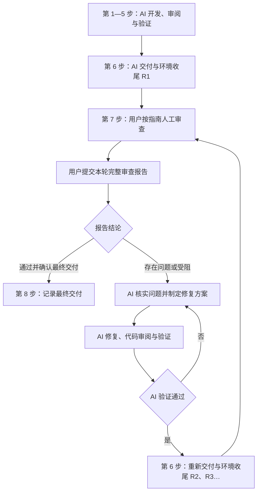

# AI 交付后人工审查与修复闭环设计

> 状态：设计已确认；项目规则、技能和模板已实施。验证结果与本轮材料见 [R1 交付记录](../../testing/human-review/2026-09-16-athena-human-review/R1/ai-delivery.md)；最终人工确认尚未完成。
>
> 用户于 2026-09-16 确认完整设计。已确认的阶段安排：第六步是“AI 交付与环境收尾”，之后才进行人工审查。发现问题后，AI 制定修复方案、实施、审查和验证，再次交付并收尾，交回用户继续审查。用户确认通过后才完成最终交付。

## 1. 两种完成状态

| 状态 | 含义 | 确认者 |
| --- | --- | --- |
| 本轮 AI 交付完成，待人工审查 | 本轮实现、AI 审阅、约定验证和环境收尾完成，审查材料已交付 | AI 根据实际证据确认 |
| 最终交付完成 | 用户对明确的交付版本完成人工审查并确认通过，问题及例外已有明确处置 | 用户确认，AI 记录 |

AI 的测试通过、PR 合并、环境停止、通知邮件发送，分别描述各自的事实。最终交付状态单独记录，只有用户的人工审查结论才能使其进入“最终交付完成”。

本轮 AI 验证或收尾尚未完成时，记录为“AI 阶段未完成／存在阻塞”，写明未完成项。新增人工审查阶段不免除 AI 原本负责的测试、真实验收和收尾。

## 2. 完整流程

| 步骤 | 负责人 | 工作内容 | 结束条件 |
| --- | --- | --- | --- |
| 1—5：现有开发阶段 | AI，必要设计决定由用户确认 | 上下文、设计与计划、实施、AI 审阅、测试及约定验收 | 对交付版本具备实际验证证据 |
| 6：AI 交付与环境收尾 | AI | 交付本轮结果、生成具体人工审查指南及可填写报告、完成临时环境收尾 | 版本与证据明确，材料可用，资源状态已核对 |
| 7：人工审查 | 用户 | 按指南操作、观察、记录，并提交本轮完整报告 | 给出“通过”“存在问题”或“受阻”的明确结论 |
| 7 的问题处理：核实与修复 | AI | 读取完整报告、核实问题、形成修复方案、实施、AI 审阅和验证 | 修复具备证据，能够再次进入第六步 |
| 8：最终交付确认 | 用户确认，AI 汇总 | 记录最终版本、人工结论、问题处置、环境与交付状态 | 满足第 10 节的全部完成条件 |



修复循环复用原有实施、调试、审阅和验证能力。沿用仍然成立的设计与决定，针对问题和影响范围补充计划。发现必须改变已批准设计的事项时，先形成明确差异，再由用户决定；其他可独立处理的问题继续推进。

第六步的 Git 交付方式沿用任务已有授权：可能是保留分支、提交 PR 或已经合并。人工审查针对实际交付版本进行；若该版本已合并，修复产生新的提交或 PR，并按已有授权处理。人工审查位置固定在第六步之后。

## 3. 每轮交接材料

人工审查使用轮次 R1、R2、R3；问题编号在同一任务内保持稳定，跨轮次继续引用。

| 材料 | 负责人 | 必须包含的内容 |
| --- | --- | --- |
| AI 交付报告 | AI | 交付范围、设计依据、准确代码版本、测试与审阅证据、已知限制、环境收尾结果、审查指南入口 |
| 人工审查指南 | AI | 检查顺序、具体操作、测试数据与身份、可观察的预期结果、记录方式；修复轮还须说明重查范围 |
| 人工审查报告 | AI 预填元信息和检查项，用户填写结果 | 每项检查结果、问题事实与证据、本轮总体结论、草稿或已提交状态 |
| 修复方案与结果 | AI，在有问题时生成 | 每个问题的核实结论、原因、修改范围、验证办法、人工复验项及最终处置 |

局部修复可在交付材料中写简短修复方案；多任务或跨层修复按 `writing-plans` 写实施计划并引用。材料之间使用链接，避免重复维护同一份需求、设计或测试报告。

建议正式落地时，每个任务使用 `docs/testing/human-review/<任务标识>/`，轮次材料分别放在 `R1/`、`R2/` 等目录。每轮包含 `ai-delivery.md`、`review-guide.md`、`human-report.md`；较小修复方案可放在本轮交付报告的修复章节。较大修复计划沿用 `docs/superpowers/plans/`。

以上目录现为实际产物约定，对应流程及模板已由项目技能 [athena-human-review](../../../.codex/skills/athena-human-review/SKILL.md) 创建。首次报告提交后保留原始观察；后续补充、修复结论和复验结果注明轮次与时间，避免覆盖历史事实。正式文件已落地，但本次独立行为评估、整体审阅和 R1 交付验证仍按当前实施状态继续。

## 4. 第六步必须准备好的内容

### 4.1 可定位的版本

AI 预填任务、轮次、仓库与 worktree、分支及提交 SHA；涉及子模块时记录相关子模块提交。仅写“最新版本”或可变分支名不足以定位被审查对象。

确实包含未提交成果时，须记录工作区差异并保存可恢复的补丁或对应产物，说明这次审查针对哪个状态。不能用某次旧提交的测试证据覆盖当前工作区。

设计依据须指向本次已批准的需求、设计条目或可定位的会话决定。指南中的预期结果从这些依据产生，不能只根据当前实现反推“应该如此”。

### 4.2 可恢复的环境

第六步先按现有规则停止本任务的临时服务，保留数据库、数据卷和证据；已有共享环境或用户要求保留的环境按原有归属处理。交付材料写明哪些已停止、哪些保留及其原因。

涉及运行验证时，人工审查指南必须提供：

1. 正确仓库／worktree、待审查版本及版本检查方法。
2. 本任务需要的运行前提、实际启动命令、实例或 profile、日志位置。
3. 入口地址、账号或身份准备、测试数据准备及预期就绪表现。
4. 停止命令及资源归属，明确哪些资源由用户或 AI 启动。

指南中的实际命令应来自目标工作区及[本地运行说明](../../developer-guide/running-locally.md)，并在交付时核实。用户操作版必须填入确定值，不能只留下通用占位命令。

用户开始人工审查时，可自行按指南启动，也可请求 AI 协助启动。AI 代为准备时，必要启动、检查和排障包含在该请求中；交给用户继续审查的指定环境按用户的检查用途保留，记录停止方法。其他已收尾实例维持停止状态。

人工审查可能发生在另一天或另一个工作区。发现版本、配置或数据不匹配时，先恢复正确前提；保存问题现场，避免用重置数据库或强制切换分支覆盖用户现有工作。

### 4.3 与本次功能对应的指南

每条检查须包含以下字段：

| 字段 | 要求 |
| --- | --- |
| 检查编号 | 同一任务内稳定，例如 CHK-001 |
| 设计依据 | 对应需求、设计条目或已批准决定 |
| 前置条件 | 页面／命令入口、身份、数据状态和依赖 |
| 操作步骤 | 可以逐条照做的动作，必要时写明输入值 |
| 预期结果 | 可直接观察或核对的结果，必要时注明等待条件或时限 |
| 记录方式 | 通过、失败、受阻、未执行；需要时附截图、日志或相关业务标识 |
| 影响与恢复 | 会修改哪些测试数据，如何为后续步骤恢复可用状态 |

例如，某项已批准设计如果约定“保存后刷新仍保留设置”，检查就应明确：进入对应页面、修改指定测试字段、保存、观察反馈、刷新、再次核对字段。预期须分别描述保存结果和刷新后的结果，不能只写“验证保存正常”。此例只说明写法，不新增 ATHENA 的业务需求。

检查范围来自本次交付：覆盖主要业务流程、重要规则、异常与权限边界，以及需要人判断的交互和展示。无需要求用户重跑所有自动化测试；约定的人工检查仍须有逐项结论。

## 5. 用户如何执行人工审查

1. **打开本轮指南和预填报告。** 确认审查的任务、R 轮次和交付版本。
2. **准备审查环境。** 按指南核对并启动目标版本，完成身份及数据准备。版本不符或环境失败时记录“受阻”，可立即请求 AI 协助恢复前提。
3. **按顺序执行检查。** 每完成一项就填写结果。只有实际执行并符合预期才能写“通过”。
4. **记录发现的问题。** 保留操作、预期、实际结果和可取得的证据；无需诊断代码根因。指南以外发现的问题同样纳入报告，标记为自由检查所得。
5. **处理阻塞。** 某一步阻塞时标明依赖它的后续项目；独立项目可继续。无法继续整轮审查时，可以提交带有阻塞与未执行项的报告。
6. **汇总并提交本轮报告。** 给出总体结论，说明报告已经提交、可以据此处理。自然语言具有相同效力，无须固定口令。
7. **结束本轮现场。** 按资源归属执行指南中的停止操作，或明确要求保留指定环境；也可请 AI 代为收尾并核实。把实际状态写入报告。

“完整报告”表示本轮观察已汇总、检查状态交代清楚、可以据此处理。受阻导致的未执行项可以如实保留，不能为了凑齐结果而写成通过。

默认以用户明确提交的报告启动一轮产品修复。人工审查期间，AI 不因看到一条草稿问题就默默改变用户正在检查的版本。环境支持可以即时进行；若用户要求立即修复产品问题，则先记录当前轮次已有结果，再明确切换到下一交付版本。

## 6. 人工审查报告模板

以下是格式示例；正式交付时，AI 先填好任务、轮次、版本、设计依据和真实检查项目，用户主要填写结果与问题。缺少可由现有材料可靠推断的信息时，AI 主动补齐；只有影响问题复现或方案选择的信息才需要询问。

```markdown
# 人工审查报告

- 任务：由 AI 预填
- 交付轮次：由 AI 预填，例如 R1
- 仓库、分支、提交／产物版本：由 AI 预填
- 设计依据与审查指南：由 AI 预填链接
- 实际环境、身份和数据：AI 预填准备要求，用户记录实际差异
- 审查时间：由用户填写
- 报告状态：草稿／已提交
- 总体结论：通过／存在问题／受阻

## 检查结果

| 检查编号 | 检查内容（AI 预填） | 结果 | 实际观察或证据 | 问题编号 |
| --- | --- | --- | --- | --- |
| CHK-001 | 本次功能的具体检查 | 未执行 | | |

## 问题记录

### ISSUE-001：简短问题描述

- 对应检查：CHK-001；也可以填“自由检查”
- 操作步骤：
  1. 我执行了什么。
  2. 输入或选择了什么。
- 预期结果：我按照指南／设计预期看到什么。
- 实际结果：实际看到了什么。
- 发生情况：必现／偶发／仅遇到一次／不确定。
- 影响：是否导致后续操作无法进行，以及具体影响。
- 证据：截图、日志、相关记录标识；没有时如实写明。

## 未执行或受阻项目

- 检查编号、原因、阻塞问题编号。

## 本轮结论与交接

- 本轮报告已经提交，请根据上述问题制定修复方案并处理。
  或：本轮人工审查通过，确认该版本最终交付。
- 环境状态：已停止／按要求保留／需要 AI 协助收尾；附具体实例。
- 我明确接受的例外及范围：没有则填“无”。
```

用户可以直接在会话里提供同等内容，AI 将其整理成报告并保留原意。报告的完成程度以事实是否足够处理为准，不要求用户掌握 Git、SQL、浏览器调试或代码根因分析。

## 7. AI 收到报告后的处理

### 7.1 核实与归类

先用 `receiving-code-review` 核实反馈，再用 `systematic-debugging` 复现与定位。针对用户审查的版本判断问题；当前分支已经变化时，明确两个版本的差异。

| 核实结果 | 处理方式 |
| --- | --- |
| 实现偏离已确认设计 | 作为本轮缺陷处理，形成修复方案并执行 |
| 环境、数据、身份或版本问题 | 修复审查前提，更新准确操作说明，再验证原检查 |
| 指南错误或交付材料遗漏 | 修正指南或材料，并检查是否掩盖真实实现缺陷 |
| 设计存在歧义或相互冲突 | 列出证据和可执行选项，仅对需要的新决定请求确认 |
| 新需求或范围扩展 | 单独说明与本轮验收的关系，由用户决定是否纳入或另立任务 |
| 暂时无法复现 | 保留问题及已尝试的证据，提出最小补充验证，维持未解决状态 |

不能仅因“代码就是这样写的”而否定人工观察；也不能未经用户同意改写设计或放宽预期，把失败检查变成通过。

建议采用“完整报告提交即授权核实、制定方案并执行已确认设计范围内修复”的交接约定，避免每个缺陷再次询问是否开始。若用户明确要求只分析或先审阅修复方案，则按该限制执行。涉及新业务决定、范围扩大或超出现有授权的操作，仍须由用户决定。

### 7.2 修复方案

AI 在动手前形成可审阅的修复方案，至少包含：

| 问题编号 | 核实结论与原因 | 修改范围 | 自动化／运行验证 | 用户下一轮复验 |
| --- | --- | --- | --- | --- |
| ISSUE-001 | 明确偏差和根因，或先列定位步骤 | 受影响的文件、接口或资料 | 复现用例、修复后的验证及相关回归 | 对应 CHK 项和新增检查 |

按根因合并相关问题，按依赖安排任务。各问题保留独立编号和结论，防止批量修复漏项。多层问题使用 `sync-athena-changes`，需要时执行生成与消费者同步；前端使用 Impeccable 的相关指导。

恢复已确认设计所需的常规修复，在记录方案后连续实施。若发现新的设计决定，先提供具体差异及影响，等待该项决定，同时继续其他不依赖它的工作。

### 7.3 实施、审阅与验证

行为修复遵循 TDD，保留能复现问题的失败证据；完成实现后运行相应验证和必要回归。按任务规模使用独立代码审阅及修复复审。已经约定的真实环境验收仍须完成。

每条问题至少区分：

`待核实 → 待修复 → AI 已验证，待人工复验 → 用户确认关闭`

无法复现、受阻、等待设计决定和用户接受的例外单独记录。AI 测试通过时只能进入“待人工复验”；最终关闭以用户复验结果或明确处置为依据。

### 7.4 再次交付和收尾

完成修复后再次执行第六步：形成下一轮交付报告、核对版本与证据、停止本轮临时资源、交付更新后的人工审查指南和预填报告。材料中明确每条问题改了什么、如何验证、用户还需要检查什么。

## 8. 下一轮如何避免重复劳动

R1 覆盖本次交付的完整人工审查范围。后续轮次由 AI 根据实际修复影响给出四类清单：

| 分类 | 下一轮处理 |
| --- | --- |
| 本轮修复的问题项 | 必须人工复验，继续使用原问题编号 |
| 受修复影响的关联流程 | 按影响范围回归，并说明为什么重查 |
| 因先前问题受阻或尚未执行的项目 | 恢复前提后补查 |
| 已通过且未受影响的项目 | 保留上轮结果，记录“沿用 Rn 的通过证据”及依据 |

沿用历史结果须说明来源版本与影响判断，不能显示成在新版本上重新执行通过。修改共享组件、权限、契约或基础流程时，相应扩大回归；大范围改动可能需要重做整组人工检查。

指南遗漏的有效问题应补充成后续检查项。一个问题在下一轮仍然出现时沿用原编号，记录“复验失败”并进入新一轮定位，保留先前修复和证据。

## 9. 环境、时间与任务延续

- 第六步完成一次实际环境收尾，用户人工审查按需重新启动对应版本；修复阶段也按需恢复环境并在重新交付时再次收尾。
- 保留数据库、数据卷和日志，使问题可追溯、复验可恢复；不通过自动重置清掉失败现场。
- 用户自行启动的环境继续属于用户；AI 如受托代收尾，按指定范围操作。用户要求继续保留的环境记录用途、地址和停止方法。
- 人工审查等待不表示自动通过。等待期间无需持续运行 AI、定时轮询或自动催促；用户提交报告后恢复处理。
- 同一问题闭环沿用任务身份、设计依据、报告和累计执行记录。跨会话继续时，先读取上次交付与报告，避免重复完成的步骤。
- 通知仍遵循 [AGENTS.md](../../../AGENTS.md) 的累计时长、通用文案和同一任务去重规则；人工等待不计入执行时间，已发送的通知在后续修复轮中不得重复。通知表示本次执行结束，不代表人工审查通过或最终交付完成。

## 10. 最终交付的条件

全部满足时进入“最终交付完成”：

1. 用户明确说明对哪个交付版本、哪轮报告确认通过。
2. 本轮必查项目有通过结论；适用的历史结果有明确沿用依据。受阻、未执行或不确定项不能自动计为通过。
3. 本任务的设计偏差已修复并完成所需复验；遗留项只有在用户明确接受例外、调整范围或批准设计变更后，才能按该处置结案。
4. AI 的相关审阅、测试和约定验收有实际证据，交付版本与证据相符。
5. 所需环境收尾已完成；保留环境及归属已明确记录。

最终记录汇总：最终版本、设计依据、人工报告、修复与验证证据、用户接受的例外，以及 Git 交付和环境状态。

用户确认后，只做尚未完成的交付事项与最终记录。相同版本的已有合并、有效验证和已核对的环境收尾无须机械重复；若代码或环境发生新变化，则针对变化补充验证。

## 11. 示例：一轮问题如何闭环

以下场景仅说明流程，不声明存在具体产品缺陷。

1. AI 交付 R1，完成测试与约定验收，停止临时环境，并提供指南。
2. 用户恢复 R1 环境，执行 CHK-003，发现某设置保存后刷新丢失，记录 ISSUE-001；依赖此设置的 CHK-004 标记受阻。
3. 用户完成其他独立检查，提交 R1 报告：部分通过、一项失败、一项受阻。
4. AI 核实已批准设计确实要求保存持久生效，复现问题，记录修复方案，补充回归测试，修复并完成 AI 审阅与验证。
5. AI 交付 R2 并再次收尾，指南要求重查 CHK-003、补查 CHK-004，并检查实际受修复影响的关联行为；未受影响项目注明沿用 R1。
6. 用户按 R2 指南复验，确认问题关闭，明确接受 R2 作为最终交付。
7. AI 汇总最终记录，保留两轮报告及证据，任务进入“最终交付完成”。

## 12. 落地状态

本设计已通过项目级规则、流程文档和项目专属技能承接，保持上游 Superpowers 技能原文：

- `AGENTS.md` 已明确第六步后的人工审查、两个完成状态、报告提交后的处理授权和最终确认条件。
- `docs/developer-guide/superpowers-development.md` 已补充阶段顺序、材料约定和技能映射。
- `.codex/skills/athena-human-review/` 已包含流程入口和三份可具体化模板，负责生成实际检查、接收报告、组织修复闭环和记录最终结论。
- `docs/developer-guide/running-locally.md` 已补充人工审查环境恢复与交接说明，并继续引用根规则的收尾和通知边界。

正式有／无指导行为对照各完成五份独立样本，核心判定为 40/45 与 44/45；短答材料字段遗漏等限制、静态检查及独立审阅记录保存在 [R1 验证证据](../../testing/human-review/2026-09-16-athena-human-review/R1/evidence/README.md)。本轮实际人工指南和预填报告已生成，人工结果保持未执行，不能据 AI 评估或文件落地提前记录最终交付完成。

## 13. 依据

- [项目规则](../../../AGENTS.md)：环境收尾、既有授权、验证、长期文档和通知约定。
- [Superpowers 开发方式](../../developer-guide/superpowers-development.md)：当前工作流、技能职责及产物位置。
- [本地运行说明](../../developer-guide/running-locally.md)：环境准备、资源归属和收尾入口。
- [Brainstorming](../../../.agents/skills/brainstorming/SKILL.md)：按范围设计、复用既有决定。
- [Receiving Code Review](../../../.agents/skills/receiving-code-review/SKILL.md)：核实反馈、评估适用性及逐项处理。
- [Systematic Debugging](../../../.agents/skills/systematic-debugging/SKILL.md)：复现、根因定位与修复验证。
- [Verification Before Completion](../../../.agents/skills/verification-before-completion/SKILL.md)：基于证据报告状态。
