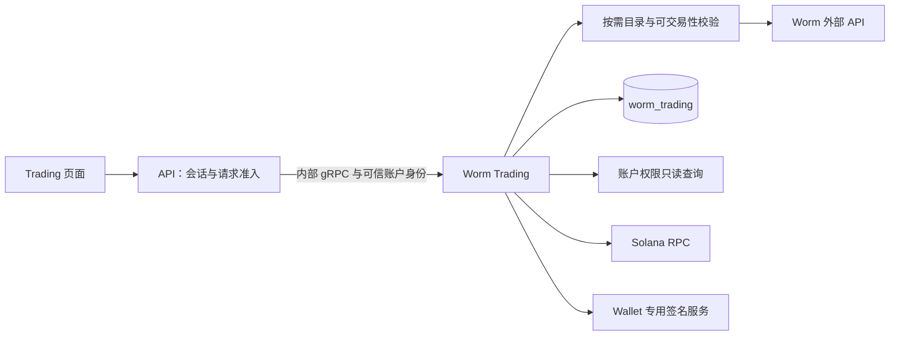

# Worm Markets 删除与 Trading 市场查询内聚设计

> 状态：2026-09-16 删除范围、专属数据直接删除及方案 A 已获用户采用；本稿补齐技术细节并完成静态自查，待用户整体审阅。尚未实施，尚未编写逐步实施计划。
>
> 需求：[删除 Worm Markets，仅保留 Worm Trading](../../requirements/development-runtime/worm-markets-removal.md)。本文覆盖旧设计中的双服务保留、Markets 接入与配置安排；BSC／Sports 删除和访问开关仍按各自范围推进。本次仅修改文档。

## 1. 采用方案与边界

采用方案 A：Worm Trading 是交易市场目录的唯一业务所有者。API 保留公共协议、交互身份、访问准入和响应投影；Trading 负责目录查询、市场可交易性、组合保存验证、预览与执行前验证。`util/worm` 继续作为供应商协议适配器。

备选方案是把无状态目录查询抽成库，由 API 与 Trading 分别直接访问 Worm；它减少交互读取的一次内部 RPC，但重复引入供应商配置、限流和业务规则入口。当前唯一业务消费者是 Trading，因此选用集中归属，不新增目录服务。

没有 Markets 进程、Markets 数据库、Markets 定时工作或通知生产。Trading 的进程内目录组件不持久化市场读模型，不增加采集循环；后台预览、Run 和 Cash Out 仍属于 Trading。

## 2. 当前依赖与目标落点

| 当前代码 | 当前职责 | 目标 |
| --- | --- | --- |
| `internal/wormmarkets/order_event_catalog.go` | 实时事件／子市场读取、方向与价格校验 | 迁入 `internal/wormtrading` 的目录组件，保留业务规则和顺序 |
| `internal/server/worm_combinations.go` | 调 Markets、验证目录、构建可信保存快照 | 改调 Trading；API 只接收和投影用户选择，权威目录与保存快照由 Trading 构建 |
| `internal/wormtrading/execution_plan_worker.go` | 通过 Markets gRPC 读取目录 | 直接调用同进程目录组件，仍按每个唯一事件读取 |
| `internal/wormtrading/execution_worker.go` | 下单前重新读取目录 | 复用同组件，不自调 gRPC，不使用预览快照代替新检查 |
| `internal/wormtrading/{service,server}.go`、Trading 命令 | 强制 Markets 客户端依赖 | 删除该依赖，注入受限目录客户端及账户权限读取器 |
| Markets 公共 API／共享类型／生成入口 | 独立市场列表、详情、状态及估算 | 移除专属能力和消费者；按真实引用保留 Trading 或 `util/worm` 所需类型 |

当前目录只调用 `GetEvent`／`GetMarket`，不读 Markets 存储。无需迁移市场历史或重新生成 Trading 组合。已有 Trading 快照和 plan digest 保持原语义，不为服务归属改变而重置持久状态版本。

## 3. 接口与目录规则

### 3.1 接口归属

在 `internal/wormtrading/wormtrading.proto` 定义 `GetOrderEventCatalog` 及其目录消息，命名沿用 [RPC 规范](../../../.codex/skills/grpc-rpc-naming/SKILL.md)。请求包含规范的 Event Condition ID；可信账户身份由 API 写入内部 metadata，不接受浏览器自报 owner、权限或供应商地址。

现有 `GET /api/v1/worm-trading/events/{eventConditionId}` 及其交互式 READ 边界保留。新内部 RPC 不注册为额外公共 gRPC／Swagger 入口，不给 Athena API Key 增加组合查询权限。所有 `/api/v1/worm-markets/*`、公共 `wormmarkets.WormMarketsService` 和内部 `athena.internal.wormmarkets.WormMarketsService` 契约删除，不提供别名、重定向或兼容服务。

组合创建和更新的内部输入收敛为 owner、名称、按序的 Event ID／Market ID／方向；更新另带正数期望 revision，创建沿用现有无源 revision 规则。Trading 查询目录、校验归属及方向，生成可信标题与标签快照，再调用现有原子存储。目录读取在数据库写事务之外；最终事务重新检查 revision、活动 Run 锁与顺序不变量。API 不再传入可作为权威事实的市场标题和可交易性。

### 3.2 目录行为

- 每个事件最多读取一次 Event，每个唯一子市场最多读取一次详情；保持供应商顺序，最多八个子市场并发。
- 事件及子市场 ID、归属、重复项、后端、规范 YES／NO 方向均按当前规则验证。仅 open、margin enabled、支持的 Polymarket／Hyperliquid 后端及该方向最大杠杆至少 1 时可选。
- 子市场详情失败保留该子项及明确不可用原因；事件级失败不返回成功空列表。沿用现有不可选代码及前端解释，不把整个 Markets 模块删除等同于删除“市场不可用”的业务状态。
- 最近成交价仍是展示信息：YES 为合法上游值，NO 用精确十进制计算补值；无合法完整价格对时两者都省略，不改变可选性。不把最近成交价作为保证成交报价。
- 目录组件只暴露事件与市场读取，不暴露 Estimate、凭据创建、签名和交易 mutation。预览的 Estimate 与执行中的 Open／Finalize 保持原目的边界。

### 3.3 超时、限流与故障

目录与 public Estimate 共用 Trading 工厂级未认证限流器，保留现有默认 100 次／分钟、burst 2；这些是仓库配置，不宣称为供应商最新额度。账户 HMAC 调用继续使用现有独立限流器。生产固定使用 Trading 已采用的官方 Worm 地址，不迁入 Markets 的任意 Base URL 配置；隔离测试通过客户端注入替身。

单个上游尝试沿用 `ATHENA_WORM_TRADING_WORM_API_ATTEMPT_TIMEOUT`，默认 5 秒。新增 Trading 目录总预算配置 `ATHENA_WORM_TRADING_CATALOG_BUDGET`，默认 45 秒；必须为正且不小于单次预算。交互读取、一次组合保存分别有同一总 deadline，保存至多四个事件并发；共享限流等待也计入该预算。预览和执行读取使用调用者已有 worker／claim 上下文与此预算的较早截止时间，取消后停止派发新调用，不重置为无限等待。

保留无效输入、NotFound、依赖不可用、超时与取消的区分；上游错误不带凭据。记录查询耗时、失败原因和供应商可达情况，复用 Trading 状态观测。`SERVING` 不代表目录或真实交易已验证；Worm 暂时失败不得清空组合，也不得阻断不需上游的已有记录读取。

## 4. 身份、权限与事务

### 4.1 新增／改变边界的服务侧校验

保留 Trading 现有内部 Bearer 认证。新目录 RPC 以及本次改变输入契约的组合 Create／Update RPC 另要求恰好一个 `x-athena-account-id`，由已验证交互式会话的 API 填写；请求 owner 必须与其一致，拒绝缺失、重复、非规范 UUID 或冲突身份。API 不透传外部同名 metadata。

为遵守 SDS-R2，Trading 在这三个方法中通过只读 `AccountAccessReader.GetAccountAccess` 查询当前账户权限，检查 LoginEnabled、有效账户矩阵及 `worm_trading` READ 或 READ_WRITE；沿用现有管理员与业务权限规则，不增设管理员绕过。仅服务 token、旧 Markets 授权或伪造 owner 都不能授予读取／保存权限。账户不存在或未获授权拒绝；读取失败返回暂不可用，不默认放行。

采用仓库已有账户状态 SQLStore 的有限读取接口及独立连接池，增加 `ATHENA_ACCOUNT_STATE_POSTGRES_DSN` 为 Trading 的显式依赖，复用已验证账户 schema；不启动账户迁移、借用 API runtime 或反向调用 API。进程命令拥有并关闭该池，目录组件只借用 reader。此项是服务边界重构新增技术细节，需随本稿整体审阅。

其余既有 Trading RPC 的 API 授权、对象归属、Run proof 和 Wallet 目的绑定继续按既有设计执行；本次不扩展为全模块授权协议重写。预览／执行 worker 在进程内调用目录组件，仍由持久任务和既有授权状态约束，不伪造交互请求，不用新的用户访问开关中断已受理工作。

### 4.2 事务与故障范围

账户读取与 Trading 写入分属各自数据库，不传递事务或连接池，不声称跨库原子撤权。API 原会话／撤权检查和 Trading 当前权限读取组成请求准入，已通过准入的业务依既有规则完成；Run 与 Cash Out 的原授权及锁不改。

账户库是已存在的共享故障域；运行期间不可用时，新目录和组合写请求失败关闭，已受理 worker 恢复继续遵循原规则。独立启动需验证 Trading 存储、账户 schema、内部 token、凭据 key 及 Wallet signer 配置；Solana 就绪按现有探测语义执行。运行器必须报告每项依赖，不能用 Markets 假配置满足启动。

## 5. 删除与保留清单

| 类别 | 删除／调整 | 保留 |
| --- | --- | --- |
| 服务源码 | `cmd/athena-worm-markets`、`internal/wormmarkets`、`internal/server/wormmarkets` 及真正专属测试；目录先迁出 | Trading、Wallet、身份模块中的 Worm 凭据与执行能力、`util/worm` |
| 契约与生成 | Markets proto、客户端、Swagger、共享专属模型、sqlc 配置及生成 wiring；同步全部消费者后重新生成 | Trading 对外路径和业务状态；其新内部目录契约 |
| 权限 | `worm_markets` 定义、默认矩阵、授权行、管理员选项、失效约束 | `worm_trading` 及其他模块的权限等级、现有数值编号 |
| 运行 | Markets 端口／地址／DSN／provider／通知配置、健康项、Compose 服务、schema 注册与数据库初始化 | Trading DSN、加密 key、内部 token、signer token 与必要 provider 配置 |
| 数据 | 实际确认属于 Markets 的数据库及专属存储 | `worm_trading` 全部表、账户与 Wallet、共享基础设施及通知历史 |
| 前端 | Markets 权限选项、健康标签及失效说明 | Trading 三组导航、七条路由及已确认视觉规则 |

权限通过新的追加迁移精确删除 `worm_markets` 行并收紧约束，同步查询、schema contract 和生成类型。保留已应用历史迁移，不复写旧文件；历史迁移中旧名称可以保留。受影响账户 revision 按现有发布／撤权一致性机制失效旧快照，不授予 Trading、不删除账户；仍被保留模块使用的 proto 数值不重排，被删数值 reserved。

revision 更新或发布维护可能使原授权过期或与当前 revision 不符。此时既有 Run／Cash Out 按原状态机等待必要验证，不能为“保持功能”绕过 proof、自动重新授权或重放外部请求；已有任务、锁、尝试与历史事实继续保留。验收区分记录保留与授权仍有效，不承诺所有在途任务无感连续执行。

与 BSC／Sports 清理并行或先后落地时按实际 next migration 编号安排，分别验证只删 Markets、先删 Sports 再删 Markets 以及反序合并后的最终 schema。不得覆盖另一任务的迁移或恢复其已移除约束。全新库和已有数据升级均需验证。

## 6. 数据与通知退役

### 6.1 数据规则

`worm_markets` 是当前默认库名，真实目标需逐环境核对 DSN、实例、连接、容器标签和挂载。所有旧 Markets 生产者退出且 Trading 已解除依赖后直接删其专属库，不备份、不归档、不搬入 Trading。共享 PostgreSQL 容器、卷、账户库和 `worm_trading` 保留。普通 `make run`／`make stop` 不执行永久删除，也不重新准备 Markets schema。

用户已确认数据策略；实际退役仍是后续实施阶段，本次没有连接现场或执行任何删除。外部 Worm 密钥、订单、持仓与资产不因本任务自动撤销或平仓。

### 6.2 通知精确范围

只处理当前源码定义的五个来源：

- `worm-markets.new-event`
- `worm-markets.live-event`
- `worm-markets.price-alert-80-20`
- `worm-markets.price-alert-90-10`
- `worm-markets.price-alert-95-5`

沿用 Notification 的发送许可与恢复边界，通过一次性存储维护操作取消这些来源的 pending 并记录退役原因。已获许可的 sending 等待有界结果，可重试回到 pending 后再取消；sent／failed／unknown 与发送尝试保留，不重试未知发送，不删除共享 Topic、Bot 偏移或其他来源。复查无可发送 pending／在途 sending 才记录通知退役完成；超时如实记录残留。

实现可复用另项 Sports 清理的维护工具骨架，但必须显式选择本任务五个来源；不使用 `worm*` 通配匹配，不因工具复用扩大该次授权的清理对象。

### 6.3 发布顺序

1. 完成 Trading 目录承接、消费者、权限迁移和一致生成产物，形成同一可部署版本；验证未依赖 Markets 的保留业务路径。
2. 记录目标环境现有任务、进程、凭据归属、数据库及停止入口；发布维护期间关闭新的用户入口，保留外部在途动作的真实状态。
3. 按既有有界停止协议停止受本次发布影响的旧 API／Trading，停止 Markets 并移除自动拉起来源；不声称停止进程能撤销已发外部请求。
4. 同库旧消费者按现有 schema 发布要求退出后执行追加迁移和 verify，再启动一致的新 API／Trading，复用原凭据 key、锁、任务与历史。共享 schema 维护不等于日常关闭板块。
5. 完成不依赖 Markets 的验收、旧来源队列收尾与残留连接核查后删除 Markets 专属数据和部署产物，复查不会重建。
6. 保留部署与删除证据，正常运行按用户指定环境恢复；本任务临时验收环境按归属停止。

出现失败时保留 Trading 数据与证据，不清空未知交易、不反复发送请求。已删 Markets 数据不承诺恢复；服务继续修复到 Trading 自足目标，不保留旧 Markets 作为兼容回退。

## 7. 运行与相邻设计衔接

- 目标本地全栈由 12 调整为 11 个常驻应用：5 核心＋6 业务。现有源码清单仍未扩展，不能把目标数量记为现状。
- 目标应用数据库由 6 调整为 5：账户状态、Wallet、Managed OO、Profit Sharing、Worm Trading；Trading 新权限 reader 使用同环境账户状态库，不新建第六个库。
- Trading 独立入口、schema 工具和运行器正向选择只准备声明依赖，支持最小环境验证；全面 11 应用接入仍由原运行计划负责，不作为 Markets 退役的全栈改造前置条件。
- `worm` 访问标识保留，产品标签为 Worm Trading；删掉 Markets 三个公共 RPC 后，原访问方案覆盖由 42 调整为 39 个公共 RPC，Trading 的 28 项业务 HTTP、专属二次验证与七条路由继续按原覆盖处理。
- 移除旧设计拟新增的 Markets 内部 token、端口配置、启动排序和通知注入。Trading 内部 Bearer、API 的准入以及本设计的服务侧权限规则继续有效。
- 启动不依赖 Markets；停止入口／API 后有界停止 Trading，再按实例归属停止其自有依赖。Worm 上游暂不可用不停止其他业务、不改访问配置。

## 8. 验证与交付证据

| 范围 | 必须验证的结果 |
| --- | --- |
| 目录行为 | 合法目录、无效／重复 ID、事件错配、全部子项保留、部分详情失败、YES／NO 精确补值、缺价、不可交易、1x 校验、限流及 deadline／取消 |
| 服务权限 | 无／错 token、缺／重复／伪造账户身份、owner 不匹配、无授权、旧 Markets-only 授权、READ 写入、权限库失败；合法 READ／READ_WRITE 正确通过 |
| 组合与预览 | 保存只信任 Trading 新目录；跨事件有序快照、revision／活动锁不变；原组合可用；预览无 mutation、过期与余额／敞口规则不变 |
| 执行与平仓 | 下单前读取新目录、目录故障不发 Open；已有 Run／Cash Out 的隔离、暂停、恢复、幂等与未知结果不重放；批量 USDC 门槛不变 |
| schema 与权限 | 空库、已有 Markets 授权库、与 Sports 迁移组合；非目标记录保留、数值不重排、最终 contract 一致 |
| 构建与运行 | 独立 Trading、API 和前端构建；无 Markets 服务／DSN／库时启动与就绪；目录／权限库失败范围；有界停止及资源 owner |
| UI 与接口 | 组合编辑／保存／预览及 Assets／Executions 真实只读 smoke；删除 Markets API／权限／健康项，保留七路由及现有授权表现 |
| 现场退役 | 精确进程退出、旧配置与拉起入口消失、专属库删除、五来源队列收尾、共享资源与 Trading 数据保留 |

测试使用可注入的 Worm 客户端与受控副作用，不向真实供应商下单、平仓或制造通知。必要真实验收读取实际环境并记录实际覆盖；真实资金交易不由本次设计或重构测试默认为授权。代码、真实只读验收、模拟写路径和现场退役分别报告，不互相替代。

服务规范适用 SDS-R1／R2／R3／R4／R5／R6／R7／R8：业务 owner 集中、内部 gRPC 与服务侧权限、独立依赖、限时调用、精确资源回收、原事务与恢复保持、生成消费者同步。未新增跨库原子事务或独立服务。

## 9. 设计自查与下一步

- 已确认目录不依赖 Markets 数据库，迁入范围包括 API 交互、组合保存、预览和执行前检查。
- 已区分 Markets 专属历史与 Trading 业务快照，删除策略不触及外部持仓和加密凭据。
- 已同步目标应用／数据库／公共 RPC 数量，旧 BSC／Sports 计划保留其独立范围并标明新决定。
- 已补齐新增服务侧权限读取、配置、故障域、事务边界及验证要求；这些技术细节属于本稿整体审阅内容。
- 本次只有文档静态检查。用户审阅本稿后再按 writing-plans 整理分步实施计划；代码、运行验收与退役均未执行。
