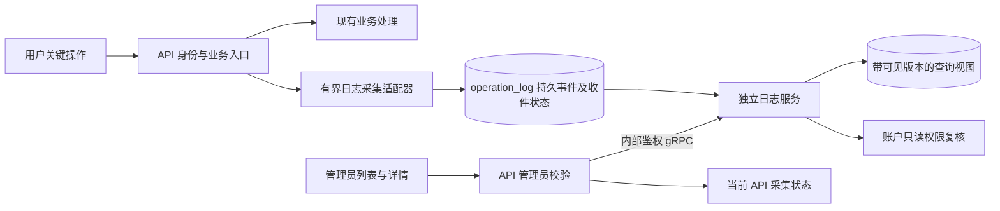

# 用户关键操作日志详细设计

> 状态：2026-09-18 用户整体审阅通过，已确认待实现；用户明确要求暂不进入实施，当前停留在设计阶段，尚未编写实施计划或修改产品代码。
>
> 用户已确认：实现关键操作日志供管理员查看；日志写入失败时业务继续，尝试补记并显示日志异常。
>
> 源码基线：ATHENA `/home/yege/work/athena`，分支 `rf4`，`6a091a03`。本文与附录是目标设计，不把未实现入口写成已有功能。

## 1. 阅读入口

| 文档 | 已细化内容 |
| --- | --- |
| [事件目录](2026-09-18-key-operation-logs/event-catalog.md)／[机器清单](2026-09-18-key-operation-logs/event-catalog.json) | 74 个动作编码、98 个采集位置；逐项对应现有 RPC／HTTP handler、结果策略、对象和详情白名单；含 12 个仅记录初始化失败的位置及注册登录子动作 |
| [采集与结果契约](2026-09-18-key-operation-logs/collection-and-results.md) | 字段类型、身份来源、采集时机、去重、注册／登录／退出、八种结果及采集预算 |
| [存储与查询](2026-09-18-key-operation-logs/storage-and-query.md) | 独立 schema、五类业务表、唯一性和索引、消费事务、历史版本、快照及游标 |
| [API 与管理员页面](2026-09-18-key-operation-logs/api-and-admin-ui.md) | 五个公共查询、三个内部 RPC、请求／响应、鉴权、错误、筛选与列表／详情、桌面／手机状态 |
| [运行与验证](2026-09-18-key-operation-logs/runtime-and-verification.md) | 独立服务／迁移入口、配置、生成与消费者、故障矩阵、V01–V18 验证要求 |
| [长期业务需求](../../requirements/observability/key-operation-logs.md) | 用户已确认决定、拟议范围及业务验收目标 |
| [长期技术设计入口](../../design/observability/operation-logs.md) | 职责边界、当前差距及详细契约位置 |

附录是本规格的一部分，一并审阅。98 个采集位置不等于 98 个独立 URL：Google 共用 callback 的目的分派、同一路由的动作以及注册后登录子动作分别列出，避免遗漏或重复。

## 2. 目标、范围与当前事实

管理员能够查询“哪个用户，在什么时间，对什么对象做了什么，系统观察到什么结果”。只记录关键操作，不采集普通页面查看、搜索、自动刷新和浏览轨迹。

第一版覆盖现有身份、账户、钱包、Trader Sync 订阅、通知设置、Profit Sharing、Worm 及当前已注册管理写接口；同时记录管理员关键操作，并以角色和凭据来源区分。API Key 调用归属真实账户。未实现的 Trader Sync 手动交易、Token 前端等独立任务不因日志系统开启。

当前已有管理员应用、持久角色校验和分页／详情组件；模块访问设置保存最后修改人和时间，但不是全站操作历史。[API 路由注册](../../../internal/server/athena-server.go)同时包含 gRPC、gRPC-web、grpc-gateway 和原生 HTTP，必须分别覆盖且保持唯一采集位置。

第一版持续保留记录，不提供编辑、删除、导出、统计大屏或通知配置。它记录关键命令及观察结果，不替代各业务的完整订单、投票、通知和交易明细。

## 3. 架构与方案取舍

选用独立 operation-log 服务＋PostgreSQL 持久收件箱。查询通过 gRPC；采集采用明确的同库持久消息协议。日志独立处理进程可以停机，API 在数据库正常时继续入箱，恢复后处理积压。

| 备选 | 取舍 |
| --- | --- |
| 业务结束后直接 RPC 写日志 | 日志服务停止时还需持久补记机制；本方案直接以数据库消息入口解耦采集与查询进程 |
| 所有业务服务建立事务性 outbox 再汇总 | 原子性更强，但涉及多个业务事务；本版保留跨服务结果未确认边界，不扩展为全部业务事件平台 |
| 独立服务＋同库持久收件箱 | 第一版采用；必须明确共享数据库故障域、schema 所有者、原始事实和查询投影的边界 |

共享库使用独立 `operation_log` schema 和 `operation_log.goose_db_version`，不向现有 public 账户目录或版本表混入第二套迁移。API 只持有 producer adapter，不持有日志服务 runtime，不消费或修改查询视图。独立数据库不是本版前提。

## 4. 必须保持的业务语义

- 身份从验证后的 session／API Key 取得，不接受请求体声明的操作者。历史用户名和角色是快照；账号／对象后续变化不改写历史。
- 同步操作确认完成才是 SUCCEEDED；异步命令是 ACCEPTED；明确失败、拒绝、部分完成、需用户继续、主动取消和未知分别表达。
- 远端调用超时不能证明没有发生副作用。只有 START 时显示结果待记录；FINISH 可独立恢复完整结果，不因为缺少 START 而丢弃。
- 注册创建账户和随后登录是不同事实。账户已建立、后续发布或登录失败，日志仍保留账户建立结果。
- 网关转发只记录一次；日志重试幂等，用户再次发起请求则是新尝试。业务幂等键只用于关联。
- 日志故障时业务继续，每阶段写入和重试合计有界。补记只重试日志，不重新执行用户业务。
- 成功入箱的记录可恢复处理；从未成功入箱的记录不保证能补齐。提交回执超时计为未确认，不直接声称确定丢失；管理员看到真实采集和处理异常。
- 日志字段使用动作白名单，不收录请求／响应正文、私钥、令牌、签名、私有备注和完整业务内容；管理员原有数据边界继续有效。

## 5. 管理员体验

System 下新增 Operation Logs，列表与独立详情共用现有深色主题和管理员 read scope。默认最近 7 天、每页 50 条，显式 Apply／Reset／Refresh；可按操作者、模块、动作、结果、来源和对象筛选，历史通过自定义时间区间查询。

列表时间倒序，按同一发布快照翻页；详情可沿用列表快照或显式刷新到最新。结果晚到、身份补充和新记录不会使已打开的分页跳动。状态来源分别是日志查询、日志处理进程和当前 API 采集实例，不能把其中一个来源正常写成全部历史完整。

会员、API Key 和无管理员角色者不可查询；服务侧再次验证可信调用身份和持久管理员资格。详情不通过链接打开原本无权读取的会员页面。所有新增入口支持既有部署前缀，且只经 API Server 对外。

## 6. 设计自查与验证边界

本次细化检查入口覆盖、源文件和符号、数据约束、错误语义、分页并发、跨文档一致性及链接。具体结果记录在[设计核对记录](2026-09-18-key-operation-logs/design-review.md)。数据库行锁、sequence 与 Goose 依据位于存储附录的官方来源旁；本次未执行新 schema 或新接口，也未启动服务，不能将静态设计核对当作实现验收。

实施须完成 V01–V18、适用生成／构建、AI 审阅、真实环境验收与环境收尾，再进入 ATHENA 人工审查。测试替身不能替代真实登录、真实业务写入及管理员读取。

## 7. 审阅与后续

用户于 2026-09-18 明确回复：“审阅通过，然后先不进入实施”。本规格及全部附录整体通过审阅，确认范围包括第一版具体动作覆盖（含管理员与当前已注册管理接口）、独立服务和同库 schema 方案、管理员页面、记录内容及持续保留策略。

按用户要求暂不进入实施，当前仅保存已批准设计，不编写实施计划、不修改产品代码、不启动环境。待用户明确恢复后，再沿用本次批准方案推进；相同设计决定无需重复确认。设计审阅通过不表示代码已实现或运行验收已通过。
