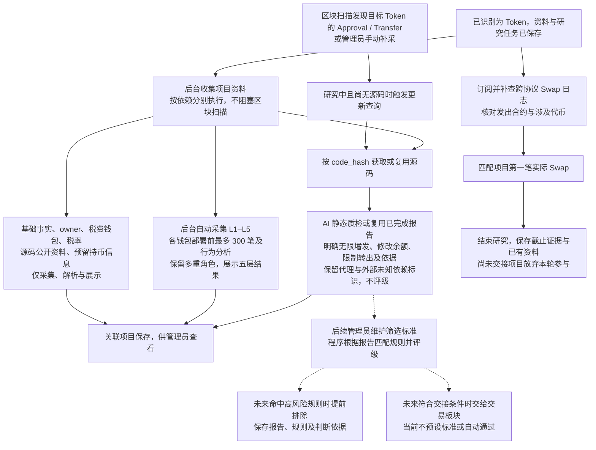

# Token 项目研究与筛选流程

> 文档状态：目标设计，尚未实现。首版仅 ETH；AI 只生成质检报告，后台自动采集五层钱包，项目首次实际 Swap 截止研究。

## 业务流程

输入是已经识别为 Token 的项目。识别结果、项目资料和研究任务可靠保存后，区块扫描继续推进；研究任务后台独立执行。源码、钱包、税率、持币与公开资料按各自依赖采集，不要求所有资料共同完成。

链扫描、活动/Swap 监控和外部采集采用 [单链实例运行设计](token-chain-runtime.md)：同一程序按启动配置选择唯一链，任务与链上读取限定所属链。资料汇总、源码与 AI 报告可以共享，同一源码复用分析，实际地址和值逐链、逐合约保存；首版只运行 ETH。

资料分支表示数据依赖，不规定所有调用在同一时刻开始。首次 Swap 是独立的研究停止条件，即使源码报告或五层钱包尚未完成也结束；迟到活动不能恢复研究。在途调用的取消与结果保存细节待实现设计，后台不再为已结束项目启动新的研究采集。

## 已确认资料与边界

| 资料 | 已确定范围 |
| --- | --- |
| 基础信息 | 链、合约、部署交易、部署区块 B 与时间、Token 识别结果；名称、符号、精度、总供应量、code.length 和 code_hash 按采集时最新区块保存。 |
| 源码 | 非空缓存复用；成功空响应与请求失败分开。空源码支持手动补采或后续 Approval/Transfer 活动更新；失败重试并通知管理员。详见 [源码流程](token-contract-source-flow.md)。 |
| AI 质检报告 | 只分析实际源码，必含无限增发、修改余额、限制转出三项及依据，保留代理/未知依赖标识；AI 不评级，不读取链上状态核实、不扩展外部依赖分析。详见 [报告流程](token-contract-review-flow.md)。 |
| owner | AI 按源码识别读取方式，Go 读取当前合约最新状态；实际地址逐合约取得，缺失不猜测、不单独过滤。详见 [owner 流程](token-owner-wallet-flow.md)。 |
| 税费接收钱包 | 支持多个固定地址或读函数取得地址，两种来源可并存，保留用途与来源；取得地址全部纳入 L1。详见 [税费接收钱包](token-fee-recipient-wallet-flow.md)。 |
| 税率 | AI 给出读函数与解释方式，Go 读取原值与必要分母，同一税率相关调用固定同一区块；只展示配置，不据此新增过滤。详见 [税率流程](token-tax-rate-flow.md)。 |
| L1 钱包 | 部署者、最多 5 个初始接收钱包、已取得 owner 和税费接收钱包；按项目保留多个角色，按链与地址去重。5 个限制不约束税费接收方数量。 |
| L1–L5 历史与资金关系 | 后台自动扩展到五层，各钱包查询 `0..B-1`、desc、第一页最多 300 笔；分析同批回执日志与直接部署、跨协议代币交互，首版只从成功的 ETH 直接入账发现来源。L5 分析但不扩展 L6。详见 [钱包研究](token-wallet-research-flow.md)。 |
| 钱包展示与资产 | 展示五层结果，折叠仅控制显示；按最短路径分层，共同来源和循环边保留。仅 L1 采集 WETH、USDT 等已追踪代币余额，不采集 ETH 原生余额。钱包事实不参与当前风险评级或筛选。 |
| 公开资料 | AI 从实际源码提取多个 HTTPS 链接并分类，同源码复用、保留出处；显示“来源：合约源码”，不抓取网页或核验官方归属。详见 [公开资料](token-public-links-flow.md)。 |
| 持币信息 | 预留专用 PRO Key 的当前持有人列表、数量与总数；未配置时记录未采集，只展示，不自动把普通持有人纳入 L1–L5。详见 [持币资料](token-holder-flow.md)。 |
| 项目活动与首次 Swap | Token Approval/Transfer 触发无源码项目更新；来自实际协议且涉及项目代币的第一笔 Swap 结束研究。池身份和代币映射仅服务匹配，不扩展池深或 LP 风险研究。 |

钱包历史上限始终是项目部署区块之前：例如 B=30000，查询 0..29999。Swap 截止补查从 B 开始并包含 B，二者不能共用截止范围。历史项目报告只作关联展示，不自动把历史项目判断传递给当前项目。

## 报告、程序判断与研究截止

同源码复用已完成质检报告，默认按报告准确使用；管理员可针对某份源码人工触发重检，例如提示词变更。报告、owner、税费接收钱包、税率与公开资料分别复用，实际链上值逐合约读取，不要求同一次 AI 调用。

当前先将报告展示给管理员，不由 AI 评级。管理员后期维护规则，程序按报告生成风险结果；规则未维护不表示低风险或已通过。程序判断需要引用实际报告与规则，后续若命中高风险规则则提前排除并保留依据。具体标准、配置和交接条件后续设计。

研究结束不修改 Token 识别结论，不等于报告完整或项目通过。首次 Swap 时尚未交接的项目放弃本轮参与；已交接项目的后续行为由交易板块另行设计。报告维护重检不自动重启已结束项目。

本阶段不研究池深、流动性估值或 LP 风险；只为截止事件识别取得必要的协议、池和资产映射。不采集 Ave，模拟结果非必采，系统自有代码/钱包黑名单继续按已确定方向后续移除。当前不考虑区块替换。

返回 [Token 目标设计](token.md) 或 [资料整理总图](token-research-materials-flow.md)，新增监控见 [项目活动](token-project-activity-flow.md)与[Swap 调研](token-swap-events-research.md)。
